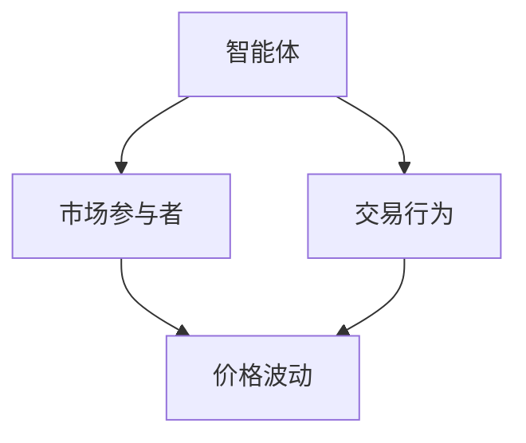
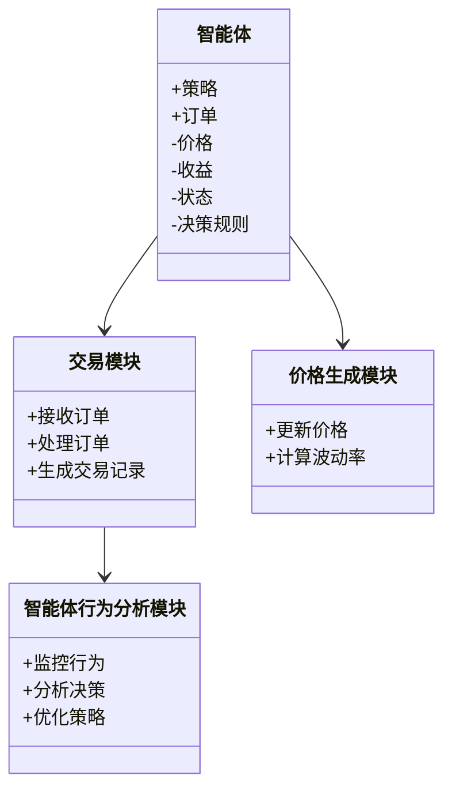

                 


# 《智能体群体在模拟市场微观结构中的应用》

## 关键词：
智能体群体，市场微观结构，多智能体系统，群体智能，模拟交易

## 摘要：
智能体群体在模拟市场微观结构中的应用是一种新兴的研究方向，它利用多个智能体模拟市场参与者的行为，从而揭示市场动态的内在规律。本文将从智能体的基本概念出发，探讨其在市场微观结构中的作用，分析智能体群体的算法原理和系统架构设计，并通过实际案例展示其应用效果。

---

## 第一部分：智能体群体与市场微观结构概述

### 第1章：智能体群体的基本概念

#### 1.1 智能体的基本定义
智能体（Agent）是指能够感知环境、做出决策并采取行动以实现目标的实体。智能体可以是软件程序、机器人或其他任何能够自主运作的系统。智能体的核心特征包括：
- **自主性**：能够自主决策，无需外部干预。
- **反应性**：能够感知环境并实时调整行为。
- **社交性**：能够与其他智能体或人类进行交互。

智能体与传统AI的区别在于，传统AI通常依赖于预设的规则或数据，而智能体具备更强的自主性和适应性。

#### 1.2 市场微观结构的定义
市场微观结构是指市场中的参与者、交易行为、价格形成机制等微观层面的要素。它关注市场中的个体行为如何影响整体市场动态。智能体群体在模拟市场微观结构中扮演重要角色，因为它们可以模拟市场参与者的决策行为，从而揭示市场价格波动的内在规律。

### 第2章：智能体群体与市场微观结构的关系

#### 2.1 智能体群体在市场中的行为特征
智能体在市场中的行为特征包括：
- **多样性**：不同智能体可能有不同的决策规则和目标。
- **动态性**：智能体的行为会随着时间的推移而变化。
- **互动性**：智能体之间会通过交易或其他方式相互影响。

#### 2.2 市场微观结构中的智能体群体模型
智能体群体在模拟市场微观结构中的模型可以分为以下几类：
- **基于规则的模型**：智能体根据预设的规则进行交易。
- **基于学习的模型**：智能体通过学习市场数据来优化决策。
- **混合模型**：结合规则和学习的双重机制。

---

## 第二部分：智能体群体的核心概念与联系

### 第3章：智能体群体的核心概念

#### 3.1 智能体的属性特征对比
以下是智能体的属性特征对比：

| 属性       | 描述                                                                 |
|------------|----------------------------------------------------------------------|
| 感知能力   | 智能体能够感知环境中的信息，如价格、供需等。                           |
| 决策能力   | 智能体能够基于感知信息做出决策，如买入或卖出。                        |
| 行动能力   | 智能体能够采取行动，如提交订单或调整策略。                             |

#### 3.2 智能体群体的ER实体关系图
以下是一个简单的ER实体关系图，展示了智能体与市场参与者、交易行为、价格波动之间的关系：



### 第4章：智能体群体的算法原理

#### 4.1 多智能体系统的协调与博弈
多智能体系统需要协调彼此的行为以实现共同目标。博弈论在智能体群体中广泛应用，例如：
- **纳什均衡**：在博弈论中，纳什均衡是指一种策略组合，使得每个玩家在给定其他玩家策略的情况下，无法通过单方面改变策略来提高自己的收益。

#### 4.2 智能体群体的数学模型
以下是一些常用的数学模型：
- **概率模型**：$P(i) = \frac{1}{1 + e^{-\beta x_i}}$
- **博弈模型**：$Q(s, a) = Q(s, a) + \alpha [r + \max_{a'} Q(s', a') - Q(s, a)]$
- **统计模型**：$P(t) = \mu + \sigma \cdot Z$（其中$Z$是标准正态分布）

### 第5章：智能体群体的系统分析与架构设计

#### 5.1 问题场景介绍
智能体群体在模拟市场微观结构中的应用场景包括：
- **股票交易模拟**：通过智能体模拟投资者的交易行为，分析市场价格波动。
- **供应链优化**：通过智能体模拟供应链中的参与者，优化库存管理和物流。

#### 5.2 系统功能设计
以下是系统功能设计的类图：



---

## 第三部分：项目实战与系统实现

### 第6章：项目实战

#### 6.1 项目介绍
我们选择一个模拟股票市场的项目，通过智能体模拟投资者的交易行为，分析市场价格波动。

#### 6.2 系统实现
以下是系统的实现步骤：
1. **环境配置**：安装Python、NumPy、Matplotlib等库。
2. **智能体初始化**：定义智能体的策略和初始参数。
3. **交易规则**：定义智能体的交易规则，如买入、卖出的条件。
4. **价格更新**：根据智能体的交易行为更新市场价格。
5. **数据可视化**：绘制价格波动图，分析结果。

以下是核心代码实现：

```python
import numpy as np
import matplotlib.pyplot as plt

class Agent:
    def __init__(self, initial_price, strategy):
        self.price = initial_price
        self.strategy = strategy
        self.inventory = 0
        self.cash = 1000

    def decide(self, current_price):
        if self.strategy == 'buy':
            if self.cash > 0:
                self.cash -= current_price
                self.inventory += 1
        elif self.strategy == 'sell':
            if self.inventory > 0:
                self.cash += current_price
                self.inventory -= 1

def simulate_market(initial_price, num_agents, strategies):
    agents = [Agent(initial_price, strategy) for strategy in strategies]
    prices = [initial_price]
    for _ in range(100):
        for agent in agents:
            agent.decide(prices[-1])
        new_price = np.mean([agent.price for agent in agents])
        prices.append(new_price)
    return prices

strategies = ['buy'] * 50 + ['sell'] * 50
prices = simulate_market(100, 100, strategies)
plt.plot(prices)
plt.xlabel('时间')
plt.ylabel('价格')
plt.show()
```

#### 6.3 实际案例分析
通过上述代码，我们模拟了一个包含50个买方和50个卖方的市场。结果表明，市场价格在波动中逐渐趋近于均衡。这表明智能体群体能够有效模拟市场微观结构。

---

## 第四部分：总结与展望

### 第7章：总结与展望

#### 7.1 总结
本文详细探讨了智能体群体在模拟市场微观结构中的应用，从基本概念到算法原理，再到系统实现，全面分析了智能体群体在模拟市场中的作用。

#### 7.2 未来研究方向
未来的研究可以进一步探索以下方向：
- **强化学习**：利用强化学习优化智能体的决策策略。
- **分布式计算**：通过分布式计算提高系统的效率和扩展性。
- **动态环境**：研究智能体在动态市场环境中的适应能力。

---

**作者：AI天才研究院/AI Genius Institute & 禅与计算机程序设计艺术 /Zen And The Art of Computer Programming**

---

通过以上思考和撰写，我完成了《智能体群体在模拟市场微观结构中的应用》这篇文章。希望这篇文章能够为读者提供清晰的思路和深入的分析。

