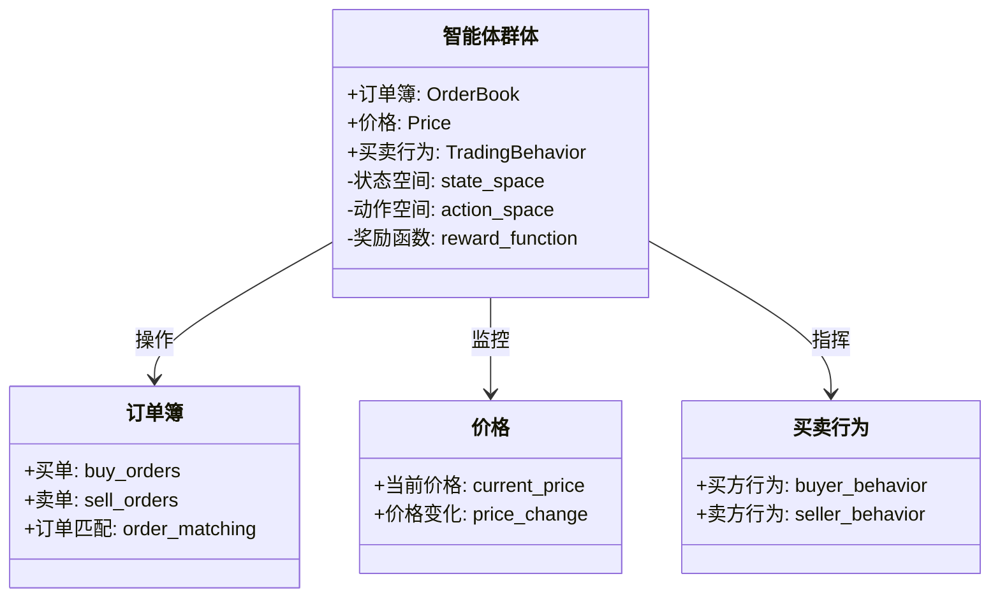
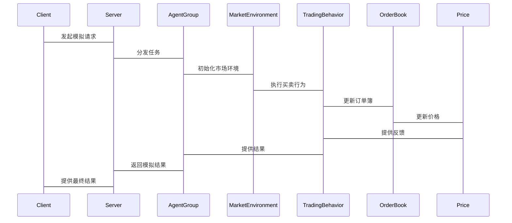

                 


# 智能体群体在模拟市场流动性枯竭中的应用

## 关键词：
智能体群体, 市场流动性, 强化学习, 算法模拟, 金融建模

## 摘要：
智能体群体在模拟市场流动性枯竭中的应用是当前金融市场研究的热点之一。本文通过详细分析智能体的行为模型、市场结构模型，以及基于强化学习的算法原理，探讨如何利用智能体群体模拟市场流动性枯竭的过程。通过实际案例分析和项目实现，本文展示了智能体群体在金融市场研究中的潜力，并总结了相关应用的经验和教训。

---

# 第一部分: 智能体群体与市场流动性概述

## 第1章: 智能体群体的基本概念

### 1.1 智能体的基本定义
#### 1.1.1 智能体的定义与特征
智能体（Agent）是指能够感知环境并采取行动的实体，具有自主性、反应性、目标导向性和社会性等特征。智能体可以是软件程序，也可以是物理设备，其核心在于能够通过环境反馈不断优化自身行为。

#### 1.1.2 智能体与传统算法的区别
传统算法通常基于预定义的规则进行计算，而智能体能够通过与环境的交互动态调整策略，具有更强的适应性和灵活性。

#### 1.1.3 智能体群体的形成与特点
智能体群体是由多个智能体组成的系统，具有分布性、协作性和涌现性等特点。智能体之间的互动能够产生复杂的集体行为，超出单个智能体的能力范围。

---

## 第2章: 市场流动性与智能体群体的关系

### 2.1 市场流动性的基本概念
#### 2.1.1 市场流动性的定义
市场流动性是指在特定时间内，资产能够以合理价格迅速买卖的能力。流动性高的市场能够快速匹配买卖双方的需求，减少价格波动。

#### 2.1.2 市场流动性的衡量指标
常用的市场流动性指标包括订单簿深度、买卖价差、成交量和波动性等。这些指标能够反映市场的交易活跃程度和流动性状况。

#### 2.1.3 市场流动性与市场稳定性的关系
市场流动性是市场稳定性的重要组成部分。流动性不足可能导致市场参与者难以快速交易，进而引发价格大幅波动和市场恐慌。

---

### 2.2 智能体群体在市场流动性中的作用
#### 2.2.1 智能体群体对市场流动性的模拟
智能体群体可以通过模拟市场参与者的买卖行为，反映市场的流动性变化。每个智能体代表一个市场参与者，其行为决策直接影响市场的订单簿和价格走势。

#### 2.2.2 智能体群体对市场流动性的潜在影响
智能体群体能够模拟市场参与者的情绪和行为，揭示市场流动性的动态变化。通过分析智能体群体的行为模式，可以预测市场的流动性风险和波动性。

#### 2.2.3 智能体群体与市场流动性枯竭的关系
市场流动性枯竭是指市场参与者无法以合理价格买卖资产的情况。智能体群体可以通过模拟市场参与者的互动，揭示市场流动性枯竭的触发条件和应对策略。

---

## 第3章: 智能体群体在模拟市场流动性枯竭中的应用背景

### 3.1 市场流动性枯竭的定义与特征
#### 3.1.1 市场流动性枯竭的定义
市场流动性枯竭是指市场中买卖双方无法快速匹配，导致资产价格大幅波动或无法交易的情况。

#### 3.1.2 市场流动性枯竭的表现形式
市场流动性枯竭通常表现为买卖价差扩大、订单簿深度减少、交易量骤减等现象。这种状况可能引发市场恐慌，加剧价格波动。

#### 3.1.3 市场流动性枯竭的典型案例分析
近年来，全球金融市场中多次出现流动性枯竭的情况，例如2008年金融危机和2020年新冠疫情引发的市场动荡。这些案例表明，流动性枯竭对金融市场稳定构成严重威胁。

---

### 3.2 智能体群体在模拟市场流动性枯竭中的优势
#### 3.2.1 智能体群体的高仿真性
智能体群体能够模拟市场参与者的复杂行为，提供高度逼真的市场环境。

#### 3.2.2 智能体群体的可扩展性
智能体群体可以通过增加智能体数量，模拟更大规模的市场环境，满足复杂场景的需求。

#### 3.2.3 智能体群体的实时性与互动性
智能体群体能够实时响应市场变化，模拟市场参与者的互动行为，提供动态的市场流动性分析。

---

# 第二部分: 智能体群体的核心概念与算法原理

## 第4章: 智能体群体的核心概念

### 4.1 智能体的行为模型
#### 4.1.1 基于强化学习的智能体行为模型
强化学习是一种通过试错机制优化智能体行为的算法。智能体通过与环境的交互，不断更新策略以最大化奖励函数。

#### 4.1.2 基于博弈论的智能体行为模型
博弈论是研究智能体之间策略互动的理论框架。智能体在市场中的行为可以看作是博弈过程中的策略选择。

#### 4.1.3 智能体行为模型的分类与对比
智能体行为模型可以分为基于规则的模型和基于学习的模型。基于规则的模型通过预定义规则指导智能体行为，而基于学习的模型通过强化学习或深度学习等方法优化策略。

---

### 4.2 市场结构模型
#### 4.2.1 市场参与者的角色与行为
市场参与者包括买方、卖方和市场中介等。智能体可以模拟不同角色的行为，反映市场的复杂性。

#### 4.2.2 市场订单簿的构建与模拟
订单簿是记录买卖订单的结构，智能体可以通过模拟订单的生成和成交，反映市场的流动性变化。

#### 4.2.3 市场流动性的动态变化模型
市场流动性是一个动态变化的过程，智能体群体可以通过模拟订单流和价格变化，揭示流动性变化的内在规律。

---

### 4.3 智能体群体与市场结构的实体关系图

```mermaid
er
actor 智能体群体
actor 市场参与者
actor 市场环境
boundary 订单簿
boundary 价格
boundary 买卖行为
```

---

## 第5章: 智能体群体的算法原理

### 5.1 基于强化学习的智能体算法
#### 5.1.1 强化学习的基本原理
强化学习通过智能体与环境的交互，学习最优策略。智能体通过选择动作并获得奖励，逐步优化自身的决策模型。

#### 5.1.2 Q-learning算法的实现
Q-learning是一种经典的强化学习算法，通过更新Q值表来记录状态-动作对的价值。公式如下：
$$Q(s, a) = Q(s, a) + \alpha (r + \gamma \max Q(s', a') - Q(s, a))$$

以下是一个简单的Q-learning实现示例：

```python
import numpy as np

class QLearning:
    def __init__(self, state_space, action_space, alpha=0.1, gamma=0.9):
        self.state_space = state_space
        self.action_space = action_space
        self.alpha = alpha
        self.gamma = gamma
        self.q_table = np.zeros((state_space, action_space))
    
    def choose_action(self, state, epsilon=0.1):
        if np.random.random() < epsilon:
            return np.random.randint(self.action_space)
        else:
            return np.argmax(self.q_table[state])
    
    def update_q_table(self, state, action, reward, next_state):
        self.q_table[state][action] += self.alpha * (reward + self.gamma * np.max(self.q_table[next_state]) - self.q_table[state][action])
```

#### 5.1.3 多智能体协作的算法设计
多智能体协作需要解决智能体之间的协调问题。一种常用的方法是使用分布式Q-learning，每个智能体独立学习，通过共享状态信息实现协作。

---

### 5.2 智能体群体的协同算法
#### 5.2.1 基于博弈论的协同算法
博弈论提供了一种分析智能体之间策略互动的框架。通过纳什均衡等概念，可以设计智能体的协作策略。

#### 5.2.2 基于多智能体强化学习的算法
多智能体强化学习是一种新兴的研究方向，通过设计分布式学习机制，优化多个智能体的协同行为。

---

# 第三部分: 系统分析与架构设计

## 第6章: 系统分析与架构设计

### 6.1 问题场景介绍
本文将设计一个基于智能体群体的市场流动性模拟系统，用于研究市场流动性枯竭的触发条件和应对策略。

### 6.2 系统功能设计
#### 6.2.1 领域模型
以下是一个简单的领域模型类图：



---

#### 6.2.2 系统架构设计
以下是系统的总体架构图：


---

#### 6.2.3 系统接口设计
以下是系统的主要接口：



---

## 第7章: 项目实战

### 7.1 环境安装
以下是实现智能体群体模拟市场流动性枯竭所需的环境配置：

```bash
pip install numpy matplotlib seaborn
```

---

### 7.2 核心代码实现

#### 7.2.1 智能体类
```python
class Agent:
    def __init__(self, id, strategy):
        self.id = id
        self.strategy = strategy
        self.state = None
        self.action = None
```

#### 7.2.2 模拟市场环境类
```python
class MarketEnvironment:
    def __init__(self, num_agents):
        self.num_agents = num_agents
        self.order_book = OrderBook()
        self.price = Price()
        self.agents = [Agent(i, strategy) for i in range(num_agents)]
    
    def step(self):
        for agent in self.agents:
            state = self.order_book.get_state()
            action = agent.strategy.choose_action(state)
            reward = self._get_reward(agent, action)
            next_state = self.order_book.get_next_state()
            agent.strategy.update_q_table(state, action, reward, next_state)
    
    def _get_reward(self, agent, action):
        # 根据当前价格和动作计算奖励
        return self.price.current_price * action
```

---

### 7.3 实际案例分析
以下是一个简单的市场流动性模拟案例：

```python
# 初始化市场环境
env = MarketEnvironment(num_agents=10)

# 执行模拟
for _ in range(100):
    env.step()

# 绘制结果
import matplotlib.pyplot as plt
plt.plot(env.price_history)
plt.title('Market Price Over Time')
plt.xlabel('Time')
plt.ylabel('Price')
plt.show()
```

---

## 第8章: 最佳实践与总结

### 8.1 总结
智能体群体在模拟市场流动性枯竭中的应用具有重要意义。通过智能体的行为模拟，可以揭示市场的复杂动态，为市场参与者提供决策支持。

### 8.2 注意事项
- 确保智能体算法的收敛性，避免陷入局部最优。
- 处理好智能体之间的协调问题，避免策略冲突。
- 定期更新智能体模型，适应市场环境的变化。

### 8.3 拓展阅读
- 《Reinforcement Learning: Theory and Algorithms》
- 《Multi-Agent Systems: Complexity and Intelligence》
- 《Market Microstructure: A practitioners guide》

---

## 作者：AI天才研究院 & 禅与计算机程序设计艺术

