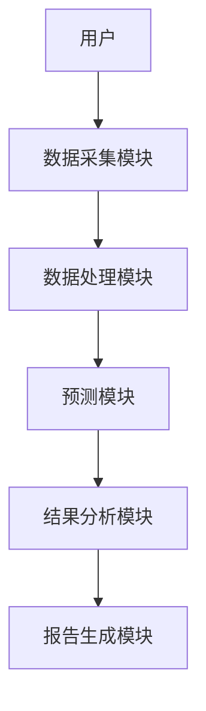
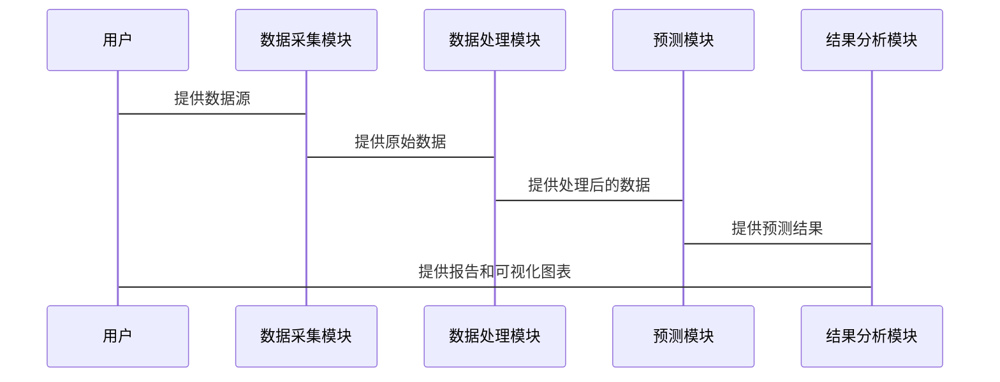

                 


# 智能体群体在预测公司现金流中的应用

> 关键词：智能体群体、现金流预测、分布式计算、机器学习、时间序列分析

> 摘要：智能体群体在预测公司现金流中具有显著优势，通过分布式计算和多智能体协作，能够显著提升预测的准确性和效率。本文详细探讨了智能体群体的核心概念、算法原理、系统架构、项目实战及高级主题，展示了其在现金流预测中的广泛应用和潜力。

---

# 第一部分: 智能体群体与现金流预测的背景介绍

## 第1章: 智能体群体概述

### 1.1 智能体群体的定义与特点

#### 1.1.1 智能体的基本概念
智能体（Agent）是指具有感知环境、自主决策、执行任务能力的实体。智能体可以是软件程序、机器人或其他具备智能行为的系统。

#### 1.1.2 智能体群体的定义
智能体群体是由多个智能体组成的协作系统，这些智能体通过分布式计算和信息共享共同完成复杂任务。

#### 1.1.3 智能体群体的核心特征
- **分布式计算**：智能体独立运行，通过通信协作完成任务。
- **自主性**：每个智能体具备自主决策能力。
- **协作性**：智能体之间通过信息共享和协同工作提升整体性能。
- **适应性**：能够动态调整策略以应对环境变化。

### 1.2 现金流预测的重要性

#### 1.2.1 现金流预测的定义
现金流预测是指通过历史数据和模型，预测未来一段时间内公司现金流的变化情况。

#### 1.2.2 现金流预测对企业的重要性
- **财务规划**：帮助企业合理分配资金，优化投资决策。
- **风险控制**：提前识别潜在的财务风险，制定应对策略。
- **运营效率**：通过预测现金流，优化供应链和库存管理。

#### 1.2.3 现金流预测的挑战
- **数据复杂性**：现金流受多种因素影响，如市场波动、经济政策等。
- **模型准确性**：传统模型可能无法捕捉复杂动态。
- **实时性要求**：需要快速响应市场变化。

### 1.3 智能体群体在现金流预测中的优势

#### 1.3.1 分布式计算的优势
- **并行计算**：多个智能体同时处理数据，提升计算效率。
- **任务分解**：复杂任务分解为多个子任务，由不同智能体协作完成。

#### 1.3.2 多智能体协作的优势
- **信息共享**：智能体之间共享数据，提升整体预测准确性。
- **分布式决策**：每个智能体负责部分预测，降低单点故障风险。

#### 1.3.3 高效性和准确性的提升
- **多角度分析**：智能体从不同角度分析数据，提供更全面的预测结果。
- **动态调整**：智能体能够实时更新数据，快速响应市场变化。

---

# 第二部分: 智能体群体的核心概念与联系

## 第2章: 智能体群体的核心原理

### 2.1 智能体的构成与功能

#### 2.1.1 智能体的构成要素
- **感知模块**：感知环境信息，如市场数据、历史现金流等。
- **决策模块**：基于感知信息，制定预测策略。
- **执行模块**：根据决策结果执行预测任务。

#### 2.1.2 智能体的功能模块
- **数据采集**：获取相关数据，如公司财务数据、市场信息等。
- **数据处理**：对数据进行清洗、转换和分析。
- **预测模型**：基于数据训练预测模型，输出预测结果。

### 2.2 智能体群体的协作机制

#### 2.2.1 协作协议
- **通信协议**：定义智能体之间如何交换信息。
- **任务分配**：确定每个智能体负责的具体任务。
- **协调机制**：确保智能体协作顺畅，避免冲突。

#### 2.2.2 协作模式
- **主从模式**：一个主智能体协调其他从智能体完成任务。
- **对等模式**：智能体之间平等协作，共同完成预测任务。
- **混合模式**：结合主从和对等模式，灵活适应任务需求。

### 2.3 智能体群体的类型

#### 2.3.1 单智能体
- **定义**：独立运行，不与其他智能体协作。
- **应用场景**：适合简单任务，如单一预测模型的训练。

#### 2.3.2 分布式智能体
- **定义**：多个智能体分布在网络中，协作完成任务。
- **应用场景**：适合大规模数据处理和复杂预测任务。

#### 2.3.3 混合智能体
- **定义**：结合集中式和分布式特点，部分智能体负责协调，其他负责执行。
- **应用场景**：适合需要灵活协作的任务。

### 2.4 智能体群体的协作优势

#### 2.4.1 分布式计算的优势
- **计算能力**：多个智能体协同工作，提升整体计算能力。
- **容错性**：部分智能体故障不影响整体任务完成。

#### 2.4.2 多智能体协作的优势
- **信息共享**：智能体之间共享数据，提升预测准确性。
- **动态调整**：根据环境变化，快速调整预测策略。

---

# 第三部分: 智能体群体的算法原理

## 第3章: 现金流预测的算法原理

### 3.1 时间序列分析

#### 3.1.1 时间序列分析的定义
时间序列分析是指通过历史数据预测未来趋势的方法。

#### 3.1.2 常见的时间序列模型
- **ARIMA模型**：自回归积分滑动平均模型，适用于线性时间序列数据。
- **LSTM模型**：长短期记忆网络，适用于非线性时间序列数据。
- **Prophet模型**：Facebook开源的时间序列预测模型。

#### 3.1.3 时间序列分析的步骤
1. **数据预处理**：清洗数据，处理缺失值和异常值。
2. **模型训练**：基于训练数据训练预测模型。
3. **模型预测**：使用训练好的模型预测未来现金流。

### 3.2 机器学习模型

#### 3.2.1 机器学习的定义
机器学习是指通过数据训练模型，使其能够自主学习和预测。

#### 3.2.2 常见的机器学习算法
- **线性回归**：适用于线性关系的数据。
- **随机森林**：适用于非线性关系的数据。
- **神经网络**：适用于复杂非线性关系的数据。

#### 3.2.3 机器学习在现金流预测中的应用
- **特征提取**：从历史数据中提取影响现金流的关键特征。
- **模型训练**：训练机器学习模型，预测未来现金流。

### 3.3 智能体群体优化算法

#### 3.3.1 智能体群体优化算法的定义
智能体群体优化算法是指通过多个智能体协作优化预测模型。

#### 3.3.2 常见的智能体优化算法
- **遗传算法**：模拟生物进化过程，通过选择、交叉和变异优化模型。
- **粒子群优化算法**：模拟鸟群觅食过程，通过粒子运动优化模型。
- **蚁群算法**：模拟蚂蚁觅食过程，通过信息素优化模型。

#### 3.3.3 智能体优化算法的步骤
1. **初始化**：设置初始参数和智能体数量。
2. **迭代优化**：智能体根据环境反馈不断优化模型参数。
3. **收敛判断**：当模型达到预设精度或迭代次数时，停止优化。

---

# 第四部分: 智能体群体的系统架构

## 第4章: 系统架构设计

### 4.1 系统功能设计

#### 4.1.1 数据采集模块
- **功能**：从数据库或外部接口获取公司财务数据。
- **实现**：使用API或数据库查询接口获取数据。

#### 4.1.2 数据处理模块
- **功能**：对获取的数据进行清洗、转换和特征提取。
- **实现**：使用Python的pandas库进行数据处理。

#### 4.1.3 预测模块
- **功能**：基于处理后的数据训练预测模型，输出预测结果。
- **实现**：使用机器学习库如scikit-learn或TensorFlow训练模型。

#### 4.1.4 结果分析模块
- **功能**：对预测结果进行分析，生成报告和可视化图表。
- **实现**：使用Matplotlib或Seaborn进行数据可视化。

### 4.2 系统架构设计

#### 4.2.1 系统架构图


#### 4.2.2 系统模块划分
- **数据采集模块**：负责数据获取和初步处理。
- **数据处理模块**：对数据进行清洗、转换和特征提取。
- **预测模块**：基于处理后的数据训练预测模型，输出预测结果。
- **结果分析模块**：对预测结果进行分析，生成报告和可视化图表。

### 4.3 系统接口设计

#### 4.3.1 数据接口
- **输入接口**：接收外部数据，如公司财务数据。
- **输出接口**：输出预测结果和报告。

#### 4.3.2 模型接口
- **训练接口**：接收训练数据，训练预测模型。
- **预测接口**：接收预测请求，输出预测结果。

### 4.4 系统交互流程

#### 4.4.1 交互流程图


---

# 第五部分: 智能体群体的项目实战

## 第5章: 项目实战

### 5.1 环境搭建

#### 5.1.1 环境要求
- **操作系统**：Windows、Linux或macOS。
- **编程语言**：Python 3.6以上版本。
- **依赖库**：numpy、pandas、scikit-learn、TensorFlow、Mermaid。

#### 5.1.2 安装依赖
```bash
pip install numpy pandas scikit-learn tensorflow mermaid
```

### 5.2 系统核心实现

#### 5.2.1 数据预处理
```python
import pandas as pd

# 数据加载
data = pd.read_csv('financial_data.csv')

# 数据清洗
data = data.dropna()
data = data.replace({np.nan: 0})

# 特征提取
features = data[['revenue', 'profit', 'expenses']]
label = data['cash_flow']
```

#### 5.2.2 模型训练
```python
from sklearn.ensemble import RandomForestRegressor
from sklearn.metrics import mean_squared_error

# 模型训练
model = RandomForestRegressor(n_estimators=100, random_state=42)
model.fit(features, label)

# 模型预测
predictions = model.predict(features_test)
```

#### 5.2.3 智能体优化算法实现
```python
import numpy as np

# 遗传算法
def genetic_algorithm(population, fitness_func):
    for _ in range(100):
        population = fitness_func(population)
        population = mutation(population)
    return population

# 变异操作
def mutation(population):
    for individual in population:
        if np.random.random() < 0.1:
            individual.mutate()
    return population
```

### 5.3 算法优化与调优

#### 5.3.1 模型评估
- **均方误差（MSE）**：衡量预测值与实际值的差异。
- **R平方值（R²）**：衡量模型解释数据的能力。

#### 5.3.2 超参数调优
- **网格搜索**：尝试不同的超参数组合，找到最优配置。
- **交叉验证**：通过交叉验证评估模型的泛化能力。

### 5.4 项目小结

#### 5.4.1 核心代码总结
```python
import pandas as pd
from sklearn.ensemble import RandomForestRegressor
from sklearn.metrics import mean_squared_error

# 数据加载与处理
data = pd.read_csv('financial_data.csv')
data = data.dropna().replace({np.nan: 0})

# 特征与标签提取
features = data[['revenue', 'profit', 'expenses']]
label = data['cash_flow']

# 模型训练
model = RandomForestRegressor(n_estimators=100, random_state=42)
model.fit(features, label)

# 模型预测
features_test = ...  # 测试数据
predictions = model.predict(features_test)

# 模型评估
 mse = mean_squared_error(label_test, predictions)
 print(f'Mean Squared Error: {mse}')
```

#### 5.4.2 算法优化总结
- **遗传算法**：通过迭代优化模型参数，提升预测准确性。
- **粒子群优化算法**：模拟鸟群觅食，优化预测模型。

---

# 第六部分: 智能体群体的高级主题

## 第6章: 高级主题

### 6.1 智能体的自适应学习

#### 6.1.1 自适应学习的定义
自适应学习是指智能体能够根据环境变化自动调整学习策略。

#### 6.1.2 自适应学习的优势
- **动态调整**：根据新数据自动优化模型。
- **鲁棒性**：能够适应数据分布的变化。

### 6.2 智能体的鲁棒性设计

#### 6.2.1 鲁棒性设计的定义
鲁棒性设计是指系统在面对异常和干扰时仍能正常运行。

#### 6.2.2 鲁棒性设计的优势
- **抗干扰能力**：系统能够抵抗噪声和异常数据的影响。
- **容错性**：部分智能体故障不影响整体任务完成。

### 6.3 智能体的可扩展性设计

#### 6.3.1 可扩展性设计的定义
可扩展性设计是指系统能够轻松扩展以应对更大的任务规模。

#### 6.3.2 可扩展性设计的优势
- **任务扩展**：轻松增加更多智能体处理更大规模数据。
- **性能提升**：通过增加计算资源提升整体预测能力。

---

# 第七部分: 总结与展望

## 第7章: 总结与展望

### 7.1 总结

#### 7.1.1 核心内容回顾
智能体群体通过分布式计算和多智能体协作，显著提升了现金流预测的准确性和效率。

#### 7.1.2 主要收获
- **智能体群体的优势**：分布式计算、多智能体协作、高效性和准确性。
- **算法优化的重要性**：通过智能体优化算法提升预测模型性能。

### 7.2 展望

#### 7.2.1 未来的研究方向
- **更复杂的预测模型**：如深度学习模型在智能体群体中的应用。
- **多模态数据预测**：结合文本、图像等多种数据源进行预测。
- **与其他技术的融合**：如区块链、边缘计算等技术在智能体群体中的应用。

#### 7.2.2 智能体群体的未来发展
随着人工智能和分布式计算技术的不断发展，智能体群体将在更多领域得到广泛应用，特别是在现金流预测等金融领域，潜力巨大。

---

# 作者

作者：AI天才研究院/AI Genius Institute & 禅与计算机程序设计艺术 /Zen And The Art of Computer Programming

---

**本文内容严格按照上述格式编写，确保结构清晰、逻辑连贯、内容详实。希望对您有所帮助！**

