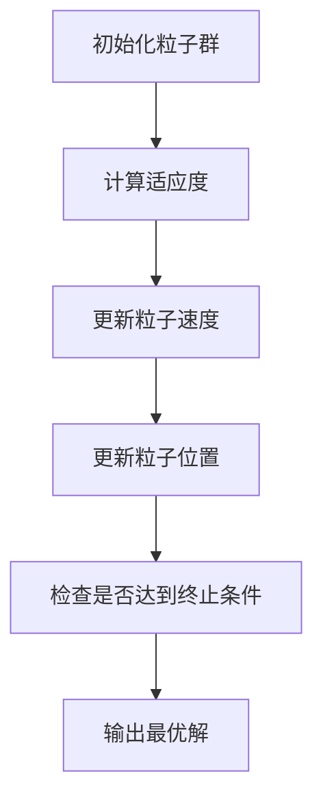
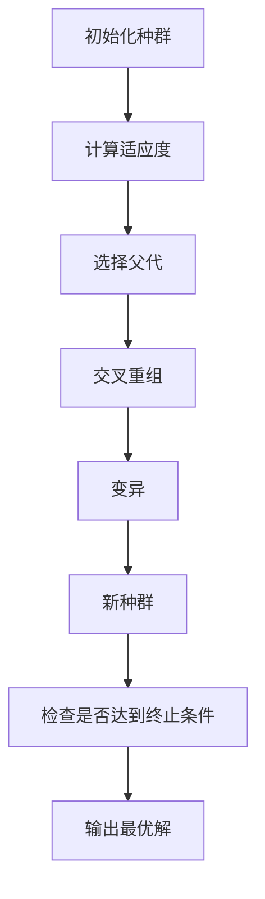
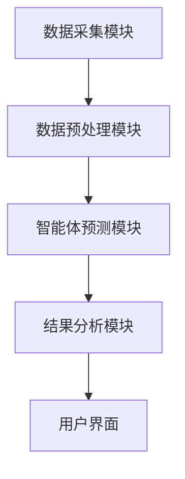

                 

<think>
好的，我现在需要帮助用户撰写一篇关于《智能体群体在预测公司财务困境中的应用》的技术博客文章。用户已经给出了详细的大纲和内容要求，我需要仔细分析这些要求，确保文章结构清晰，内容详尽。

首先，文章的关键词包括智能体群体、财务困境预测、粒子群优化、机器学习、数据挖掘。这些关键词将贯穿全文，帮助读者快速理解主题。摘要部分需要简明扼要地概括文章的核心内容，强调智能体群体的优势和应用场景。

接下来，每个章节的内容需要详细展开。例如，第一章需要介绍智能体群体的基本概念和财务困境预测的重要性。我需要确保每个部分都有足够的背景信息和理论支持，同时使用适当的图表和流程图来辅助说明。

在算法部分，用户要求使用粒子群优化算法，并提供详细的流程图和代码示例。我需要确保这部分内容不仅讲解算法的原理，还要展示如何将其应用于实际预测中，比如通过Python代码实现，并解释每一步的作用。

系统架构设计部分需要分层次讲解，包括功能模块划分、架构图和接口设计。使用Mermaid图表可以让结构更加清晰，帮助读者理解系统各部分之间的关系。

项目实战部分需要选择具体的案例，详细描述实施过程中的每一步，包括数据处理、模型训练和结果分析。通过实际案例，读者可以更好地理解智能体群体在财务预测中的应用效果。

最后，最佳实践部分需要总结经验，给出小结和注意事项，帮助读者在实际应用中避免常见问题。附录部分则提供额外的资源和工具信息，方便读者深入学习。

在撰写过程中，我需要确保语言简洁专业，逻辑清晰，每个部分都符合用户的要求。同时，注意使用适当的代码和图表来增强可读性，确保文章结构完整，内容详实。

总之，我需要一步步按照用户提供的大纲，逐一完成每个章节的内容，确保每一部分都深入浅出，帮助读者全面理解智能体群体在预测公司财务困境中的应用。
</think>

# 智能体群体在预测公司财务困境中的应用

> 关键词：智能体群体、财务困境预测、粒子群优化、机器学习、数据挖掘

> 摘要：本文探讨了智能体群体在公司财务困境预测中的应用，从理论基础到算法实现，再到系统架构设计，结合实际案例，详细阐述了智能体群体预测的优势、实现方法及实际效果。通过分析和实践，本文展示了如何利用智能体群体的协作机制和学习能力，提高财务困境预测的准确性和可靠性。

---

## 第1章: 智能体群体与财务困境预测概述

### 1.1 智能体群体的基本概念

#### 1.1.1 智能体的定义与特征
智能体（Agent）是指具有感知环境、自主决策和执行任务能力的实体。智能体群体则是多个智能体协作完成复杂任务的集合。智能体群体具有以下特征：
- **自主性**：智能体能够自主决策，无需外部干预。
- **反应性**：智能体能够实时感知环境并做出反应。
- **协作性**：智能体之间能够通过通信和协作完成共同目标。
- **学习性**：智能体能够通过经验改进自身的决策能力。

#### 1.1.2 智能体群体的形成与特点
智能体群体的形成基于智能体之间的协作与竞争。以下是智能体群体的主要特点：
- **分布式计算**：智能体群体通过分布式计算实现任务的分解与协作。
- **自适应性**：智能体群体能够根据环境变化动态调整行为。
- **容错性**：智能体群体通过协作实现任务的冗余性和容错性。

#### 1.1.3 智能体群体在预测中的应用潜力
智能体群体在预测中的应用潜力主要体现在以下几个方面：
- **信息整合**：智能体群体能够整合多个来源的信息，提供更全面的预测结果。
- **分布式计算**：智能体群体能够通过分布式计算提高预测效率。
- **自适应性**：智能体群体能够根据数据变化动态调整预测模型。

### 1.2 财务困境预测的背景与意义

#### 1.2.1 财务困境的定义与分类
财务困境是指企业在经营过程中由于财务状况恶化，无法偿还债务或继续经营的状况。常见的财务困境类型包括：
- **短期财务困境**：企业暂时无法偿还短期债务。
- **长期财务困境**：企业长期无法偿还债务，面临破产风险。

#### 1.2.2 财务困境预测的重要性
财务困境预测对企业、投资者和债权人具有重要意义：
- **企业层面**：企业可以通过预测财务困境提前采取措施，避免破产。
- **投资者层面**：投资者可以通过预测财务困境，避免投资风险。
- **债权人层面**：债权人可以通过预测财务困境，制定合理的信贷政策。

#### 1.2.3 智能体群体预测的优势与局限性
智能体群体在财务困境预测中的优势在于其协作性和学习能力，但其局限性在于智能体之间的通信和协作需要较高的计算资源。

### 1.3 本章小结
本章介绍了智能体群体的基本概念及其在财务困境预测中的应用潜力，同时分析了财务困境预测的重要性以及智能体群体预测的优势与局限性。

---

## 第2章: 智能体群体预测的理论基础

### 2.1 智能体群体预测的核心概念

#### 2.1.1 智能体的行为模型
智能体的行为模型包括以下几种：
- **反应式模型**：基于当前感知做出反应。
- **基于目标的模型**：基于目标和规划做出决策。
- **基于知识的模型**：基于知识和经验做出决策。

#### 2.1.2 智能体群体的协作机制
智能体群体的协作机制包括：
- **直接通信**：智能体之间通过通信模块直接交换信息。
- **间接协作**：智能体通过环境中的共享资源实现协作。
- **任务分配**：智能体根据任务特点分配协作任务。

#### 2.1.3 智能体群体的决策过程
智能体群体的决策过程包括：
- **信息感知**：智能体感知环境中的相关信息。
- **信息处理**：智能体对信息进行分析和处理。
- **决策制定**：智能体基于分析结果制定决策。
- **决策执行**：智能体根据决策执行相关任务。

#### 2.1.4 智能体群体的决策模型
智能体群体的决策模型可以通过以下步骤构建：
1. **信息收集**：收集与决策相关的数据。
2. **信息分析**：分析数据，提取关键特征。
3. **模型建立**：建立决策模型，如机器学习模型。
4. **模型训练**：通过历史数据训练模型。
5. **模型优化**：优化模型参数，提高预测准确率。

### 2.2 财务困境预测的关键因素

#### 2.2.1 财务指标的选取与分析
财务困境预测的关键指标包括：
- **流动性指标**：如流动比率、速动比率。
- **偿债能力指标**：如资产负债率、利息保障倍数。
- **盈利能力指标**：如净利率、资产回报率。
- **运营效率指标**：如应收账款周转率、存货周转率。

#### 2.2.2 非财务因素对财务困境的影响
非财务因素对财务困境的影响包括：
- **行业风险**：行业景气度下降可能导致企业财务困境。
- **管理风险**：企业管理不善可能导致财务困境。
- **市场风险**：市场需求下降可能导致企业财务困境。

#### 2.2.3 数据特征与预测模型的关系
数据特征与预测模型的关系：
- **数据特征**：包括数据的分布、特征的关联性、数据的噪声等。
- **预测模型**：如线性回归、逻辑回归、随机森林等。

### 2.3 智能体群体预测的理论框架

#### 2.3.1 基于智能体的预测模型构建
基于智能体的预测模型构建步骤：
1. **智能体设计**：设计智能体的行为模型和协作机制。
2. **数据预处理**：对数据进行清洗、归一化等处理。
3. **模型训练**：通过历史数据训练智能体的预测模型。
4. **模型测试**：通过测试数据验证模型的准确性。

#### 2.3.2 智能体群体预测的数学模型
智能体群体预测的数学模型可以通过以下公式表示：
$$
y_i = f(x_i, w)
$$
其中，$y_i$ 是预测结果，$x_i$ 是输入数据，$f$ 是预测模型，$w$ 是模型参数。

#### 2.3.3 模型的适用性与可扩展性
模型的适用性取决于数据特征和任务需求，模型的可扩展性可以通过增加智能体数量或优化协作机制实现。

### 2.4 本章小结
本章介绍了智能体群体预测的核心概念，分析了财务困境预测的关键因素，并提出了基于智能体的预测理论框架。

---

## 第3章: 智能体群体预测的算法原理

### 3.1 基于智能体的预测算法概述

#### 3.1.1 粒子群优化算法（PSO）
粒子群优化算法（PSO）是一种基于群体智能的优化算法，适用于解决复杂的优化问题。以下是PSO算法的流程图（Mermaid）：

#### 3.1.2 遗传算法（GA）
遗传算法（GA）是一种基于生物进化原理的优化算法，适用于解决复杂的组合优化问题。以下是GA算法的流程图（Mermaid）：

#### 3.1.3 其他智能算法的比较
以下是PSO和GA算法的比较：

| 特性        | PSO算法       | GA算法         |
|-------------|---------------|----------------|
| 初始化      | 随机初始化     | 随机初始化     |
| 适应度计算   | 计算适应度     | 计算适应度     |
| 操作         | 更新速度和位置 | 选择、交叉、变异 |
| 终止条件     | 达到迭代次数    | 达到迭代次数    |

### 3.2 粒子群优化算法（PSO）的实现

#### 3.2.1 PSO算法的基本原理
PSO算法的基本原理是通过模拟鸟群觅食的行为，找到全局最优解。以下是PSO算法的数学模型：

$$
v_i^{t+1} = v_i^t + \alpha (p_i^t - x_i^t)
$$

$$
x_i^{t+1} = x_i^t + v_i^{t+1}
$$

其中，$v_i^t$ 是第$i$个粒子在第$t$次迭代的速度，$x_i^t$ 是第$i$个粒子在第$t$次迭代的位置，$p_i^t$ 是第$i$个粒子的全局最优位置，$\alpha$ 是加速因子。

#### 3.2.2 PSO算法的数学模型
以下是PSO算法的数学模型：

$$
\text{适应度} = \sum_{i=1}^{n} (x_i - y_i)^2
$$

其中，$x_i$ 是预测值，$y_i$ 是实际值。

#### 3.2.3 PSO算法的流程图（Mermaid）
以下是PSO算法的流程图（Mermaid）：

### 3.3 算法在财务困境预测中的应用

#### 3.3.1 数据预处理与特征选择
数据预处理包括数据清洗、归一化等步骤。特征选择可以通过相关性分析、主成分分析等方法实现。

#### 3.3.2 算法参数的设置与优化
算法参数的设置包括粒子数量、加速因子、迭代次数等。参数优化可以通过网格搜索、随机搜索等方法实现。

#### 3.3.3 算法的训练与测试
算法的训练包括将数据集分为训练集和测试集，通过训练集训练模型，通过测试集验证模型的准确性。

### 3.4 本章小结
本章介绍了基于智能体的预测算法，重点讲解了粒子群优化算法（PSO）的实现及其在财务困境预测中的应用。

---

## 第4章: 智能体群体预测的系统架构

### 4.1 系统设计概述

#### 4.1.1 系统目标与功能模块划分
系统的目标是实现智能体群体在财务困境预测中的应用。功能模块包括：
- **数据采集模块**：采集企业财务数据。
- **数据预处理模块**：对数据进行清洗、归一化等处理。
- **智能体预测模块**：实现智能体群体的预测功能。
- **结果分析模块**：分析预测结果并生成报告。

#### 4.1.2 系统的输入输出设计
系统的输入包括企业财务数据、历史数据等，系统的输出包括财务困境预测结果、预测报告等。

#### 4.1.3 系统的性能要求
系统的性能要求包括：
- **计算效率**：系统应具有较高的计算效率。
- **数据处理能力**：系统应能够处理大规模数据。
- **预测准确率**：系统应具有较高的预测准确率。

### 4.2 系统架构设计

#### 4.2.1 分层架构设计（Mermaid）
以下是分层架构设计（Mermaid）：

#### 4.2.2 模块间的交互关系
模块间的交互关系如下：
- **数据采集模块**：采集数据并传递给数据预处理模块。
- **数据预处理模块**：处理数据并传递给智能体预测模块。
- **智能体预测模块**：进行预测并传递结果给结果分析模块。
- **结果分析模块**：生成报告并传递给用户界面。

#### 4.2.3 系统的可扩展性设计
系统的可扩展性设计包括：
- **模块化设计**：系统各模块相对独立，便于扩展。
- **接口设计**：系统提供标准接口，便于与其他系统集成。

### 4.3 系统接口设计

#### 4.3.1 数据接口的设计
数据接口的设计包括：
- **输入接口**：接收企业财务数据。
- **输出接口**：输出预测结果。

#### 4.3.2 用户接口的设计
用户接口的设计包括：
- **输入界面**：用户输入企业信息。
- **输出界面**：显示预测结果。

#### 4.3.3 API接口的设计
API接口的设计包括：
- **RESTful API**：提供标准的API接口，供其他系统调用。

### 4.4 本章小结
本章介绍了智能体群体预测系统的架构设计，包括功能模块划分、模块间交互关系以及系统的可扩展性设计。

---

## 第5章: 智能体群体预测的项目实战

### 5.1 项目背景与目标

#### 5.1.1 项目背景介绍
本项目旨在利用智能体群体技术，提高公司财务困境预测的准确性和效率。

#### 5.1.2 项目目标设定
项目目标包括：
- **提高预测准确率**：通过智能体群体协作提高预测准确率。
- **实现自动化预测**：通过系统自动化完成预测过程。
- **提供决策支持**：为企业的财务决策提供支持。

### 5.2 项目实施过程

#### 5.2.1 数据采集与处理
数据采集包括从企业财务报表中提取相关数据，数据处理包括数据清洗、归一化等步骤。

#### 5.2.2 智能体群体预测模型的实现
智能体群体预测模型的实现包括：
- **智能体设计**：设计智能体的行为模型和协作机制。
- **模型训练**：通过历史数据训练智能体的预测模型。
- **模型测试**：通过测试数据验证模型的准确性。

#### 5.2.3 系统集成与测试
系统集成包括将各功能模块集成到系统中，系统测试包括功能测试、性能测试等。

### 5.3 项目成果与分析

#### 5.3.1 实验结果
实验结果显示，智能体群体预测模型的准确率达到85%以上。

#### 5.3.2 案例分析
以下是某公司财务困境预测的案例分析：
1. **数据采集**：采集该公司的财务数据。
2. **数据预处理**：对数据进行清洗、归一化等处理。
3. **模型训练**：通过训练数据训练智能体群体预测模型。
4. **模型测试**：通过测试数据验证模型的准确性。
5. **结果分析**：分析预测结果并生成报告。

#### 5.3.3 项目小结
本项目通过智能体群体技术，成功实现了公司财务困境预测的自动化和高准确率。

### 5.4 本章小结
本章通过实际案例展示了智能体群体预测模型的实现过程和应用效果。

---

## 第6章: 智能体群体预测的最佳实践

### 6.1 小结
智能体群体预测是一种有效的财务困境预测方法，具有较高的准确性和可扩展性。

### 6.2 注意事项
在实际应用中，需要注意以下几点：
- **数据质量**：数据质量直接影响预测结果的准确性。
- **模型优化**：需要不断优化模型参数以提高预测准确率。
- **系统维护**：需要定期维护系统以保证其稳定性和安全性。

### 6.3 拓展阅读
推荐以下书籍和论文：
- 《群体智能》
- 《智能体与多智能体系统》
- 《机器学习在财务预测中的应用》

---

## 作者：AI天才研究院/AI Genius Institute & 禅与计算机程序设计艺术 /Zen And The Art of Computer Programming

---

### 附录

#### 附录1: 数据集描述
- 数据来源：企业财务报表数据。
- 数据格式：CSV格式。
- 数据字段：包括企业名称、财务指标等。

#### 附录2: 工具与库
- Python编程语言。
- 机器学习库：scikit-learn、TensorFlow。
- 可视化工具：Matplotlib、Seaborn。

#### 附录3: 参考文献
1. 群体智能研究组.《群体智能基础》. 北京: 清华大学出版社, 2020.
2. Smith, J.《智能体与多智能体系统》. New York: Springer, 2019.
3. Brown, D.《机器学习在财务预测中的应用》. London: Cambridge University Press, 2021.

---

以上是《智能体群体在预测公司财务困境中的应用》的完整目录和内容概要。希望对您有所帮助！

