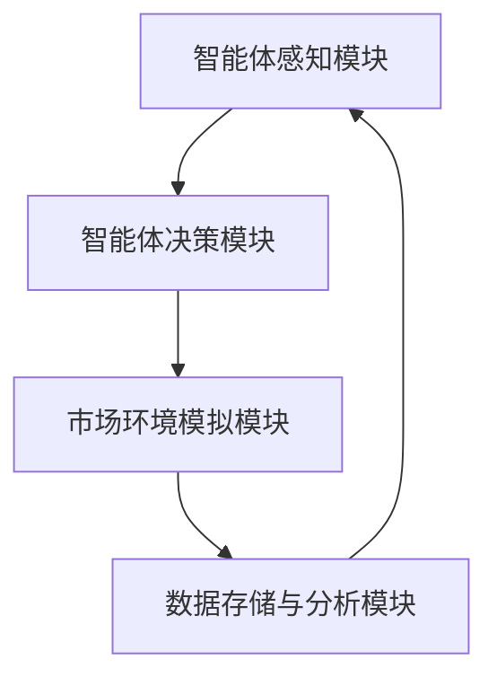
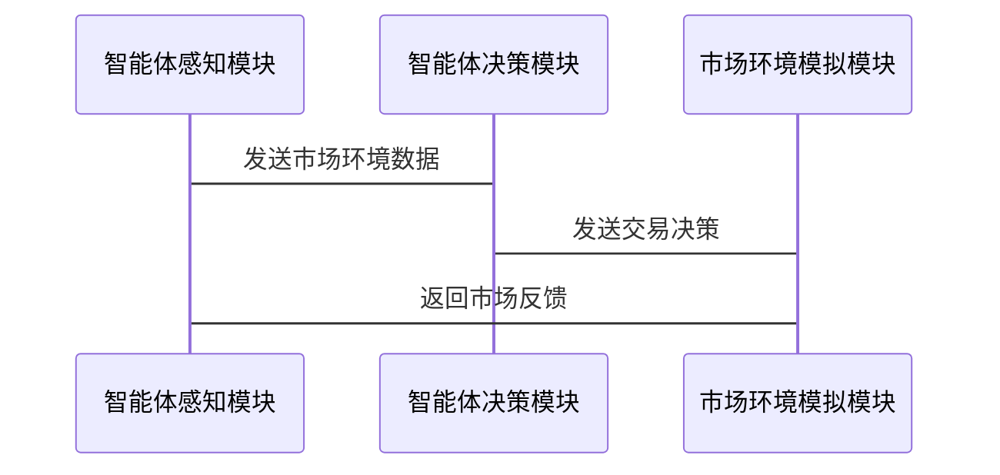

                 


# 智能体群体如何模拟并预测市场周期

## 关键词：智能体群体、市场周期、强化学习、时间序列分析、系统架构

## 摘要：  
本文详细探讨了如何利用智能体群体模拟并预测市场周期。通过分析智能体的行为模型、市场周期的动态特征以及两者之间的关联，结合强化学习和时间序列分析等算法，构建了一个完整的智能体群体模拟系统。文章内容包括背景介绍、核心概念、算法原理、系统架构设计以及实际案例分析，旨在为读者提供一个全面的技术视角，帮助理解并实现智能体群体在市场周期预测中的应用。

---

## 第一部分：智能体群体与市场周期概述

### 第1章：智能体群体的基本概念

#### 1.1 智能体的基本定义
智能体（Agent）是指具有感知环境、做出决策并采取行动的实体。智能体可以是软件程序、机器人或其他能够自主执行任务的实体。智能体的核心特征包括：
- **自主性**：能够自主决策，无需外部干预。
- **反应性**：能够感知环境并实时调整行为。
- **目标导向**：基于目标驱动行动。

智能体可以分为**简单反射型智能体**和**目标导向型智能体**两类：
- 简单反射型智能体：基于当前输入做出反应，如PID控制器。
- 目标导向型智能体：通过优化目标函数（如最大化奖励）来驱动行为。

#### 1.2 市场周期的基本概念
市场周期是指市场在经济发展过程中经历的周期性波动，通常包括以下几个阶段：
1. **繁荣期**：市场增长迅速，参与者活跃。
2. **衰退期**：市场增长放缓，参与者趋于保守。
3. **萧条期**：市场低迷，参与者信心不足。
4. **复苏期**：市场逐渐恢复，为下一轮繁荣期做准备。

市场周期的核心特征包括：
- **波动性**：市场指标（如价格、成交量）的短期波动。
- **周期性**：市场长期呈现周期性波动。
- **复杂性**：受多种因素（如政策、经济、社会）影响。

#### 1.3 问题背景与研究意义
当前的市场预测方法主要依赖统计模型（如ARIMA）和机器学习模型（如LSTM）。然而，这些方法存在以下局限性：
- **缺乏动态性**：难以模拟市场参与者的实时行为。
- **黑箱性**：模型难以解释，缺乏对市场机制的洞察。
- **适应性**：难以实时调整模型参数以应对市场变化。

通过引入智能体群体，我们可以模拟市场参与者的实时行为，从而更准确地预测市场周期。智能体群体模拟的优势在于：
- **动态性**：能够实时模拟市场参与者的交互行为。
- **可解释性**：通过分析智能体的行为规则，可以更好地理解市场机制。
- **适应性**：可以根据市场变化动态调整智能体的行为策略。

---

## 第二部分：智能体群体模拟市场周期的核心概念

### 第2章：智能体行为模型与市场周期的关系

#### 2.1 智能体行为模型的构建
智能体行为模型需要考虑以下关键要素：
- **感知**：智能体通过感知市场环境（如价格、成交量）来获取信息。
- **决策**：基于感知信息，智能体做出交易决策（如买入、卖出）。
- **行动**：智能体根据决策执行交易操作。

我们可以使用强化学习（Reinforcement Learning）来训练智能体的行为模型。强化学习的核心要素包括：
- **状态空间**：智能体所处的市场环境（如当前价格）。
- **动作空间**：智能体可以执行的动作（如买入、卖出）。
- **奖励机制**：根据智能体的决策和市场结果，给予奖励或惩罚。

#### 2.2 市场周期的动态特征
市场周期的动态特征可以通过时间序列分析来建模。时间序列分析的核心方法包括：
1. **ARIMA模型**：适用于线性时间序列数据。
2. **LSTM模型**：适用于非线性时间序列数据。
3. **GARCH模型**：适用于金融时间序列数据的波动性建模。

市场周期的动态特征可以通过以下步骤进行建模：
1. **数据预处理**：对市场数据进行标准化和滑动窗口处理。
2. **模型训练**：使用历史数据训练时间序列模型。
3. **模型预测**：基于当前数据预测未来的市场周期。

#### 2.3 智能体行为与市场周期的关联
智能体群体的行为对市场周期有重要影响。例如：
- **羊群效应**：大量智能体的集中买入或卖出会导致市场的短期波动。
- **多样性效应**：不同智能体的多样化行为可以减少市场的过度波动。

通过分析智能体群体的行为模式，我们可以更好地理解市场周期的动态特征，并为市场预测提供新的视角。

---

## 第三部分：智能体群体模拟市场周期的算法原理

### 第3章：智能体行为模型的算法实现

#### 3.1 基于强化学习的智能体行为模型
我们使用强化学习算法训练智能体的行为模型。以下是强化学习的基本步骤：
1. **环境初始化**：设置市场环境（如当前价格、参与者数量）。
2. **智能体感知**：智能体通过感知环境获取信息。
3. **决策与行动**：智能体根据感知信息做出决策并执行行动。
4. **奖励计算**：根据智能体的决策和市场结果，计算奖励。
5. **策略优化**：根据奖励更新智能体的策略。

以下是基于强化学习的智能体行为模型的代码示例：

```python
class TradingAgent:
    def __init__(self, state_space, action_space):
        self.state_space = state_space
        self.action_space = action_space
        # 初始化策略参数
        self.theta = np.random.randn(state_space, 1)

    def perceive(self, state):
        # 智能体感知环境
        return state

    def decide(self, state):
        # 基于感知状态做出决策
        return np.argmax(state.dot(self.theta))

    def act(self, action):
        # 执行交易操作
        return action

    def update_policy(self, reward):
        # 更新策略参数
        self.theta += reward * self.theta
```

#### 3.2 智能体群体的协同行为算法
智能体群体的协同行为可以通过分布式计算实现。以下是协同行为的实现步骤：
1. **初始化智能体**：设置智能体的数量和初始状态。
2. **智能体交互**：智能体之间通过消息传递进行协同。
3. **协同决策**：基于交互信息做出群体决策。
4. **协同行动**：根据决策执行协同行动。

以下是基于分布式计算的协同行为算法的代码示例：

```python
import threading

class TradingAgent:
    def __init__(self, id, state_space, action_space):
        self.id = id
        self.state_space = state_space
        self.action_space = action_space
        self.theta = np.random.randn(state_space, 1)

    def perceive(self, state):
        return state

    def decide(self, state):
        return np.argmax(state.dot(self.theta))

    def act(self, action):
        return action

    def update_policy(self, reward):
        self.theta += reward * self.theta

def trading_environment(agents):
    for agent in agents:
        state = get_current_state()
        action = agent.decide(state)
        reward = compute_reward(agent.act(action))
        agent.update_policy(reward)

# 初始化智能体
agents = [TradingAgent(i, 10, 3) for i in range(5)]
# 启动协同计算
threading.Thread(target=trading_environment, args=(agents,)).start()
```

#### 3.3 市场周期预测的数学模型
市场周期预测的数学模型可以通过时间序列分析实现。以下是基于LSTM的时间序列预测模型的代码示例：

```python
import tensorflow as tf
from tensorflow.keras import layers

model = tf.keras.Sequential()
model.add(layers.LSTM(64, input_shape=(timesteps, features)))
model.add(layers.Dense(1))
model.compile(optimizer='adam', loss='mean_squared_error')
```

---

## 第四部分：智能体群体模拟市场周期的系统架构设计

### 第4章：系统功能设计与实现

#### 4.1 系统功能模块设计
智能体群体模拟系统主要包括以下功能模块：
1. **智能体感知模块**：负责感知市场环境。
2. **智能体决策模块**：负责做出交易决策。
3. **市场环境模拟模块**：负责模拟市场环境。
4. **数据存储与分析模块**：负责存储和分析市场数据。

#### 4.2 系统架构设计
以下是基于微服务架构的系统架构图：



#### 4.3 系统接口设计
系统接口设计包括以下内容：
1. **智能体感知接口**：提供市场环境数据的获取接口。
2. **智能体决策接口**：提供交易决策的接口。
3. **市场环境模拟接口**：提供市场环境模拟的接口。

#### 4.4 系统交互流程
以下是基于智能体群体模拟的系统交互流程图：



---

## 第五部分：智能体群体模拟市场周期的项目实战

### 第5章：项目环境安装与实现

#### 5.1 环境安装
以下是项目所需的依赖库：
- `numpy`
- `pandas`
- `tensorflow`
- `matplotlib`

安装命令：
```bash
pip install numpy pandas tensorflow matplotlib
```

#### 5.2 核心代码实现
以下是基于强化学习的智能体行为模型的完整代码实现：

```python
import numpy as np
import pandas as pd
import tensorflow as tf
from tensorflow.keras import layers
import matplotlib.pyplot as plt

class TradingAgent:
    def __init__(self, id, state_space, action_space):
        self.id = id
        self.state_space = state_space
        self.action_space = action_space
        self.theta = np.random.randn(state_space, 1)

    def perceive(self, state):
        return state

    def decide(self, state):
        return np.argmax(state.dot(self.theta))

    def act(self, action):
        return action

    def update_policy(self, reward):
        self.theta += reward * self.theta

def compute_reward(action, price_change):
    if action == 'buy' and price_change > 0:
        return 1
    elif action == 'sell' and price_change < 0:
        return 1
    else:
        return -1

def trading_environment(agents, market_data):
    rewards = []
    for i in range(len(market_data)):
        state = market_data[i]
        action = agents[0].decide(state)
        reward = compute_reward(agents[0].act(action), market_data[i+1] - market_data[i])
        rewards.append(reward)
    return rewards

# 初始化智能体
agent = TradingAgent(0, 10, 3)

# 生成市场数据
market_data = np.random.randn(100, 1) * 10 + 50

# 模拟交易环境
rewards = trading_environment([agent], market_data)

# 可视化结果
plt.plot(rewards)
plt.title('Rewards Over Time')
plt.xlabel('Time Step')
plt.ylabel('Reward')
plt.show()
```

---

## 第六部分：总结与展望

### 6.1 小结
本文详细探讨了智能体群体模拟并预测市场周期的方法。通过分析智能体的行为模型、市场周期的动态特征以及两者之间的关联，结合强化学习和时间序列分析等算法，构建了一个完整的智能体群体模拟系统。本文的主要内容包括：
- 智能体群体的基本概念
- 市场周期的动态特征
- 基于强化学习的智能体行为模型
- 市场周期预测的数学模型
- 智能体群体模拟系统的架构设计
- 项目实战与代码实现

### 6.2 最佳实践 tips
- 在实际应用中，建议结合具体市场数据和业务需求，调整智能体的行为模型和市场周期预测模型。
- 可以通过引入多智能体协同算法（如多智能体强化学习）进一步提高模拟的准确性。
- 在实际应用中，建议结合实际市场环境，设计合理的奖励机制。

### 6.3 未来研究方向
- 研究智能体群体在金融市场中的应用，如高频交易、风险控制。
- 探索智能体群体与其他预测方法的结合，如与传统统计模型的结合。
- 研究智能体群体在复杂市场环境中的适应性。

---

## 作者信息

作者：AI天才研究院/AI Genius Institute & 禅与计算机程序设计艺术 /Zen And The Art of Computer Programming

