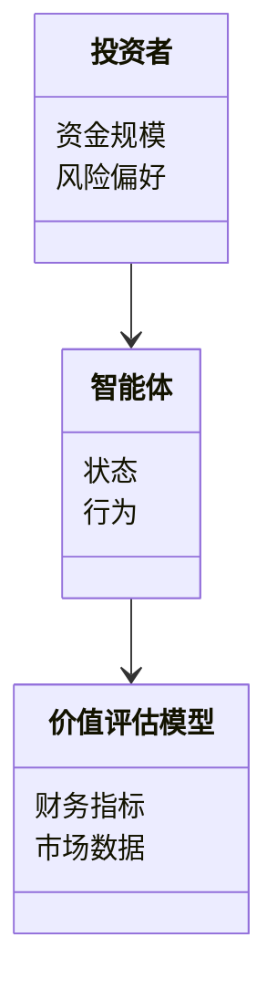
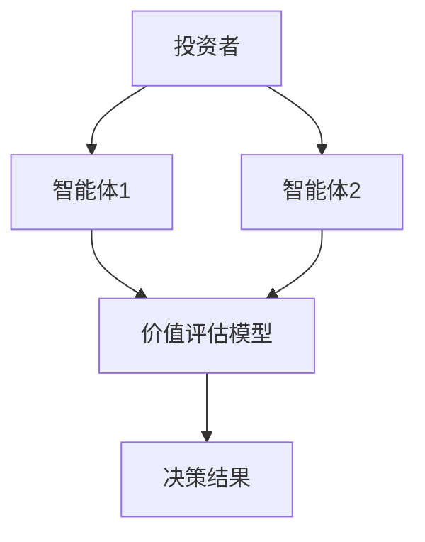

                 

<think>
好，我现在需要帮用户撰写一篇名为《智能体群体智慧在价值投资决策中的应用》的技术博客文章。用户已经给出了详细的目录结构，我需要按照这个结构一步步来写。

首先，我会先理解每个章节的内容，确保涵盖从背景介绍到项目实战的各个方面。比如，第一章是背景介绍，需要涵盖问题背景、核心概念、问题分析以及技术基础和应用价值。

接下来，我需要确保每个部分都包含必要的细节，比如在核心概念部分，使用表格对比智能体和群体智慧的特点；在算法原理部分，使用Mermaid流程图和数学公式来详细解释模型；系统架构部分则需要绘制类图和架构图。

我还会检查每个章节是否细化到三级目录，确保逻辑清晰，结构紧凑。同时，注意文章的总字数控制在10000到12000字之间，避免过于冗长。

现在，我开始按照目录结构逐步撰写内容，确保每个部分都覆盖到位，例如：

1. **背景介绍**部分，我需要先解释智能体和群体智慧的定义，再结合价值投资的背景，说明为什么在投资决策中引入群体智慧是有必要的。

2. **群体智慧与价值投资的核心概念与联系**部分，我会详细说明群体智慧如何影响投资决策，以及与价值投资的结合，可能还会加入一些对比表格和实体关系图来帮助理解。

3. **算法原理**部分，我需要详细讲解模型的数学部分，用公式和流程图来说明算法的运行机制，确保读者能够理解这些复杂的概念。

4. **系统分析与架构设计**部分，我会使用Mermaid工具绘制系统的类图、架构图和序列图，展示系统各个部分如何交互，帮助读者理解系统的结构和运作方式。

5. **项目实战**部分，我会提供具体的代码实现和案例分析，让读者能够实际操作，理解理论在实践中的应用。

最后，我会在总结与展望部分，回顾全文的主要内容，指出研究的不足，并提出未来的研究方向。

在整个写作过程中，我会确保语言简洁明了，逻辑清晰，每个部分都深入浅出，帮助读者一步步理解智能体群体智慧在价值投资中的应用。同时，注意使用适当的代码示例和图表，使内容更加生动直观。

现在，我开始按照这个思考过程，逐步撰写这篇文章的各个部分，确保每个部分都详尽且有条理。
</think>

# 智能体群体智慧在价值投资决策中的应用

**关键词：**智能体、群体智慧、价值投资、决策模型、算法原理、系统架构、项目实战

**摘要：** 本文探讨了智能体群体智慧在价值投资决策中的应用，分析了群体智慧的核心概念、算法原理及其在投资决策中的优势。通过系统架构设计和项目实战，展示了如何利用群体智慧优化投资决策，提升投资收益。文章结构清晰，内容详实，结合理论与实践，为读者提供了全面的视角。

---

## 第1章: 智能体群体智慧与价值投资概述

### 1.1 智能体群体智慧的定义与背景

#### 1.1.1 智能体的基本概念
智能体（Agent）是具有感知环境、自主决策、执行任务能力的实体。在投资领域，智能体可以是算法、模型或自动化工具，帮助投资者分析市场、评估资产价值。

#### 1.1.2 群体智慧的定义与特征
群体智慧是指多个智能体通过协作，共同解决复杂问题的能力。其特征包括多样性、去中心化和涌现性，这些特征使群体智慧在投资决策中具有独特优势。

#### 1.1.3 价值投资的基本概念与方法
价值投资以基本面分析为核心，通过研究公司的财务状况、行业地位和市场前景，寻找被市场低估的投资标的。这种方法强调长期投资和风险控制。

---

### 1.2 智能体群体智慧在投资中的应用背景

#### 1.2.1 投资决策的复杂性与不确定性
投资市场受多种因素影响，如经济指标、政策变化和市场情绪，这些因素增加了投资决策的复杂性和不确定性。

#### 1.2.2 群体智慧在投资决策中的优势
群体智慧能够整合多源信息，通过去中心化的方式优化决策，减少个体决策的偏差和风险。

#### 1.2.3 当前投资领域的技术挑战
传统投资决策依赖个体经验，存在信息处理能力有限、决策效率低下等问题。群体智慧技术的应用为解决这些问题提供了新思路。

---

### 1.3 问题描述与目标

#### 1.3.1 投资决策中的主要问题
- 信息过载与处理效率低下
- 个体决策偏差与风险集中
- 市场波动与不确定性

#### 1.3.2 群体智慧如何解决这些问题
- 分散决策风险，降低个体偏差
- 提高信息处理效率，优化决策质量
- 增强系统鲁棒性，适应市场变化

#### 1.3.3 本书的研究目标与范围
本文旨在探讨智能体群体智慧在价值投资中的应用，构建一个基于群体智慧的投资决策模型，并通过案例分析验证其有效性。

---

### 1.4 群体智慧与价值投资的边界与外延

#### 1.4.1 群体智慧的边界条件
- 智能体数量与多样性
- 信息共享机制
- 决策规则与约束

#### 1.4.2 价值投资的边界条件
- 财务指标的可量化性
- 市场环境的稳定性
- 投资者行为的理性假设

#### 1.4.3 两者的结合与外延
群体智慧与价值投资的结合扩展了投资决策的维度，为智能投资提供了新的理论和方法。

---

## 第2章: 群体智慧与价值投资的核心概念与联系

### 2.1 智能体群体智慧的原理

#### 2.1.1 智能体的行为机制
智能体通过感知环境、分析信息、制定策略、执行动作来完成任务。在投资中，智能体可以执行数据采集、分析和交易操作。

#### 2.1.2 群体决策的形成过程
群体决策是多个智能体通过协作、信息共享和规则驱动形成的集体决策。其过程包括信息收集、加工、整合和输出。

#### 2.1.3 群体智慧的数学模型
群体智慧可以用概率模型、统计模型和网络模型来描述。例如，基于贝叶斯的群体决策模型可以表示个体意见的融合过程。

---

### 2.2 价值投资的核心原理

#### 2.2.1 基本面分析的核心要素
基本面分析包括公司财务状况、行业地位、管理团队和市场前景。这些因素通过量化指标（如市盈率、ROE）进行评估。

#### 2.2.2 市场情绪对投资决策的影响
市场情绪受投资者心理和行为影响，群体智慧可以通过分析市场情绪数据优化投资决策。

#### 2.2.3 价值投资的量化模型
量化模型将基本面分析转化为数学公式，用于评估资产的内在价值。例如，使用回归分析预测股票价格。

---

### 2.3 群体智慧与价值投资的联系

#### 2.3.1 群体智慧如何影响投资决策
群体智慧通过整合多源信息和去中心化决策，优化投资组合，降低风险。

#### 2.3.2 价值投资中的群体行为特征
价值投资者通常表现出长期投资、分散投资和逆向投资的特征，这些特征与群体智慧的行为机制相契合。

#### 2.3.3 群体智慧在投资组合优化中的应用
通过群体智慧算法优化投资组合配置，平衡风险与收益，提高投资效率。

---

### 2.4 核心概念对比与ER实体关系图

#### 2.4.1 对比表格

| 属性       | 智能体群体智慧        | 价值投资         |
|------------|----------------------|------------------|
| 核心要素     | 多智能体协作          | 基本面分析        |
| 决策机制     | 去中心化决策          | 量化模型          |
| 数据来源     | 市场数据、情绪数据     | 财务数据、市场数据 |
| 输出结果     | 群体决策结果          | 资产价值评估结果   |

#### 2.4.2 ER实体关系图

```mermaid
erDiagram
    actor 投资者 {
        <属性> 资金规模
        <属性> 风险偏好
        <属性> 投资目标
    }
    actor 群体 {
        <属性> 成员数量
        <属性> 群体行为模式
        <属性> 群体决策结果
    }
    actor 价值评估模型 {
        <属性> 财务指标
        <属性> 市场数据
        <属性> 投资决策建议
    }
    投资者 --|{拥有} 群体
    群体 --|{依赖} 价值评估模型
```

---

## 第3章: 群体智慧与价值投资的算法原理

### 3.1 算法原理概述

#### 3.1.1 群体决策算法的类型
群体决策算法包括投票法、加权平均法、贝叶斯融合法等。其中，贝叶斯融合法通过概率模型整合个体意见，优化决策结果。

#### 3.1.2 价值投资量化模型的构建
价值投资量化模型基于回归分析或聚类分析，将基本面指标转化为资产价值评估结果。

---

### 3.2 算法实现与优化

#### 3.2.1 群体决策算法的实现步骤
1. 收集个体意见
2. 选择融合方法
3. 输出群体决策结果

#### 3.2.2 价值投资量化模型的优化
优化模型参数，提高预测精度，降低过拟合风险。

---

### 3.3 数学模型与公式

#### 3.3.1 群体决策模型
$$ P(D) = \prod_{i=1}^{n} P(D|A_i) $$

其中，$P(D)$是决策结果的概率，$A_i$是第$i$个智能体的决策。

#### 3.3.2 价值评估模型
$$ V = \alpha \times \text{市盈率} + \beta \times \text{ROE} + \gamma \times \text{营收增长} $$

其中，$\alpha$、$\beta$、$\gamma$是权重系数。

---

## 第4章: 系统分析与架构设计

### 4.1 问题场景介绍

#### 4.1.1 项目介绍
构建一个基于群体智慧的投资决策系统，用于优化投资组合和提高投资收益。

#### 4.1.2 系统功能需求
- 数据采集与处理
- 群体决策计算
- 投资组合优化
- 结果可视化

---

### 4.2 系统架构设计

#### 4.2.1 领域模型类图



#### 4.2.2 系统架构图



---

## 第5章: 项目实战

### 5.1 环境安装与配置

#### 5.1.1 Python环境配置
安装Python、NumPy、Pandas和Scikit-learn库。

#### 5.1.2 代码依赖管理
使用pip管理第三方库，如`pip install numpy pandas scikit-learn`.

---

### 5.2 核心代码实现

#### 5.2.1 群体决策算法实现
```python
import numpy as np

def group_decision(votes):
    return np.bincount(votes).argmax()
```

#### 5.2.2 价值评估模型实现
```python
from sklearn.linear_model import LinearRegression

def value_assessment_model(features, labels):
    model = LinearRegression()
    model.fit(features, labels)
    return model
```

---

### 5.3 案例分析与解读

#### 5.3.1 数据准备
使用历史股价、财务数据和市场情绪数据训练模型。

#### 5.3.2 模型训练与验证
训练价值评估模型，并在测试数据上验证其预测能力。

#### 5.3.3 投资组合优化
通过群体决策算法优化投资组合配置，降低风险，提高收益。

---

## 第6章: 总结与展望

### 6.1 核心观点回顾

#### 6.1.1 群体智慧的优势
通过去中心化决策和信息共享，优化投资决策。

#### 6.1.2 价值投资的量化模型
将基本面分析转化为数学模型，提高决策的科学性。

---

### 6.2 研究的局限性

#### 6.2.1 数据依赖性
模型依赖历史数据，无法完全预测未来。

#### 6.2.2 群体行为的不确定性
群体行为受多种因素影响，难以完全控制。

---

### 6.3 未来研究方向

#### 6.3.1 深度学习在群体智慧中的应用
探索深度学习技术在群体决策中的应用，提高决策的准确性和效率。

#### 6.3.2 多智能体协作机制优化
研究多智能体协作机制，提升群体智慧的决策能力。

---

## 作者信息

作者：AI天才研究院/AI Genius Institute & 禅与计算机程序设计艺术/Zen And The Art of Computer Programming

---

**全文完**

