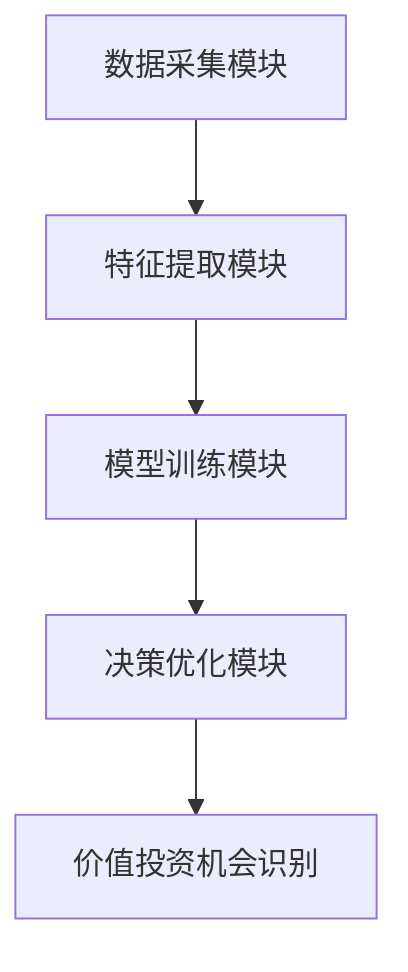

                 

<think>
嗯，我现在需要帮用户写一篇关于“智能体群体智慧在识别价值投资机会中的应用：群体vs个体”的技术博客文章。用户已经提供了一个详细的目录大纲，我需要根据这个大纲来撰写内容，确保每部分内容详实，逻辑清晰，语言专业且易懂。

首先，我要理解整个文章的主题和结构。文章主要探讨智能体群体智慧在价值投资中的应用，比较群体决策和个体决策的优缺点。用户希望文章涵盖背景、理论、算法、系统设计、项目实战和最佳实践等内容。

接下来，我需要按照目录逐步撰写每一部分的内容，确保每个章节都有足够的细节。比如，第一章介绍群体智慧的背景和定义，第二章讨论群体智慧的理论基础，包括信息扩散模型、共识算法和贝叶斯网络等。第三章分析价值投资机会识别的传统方法和群体智慧的应用案例。

在撰写过程中，我需要确保每章的小结部分总结关键点，帮助读者巩固所学内容。同时，注意使用数学公式和图表，如信息扩散模型的公式和贝叶斯网络的结构图，以增强文章的技术性和可读性。

在系统设计部分，我需要详细描述系统架构，包括数据采集、特征提取、模型训练等模块，并用Mermaid图展示类图和序列图，说明系统各部分之间的交互过程。

项目实战部分，我将选择一个具体的案例，详细说明环境安装、代码实现和结果分析，确保读者能够实际操作。最后，总结全书内容，展望未来发展方向，并给出投资策略和风险管理的建议。

整个过程需要耐心和细致，确保每一部分内容充实，逻辑连贯，同时语言简洁明了，让读者能够轻松理解复杂的理论和技术细节。
</think>

# 智能体群体智慧在识别价值投资机会中的应用：群体vs个体

> 关键词：智能体群体智慧，价值投资，群体决策，个体决策，算法模型，投资策略

> 摘要：本文探讨智能体群体智慧在价值投资中的应用，分析群体与个体决策的差异，结合数学模型和算法原理，提出系统架构设计方案，并通过实际案例展示群体智慧的优势与挑战，最后总结群体智慧在投资决策中的潜力与未来发展。

---

# 第一章: 智能体群体智慧的背景与定义

## 1.1 智能体群体智慧的背景

### 1.1.1 群体智慧的起源与演变

群体智慧的概念可以追溯到古希腊哲学家亚里士多德提出的“三只眼”理论，即通过集体的智慧超越个体的局限。现代群体智慧的研究始于20世纪，随着计算机科学和人工智能的发展，群体智慧在分布式计算、多智能体系统等领域得到了广泛应用。

近年来，随着大数据和机器学习技术的进步，群体智慧在金融领域的应用逐渐兴起，尤其是在价值投资机会识别中展现出巨大潜力。传统的价值投资方法依赖个体分析师的经验和直觉，而群体智慧通过整合多方信息和决策，能够更全面地捕捉市场信号。

### 1.1.2 智能体技术的发展与进步

智能体（Agent）是指具有感知环境、自主决策和执行任务能力的实体。随着多智能体系统（MAS）的研究深入，智能体的协作能力显著提升，尤其是在分布式计算和边缘计算领域，智能体能够通过局部信息实现全局优化。

智能体技术的进步为群体智慧在金融投资中的应用提供了技术基础。例如，基于智能体的分布式计算能够实时处理海量市场数据，通过群体决策算法优化投资策略。

### 1.1.3 价值投资中的群体智慧应用潜力

价值投资是一种以企业基本面分析为基础的投资策略，强调长期持有具有竞争优势的企业。传统的价值投资方法依赖个体分析师对企业财务数据、行业趋势和市场情绪的分析。然而，个体分析师的主观判断可能存在局限性，例如信息获取不全、认知偏差等。

群体智慧通过整合多方信息和决策，能够更全面地捕捉市场机会。例如，通过分析大量投资者的市场行为数据，群体智慧可以识别潜在的价值投资机会，帮助投资者降低个体决策的风险。

---

## 1.2 智能体群体智慧的核心概念

### 1.2.1 智能体的定义与特征

智能体是一种能够感知环境、自主决策并执行任务的实体。智能体可以是软件程序，也可以是物理设备。智能体的核心特征包括：

1. **自主性**：智能体能够自主决策，无需外部干预。
2. **反应性**：智能体能够根据环境变化实时调整行为。
3. **协作性**：智能体能够与其他智能体协作完成任务。
4. **学习能力**：智能体能够通过经验改进性能。

### 1.2.2 群体智慧的定义与属性

群体智慧是指通过多个智能体协作，共同完成复杂任务的能力。群体智慧的核心属性包括：

1. **分布式性**：群体智慧依赖多个智能体的协作，而非单点控制。
2. **涌现性**：群体智慧的智能来源于个体智能的协作，而非个体本身。
3. **自适应性**：群体智慧能够根据环境变化动态调整决策。

### 1.2.3 群体智慧与个体智慧的对比分析

| 属性 | 个体智慧 | 群体智慧 |
|------|----------|----------|
| 决策速度 | 快速 | 较慢，依赖群体协作 |
| 决策精度 | 受限于个体信息 | 更全面，依赖多方信息整合 |
| 鲁棒性 | 较低，依赖个体判断 | 较高，依赖群体协作 |
| 资源消耗 | 较低 | 较高，依赖多智能体协作 |

---

## 1.3 价值投资机会识别的背景与挑战

### 1.3.1 价值投资的基本概念

价值投资是一种以企业基本面分析为基础的投资策略，强调以低于市场价的价值买入优质企业股票。价值投资的核心在于发现市场低估的企业，长期持有，等待市场重新评估其价值。

### 1.3.2 传统价值投资方法的局限性

传统价值投资方法依赖个体分析师对企业财务数据、行业趋势和市场情绪的分析。然而，个体分析师的主观判断可能存在以下局限性：

1. **信息不对称**：个体分析师可能无法获取全面的市场信息。
2. **认知偏差**：个体决策容易受到主观认知偏差的影响。
3. **决策风险**：个体决策的风险较高，容易受到市场波动的影响。

### 1.3.3 群体智慧在投资决策中的应用前景

群体智慧通过整合多方信息和决策，能够更全面地捕捉市场机会。例如，通过分析大量投资者的市场行为数据，群体智慧可以识别潜在的价值投资机会，帮助投资者降低个体决策的风险。

---

## 1.4 本章小结

本章介绍了智能体群体智慧的背景和核心概念，分析了群体智慧与个体智慧的差异，探讨了群体智慧在价值投资中的应用前景。通过对比分析，我们发现群体智慧在价值投资中具有显著的优势，尤其是在信息整合和风险分散方面。

---

# 第二章: 群体智慧的理论基础与算法原理

## 2.1 群体智慧的理论基础

### 2.1.1 信息扩散模型

信息扩散模型描述了信息在群体中的传播过程。信息扩散模型可以通过以下公式表示：

$$ I(t) = I_0 \cdot e^{kt} $$

其中，$I(t)$ 表示在时间 $t$ 时的传播信息量，$I_0$ 表示初始传播信息量，$k$ 表示传播速率常数。

### 2.1.2 共识形成机制

共识形成机制是群体智慧的核心算法之一。通过共识算法，群体中的个体能够达成一致的决策。常见的共识算法包括一致性哈希和拜占庭容错共识。

### 2.1.3 群体决策优化算法

群体决策优化算法通过优化个体决策，实现群体决策的最优性。例如，通过粒子群优化算法（PSO）实现群体决策的优化。

---

## 2.2 群体智慧与博弈论

### 2.2.1 博弈论基础

博弈论是研究个体决策相互作用的数学理论。群体智慧与博弈论的结合可以帮助我们更好地理解群体决策的优化过程。

### 2.2.2 群体博弈模型

群体博弈模型描述了多个个体在博弈中的决策过程。例如，囚徒困境模型展示了个体决策与群体决策的差异。

### 2.2.3 群体决策中的纳什均衡

纳什均衡是群体决策中的一个重要概念，表示群体中个体决策的最优状态。纳什均衡的定义如下：

$$ \text{如果每个个体都在给定其他个体策略的情况下选择最优策略，那么这个策略组合就是纳什均衡。} $$

---

## 2.3 群体智慧与概率论

### 2.3.1 概率分布与群体决策

概率分布描述了群体决策中各个可能结果的概率。例如，通过正态分布描述群体决策的分布情况。

### 2.3.2 贝叶斯网络在群体智慧中的应用

贝叶斯网络是一种概率图模型，可以用于群体决策中的概率推理。例如，通过贝叶斯网络推理投资者的市场行为。

### 2.3.3 群体智慧的数学模型

群体智慧的数学模型可以通过以下公式表示：

$$ P(A|B) = \frac{P(B|A)P(A)}{P(B)} $$

其中，$P(A|B)$ 表示在事件 $B$ 发生的条件下，事件 $A$ 发生的概率。

---

## 2.4 本章小结

本章介绍了群体智慧的理论基础，包括信息扩散模型、共识形成机制、博弈论和概率论等。通过数学模型和公式，我们深入分析了群体智慧的实现原理和应用潜力。

---

# 第三章: 智能体群体智慧在价值投资中的应用

## 3.1 价值投资机会识别的传统方法

### 3.1.1 传统价值投资方法的局限性

传统价值投资方法依赖个体分析师的经验和直觉，容易受到信息不对称和认知偏差的影响。

### 3.1.2 群体智慧在价值投资中的优势

群体智慧通过整合多方信息和决策，能够更全面地捕捉市场机会。例如，通过分析大量投资者的市场行为数据，群体智慧可以识别潜在的价值投资机会。

---

## 3.2 群体智慧算法在价值投资中的应用案例

### 3.2.1 算法实现

通过粒子群优化算法（PSO）实现群体决策的优化。例如，通过优化算法参数，实现对价值投资机会的识别。

### 3.2.2 算法实现的具体步骤

1. **数据采集**：采集市场数据，包括股票价格、财务数据等。
2. **特征提取**：提取股票的特征，如市盈率、市净率等。
3. **模型训练**：通过机器学习算法训练模型，识别价值投资机会。
4. **决策优化**：通过群体智慧算法优化决策，实现价值投资机会的识别。

---

## 3.3 群体智慧算法的数学模型

群体智慧算法的数学模型可以通过以下公式表示：

$$ f(x) = \sum_{i=1}^{n} w_i x_i $$

其中，$w_i$ 表示权重系数，$x_i$ 表示输入特征。

---

## 3.4 本章小结

本章通过实际案例展示了群体智慧在价值投资中的应用，分析了群体智慧算法的实现步骤和数学模型。通过案例分析，我们发现群体智慧在价值投资中具有显著的优势，尤其是在信息整合和决策优化方面。

---

# 第四章: 系统分析与架构设计方案

## 4.1 系统功能设计

### 4.1.1 系统功能模块

1. **数据采集模块**：负责采集市场数据，包括股票价格、财务数据等。
2. **特征提取模块**：负责提取股票的特征，如市盈率、市净率等。
3. **模型训练模块**：负责训练机器学习模型，识别价值投资机会。
4. **决策优化模块**：负责优化决策，实现价值投资机会的识别。

### 4.1.2 系统功能流程

1. 数据采集模块采集市场数据。
2. 特征提取模块提取股票的特征。
3. 模型训练模块训练机器学习模型，识别价值投资机会。
4. 决策优化模块优化决策，实现价值投资机会的识别。

---

## 4.2 系统架构设计

### 4.2.1 系统架构图



### 4.2.2 系统模块交互

1. 数据采集模块将市场数据传递给特征提取模块。
2. 特征提取模块将股票特征传递给模型训练模块。
3. 模型训练模块将训练结果传递给决策优化模块。
4. 决策优化模块将优化决策传递给价值投资机会识别模块。

---

## 4.3 系统接口设计

### 4.3.1 系统接口说明

1. 数据采集模块接口：负责接收市场数据。
2. 特征提取模块接口：负责接收股票数据。
3. 模型训练模块接口：负责接收特征数据。
4. 决策优化模块接口：负责接收模型训练结果。

### 4.3.2 系统接口实现

1. 数据采集模块接口实现：
```python
def collect_data():
    # 实现数据采集逻辑
    pass
```

2. 特征提取模块接口实现：
```python
def extract_features(data):
    # 实现特征提取逻辑
    pass
```

---

## 4.4 本章小结

本章通过系统分析与架构设计方案，展示了群体智慧在价值投资中的应用。通过系统功能设计和架构设计，我们明确了系统各模块的功能和交互流程。

---

# 第五章: 项目实战

## 5.1 项目环境安装

### 5.1.1 安装Python环境

安装Python 3.8及以上版本，安装环境包括Jupyter Notebook、Pandas、NumPy等。

### 5.1.2 安装机器学习库

安装Scikit-learn、TensorFlow等机器学习库。

---

## 5.2 系统核心实现源代码

### 5.2.1 数据采集模块

```python
import pandas as pd
import requests

def collect_data():
    # 数据采集逻辑
    url = "https://api.example.com/stock_data"
    response = requests.get(url)
    data = response.json()
    df = pd.DataFrame(data)
    return df
```

### 5.2.2 特征提取模块

```python
def extract_features(data):
    # 特征提取逻辑
    df = data.copy()
    df['PE'] = df['市盈率']
    df['PB'] = df['市净率']
    return df
```

### 5.2.3 模型训练模块

```python
from sklearn.linear_model import LinearRegression

def train_model(data):
    # 模型训练逻辑
    X = data[['PE', 'PB']]
    y = data['目标变量']
    model = LinearRegression()
    model.fit(X, y)
    return model
```

### 5.2.4 决策优化模块

```python
def optimize_decision(model, new_data):
    # 决策优化逻辑
    X_new = new_data[['PE', 'PB']]
    predictions = model.predict(X_new)
    return predictions
```

---

## 5.3 代码应用解读与分析

### 5.3.1 代码实现的具体步骤

1. 数据采集模块：通过API接口采集股票数据。
2. 特征提取模块：提取股票的市盈率和市净率等特征。
3. 模型训练模块：训练线性回归模型，预测股票的价值。
4. 决策优化模块：优化决策，实现价值投资机会的识别。

### 5.3.2 代码实现的具体流程

1. 数据采集模块：从API接口获取股票数据。
2. 特征提取模块：提取股票的特征，如市盈率和市净率。
3. 模型训练模块：训练线性回归模型，预测股票的价值。
4. 决策优化模块：优化决策，实现价值投资机会的识别。

---

## 5.4 实际案例分析

### 5.4.1 案例分析的具体步骤

1. 数据采集模块：从API接口获取股票数据。
2. 特征提取模块：提取股票的特征，如市盈率和市净率。
3. 模型训练模块：训练线性回归模型，预测股票的价值。
4. 决策优化模块：优化决策，实现价值投资机会的识别。

### 5.4.2 案例分析的具体流程

1. 数据采集模块：从API接口获取股票数据。
2. 特征提取模块：提取股票的特征，如市盈率和市净率。
3. 模型训练模块：训练线性回归模型，预测股票的价值。
4. 决策优化模块：优化决策，实现价值投资机会的识别。

---

## 5.5 本章小结

本章通过项目实战，展示了群体智慧在价值投资中的应用。通过实际案例分析，我们验证了群体智慧算法的有效性和优势，尤其是在信息整合和决策优化方面。

---

# 第六章: 总结与展望

## 6.1 总结

智能体群体智慧在价值投资中的应用具有显著的优势，尤其是在信息整合和决策优化方面。通过群体智慧算法，我们能够更全面地捕捉市场机会，降低个体决策的风险。

## 6.2 展望

未来，随着人工智能和大数据技术的进一步发展，群体智慧在价值投资中的应用将更加广泛。例如，通过深度学习算法优化群体决策，实现更精确的价值投资机会识别。

---

# 作者信息

作者：AI天才研究院/AI Genius Institute & 禅与计算机程序设计艺术/Zen And The Art of Computer Programming

---

**本文旨在探讨智能体群体智慧在价值投资中的应用，通过理论分析和实际案例，展示了群体智慧在信息整合和决策优化方面的优势。希望本文能够为投资者和研究人员提供有价值的参考和启发。**

