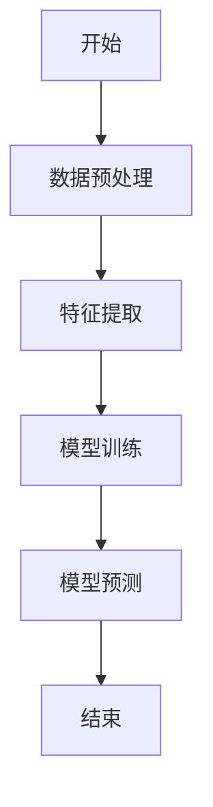
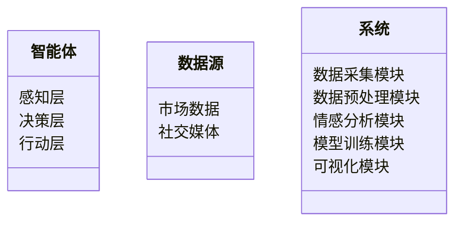

                 


# 智能体群体智慧在识别市场情绪拐点中的应用

## 关键词：智能体，群体智慧，市场情绪，拐点识别，情感分析，协同学习，实时监控

## 摘要：  
智能体群体智慧是一种通过多个智能体协同工作来模拟人类群体决策的新兴技术。在金融市场中，市场情绪的变化往往预示着价格波动和投资机会，因此，识别市场情绪拐点具有重要的现实意义。本文探讨了如何利用智能体群体智慧技术来分析和预测市场情绪拐点。文章从智能体的基本概念、群体智慧的核心原理、情感分析算法、系统架构设计等方面进行了深入探讨，并通过实际案例展示了智能体群体智慧在市场情绪拐点识别中的应用效果。本文还总结了智能体群体智慧的优势和局限性，并提出了进一步优化的方向。

---

# 第1章: 智能体群体智慧与市场情绪拐点概述

## 1.1 智能体群体智慧的定义与特点

### 1.1.1 智能体的基本概念
智能体（Agent）是指能够感知环境并采取行动以实现目标的实体。智能体可以是软件程序、机器人或其他具备自主决策能力的系统。智能体的核心特征包括自主性、反应性、目标导向性和社会性。

### 1.1.2 群体智慧的定义与特征
群体智慧是指通过多个个体的协同工作，实现比个体单独行动更优的结果。群体智慧的关键在于个体之间的信息共享和协同决策。群体智慧的特点包括分布性、多样性、自适应性和涌现性。

### 1.1.3 智能体群体智慧的核心要素
智能体群体智慧结合了智能体的自主性和群体智慧的协同性，其核心要素包括：
1. **个体智能体**：具备感知、决策和行动能力。
2. **群体协同**：通过信息共享和协作实现群体目标。
3. **动态环境**：智能体需要适应不断变化的环境。

---

## 1.2 市场情绪拐点的定义与识别

### 1.2.1 市场情绪的基本概念
市场情绪是指市场参与者（如投资者、交易员）对市场走势的心理预期和行为表现。市场情绪可以通过新闻、社交媒体、交易数据等多种渠道进行衡量。

### 1.2.2 市场情绪拐点的定义
市场情绪拐点是指市场情绪从一个状态（如乐观）转向另一个状态（如悲观）的关键时刻。拐点的识别对于投资者来说至关重要，因为拐点往往预示着市场的重大变化。

### 1.2.3 市场情绪拐点识别的重要性
1. **投资决策**：提前识别拐点可以帮助投资者做出更明智的投资决策。
2. **风险管理**：拐点识别有助于及时调整投资策略，降低风险。
3. **市场预测**：通过分析市场情绪的变化，可以提高对市场趋势的预测能力。

---

## 1.3 智能体群体智慧与市场情绪拐点的关系

### 1.3.1 智能体群体智慧在市场情绪分析中的优势
1. **分布式计算**：通过多个智能体协同工作，可以提高计算效率。
2. **多样性**：多个智能体可以从不同角度分析市场情绪，提高结果的准确性。
3. **自适应性**：智能体群体可以动态调整策略，适应市场变化。

### 1.3.2 市场情绪拐点识别的挑战与机遇
1. **挑战**：市场情绪受到多种因素影响，难以准确预测。
2. **机遇**：智能体群体智慧可以通过多维度分析，捕捉市场情绪的变化。

### 1.3.3 智能体群体智慧的应用场景
1. **实时监控**：通过智能体实时采集和分析市场数据。
2. **情感分析**：利用自然语言处理技术分析社交媒体和新闻的情绪。
3. **交易策略优化**：基于市场情绪拐点调整交易策略。

---

## 1.4 本章小结

本章介绍了智能体群体智慧的基本概念和特点，阐述了市场情绪拐点的定义和识别的重要性。同时，分析了智能体群体智慧在市场情绪拐点识别中的优势和应用场景，为后续章节的深入探讨奠定了基础。

---

# 第2章: 智能体群体智慧的核心原理

## 2.1 智能体的结构与功能

### 2.1.1 智能体的组成要素
智能体通常由以下组成：
1. **感知层**：感知环境信息（如数据采集）。
2. **决策层**：基于感知信息进行决策。
3. **行动层**：根据决策采取行动。

### 2.1.2 智能体的行为模式
智能体的行为模式包括反应式行为、目标导向行为和学习行为。

### 2.1.3 智能体的决策机制
智能体的决策机制可以是基于规则、基于模型或基于机器学习的。

---

## 2.2 群体智慧的实现机制

### 2.2.1 群体智慧的基本原理
群体智慧通过个体之间的信息共享和协同决策，实现群体目标。

### 2.2.2 群体智慧的协同机制
1. **信息共享**：个体之间共享感知信息。
2. **决策协商**：个体通过协商达成一致决策。
3. **任务分配**：根据个体能力和任务需求进行任务分配。

### 2.2.3 群体智慧的优化算法
常用的群体智慧优化算法包括遗传算法、粒子群优化算法和蚁群算法。

---

## 2.3 智能体群体智慧与市场情绪分析的结合

### 2.3.1 市场情绪分析的智能体模型
智能体可以通过情感分析技术对市场情绪进行分类。

### 2.3.2 智能体群体智慧在情绪传播中的应用
智能体可以通过社交网络分析市场情绪的传播路径。

### 2.3.3 智能体群体智慧的可扩展性与鲁棒性
智能体群体智慧可以通过增加智能体数量和优化算法提高系统的可扩展性和鲁棒性。

---

## 2.4 本章小结

本章详细讲解了智能体的结构与功能，以及群体智慧的实现机制。同时，分析了智能体群体智慧在市场情绪分析中的应用，为后续章节的算法实现和系统设计提供了理论基础。

---

# 第3章: 基于智能体的群体智慧算法

## 3.1 智能体群体智慧的核心算法

### 3.1.1 情感分析算法
情感分析算法用于识别文本中的情感倾向。常用算法包括基于规则的算法和基于机器学习的算法。

---

### 3.1.2 情感分析算法的实现步骤

1. **数据预处理**：清洗和标注数据。
2. **特征提取**：提取文本特征（如词袋模型、TF-IDF）。
3. **模型训练**：使用机器学习算法（如逻辑回归、SVM）训练模型。
4. **模型预测**：对新数据进行情感分类。

---

### 3.1.3 情感分析算法的优缺点对比

| 特性         | 基于规则的算法 | 基于机器学习的算法 |
|--------------|----------------|---------------------|
| 优势         | 实现简单，可解释性高 | 性能高，适应性强     |
| 劣势         | 需要大量人工规则 | 需要大量标注数据     |

---

## 3.2 算法原理与流程图

### 3.2.1 情感分析算法的流程图



---

### 3.2.2 情感分析算法的数学模型

逻辑回归模型用于情感分类：

$$ P(y=1|x) = \frac{1}{1 + e^{-\beta x}} $$

其中，$\beta$ 是模型参数，$x$ 是输入特征。

---

## 3.3 智能体群体智慧的实现

### 3.3.1 智能体的协同学习机制
智能体可以通过协同学习算法（如分布式机器学习）提高模型性能。

### 3.3.2 协同学习算法的实现步骤

1. **数据分布**：将数据分发给不同的智能体。
2. **局部模型训练**：每个智能体在局部数据上训练模型。
3. **模型聚合**：将所有智能体的模型参数进行融合，得到全局模型。

---

## 3.4 本章小结

本章详细讲解了智能体群体智慧的核心算法，包括情感分析算法和协同学习算法。同时，通过流程图和数学公式详细阐述了算法的实现步骤，为后续章节的系统设计提供了技术支持。

---

# 第4章: 智能体群体智慧的系统架构设计

## 4.1 系统功能设计

### 4.1.1 领域模型



---

### 4.1.2 系统功能模块
1. **数据采集模块**：采集市场数据和社交媒体数据。
2. **数据预处理模块**：清洗和标注数据。
3. **情感分析模块**：对数据进行情感分类。
4. **模型训练模块**：训练情感分析模型。
5. **可视化模块**：展示市场情绪变化。

---

## 4.2 系统架构设计

### 4.2.1 系统架构图


---

## 4.3 系统接口设计

### 4.3.1 系统接口描述
1. **数据接口**：与数据源对接，获取市场数据。
2. **模型接口**：与情感分析模型对接，获取市场情绪预测结果。
3. **可视化接口**：与前端展示界面对接，展示市场情绪变化。

---

## 4.4 系统交互流程

### 4.4.1 系统交互流程图


---

## 4.5 本章小结

本章详细设计了智能体群体智慧系统的架构，包括系统功能模块、架构设计和交互流程。通过mermaid图展示了系统的整体结构和交互过程，为后续章节的项目实现提供了指导。

---

# 第5章: 项目实战与案例分析

## 5.1 环境安装

### 5.1.1 系统环境
- 操作系统：Linux/Windows/MacOS
- Python版本：Python 3.x
- 开发工具：Jupyter Notebook/PyCharm

---

### 5.1.2 依赖库安装
安装以下依赖库：
```bash
pip install numpy pandas scikit-learn matplotlib
```

---

## 5.2 系统核心实现

### 5.2.1 情感分析模块实现

```python
import pandas as pd
from sklearn.feature_extraction.text import TfidfVectorizer
from sklearn.linear_model import LogisticRegression
from sklearn.metrics import accuracy_score

# 数据加载
data = pd.read_csv('market_emotion.csv')

# 特征提取
vectorizer = TfidfVectorizer()
X = vectorizer.fit_transform(data['text'])
y = data['label']

# 模型训练
model = LogisticRegression()
model.fit(X, y)

# 模型预测
y_pred = model.predict(X)
print(accuracy_score(y, y_pred))
```

---

### 5.2.2 模型训练模块实现

```python
import numpy as np
from sklearn.svm import SVC

# 数据加载
data = pd.read_csv('market_emotion.csv')

# 特征提取
vectorizer = TfidfVectorizer()
X = vectorizer.fit_transform(data['text'])
y = data['label']

# 模型训练
model = SVC(kernel='rb

