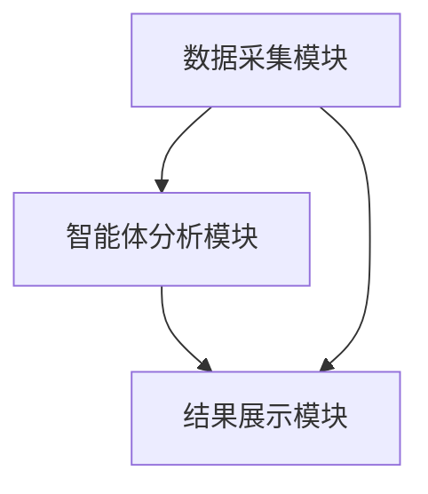

                 


# 智能体群体智慧在识别市场泡沫中的应用：保护价值投资

> 关键词：智能体群体智慧、市场泡沫、价值投资、算法原理、系统架构、项目实战

> 摘要：本文深入探讨了智能体群体智慧在识别市场泡沫中的应用，结合价值投资的保护策略，通过算法原理、系统架构设计和项目实战的详细讲解，展示了如何利用智能体群体智慧提升市场分析的准确性和效率，为投资者提供科学的决策支持。

---

## 第1章: 引言

### 1.1 市场泡沫与价值投资的挑战

#### 1.1.1 市场泡沫的定义与特征
市场泡沫是指资产价格在短时间内急剧上涨，远远超出其实际价值的现象。其特征包括价格波动剧烈、市场情绪化、参与者行为趋同等。市场泡沫的形成通常由投资者的非理性行为、信息不对称和市场过度杠杆化等因素驱动。

#### 1.1.2 价值投资的核心理念
价值投资强调以低于资产内在价值的价格买入优质资产，长期持有，通过时间复利实现财富增长。其核心理念包括寻找具有持续竞争优势的企业、注重企业的基本面分析、忽略短期市场波动等。

#### 1.1.3 智能体群体智慧的引入
智能体群体智慧通过模拟个体行为和群体决策，能够有效捕捉市场中的非理性行为和潜在风险。通过智能体的协同计算，可以更准确地识别市场泡沫，为价值投资者提供保护。

---

## 第2章: 智能体群体智慧的核心概念

### 2.1 智能体的定义与分类

#### 2.1.1 智能体的定义
智能体是指能够感知环境、做出决策并采取行动的实体。它可以是个体、组织或算法程序。

#### 2.1.2 智能体的分类
- **简单反射型智能体**：基于预定义规则做出反应。
- **基于模型的反射型智能体**：通过内部模型预测环境变化并做出决策。
- **目标驱动型智能体**：根据目标函数优化行为。
- **学习型智能体**：通过机器学习算法不断优化决策策略。

#### 2.1.3 智能体的核心特征
- **自主性**：能够独立决策。
- **反应性**：能够实时感知环境并做出反应。
- **目标导向性**：根据目标函数优化行为。
- **学习能力**：能够通过经验改进决策。

### 2.2 群体智慧的机制与特点

#### 2.2.1 群体智慧的定义
群体智慧是指通过多个个体的协同行为，形成比个体更强的决策能力和信息处理能力的现象。

#### 2.2.2 群体智慧的核心机制
- **信息聚合**：通过个体行为汇总信息，形成集体决策。
- **多样性**：个体之间的差异性有助于降低集体决策的偏差。
- **适应性**：群体能够根据环境变化动态调整行为策略。

#### 2.2.3 智能体群体智慧在金融领域的应用
- **市场情绪分析**：通过智能体模拟投资者行为，分析市场情绪。
- **风险预警**：通过群体行为识别潜在的市场风险。
- **价格预测**：通过群体智慧预测资产价格走势。

---

## 第3章: 智能体群体智慧在市场泡沫识别中的应用

### 3.1 市场泡沫识别的理论基础

#### 3.1.1 市场泡沫的形成机制
市场泡沫通常由非理性行为、信息不对称和过度杠杆化等因素引发。投资者的羊群效应和从众心理加剧了泡沫的形成。

#### 3.1.2 传统市场分析方法的局限性
传统市场分析方法依赖于历史数据分析和专家经验，难以捕捉市场中的非理性行为和新兴风险。

#### 3.1.3 智能体群体智慧的优势
智能体群体智慧通过模拟个体行为，能够更准确地捕捉市场中的非理性波动和潜在风险。

---

## 第4章: 智能体群体智慧的算法原理

### 4.1 基于群体行为的异常检测算法

#### 4.1.1 算法步骤
1. **个体行为建模**：为每个智能体建立行为模型，模拟其在市场中的决策过程。
2. **群体行为聚合**：将个体行为数据聚合，形成群体行为特征。
3. **异常检测**：通过对比群体行为特征与正常行为特征，识别异常行为模式。

#### 4.1.2 算法实现
使用Python实现基于群体行为的异常检测算法，代码示例如下：

```python
import numpy as np

def detect_anomaly(group_behavior, normal_behavior):
    anomaly_score = np.abs(group_behavior - normal_behavior).mean()
    return anomaly_score > 0.1
```

#### 4.1.3 数学模型
$$
\text{异常评分} = \frac{\sum_{i=1}^{n} |x_i - \mu|}{n}
$$
其中，$x_i$ 表示个体行为特征，$\mu$ 表示群体行为特征的均值，$n$ 为个体数量。

---

## 第5章: 系统架构设计

### 5.1 系统功能设计

#### 5.1.1 数据采集模块
- **功能**：采集市场数据，包括资产价格、交易量、投资者情绪等。
- **实现**：通过API接口实时获取市场数据。

#### 5.1.2 智能体分析模块
- **功能**：模拟投资者行为，分析群体行为特征。
- **实现**：使用Python编写智能体行为模型，通过并行计算优化性能。

#### 5.1.3 结果展示模块
- **功能**：将分析结果可视化，提供直观的市场风险预警。
- **实现**：使用Matplotlib绘制图表，展示市场泡沫风险等级。

### 5.2 系统架构设计
使用Mermaid图展示系统架构：



---

## 第6章: 项目实战

### 6.1 环境安装

#### 6.1.1 安装Python
使用以下命令安装Python 3.8及以上版本：
```bash
apt-get install python3.8
```

#### 6.1.2 安装依赖库
安装必要的依赖库：
```bash
pip install numpy matplotlib
```

### 6.2 核心代码实现

#### 6.2.1 智能体行为模型
```python
class Agent:
    def __init__(self, id):
        self.id = id
        self.position = 0.5  # 初始行为特征
```

#### 6.2.2 群体行为分析
```python
def analyze_group_behavior(agents):
    positions = [agent.position for agent in agents]
    return np.mean(positions), np.std(positions)
```

### 6.3 案例分析

#### 6.3.1 数据采集与处理
假设我们从金融数据API获取股票价格数据，进行预处理和特征提取。

#### 6.3.2 模型训练与测试
通过训练智能体行为模型，识别市场泡沫风险等级，并进行回测验证。

---

## 第7章: 最佳实践与总结

### 7.1 总结
智能体群体智慧为市场泡沫识别提供了新的思路，通过模拟个体行为和群体决策，能够更准确地捕捉市场风险，为价值投资者提供保护。

### 7.2 注意事项
- 数据质量和完整性直接影响分析结果，需确保数据来源可靠。
- 模型的可解释性是实际应用中的重要考量，需关注模型的透明度。
- 算法的实时性和效率是系统性能的关键，需优化计算流程。

### 7.3 扩展阅读
推荐阅读《群体智慧》和《智能体与复杂适应系统》等书籍，深入了解智能体群体智慧的理论与实践。

---

## 作者

作者：AI天才研究院/AI Genius Institute & 禅与计算机程序设计艺术 /Zen And The Art of Computer Programming

