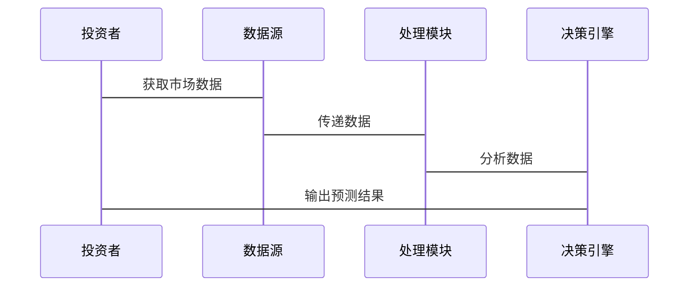

                 

<think>
好，我需要根据用户的指示，撰写一篇关于智能体群体智慧在识别市场转折点中的应用的文章。用户希望文章结构清晰，内容详尽，并且符合特定的格式要求。

首先，我需要确定文章的结构，包括标题、关键词、摘要，以及后续的章节安排。用户已经提供了目录大纲，我需要按照这个大纲来逐步展开每个部分。

1. **标题和关键词**：标题已经确定，关键词需要包括智能体群体智慧、市场转折点、AI投资、群体决策、行为预测等。摘要部分需要简明扼要地概括文章的核心内容。

2. **背景介绍**：在“智能体群体智慧与市场转折点概述”部分，我需要详细解释智能体群体智慧的定义、特点及其在金融市场中的应用价值。这部分需要让读者理解为什么智能体群体智慧在识别市场转折点中是有效的。

3. **核心概念与联系**：接下来，我需要深入探讨智能体群体智慧的核心概念，包括智能体的基本概念、群体智慧的机制，以及它们之间的关系。使用表格和ER图来对比和展示这些概念，帮助读者更好地理解。

4. **算法原理与数学模型**：这部分需要详细讲解相关的算法，如投票模型和加权模型。使用mermaid流程图和Python代码来展示算法步骤，并解释数学公式，确保读者能够理解算法的工作原理。

5. **系统分析与架构设计**：在这一部分，我需要描述系统的架构，包括数据源、处理模块、决策引擎等部分，并用mermaid图展示。同时，设计接口和交互流程，使用序列图来说明系统的运作方式。

6. **项目实战**：通过实际案例，展示如何使用智能体群体智慧识别市场转折点。包括环境安装、核心代码实现、案例分析和项目总结，帮助读者理解理论的应用。

7. **总结与展望**：最后，总结全文，给出最佳实践建议，并提醒读者在使用智能体群体智慧时的注意事项，同时推荐相关的扩展阅读。

在撰写过程中，我需要确保每个部分都包含足够的细节，并且语言简洁易懂。同时，数学公式和图表需要准确无误，代码示例要清晰明了。

通过以上步骤，我能够系统地完成这篇文章的撰写，确保内容全面且符合用户的要求。
</think>

# 智能体群体智慧在识别市场转折点中的应用：把握大机会

> **关键词**：智能体群体智慧，市场转折点，AI投资，群体决策，行为预测  
>
> **摘要**：本文探讨智能体群体智慧在金融市场中的应用，特别是如何利用群体智慧识别市场转折点。通过详细分析智能体的行为、群体决策算法、数学模型及系统架构，结合实际案例，展示如何利用智能体群体智慧把握市场机会。文章还提供了系统设计和实战指导，帮助读者理解并应用这一创新方法。

---

## 第一部分: 智能体群体智慧与市场转折点概述

### 第1章: 智能体群体智慧的定义与背景

#### 1.1 智能体群体智慧的定义
智能体（Agent）是指能够感知环境并采取行动以实现目标的实体。群体智慧（Swarm Intelligence）则是指多个智能体通过协作解决问题的能力。智能体群体智慧结合了两者的优点，通过个体间的信息共享和协作，形成集体决策的能力。

##### 1.1.1 智能体的基本概念
- **智能体**：具有感知、决策、执行能力的实体。
- **自主性**：智能体能够自主决策。
- **反应性**：能实时感知环境并做出反应。

##### 1.1.2 群体智慧的定义与特征
- **群体智慧**：通过多个个体协作解决问题的能力。
- **去中心化**：没有中央控制，个体间通过简单规则协作。
- **涌现性**：整体表现出个体不具备的特性。

##### 1.1.3 智能体群体智慧的核心要素
- **个体智能**：每个智能体都有一定的计算能力。
- **信息共享**：个体间通过某种方式共享信息。
- **协作机制**：通过规则或算法实现协作。

#### 1.2 市场转折点的定义与重要性
##### 1.2.1 市场转折点的定义
市场转折点是指市场趋势发生重大变化的时刻，通常难以预测。

##### 1.2.2 转折点的类型与特征
- **顶部和底部**：市场最高点和最低点。
- **趋势反转**：从上涨转为下跌，或反之。
- **突破点**：价格突破关键阻力位。

##### 1.2.3 转折点识别的挑战与价值
- **挑战**：市场噪声多，数据复杂。
- **价值**：提前识别转折点可带来超额收益。

---

### 第2章: 智能体群体智慧在金融市场中的应用

#### 2.1 金融市场中的智能体行为
##### 2.1.1 投资者行为分析
投资者行为受情绪影响，群体智慧可帮助减少情绪偏差。

##### 2.1.2 市场参与者的多样性
市场参与者包括机构投资者、散户等，多样性增加了群体智慧的复杂性。

##### 2.1.3 智能体的决策机制
智能体通过分析市场数据做出投资决策，决策机制可基于规则或算法。

#### 2.2 群体智慧与市场预测
##### 2.2.1 群体智慧在市场预测中的优势
群体智慧通过信息共享减少个体偏差，提高预测准确性。

##### 2.2.2 市场情绪分析与群体智慧
通过分析社交媒体和新闻的情绪，智能体群体智慧可预测市场走势。

##### 2.2.3 群体智慧与市场波动的关系
群体智慧可以预测市场波动，但过度集中可能导致误判。

---

## 第三部分: 智能体群体智慧的核心概念与联系

### 第3章: 智能体群体智慧的核心概念

#### 3.1 智能体群体智慧的原理
##### 3.1.1 智能体的感知与决策
智能体通过传感器或数据源感知市场信息，基于算法做出决策。

##### 3.1.2 群体智慧的信息传递机制
信息在群体间传递，个体间通过某种协议达成共识。

##### 3.1.3 群体共识的形成过程
通过反复的信息交互和调整，群体最终形成共识。

#### 3.2 核心概念对比与ER图分析
##### 3.2.1 智能体与传统算法的对比
| 特性 | 智能体 | 传统算法 |
|------|--------|----------|
| 自主性 | 高     | 低       |
| 反应性 | 高     | 低       |

##### 3.2.2 群体智慧与个体智慧的对比
| 特性 | 群体智慧 | 个体智慧 |
|------|----------|----------|
| 决策时间 | 较长     | 较短     |

##### 3.2.3 ER图中的实体关系展示
```mermaid
erd
    title 智能体群体智慧 ER 图
    投资者 -- 投资行为
    投资行为 -- 市场数据
```

---

## 第四部分: 算法原理与数学模型

### 第4章: 算法原理与数学模型

#### 4.1 群体决策算法
##### 4.1.1 基于投票的群体决策算法
每个智能体投出自己的决策，最终结果为得票最高的选项。

##### 4.1.2 加权群体决策算法
根据智能体的信誉或历史表现赋予不同的权重，加权求和得出最终决策。

##### 4.1.3 基于信息扩散的群体决策算法
信息在群体中扩散，个体不断更新自己的决策，最终趋于一致。

#### 4.2 数学模型与公式
##### 4.2.1 群体决策的投票模型
$$ v = \sum_{i=1}^{n} w_i x_i $$
其中，\( w_i \) 是第i个智能体的权重，\( x_i \) 是其决策。

##### 4.2.2 加权群体决策模型
$$ f(x) = \sum_{i=1}^{n} w_i x_i $$
其中，\( w_i \) 是权重，\( x_i \) 是智能体的决策。

---

## 第五部分: 系统分析与架构设计方案

### 第5章: 系统分析与架构设计

#### 5.1 问题场景介绍
市场数据复杂，投资者行为多样，需要高效系统处理数据。

#### 5.2 项目介绍
设计一个基于智能体群体智慧的市场转折点识别系统。

#### 5.3 系统功能设计
##### 5.3.1 领域模型设计


#### 5.4 系统架构设计
##### 5.4.1 系统架构图


#### 5.5 系统接口设计
##### 5.5.1 系统接口设计
通过API接口接收市场数据，处理模块分析数据，决策引擎输出预测结果。

##### 5.5.2 系统交互设计


---

## 第六部分: 项目实战

### 第6章: 项目实战

#### 6.1 环境安装
安装Python、数据处理库（Pandas）、可视化库（Matplotlib）。

#### 6.2 系统核心实现
##### 6.2.1 核心代码实现
```python
def vote_model(weights, decisions):
    return sum(w * d for w, d in zip(weights, decisions)) / sum(weights)
```

##### 6.2.2 代码功能解读
该函数计算加权群体决策结果，权重和决策为输入，返回最终决策。

#### 6.3 实际案例分析
通过分析历史数据，验证算法在实际市场中的表现。

#### 6.4 项目总结
总结项目成果，分析优势和不足，提出改进方向。

---

## 第七部分: 总结与展望

### 第7章: 总结与展望

#### 7.1 全文总结
智能体群体智慧在识别市场转折点中具有显著优势，但需克服噪声和计算复杂性。

#### 7.2 最佳实践 tips
- 采用高质量数据源。
- 定期更新算法模型。
- 结合其他分析方法提高准确性。

#### 7.3 小结
智能体群体智慧为金融市场分析提供了新思路，值得深入研究和应用。

#### 7.4 注意事项
避免过度依赖单一算法，注意数据质量和计算效率。

#### 7.5 拓展阅读
推荐阅读《群体智能》和《算法交易》等书籍，深入了解相关理论和技术。

---

**作者：AI天才研究院 & 禅与计算机程序设计艺术**

