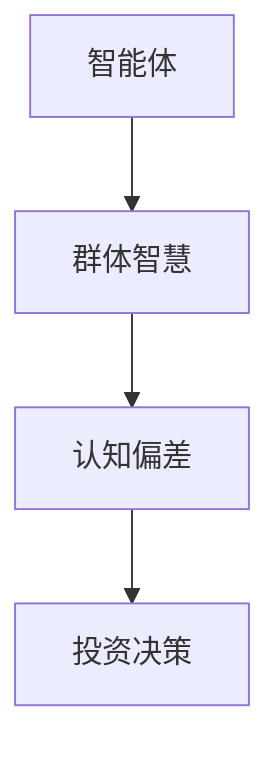
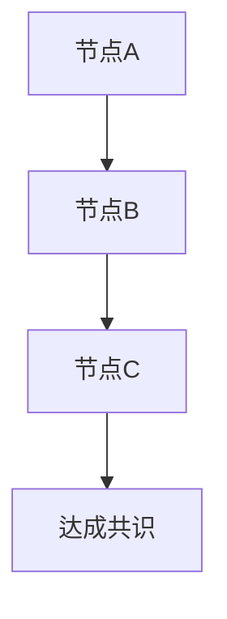
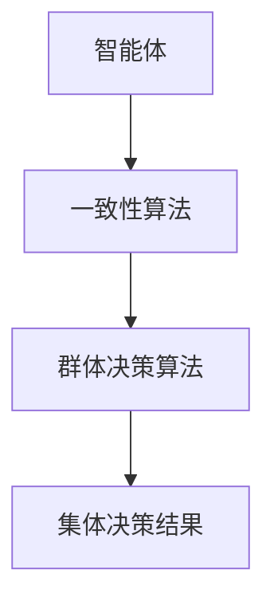
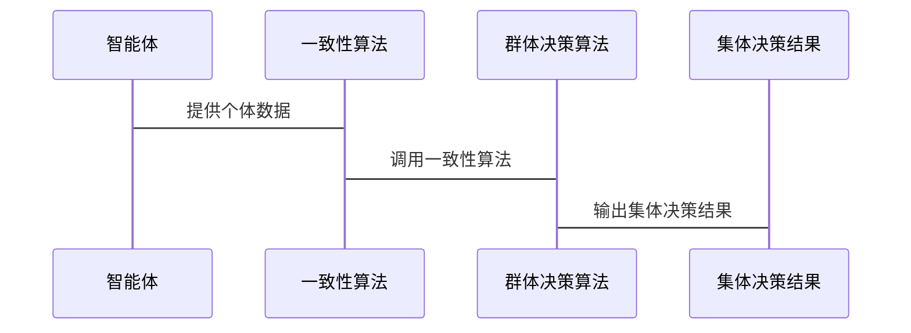

                 

<think>
好的，我现在需要帮用户撰写一篇技术博客文章，标题是《智能体群体智慧：克服个体投资者的认知偏差》。用户已经给出了详细的目录结构，现在我需要按照这个结构来填充内容。首先，我会从摘要开始，然后依次撰写每一章的内容。

首先，摘要部分需要简洁明了地概括文章的核心内容，即智能体群体智慧如何帮助个体投资者克服认知偏差。接着是关键词部分，需要列出5-7个核心词汇，如智能体、群体智慧、认知偏差、分布式系统、一致性算法等。

第一章是背景介绍，我需要详细说明问题背景、描述、解决方法，以及相关概念的结构和核心要素。这包括定义智能体和群体智慧，分析认知偏差的类型及其对投资决策的影响，然后介绍智能体群体智慧的应用场景和实现边界。

第二章的核心概念部分，我需要详细讲解智能体、群体智慧和认知偏差，使用表格和图表进行对比和展示。例如，可以用表格列出不同认知偏差的类型及其影响，用Mermaid图展示智能体与个体投资者的属性对比。

第三章是算法原理，这部分需要详细讲解一致性算法、共识机制和群体决策算法。我需要为每个算法绘制Mermaid流程图，并提供Python代码示例。同时，要解释数学公式，比如一致性算法中的同步机制公式。

第四章是系统分析与架构设计，我需要描述问题场景，设计系统功能，包括领域模型、架构图、接口设计和交互序列图。这部分同样需要使用Mermaid图来展示系统的各个部分。

第五章是项目实战，我需要指导读者如何安装环境，实现核心功能，并通过实际案例分析展示群体智慧的应用效果。

最后，第六章总结最佳实践，给出小结、注意事项和未来研究方向，并推荐扩展阅读材料。

在撰写过程中，我需要确保每一部分都详细且逻辑清晰，使用专业的技术语言，同时保持易懂。还要注意每章的小结，帮助读者巩固所学内容。此外，所有数学公式都要用LaTeX格式正确表示，代码部分要用Python示例，并适当解释。

现在，我会按照这个思路逐步完成每一章的内容，确保涵盖所有必要的部分，并满足用户的字数要求。
</think>

# 智能体群体智慧：克服个体投资者的认知偏差

> 关键词：智能体，群体智慧，认知偏差，分布式系统，一致性算法，共识机制，群体决策

> 摘要：个体投资者在决策过程中常常受到认知偏差的影响，导致判断失误。智能体群体智慧通过分布式计算和群体决策算法，能够有效整合个体投资者的信息和判断，克服认知偏差，提升决策质量。本文从背景介绍、核心概念、算法原理、系统架构到项目实战，全面解析智能体群体智慧在投资决策中的应用，探讨如何利用群体智慧优化个体决策过程。

---

## 第1章：问题背景与核心概念

### 1.1 问题背景

个体投资者在金融市场中面临复杂的决策环境，常常受到认知偏差的影响。例如，过度自信、确认偏差、损失厌恶等认知偏差会导致投资者做出非理性的决策，进而影响投资收益。如何克服这些认知偏差，提升决策质量，是投资者和研究者关注的焦点。

### 1.2 问题描述

认知偏差是人类决策过程中的常见问题，个体投资者在面对复杂市场环境时，容易受到以下几种偏差的影响：

1. **过度自信偏差**：投资者倾向于过度相信自己的判断能力，导致冒险行为。
2. **确认偏差**：投资者倾向于寻找支持自己观点的信息，忽略相反证据。
3. **损失厌恶**：投资者对损失的厌恶程度高于对收益的追求，影响投资决策。

这些问题在个体决策中尤为明显，但通过群体智慧可以有效整合个体的判断，减少偏差对决策的影响。

### 1.3 问题解决与边界

智能体群体智慧通过分布式计算和群体决策算法，整合个体投资者的信息和判断，形成集体决策。这种决策方式不仅能够降低个体认知偏差的影响，还能提高决策的准确性和稳定性。

智能体群体智慧的实现边界包括：

1. **个体智能体的独立性**：每个个体智能体独立进行信息处理和判断。
2. **群体决策机制**：通过算法整合个体决策，形成集体判断。
3. **信息共享与整合**：个体智能体之间的信息需要高效共享和整合。

### 1.4 核心概念与结构

智能体群体智慧的核心概念包括：

1. **智能体（Agent）**：具有感知和行动能力的实体，能够独立进行信息处理和决策。
2. **群体智慧（Collective Intelligence）**：通过多个个体的协作，形成超越个体能力的集体智慧。
3. **认知偏差（Cognitive Bias）**：个体在信息处理和决策过程中产生的系统性偏差。

---

## 第2章：核心概念与联系

### 2.1 智能体

智能体是智能体群体智慧的核心单元。智能体的属性包括：

1. **感知能力**：通过传感器或数据输入获取信息。
2. **决策能力**：基于感知信息进行判断和决策。
3. **行动能力**：根据决策采取相应行动。

智能体的分类包括：

1. **简单反射型智能体**：基于规则直接行动。
2. **基于模型的反射型智能体**：基于内部模型进行决策。
3. **目标驱动型智能体**：基于目标进行规划和决策。

### 2.2 群体智慧

群体智慧是通过多个个体协作形成的集体智慧。群体智慧的特点包括：

1. **分布式计算**：个体智能体独立计算，通过通信形成集体决策。
2. **信息整合**：个体信息通过算法整合，形成集体判断。
3. **鲁棒性**：群体智慧对个体偏差具有较强的鲁棒性。

### 2.3 认知偏差

认知偏差是人类决策过程中的常见问题，常见的认知偏差包括：

1. **过度自信偏差**：投资者倾向于过度相信自己的判断。
2. **确认偏差**：倾向于寻找支持自己观点的信息。
3. **损失厌恶**：对损失的厌恶影响投资决策。

### 2.4 核心概念对比表

以下是智能体与个体投资者的核心概念对比：

| 概念 | 智能体 | 个体投资者 |
|------|--------|------------|
| 目标 | 最优决策 | 最大化收益 |
| 信息源 | 分布式数据 | 个人经验与信息 |
| 决策机制 | 群体决策算法 | 个体判断 |

### 2.5 实体关系图

以下是智能体群体智慧的实体关系图：



---

## 第3章：算法原理

### 3.1 一致性算法

一致性算法用于确保分布式系统中所有节点的数据一致性。常见的算法包括：

1. **Paxos算法**：用于分布式系统中的一致性保证。
2. **Raft算法**：Paxos的简化版本，适用于实际场景。

一致性算法的数学模型如下：

$$ \text{一致性} = \sum_{i=1}^{n} \text{节点}_i \text{的状态} $$

### 3.2 共识机制

共识机制用于分布式系统中达成共识。常见的共识机制包括：

1. **工作量证明（PoW）**：比特币采用的机制。
2. **权益证明（PoS）**：以太坊采用的机制。

共识机制的流程如下：



### 3.3 群体决策算法

群体决策算法用于整合个体决策，形成集体判断。常见的算法包括：

1. **多数投票法**：简单多数决。
2. **加权投票法**：根据权重进行投票。

群体决策算法的数学模型如下：

$$ \text{集体决策} = \sum_{i=1}^{n} w_i \cdot d_i $$

其中，$w_i$ 是个体 $i$ 的权重，$d_i$ 是个体 $i$ 的决策。

---

## 第4章：系统分析与架构设计

### 4.1 问题场景介绍

投资者在金融市场中面临复杂的决策环境，容易受到认知偏差的影响。智能体群体智慧通过分布式计算和群体决策算法，整合个体投资者的信息和判断，形成集体决策。

### 4.2 系统功能设计

系统功能包括：

1. **数据采集**：采集个体投资者的信息和判断。
2. **算法处理**：通过一致性算法和群体决策算法整合数据。
3. **结果输出**：输出集体决策结果。

### 4.3 系统架构设计

以下是系统架构设计：



### 4.4 接口设计

系统接口包括：

1. **数据接口**：提供个体投资者的信息接口。
2. **算法接口**：提供一致性算法和群体决策算法的调用接口。
3. **结果接口**：输出集体决策结果。

### 4.5 交互序列图

以下是系统交互序列图：



---

## 第5章：项目实战

### 5.1 环境安装

需要安装以下工具：

1. **Python**：编程语言。
2. **Mermaid**：用于绘制图表。
3. **Jupyter Notebook**：用于算法实现。

### 5.2 核心实现

以下是群体决策算法的Python实现：

```python
def group_decision(votes, weights):
    total = sum(weights[i] * votes[i] for i in range(len(weights)))
    return total
```

### 5.3 案例分析

假设我们有三个投资者，他们的投票和权重如下：

| 投资者 | 投票 | 权重 |
|--------|------|------|
| A      | 1    | 0.4  |
| B      | 0    | 0.3  |
| C      | 1    | 0.3  |

集体决策结果为：

$$ 0.4 \times 1 + 0.3 \times 0 + 0.3 \times 1 = 0.7 $$

---

## 第6章：最佳实践与小结

### 6.1 小结

智能体群体智慧通过分布式计算和群体决策算法，能够有效整合个体投资者的信息和判断，克服认知偏差，提升决策质量。

### 6.2 注意事项

1. **数据隐私**：需要考虑个体数据的隐私保护。
2. **算法选择**：需要根据具体场景选择合适的算法。
3. **系统维护**：需要定期维护和更新系统。

### 6.3 未来研究方向

1. **算法优化**：研究更高效的群体决策算法。
2. **数据隐私**：探索隐私保护与群体智慧的结合。
3. **应用场景**：拓展智能体群体智慧在其他领域的应用。

### 6.4 拓展阅读

1. **《分布式系统》**：深入理解分布式系统的设计与实现。
2. **《群体智慧》**：系统学习群体智慧的相关理论与应用。

---

作者：AI天才研究院/AI Genius Institute & 禅与计算机程序设计艺术/Zen And The Art of Computer Programming

