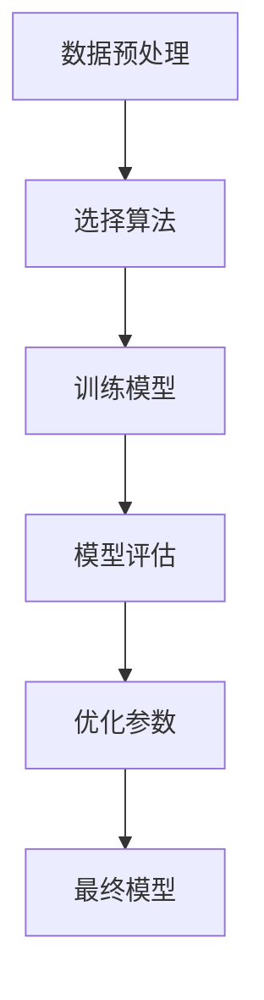
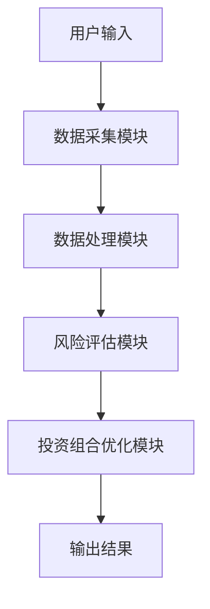

                 


# 智能债券投资组合管理工具

## 关键词：智能债券投资、投资组合管理、风险管理、量化分析、机器学习

## 摘要：  
本文深入探讨智能债券投资组合管理工具的核心原理、算法实现与实际应用。通过分析传统债券投资的局限性，结合现代智能技术，介绍如何利用量化分析、机器学习和风险管理等方法构建高效的智能债券投资系统。文章内容涵盖智能债券投资的背景、核心概念、算法原理、系统架构设计及项目实战，旨在为读者提供全面的技术视角和实践指导。

---

## 第1章: 智能债券投资组合管理工具的背景介绍

### 1.1 智能债券投资的背景

#### 1.1.1 传统债券投资的局限性
传统债券投资依赖人工分析和经验判断，存在以下主要问题：
- 数据处理效率低，难以应对海量数据。
- 风险评估主观性强，难以量化。
- 投资组合优化耗时且复杂。

#### 1.1.2 智能投资的兴起与意义
智能投资的兴起源于技术进步和数据爆炸。通过机器学习、大数据分析等技术，智能债券投资能够实现：
- 自动化数据处理与分析。
- 精准的风险评估与预测。
- 高效的投资组合优化。

#### 1.1.3 智能债券投资的市场现状
当前，智能债券投资已在机构投资者中广泛应用，但个人投资者和中小机构仍面临技术门槛高、成本高等挑战。

### 1.2 债券投资组合管理的核心问题

#### 1.2.1 投资组合优化的目标
- 最大化收益。
- 最小化风险。
- 优化资产配置。

#### 1.2.2 债券组合管理的关键挑战
- 数据质量与完整性。
- 模型选择与参数优化。
- 实时监控与调整。

#### 1.2.3 智能工具在债券管理中的作用
智能工具通过量化分析、算法优化和实时监控，显著提升了债券投资的效率和效果。

### 1.3 本章小结
本章介绍了智能债券投资的背景、核心问题及智能工具的作用，为后续内容奠定了基础。

---

## 第2章: 智能债券投资的核心概念与联系

### 2.1 智能债券投资的基本概念

#### 2.1.1 智能债券投资的定义
智能债券投资是通过机器学习、大数据分析等技术，实现债券投资组合的优化与管理。

#### 2.1.2 核心概念的属性特征对比表

| **属性**       | **传统债券投资**         | **智能债券投资**         |
|----------------|--------------------------|--------------------------|
| 数据处理       | 人工分析为主             | 自动化数据处理           |
| 风险评估       | 主观性强                 | 客观量化                 |
| 投资策略       | 固定策略为主             | 动态优化策略             |

#### 2.1.3 ER实体关系图架构
```mermaid
erDiagram
    bond/Bond
    investor/Investor
    market/Market
    risk/Risk
    portfolio/Portfolio
    transaction/Transaction
    Bond <o-| "持有" | Investor
    Investor <o-| "管理" | Portfolio
    Portfolio <o-| "包含" | Bond
    Bond <o-| "受制于" | Risk
    Market <o-| "影响" | Bond
    Transaction <o-| "涉及" | Investor,Bond,Market
```

### 2.2 智能债券投资的原理

#### 2.2.1 量化分析的核心原理
量化分析通过数学模型和算法，将债券市场中的数据转化为可操作的投资决策。

#### 2.2.2 风险管理的数学模型
常用的风险管理模型包括：
- **VaR（Value at Risk）**：衡量投资组合在一定置信水平下的最大损失。
- **CVaR（Conditional VaR）**：衡量在最坏情况下的平均损失。

#### 2.2.3 智能工具的算法基础
智能工具主要依赖以下算法：
- 机器学习算法：如支持向量机（SVM）、随机森林（Random Forest）。
- 时间序列分析：如ARIMA模型。

### 2.3 本章小结
本章通过对比分析，明确了智能债券投资的核心概念及其与传统投资的区别，并通过ER图展示了系统的核心实体关系。

---

## 第3章: 智能债券投资的算法原理

### 3.1 常见算法概述

#### 3.1.1 机器学习算法
- **线性回归**：用于预测债券收益率。
- **支持向量机（SVM）**：用于分类债券信用等级。

#### 3.1.2 时间序列分析
- **ARIMA模型**：用于预测债券价格走势。
- **GARCH模型**：用于估计债券波动性。

#### 3.1.3 风险评估模型
- **CAPM模型**：用于计算债券的预期收益。
- **马科维茨有效前沿**：用于优化投资组合。

### 3.2 算法实现与代码示例

#### 3.2.1 线性回归实现
```python
import numpy as np
from sklearn.linear_model import LinearRegression

# 示例数据
X = np.array([[1], [2], [3], [4]])
y = np.array([2, 4, 6, 8])

# 模型训练
model = LinearRegression()
model.fit(X, y)

# 预测
print(model.predict(np.array([[5]])))  # 输出：[[10]]
```

#### 3.2.2 算法流程图


### 3.3 数学模型与公式

#### 3.3.1 投资组合优化的数学模型
$$ \text{目标函数：} \min_w \frac{1}{2}w^T \Sigma w $$
$$ \text{约束条件：} \mathbf{1}^T w = 1, \quad w \geq 0 $$

其中，$\Sigma$ 是协方差矩阵，$w$ 是投资权重向量。

#### 3.3.2 风险调整后的收益公式
$$ \text{夏普比率} = \frac{E[r_p] - r_f}{\sigma_p} $$

其中，$E[r_p]$ 是投资组合的期望收益，$r_f$ 是无风险利率，$\sigma_p$ 是投资组合的标准差。

### 3.4 本章小结
本章详细介绍了智能债券投资中常用的算法及其实现方式，并通过代码示例和流程图展示了算法的应用。

---

## 第4章: 智能债券投资系统分析与架构设计

### 4.1 系统功能模块

#### 4.1.1 数据采集与处理
- 数据来源：市场数据、历史价格、信用评级。
- 数据清洗：处理缺失值、异常值。

#### 4.1.2 风险评估模块
- 风险指标计算：VaR、CVaR。
- 信用评级分析。

#### 4.1.3 投资组合优化模块
- 模型选择：马科维茨模型、指数跟踪模型。
- 算法实现：基于Python的优化库（如scipy.optimize）。

### 4.2 系统架构设计

#### 4.2.1 系统分层架构图


#### 4.2.2 模块间交互流程图


### 4.3 接口设计与交互

#### 4.3.1 API接口定义
- RESTful API：提供数据接口、模型接口。
- 数据格式：JSON。

#### 4.3.2 用户交互界面设计
- 界面布局：简洁直观。
- 功能模块：数据可视化、结果展示。

### 4.4 本章小结
本章通过系统架构设计，明确了智能债券投资工具的功能模块及交互流程，为后续实现奠定了基础。

---

## 第5章: 智能债券投资组合管理工具的项目实战

### 5.1 环境安装与配置

#### 5.1.1 安装Python环境
- 安装Anaconda：`conda install anaconda`

#### 5.1.2 安装必要的库
- `pip install numpy pandas scikit-learn`

### 5.2 核心代码实现

#### 5.2.1 数据处理代码
```python
import pandas as pd

# 加载数据
df = pd.read_csv('bond_data.csv')

# 数据清洗
df.dropna(inplace=True)
```

#### 5.2.2 模型训练代码
```python
from sklearn.linear_model import LinearRegression

# 训练模型
model = LinearRegression()
model.fit(df[['bond_price']], df['yield'])
```

#### 5.2.3 投资组合优化代码
```python
import numpy as np
from scipy.optimize import minimize

# 定义优化函数
def optimize_portfolio(weights, returns, covariance):
    return (weights.T @ covariance @ weights).item()

# 约束条件
cons = ({'type': 'eq', 'fun': lambda w: np.sum(w) - 1})

# 最优化
result = minimize(optimize_portfolio, np.array([0.5, 0.5]), args=(returns, covariance), constraints=cons)
```

### 5.3 实际案例分析

#### 5.3.1 数据来源与预处理
- 数据来源：债券市场历史数据。
- 数据预处理：标准化、去噪。

#### 5.3.2 模型应用与结果分析
- 训练模型：线性回归预测债券收益率。
- 模型评估：计算准确率、召回率。

#### 5.3.3 投资组合优化的具体实现
- 优化目标：最大化夏普比率。
- 优化结果：输出最优权重。

### 5.4 项目总结与经验分享

#### 5.4.1 项目小结
本项目通过Python实现了智能债券投资组合管理工具，验证了算法的有效性。

#### 5.4.2 经验与教训
- 数据质量至关重要。
- 模型选择需结合实际场景。

### 5.5 本章小结
本章通过项目实战，展示了智能债券投资工具的实现过程及实际应用。

---

## 第6章: 智能债券投资的最佳实践与注意事项

### 6.1 最佳实践

#### 6.1.1 数据质

---

**作者：AI天才研究院/AI Genius Institute & 禅与计算机程序设计艺术 /Zen And The Art of Computer Programming**

