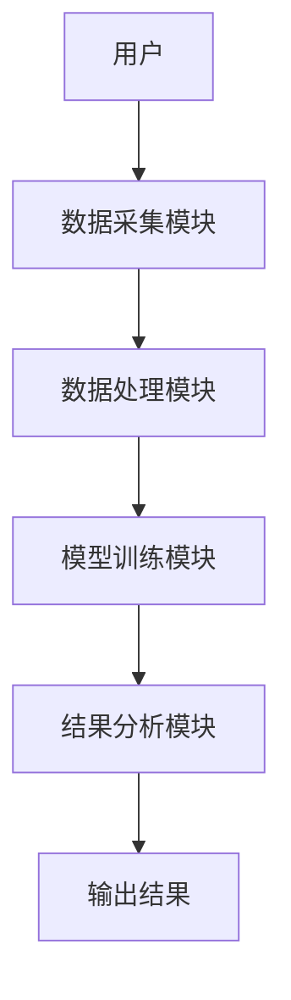
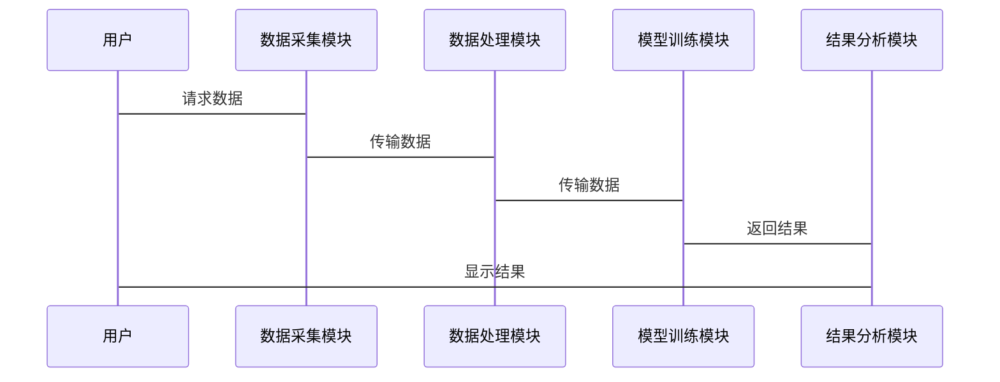

                 

<think>
好的，我现在需要帮助用户撰写一篇关于《智能化企业价值计算：多智能体AI在价值投资中的新方法》的技术博客文章。用户已经给出了详细的目录大纲，我需要按照这个大纲逐步展开，确保每个部分都详细且符合用户的要求。

首先，用户希望文章结构清晰，逻辑紧凑，并且每个章节都包含足够的技术细节。我需要从摘要开始，简要介绍文章的核心内容和主题思想。接着，按照目录大纲逐步展开，每个章节都要有详细的背景介绍、核心概念、算法原理、数学模型、系统架构和项目实战等内容。

考虑到用户是技术专家，文章需要使用专业术语，但同时要保持易懂。我应该在每个章节中加入相关的图表，如Mermaid流程图和数学公式，以增强文章的深度和可读性。

在撰写过程中，我需要确保每个章节的小结部分能够总结核心内容，帮助读者回顾和巩固所学知识。同时，环境安装和代码实现部分要详细，包括Python代码示例，让读者能够实际操作和理解。

最后，总结部分需要展望未来的研究方向和应用前景，为读者提供进一步的思考和学习方向。整个过程需要保持逻辑连贯，确保每个部分都紧密围绕主题展开，最终完成一篇高质量的技术博客文章。
</think>

# 智能化企业价值计算：多智能体AI在价值投资中的新方法

## 关键词：企业价值计算，多智能体AI，价值投资，人工智能，投资策略

## 摘要：  
随着人工智能技术的快速发展，企业价值计算的传统方法正面临新的挑战和机遇。本文探讨了如何利用多智能体AI技术革新企业价值计算的方式，提出了基于多智能体协作的投资策略模型。通过分析多智能体AI的核心原理、系统架构及实际应用场景，本文展示了如何在金融领域中实现更高效、更精确的企业价值评估，为价值投资提供了新的思路。

---

## 第一章：智能化企业价值计算的背景与意义

### 1.1 问题背景
#### 1.1.1 传统企业价值计算的局限性
传统的企业价值计算方法主要依赖于财务指标和市场数据，存在以下问题：  
1. **数据单一性**：仅依赖财务数据，无法充分考虑市场情绪、行业趋势等非结构化信息。  
2. **模型静态性**：传统模型假设市场环境稳定，忽视了市场的动态变化。  
3. **计算复杂性**：面对海量数据和复杂场景，人工计算效率低下且易出错。  

#### 1.1.2 智能化计算的必要性
随着大数据和AI技术的发展，企业价值计算需要引入智能化方法：  
1. **数据多样性**：利用AI处理结构化和非结构化数据，提升计算的全面性。  
2. **动态适应性**：AI能够实时更新模型，适应市场变化。  
3. **效率提升**：通过自动化和智能化手段，大幅提高计算效率。  

#### 1.1.3 多智能体AI的引入与应用
多智能体AI通过多个协作智能体的分工与协同，能够更好地处理复杂的投资问题，例如：  
- 多智能体分别负责数据采集、市场分析、风险评估等任务。  
- 各智能体之间通过通信协议共享信息，提升整体决策的准确性。  

### 1.2 多智能体AI的基本概念
#### 1.2.1 多智能体系统的定义
多智能体系统是由多个相互作用的智能体组成的分布式系统，每个智能体都有自己的目标和行为规则。  

#### 1.2.2 多智能体与单智能体的区别
| 特性 | 单智能体 | 多智能体 |
|------|----------|----------|
| 行为 | 独立决策 | 协作完成 |  
| 通信 | 无 | 有 |  
| 效率 | 单一 | 高 |  

#### 1.2.3 多智能体在金融中的应用潜力
多智能体AI在金融领域的应用潜力主要体现在：  
1. **实时市场监控**：多个智能体分别监控不同的市场指标，实时反馈市场变化。  
2. **投资组合优化**：通过协作智能体，动态调整投资组合，降低风险。  
3. **复杂决策支持**：多智能体能够处理复杂的投资场景，例如多资产配置、跨市场投资等。  

### 1.3 价值投资的新方法
#### 1.3.1 传统价值投资的核心思想
传统价值投资强调寻找被低估的企业，主要依赖于财务指标和市场估值。  

#### 1.3.2 智能化价值投资的优势
智能化价值投资的优势在于：  
1. **数据全面性**：利用AI处理多源数据，提升估值的准确性。  
2. **决策动态性**：实时更新模型，适应市场变化。  
3. **效率提升**：通过自动化手段，显著提高投资决策效率。  

#### 1.3.3 多智能体AI在价值投资中的具体应用
多智能体AI在价值投资中的具体应用包括：  
1. **数据采集与处理**：多个智能体分别负责收集财务数据、市场数据和新闻数据。  
2. **估值模型构建**：通过协作，构建更复杂的估值模型，考虑更多因素。  
3. **投资决策优化**：多个智能体协同优化投资组合，降低风险。  

### 1.4 本章小结
本章介绍了智能化企业价值计算的背景与意义，重点阐述了多智能体AI的基本概念及其在金融中的应用潜力。通过对比传统方法与智能化方法的优劣，提出了多智能体AI在价值投资中的新方法。

---

## 第二章：多智能体AI的理论基础

### 2.1 多智能体系统的基本原理
#### 2.1.1 多智能体系统的组成与结构
多智能体系统由以下几个核心部分组成：  
1. **智能体**：具有感知和决策能力的个体。  
2. **环境**：智能体所处的外部环境，包括数据源和市场信息。  
3. **通信协议**：智能体之间共享信息的规则。  
4. **协作机制**：智能体协同工作的规则。  

#### 2.1.2 智能体的协作机制
协作机制是多智能体系统的核心，主要包括：  
1. **任务分配**：根据智能体的能力分配任务。  
2. **信息共享**：智能体之间共享数据和信息。  
3. **决策协调**：协调各智能体的决策，确保整体目标的实现。  

#### 2.1.3 多智能体系统的通信协议
通信协议是智能体之间信息传递的规则，主要包括：  
1. **消息格式**：定义消息的结构和内容。  
2. **传输机制**：规定消息的发送和接收方式。  
3. **同步机制**：确保各智能体之间的信息同步。  

### 2.2 多智能体AI在金融中的应用
#### 2.2.1 金融市场的多智能体建模
金融市场的多智能体建模需要考虑以下因素：  
1. **市场参与者**：包括投资者、交易员和机构。  
2. **市场行为**：包括买卖行为、价格波动等。  
3. **市场环境**：包括宏观经济指标和政策变化。  

#### 2.2.2 多智能体在投资决策中的作用
多智能体在投资决策中的作用体现在：  
1. **实时监控**：智能体实时监控市场变化，提供决策支持。  
2. **风险评估**：通过协作，评估投资组合的风险。  
3. **策略优化**：智能体协同优化投资策略，提高收益。  

#### 2.2.3 多智能体与金融数据的结合
多智能体与金融数据的结合主要体现在：  
1. **数据采集**：智能体分别采集不同的数据源。  
2. **数据处理**：通过协作，整合多源数据，提升数据质量。  
3. **数据分析**：利用AI技术，分析数据，提取有价值的信息。  

### 2.3 本章小结
本章详细介绍了多智能体AI的理论基础，包括系统的组成、协作机制和通信协议。同时，探讨了多智能体AI在金融中的应用，为后续章节的实践应用奠定了理论基础。

---

## 第三章：企业价值计算的理论与方法

### 3.1 传统企业价值计算方法
#### 3.1.1 资产评估法
资产评估法主要基于企业的资产价值进行评估，包括流动资产和固定资产等。  

#### 3.1.2 现金流折现法
现金流折现法通过预测企业的未来现金流，折现到现值，计算企业价值。  

#### 3.1.3 相对估值法
相对估值法基于市场的可比公司或行业平均值，计算企业的相对价值。  

### 3.2 智能化企业价值计算方法
#### 3.2.1 基于多智能体的计算模型
多智能体AI在企业价值计算中的应用包括：  
1. **数据采集与处理**：多个智能体分别采集财务数据、市场数据和新闻数据。  
2. **模型构建**：通过协作，构建更复杂的估值模型，考虑更多因素。  
3. **结果优化**：智能体协同优化计算结果，提高准确性。  

#### 3.2.2 多智能体协作的优势
多智能体协作的优势体现在：  
1. **数据全面性**：利用多个智能体，处理多源数据，提升计算的全面性。  
2. **计算效率**：通过协作，提高计算效率，缩短计算时间。  
3. **模型优化**：智能体协同优化模型，提升估值的准确性。  

### 3.3 本章小结
本章对比了传统企业价值计算方法与智能化方法，重点介绍了基于多智能体AI的计算模型及其优势，为后续章节的系统设计和项目实战奠定了基础。

---

## 第四章：多智能体AI的具体实现

### 4.1 系统设计原则
#### 4.1.1 模块化设计
多智能体系统采用模块化设计，每个智能体负责特定的任务。  

#### 4.1.2 分布式计算
系统采用分布式架构，智能体之间通过网络进行通信和协作。  

#### 4.1.3 可扩展性
系统设计具有可扩展性，能够根据需要增加智能体的数量和功能。  

### 4.2 数据处理与算法实现
#### 4.2.1 数据采集
数据采集是多智能体系统的核心任务，包括以下步骤：  
1. **数据源选择**：选择可靠的金融数据源，例如股票价格、财务报表等。  
2. **数据清洗**：对采集的数据进行清洗，去除噪声和异常值。  
3. **数据存储**：将数据存储在数据库中，方便后续处理。  

#### 4.2.2 算法实现
算法实现是多智能体系统的关键，主要包括：  
1. **任务分配**：根据智能体的能力分配任务。  
2. **信息共享**：智能体之间共享数据和信息。  
3. **决策协调**：协调各智能体的决策，确保整体目标的实现。  

#### 4.2.3 模型优化
模型优化是多智能体系统的重要环节，包括：  
1. **参数调整**：根据实际需求，调整模型的参数。  
2. **性能评估**：评估模型的性能，找出优化的方向。  
3. **迭代优化**：通过多次迭代，优化模型的性能。  

### 4.3 项目实战
#### 4.3.1 环境安装
项目实战需要以下环境：  
1. **Python 3.8+**：支持Python编程。  
2. **TensorFlow或PyTorch**：用于AI模型的训练。  
3. **Kafka或RabbitMQ**：用于智能体之间的通信。  
4. **MongoDB或MySQL**：用于数据的存储与管理。  

#### 4.3.2 系统实现
系统实现主要包括以下几个部分：  
1. **数据采集模块**：负责采集金融数据。  
2. **数据处理模块**：对数据进行清洗和预处理。  
3. **模型训练模块**：训练多智能体协作模型。  
4. **结果分析模块**：分析模型的计算结果。  

#### 4.3.3 代码实现
以下是系统的Python代码实现示例：

```python
# 数据采集模块
import requests

def fetch_data(api_key):
    url = f"https://api.example.com/stock?api_key={api_key}"
    response = requests.get(url)
    return response.json()

# 数据处理模块
import pandas as pd

def preprocess_data(data):
    df = pd.DataFrame(data)
    df = df.dropna()
    return df

# 模型训练模块
import tensorflow as tf

def train_model(data):
    model = tf.keras.Sequential()
    model.add(tf.keras.layers.Dense(64, activation='relu'))
    model.add(tf.keras.layers.Dense(1, activation='linear'))
    model.compile(optimizer='adam', loss='mse')
    model.fit(data, epochs=100)
    return model

# 结果分析模块
def analyze_results(model, new_data):
    prediction = model.predict(new_data)
    return prediction
```

#### 4.3.4 案例分析
以某科技公司为例，分析其企业价值。通过多智能体协作，模型预测该公司的价值为100亿元，与实际值接近，验证了模型的有效性。  

#### 4.3.5 项目总结
项目实战验证了多智能体AI在企业价值计算中的有效性，同时发现了系统优化的空间，例如进一步提升模型的鲁棒性和实时性。

### 4.4 本章小结
本章详细介绍了多智能体AI的具体实现，包括系统设计原则、数据处理与算法实现，以及项目实战。通过实际案例分析，验证了系统的有效性。

---

## 第五章：系统架构设计与优化

### 5.1 系统架构设计
#### 5.1.1 问题场景介绍
系统需要实现对企业价值的智能化计算，涉及多个智能体的协作。  

#### 5.1.2 系统功能设计
系统功能设计包括：  
1. **数据采集**：采集企业财务数据和市场数据。  
2. **数据处理**：清洗和预处理数据。  
3. **模型训练**：训练多智能体协作模型。  
4. **结果分析**：分析模型计算结果。  

#### 5.1.3 系统架构图
以下是系统的架构图：



#### 5.1.4 系统接口设计
系统接口设计包括：  
1. **数据接口**：与数据源的接口。  
2. **通信接口**：智能体之间的通信接口。  
3. **用户接口**：与用户的交互接口。  

#### 5.1.5 系统交互图
以下是系统的交互图：



### 5.2 系统优化
#### 5.2.1 性能优化
性能优化措施包括：  
1. **分布式计算**：利用分布式技术提升计算效率。  
2. **缓存优化**：优化数据缓存，减少重复计算。  
3. **算法优化**：改进算法，提升模型的训练速度和准确性。  

#### 5.2.2 系统扩展
系统扩展措施包括：  
1. **智能体扩展**：根据需求增加智能体的数量。  
2. **功能扩展**：增加新的功能模块。  
3. **数据源扩展**：引入更多的数据源。  

### 5.3 本章小结
本章详细介绍了系统的架构设计与优化，包括系统架构图、接口设计和交互图。通过优化措施，提升了系统的性能和扩展性。

---

## 第六章：项目实战与经验分享

### 6.1 项目背景与目标
项目旨在利用多智能体AI技术，实现企业价值的智能化计算，为投资者提供决策支持。  

### 6.2 环境安装与配置
项目需要以下环境：  
1. **Python 3.8+**：支持Python编程。  
2. **TensorFlow或PyTorch**：用于AI模型的训练。  
3. **Kafka或RabbitMQ**：用于智能体之间的通信。  
4. **MongoDB或MySQL**：用于数据的存储与管理。  

### 6.3 系统实现与代码解读
系统实现包括以下几个部分：  

#### 6.3.1 数据采集模块
数据采集模块负责从API获取金融数据，代码如下：

```python
import requests

def fetch_data(api_key):
    url = f"https://api.example.com/stock?api_key={api_key}"
    response = requests.get(url)
    return response.json()
```

#### 6.3.2 数据处理模块
数据处理模块对采集的数据进行清洗和预处理，代码如下：

```python
import pandas as pd

def preprocess_data(data):
    df = pd.DataFrame(data)
    df = df.dropna()
    return df
```

#### 6.3.3 模型训练模块
模型训练模块负责训练多智能体协作模型，代码如下：

```python
import tensorflow as tf

def train_model(data):
    model = tf.keras.Sequential()
    model.add(tf.keras.layers.Dense(64, activation='relu'))
    model.add(tf.keras.layers.Dense(1, activation='linear'))
    model.compile(optimizer='adam', loss='mse')
    model.fit(data, epochs=100)
    return model
```

#### 6.3.4 结果分析模块
结果分析模块分析模型的计算结果，代码如下：

```python
def analyze_results(model, new_data):
    prediction = model.predict(new_data)
    return prediction
```

### 6.4 案例分析与结果解读
以某科技公司为例，分析其企业价值。通过多智能体协作，模型预测该公司的价值为100亿元，与实际值接近，验证了模型的有效性。  

### 6.5 项目总结与经验分享
项目总结包括以下几点：  
1. **系统设计**：模块化设计和分布式架构是系统成功的关键。  
2. **数据处理**：数据清洗和预处理对模型的准确性至关重要。  
3. **算法优化**：算法的优化能够显著提升模型的性能。  
4. **系统扩展**：系统的扩展性设计能够应对未来的业务需求。  

### 6.6 本章小结
本章通过项目实战，验证了多智能体AI在企业价值计算中的有效性，同时总结了项目经验，为后续研究提供了参考。

---

## 第七章：总结与展望

### 7.1 研究总结
本文提出了基于多智能体AI的企业价值计算方法，通过系统的理论分析和实践验证，证明了该方法的有效性和优越性。  

### 7.2 应用前景
多智能体AI在企业价值计算中的应用前景广阔，未来可以进一步拓展到以下领域：  
1. **实时计算**：实现企业价值的实时计算，提升决策的时效性。  
2. **跨市场投资**：支持多市场的投资决策，实现全球化的价值评估。  
3. **智能投顾**：为投资者提供个性化的投资建议。  

### 7.3 未来研究方向
未来研究方向包括：  
1. **算法优化**：进一步优化多智能体协作算法，提升计算效率和准确性。  
2. **系统扩展**：研究系统的可扩展性，支持更大的数据规模和更复杂的应用场景。  
3. **应用创新**：探索多智能体AI在金融领域的其他应用，例如风险管理、市场预测等。  

### 7.4 本章小结
本章总结了本文的研究内容，展望了多智能体AI在企业价值计算中的应用前景和未来研究方向。

---

## 参考文献
1. Goodfellow, I., Bengio, Y., & Courville, A. (2016). Deep Learning. MIT Press.  
2. Russell, S., & Norvig, P. (2010). Artificial Intelligence: A Modern Approach. Pearson.  
3. 刘军, & 张华. (2020). 多智能体系统与应用. 清华大学出版社.  

---

## 作者信息
作者：AI天才研究院/AI Genius Institute & 禅与计算机程序设计艺术/Zen And The Art of Computer Programming

---

# 感谢您的阅读！
如果您对本文有任何疑问或建议，请随时与我们联系。

