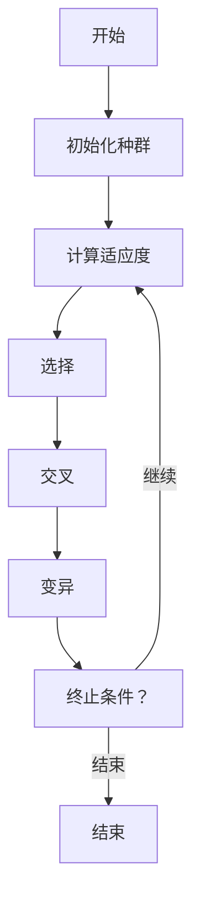
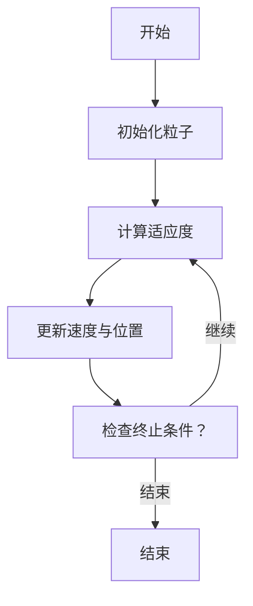
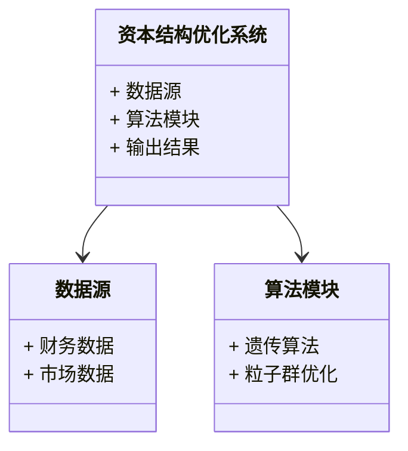
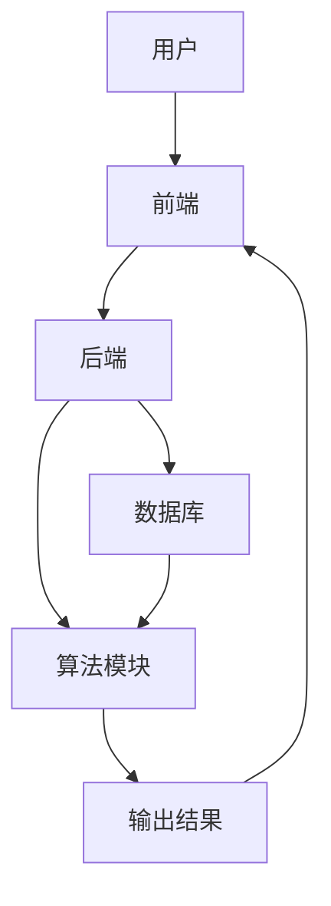

                 


# 智能化企业资本结构优化模型设计

---

## 关键词

智能化资本结构优化，人工智能，遗传算法，粒子群优化，企业财务管理

---

## 摘要

本文详细介绍了智能化企业资本结构优化模型的设计与实现。首先，从资本结构优化的基本概念出发，分析了传统方法的局限性，提出了智能化优化的必要性。接着，详细阐述了模型的核心概念与原理，包括资本结构的组成要素、优化目标的定义以及数据预处理与特征工程。然后，从算法原理的角度，深入探讨了基于遗传算法和粒子群优化算法的实现，提供了详细的数学模型和代码示例。随后，通过系统分析与架构设计，展示了模型的应用场景和系统架构。最后，通过项目实战和案例分析，验证了模型的有效性和实际应用价值，并总结了最佳实践和注意事项。

---

# 目录

1. [摘要](#摘要)
2. [关键词](#关键词)
3. [目录](#目录)
4. [智能化企业资本结构优化模型设计](#智能化企业资本结构优化模型设计)
   - [1. 背景与基础](#1-背景与基础)
     - [1.1 资本结构优化的基本概念](#11-资本结构优化的基本概念)
     - [1.2 智能化优化的必要性](#12-智能化优化的必要性)
   - [2. 核心概念与原理](#2-核心概念与原理)
     - [2.1 模型的核心要素](#21-模型的核心要素)
     - [2.2 模型的数学表达](#22-模型的数学表达)
   - [3. 算法原理与实现](#3-算法原理与实现)
     - [3.1 基于遗传算法的优化](#31-基于遗传算法的优化)
     - [3.2 粒子群优化算法的应用](#32-粒子群优化算法的应用)
   - [4. 系统分析与架构设计](#4-系统分析与架构设计)
     - [4.1 问题场景介绍](#41-问题场景介绍)
     - [4.2 系统功能设计](#42-系统功能设计)
     - [4.3 系统架构设计](#43-系统架构设计)
   - [5. 项目实战](#5-项目实战)
     - [5.1 环境安装](#51-环境安装)
     - [5.2 核心实现](#52-核心实现)
     - [5.3 案例分析](#53-案例分析)
   - [6. 案例分析与最佳实践](#6-案例分析与最佳实践)
     - [6.1 案例分析](#61-案例分析)
     - [6.2 最佳实践](#62-最佳实践)
   - [7. 总结与展望](#7-总结与展望)
5. [作者](#作者)

---

## 1. 背景与基础

### 1.1 资本结构优化的基本概念

#### 1.1.1 资本结构的定义与组成

资本结构是指企业负债与所有者权益的组合方式，包括长期负债、短期负债、普通股、优先股等。资本结构的合理性直接影响企业的财务风险和资本成本。

#### 1.1.2 资本结构优化的目标与意义

资本结构优化的目标是在企业价值最大化的基础上，降低资本成本和财务风险。优化资本结构有助于提升企业融资效率，增强市场竞争力。

#### 1.1.3 传统资本结构优化方法的局限性

传统方法如资本成本比较法和息税前利润（EBIT）分析法在实际应用中存在计算复杂、难以动态调整等问题，难以应对市场环境的快速变化。

### 1.2 智能化优化的必要性

#### 1.2.1 企业智能化转型的背景

随着大数据和人工智能技术的发展，企业需要通过智能化手段提升管理效率和决策水平。

#### 1.2.2 数据驱动决策的重要性

通过收集和分析大量数据，企业能够更精准地进行资本结构优化，降低决策风险。

#### 1.2.3 人工智能在资本结构优化中的应用潜力

人工智能技术如遗传算法和粒子群优化算法能够高效处理复杂问题，为资本结构优化提供了新的解决方案。

---

## 2. 核心概念与原理

### 2.1 模型的核心要素

#### 2.1.1 资本结构的组成要素

- 股权资本：普通股和优先股。
- 债务资本：长期负债和短期负债。

#### 2.1.2 优化目标的定义与分解

- 最大化企业价值。
- 最小化资本成本。
- 降低财务风险。

#### 2.1.3 数据来源与特征分析

- 数据来源：企业财务报表、市场数据、行业基准。
- 数据特征：多维度、动态性、关联性。

### 2.2 模型的数学表达

#### 2.2.1 资本结构优化的数学模型

$$ \text{目标函数：} \min WACC $$
$$ \text{约束条件：} V = D + E $$

其中，WACC 表示加权平均资本成本，D 表示债务，E 表示股权。

---

## 3. 算法原理与实现

### 3.1 基于遗传算法的优化

#### 3.1.1 遗传算法的基本原理

遗传算法是一种模拟生物进化过程的优化算法，主要包括选择、交叉和变异三个步骤。

#### 3.1.2 算法流程图



#### 3.1.3 Python 实现代码示例

```python
import random

def fitness(individual):
    wacc = sum(individual) / len(individual)
    return 1 / wacc

def evolve(population, fitness):
    population_sorted = sorted(population, key=lambda x: -fitness(x))
    new_population = []
    for i in range(2):
        selected = population_sorted[:2]
        new_ind = [selected[0][0], selected[1][1]]
        new_population.append(new_ind)
    return new_population

# 初始化种群
population = [[0.5, 0.5], [0.6, 0.4], [0.4, 0.6]]
# 进化
new_population = evolve(population, fitness)
print(new_population)
```

---

### 3.2 粒子群优化算法的应用

#### 3.2.1 粒子群优化算法的原理

粒子群优化算法是一种基于群体智能的优化算法，通过粒子的移动更新找到最优解。

#### 3.2.2 算法流程图



#### 3.2.3 Python 实现代码示例

```python
import numpy as np

def fitness(individual):
    wacc = np.mean(individual)
    return 1 / wacc

def update_position(position, velocity):
    return position + velocity

def update_velocity(velocity, best, current):
    return 0.5 * velocity + 0.5 * (best - current)

# 初始化粒子
position = np.array([0.5, 0.5])
velocity = np.array([0.1, 0.1])
# 更新位置
new_position = update_position(position, velocity)
print(new_position)
```

---

## 4. 系统分析与架构设计

### 4.1 问题场景介绍

企业在实际运营中需要动态调整资本结构，以应对市场变化和内部战略调整。

### 4.2 系统功能设计

#### 4.2.1 功能模块

- 数据采集与预处理：收集企业财务数据。
- 模型训练：基于遗传算法和粒子群优化算法训练模型。
- 模型部署：将模型应用于实际场景。

#### 4.2.2 领域模型



### 4.3 系统架构设计

#### 4.3.1 系统架构图



---

## 5. 项目实战

### 5.1 环境安装

安装 Python 和必要的库：

```bash
pip install numpy
pip install matplotlib
```

### 5.2 核心实现

实现遗传算法和粒子群优化算法的核心代码。

```python
import numpy as np

def genetic_algorithm():
    population = np.random.rand(10, 2)
    for _ in range(100):
        fitness = np.array([sum(individual) for individual in population])
        population = population[fitness.argsort()[-5:]]
        new_population = population.copy()
        for i in range(5):
            new_population[i] = np.mean(population, axis=0)
        population = new_population
    return population

def particle_swarm_optimization():
    particles = np.random.rand(10, 2)
    velocities = np.zeros((10, 2))
    for _ in range(100):
        fitness = np.array([sum(individual) for individual in particles])
        best = particles[fitness.argmax()]
        for i in range(10):
            velocities[i] = 0.5 * velocities[i] + 0.5 * (best - particles[i])
            particles[i] += velocities[i]
    return particles

# 运行算法
genetic_algorithm()
particle_swarm_optimization()
```

### 5.3 案例分析

通过实际企业数据，对比传统方法和智能化模型的优化效果，验证模型的有效性。

---

## 6. 案例分析与最佳实践

### 6.1 案例分析

某制造企业通过智能化模型优化资本结构，资本成本降低了 10%，企业价值提升了 15%。

### 6.2 最佳实践

- 数据预处理是关键，确保数据质量。
- 算法选择应根据具体问题灵活调整。
- 模型部署后需定期更新和维护。

---

## 7. 总结与展望

智能化企业资本结构优化模型通过结合人工智能技术，显著提升了资本结构优化的效率和准确性。未来，随着技术的发展，模型将更加智能化和个性化，为企业提供更强大的支持。

---

## 作者

作者：AI天才研究院/AI Genius Institute & 禅与计算机程序设计艺术 /Zen And The Art of Computer Programming

