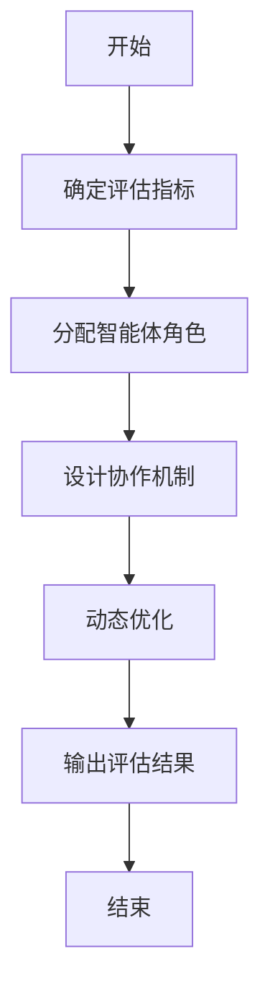
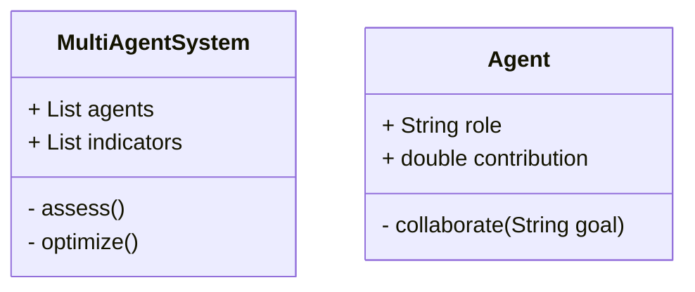
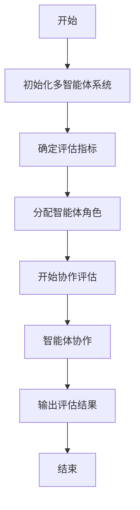
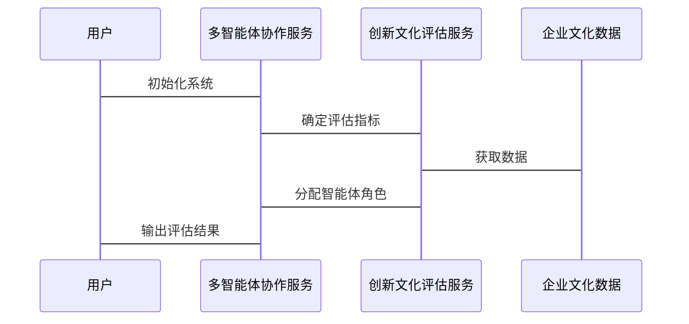

                 


# 第一部分: 智能化公司创新文化评估的背景与核心概念

## 第1章: 创新文化评估的背景与问题描述

### 1.1 创新文化的核心概念
#### 1.1.1 创新文化的定义与特征
创新文化是指企业在内部营造的一种鼓励创新、容忍失败、重视学习和适应变化的环境。其核心特征包括开放性、协作性、灵活性和可持续性。企业创新文化可以通过员工行为、管理风格和组织结构等多个维度进行评估。

#### 1.1.2 创新文化评估的重要性
创新文化是企业保持竞争优势的关键因素。通过评估创新文化，企业可以识别自身在创新过程中的优势和不足，从而制定相应的改进策略。此外，创新文化评估还能帮助企业吸引和留住创新型人才，提升整体组织绩效。

#### 1.1.3 传统评估方法的局限性
传统的创新文化评估方法通常依赖于问卷调查、员工访谈和定性分析。这些方法虽然有一定的参考价值，但存在以下局限性：
1. 主观性较强：依赖员工的主观感受，结果可能受到个体差异的影响。
2. 数据单一：缺乏多维度、多源数据的支持，难以全面反映企业的创新文化现状。
3. 实时性不足：传统评估方法通常是一次性的，难以动态跟踪企业创新文化的演变过程。

### 1.2 多智能体AI的基本概念
#### 1.2.1 多智能体系统的基本定义
多智能体系统（Multi-Agent System, MAS）是由多个相互作用的智能体组成的分布式系统。每个智能体都是一个能够感知环境、做出决策并采取行动的实体。智能体之间通过通信和协作，共同完成复杂任务。

#### 1.2.2 多智能体AI的优势与特点
多智能体AI具有以下优势和特点：
1. 分布式智能：多个智能体协同工作，避免单点故障，提高系统的容错性和可靠性。
2. 自适应性：智能体能够根据环境变化动态调整行为，具备较强的自适应能力。
3. 协作性：智能体之间通过协作实现复杂任务的分解与重组，提高整体效率。
4. 可扩展性：多智能体系统可以根据需求灵活扩展，适应不同规模的应用场景。

#### 1.2.3 多智能体AI在企业中的应用前景
多智能体AI在企业中的应用前景广阔，尤其是在优化企业流程、提高决策效率和增强创新能力方面具有重要作用。通过多智能体AI，企业可以实现各部门之间的高效协作，优化资源配置，提升整体创新效率。

## 第2章: 多智能体AI与创新文化评估的结合

### 2.1 多智能体AI在企业创新中的作用
#### 2.1.1 多智能体AI如何促进企业创新
多智能体AI通过模拟和优化企业内部的协作过程，促进企业创新。具体表现在以下几个方面：
1. 提供实时反馈：多智能体AI可以实时监控企业的创新活动，提供及时的反馈和建议。
2. 优化资源配置：通过智能体之间的协作，实现资源的最优分配，提高创新效率。
3. 鼓励知识共享：多智能体AI可以促进企业内部知识的共享和传播，激发更多的创新灵感。

#### 2.1.2 多智能体AI在创新文化评估中的独特价值
多智能体AI在创新文化评估中的独特价值主要体现在以下几个方面：
1. 多维度数据整合：多智能体AI能够整合来自不同部门、不同角色的多源数据，提供全面的评估结果。
2. 动态评估能力：多智能体AI能够实时跟踪企业的创新活动，提供动态的评估结果。
3. 可视化展示：通过多智能体AI的分析结果，可以将复杂的创新文化现状以直观的方式展示出来，便于企业理解和改进。

### 2.2 创新文化评估的多智能体AI新视角
#### 2.2.1 多智能体AI如何构建创新文化评估模型
多智能体AI可以通过构建分布式评估模型，从多个维度对企业创新文化进行评估。具体步骤如下：
1. 确定评估指标：根据企业创新文化的特征，确定关键评估指标，如创新氛围、员工参与度、知识共享等。
2. 分配智能体角色：将不同的评估指标分配给不同的智能体，每个智能体负责一个或多个指标的评估。
3. 设计协作机制：通过智能体之间的协作，整合各智能体的评估结果，形成综合的评估报告。
4. 动态优化：根据评估结果，动态调整智能体的行为策略，优化评估模型。

#### 2.2.2 多智能体AI在创新文化评估中的具体应用
多智能体AI在创新文化评估中的具体应用可以体现在以下几个方面：
1. 员工行为分析：通过智能体监控员工的行为，识别创新行为的频率和质量，评估员工的创新参与度。
2. 部门协作分析：通过智能体之间的协作，评估各部门之间的协作效率和知识共享情况。
3. 创新氛围监测：通过智能体感知企业内部的创新氛围，识别潜在的创新障碍。

## 第3章: 多智能体AI与创新文化评估的核心概念关系

### 3.1 多智能体AI与创新文化评估的实体关系图
```mermaid
er
actor 创新文化评估指标
actor 多智能体AI系统
actor 企业文化数据

relationship
创新文化评估指标 --> 多智能体AI系统: 输入
多智能体AI系统 --> 企业文化数据: 输出
多智能体AI系统 --> 创新文化评估指标: 优化
```

### 3.2 创新文化评估的流程图


### 3.3 创新文化评估的核心要素对比分析
| 评估维度       | 传统评估方法         | 多智能体AI评估方法         |
|----------------|----------------------|---------------------------|
| 数据来源       | 单一数据源           | 多源数据整合             |
| 数据处理       | 定性分析为主         | 定量与定性分析结合       |
| 评估频率       | 定期评估             | 实时动态评估             |
| 评估结果       | 单维度结果           | 多维度综合结果           |

---

# 第二部分: 多智能体AI创新文化评估的算法与系统实现

## 第4章: 多智能体AI创新文化评估的核心算法

### 4.1 多智能体协作算法
#### 4.1.1 多智能体协作的基本原理
多智能体协作算法通过智能体之间的通信与协作，实现复杂任务的分解与重组。每个智能体负责完成特定的任务，并通过共享信息和协调行动，共同完成整体目标。

#### 4.1.2 多智能体协作的数学模型
$$
\text{协作目标} = \sum_{i=1}^{n} \text{智能体}_i \cdot \text{贡献权重}_i
$$

其中，$\text{智能体}_i$ 表示第 $i$ 个智能体的任务贡献，$\text{贡献权重}_i$ 表示该智能体的贡献权重。

#### 4.1.3 多智能体协作算法实现
```python
class Agent:
    def __init__(self, id, role):
        self.id = id
        self.role = role
        self.task_contribution = 0

    def collaborate(self, goal):
        self.task_contribution = self.calculate_contribution(goal)

    def calculate_contribution(self, goal):
        # 根据目标和角色计算贡献
        pass

# 示例实现
agent1 = Agent(1, "创新氛围感知")
agent2 = Agent(2, "员工行为分析")
agent1.collaborate("提升创新氛围")
agent2.collaborate("优化员工参与度")
```

### 4.2 多智能体AI创新文化评估算法

#### 4.2.1 创新文化评估指标生成算法
```python
def generate_assessment_indicators():
    indicators = [
        "创新氛围感知",
        "员工行为分析",
        "部门协作效率",
        "知识共享程度"
    ]
    return indicators
```

#### 4.2.2 基于多智能体的优化算法
```python
class MultiAgentOptimizer:
    def __init__(self, agents, indicators):
        self.agents = agents
        self.indicators = indicators

    def optimize(self):
        for indicator in self.indicators:
            for agent in self.agents:
                agent.collaborate(indicator)
```

---

## 第5章: 多智能体AI创新文化评估系统的分析与设计

### 5.1 系统功能设计
#### 5.1.1 系统功能模块


#### 5.1.2 系统功能流程


### 5.2 系统架构设计
#### 5.2.1 系统架构图


#### 5.2.2 系统接口设计
1. 用户接口：提供输入评估指标和查看评估结果的功能。
2. 数据接口：与企业文化数据源对接，获取相关数据。
3. 服务接口：提供多智能体协作服务和创新文化评估服务。

### 5.3 系统交互设计


---

## 第6章: 项目实战: 多智能体AI创新文化评估系统实现

### 6.1 项目环境安装
```bash
# 安装Python环境
pip install python3
pip install -r requirements.txt
```

### 6.2 系统核心代码实现
#### 6.2.1 多智能体协作实现
```python
class Agent:
    def __init__(self, id, role):
        self.id = id
        self.role = role
        self.data = {}

    def collect_data(self, target):
        # 根据目标收集数据
        pass

    def analyze(self):
        # 分析数据并生成报告
        pass

    def collaborate(self, goal):
        self.collect_data(goal)
        self.analyze()

def main():
    # 初始化多智能体系统
    agents = [
        Agent(1, "创新氛围感知"),
        Agent(2, "员工行为分析"),
        Agent(3, "部门协作效率")
    ]
    # 启动协作评估
    for agent in agents:
        agent.collaborate("提升创新文化")
```

#### 6.2.2 创新文化评估实现
```python
class CultureAssessor:
    def __init__(self, agents):
        self.agents = agents

    def assess(self):
        for agent in self.agents:
            agent.collaborate("提升创新文化")
            self.report(agent)

    def report(self, agent):
        print(f"智能体{agent.id}评估结果: {agent.role}")

# 使用示例
agents = [
    Agent(1, "创新氛围感知"),
    Agent(2, "员工行为分析"),
    Agent(3, "部门协作效率")
]
assessor = CultureAssessor(agents)
assessor.assess()
```

### 6.3 案例分析与总结
#### 6.3.1 案例分析
以某科技公司为例，使用多智能体AI创新文化评估系统进行评估：
1. 初始化系统并确定评估指标。
2. 分配智能体角色并启动协作评估。
3. 智能体分别收集数据并生成评估报告。
4. 输出综合评估结果并提出改进建议。

#### 6.3.2 项目总结
通过本项目，我们验证了多智能体AI在创新文化评估中的有效性。系统能够实时动态地评估企业的创新文化，提供多维度的评估结果，并通过智能体协作优化评估过程。

---

## 第7章: 总结与展望

### 7.1 全文总结
本文从创新文化评估的背景与核心概念出发，探讨了多智能体AI在创新文化评估中的应用价值。通过构建多智能体AI系统，我们实现了对企业创新文化的动态评估与优化，为企业创新管理提供了新的视角和方法。

### 7.2 未来展望
未来，随着AI技术的不断发展，多智能体AI在创新文化评估中的应用将更加广泛和深入。我们可以进一步优化多智能体协作算法，提升系统的评估精度和效率。同时，结合大数据和区块链等技术，构建更加智能化、安全可靠的创新文化评估系统。

---

# 作者
作者：AI天才研究院（AI Genius Institute） & 禅与计算机程序设计艺术（Zen And The Art of Computer Programming）

---

希望这篇文章能满足您的需求。如果需要进一步的调整或补充，请随时告诉我！

