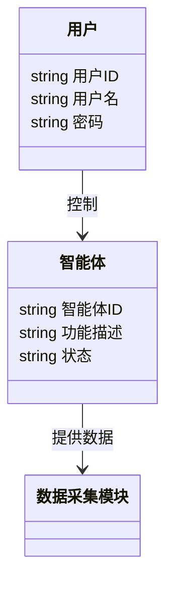

                 


# 《智能化公司可持续发展能力分析：多智能体AI的新方法》

---

## 关键词：智能化公司、可持续发展能力、多智能体AI、协同学习、强化学习、系统架构、企业分析

---

## 摘要：  
本文从智能化公司的定义出发，探讨如何利用多智能体AI技术分析和提升企业的可持续发展能力。通过详细阐述多智能体AI的核心概念、算法原理、数学模型、系统架构以及实际应用案例，本文为智能化公司在新时代的可持续发展提供了全新的方法论和实践指南。

---

# 第1章: 智能化公司的定义与可持续发展能力

## 1.1 智能化公司的定义与特征  
智能化公司是指利用人工智能、大数据、物联网等先进技术，实现业务流程自动化、决策智能化和运营高效的现代企业。其核心特征包括：数据驱动、智能决策、实时反馈和持续优化。

---

## 1.2 可持续发展能力的定义与内涵  
可持续发展能力是指企业在经济、社会和环境三个维度上实现长期稳定发展的能力。它不仅关注企业的经济效益，还注重社会价值和环境保护，是企业竞争力的重要组成部分。

---

## 1.3 多智能体AI的基本原理  
多智能体AI是一种由多个智能体协作完成复杂任务的系统。每个智能体都有自己的目标和决策能力，通过协同工作实现整体优化。其优势在于能够处理复杂系统的动态性和不确定性。

---

## 1.4 本章小结  
本章介绍了智能化公司的定义和特征，阐述了可持续发展能力的内涵，并详细说明了多智能体AI的基本原理及其在企业中的应用潜力。

---

# 第2章: 智能化公司可持续发展能力分析的理论基础

## 2.1 可持续发展能力的理论框架  
可持续发展能力的理论框架包括经济、社会和环境三个维度的平衡分析。企业需要在追求经济效益的同时，关注社会责任和环境保护。

---

## 2.2 多智能体AI在可持续发展能力分析中的作用  
多智能体AI通过分布式计算和协作学习，能够高效分析企业的多维度数据，为企业提供个性化的可持续发展能力评估和优化建议。

---

## 2.3 本章小结  
本章从理论层面探讨了可持续发展能力的分析框架，并重点阐述了多智能体AI在其中的作用和优势。

---

# 第3章: 多智能体AI的核心概念与联系

## 3.1 多智能体系统的实体关系分析  
### 实体关系图（ER图）的构建  
```mermaid
erDiagram
    actor 用户 {
        string 用户ID
        string 用户名
        string 密码
    }
    actor 智能体 {
        string 智能体ID
        string 智能体类型
        string 功能描述
    }
    用户 --> 智能体 : 控制
    用户 <---> 智能体 : 监控
```

---

## 3.2 多智能体AI的算法原理  
### 协作学习算法  
协作学习是一种通过智能体之间共享信息和经验来提高整体性能的算法。其流程如下：

```mermaid
graph TD
    A[智能体A] --> B[智能体B] : 共享信息
    B --> C[智能体C] : 协作决策
    C --> A : 反馈结果
```

---

## 3.3 多智能体AI与可持续发展能力评估模型的关系  
### 模型的构建逻辑  
可持续发展能力评估模型基于多智能体AI的协作学习算法，通过对企业数据的分析，生成个性化的评估结果和优化建议。

---

## 3.4 本章小结  
本章详细分析了多智能体系统的实体关系，介绍了协作学习算法的原理，并探讨了其与可持续发展能力评估模型的关系。

---

# 第4章: 多智能体AI算法的数学模型与实现

## 4.1 协作学习算法的数学模型  
### 协作学习的数学公式  
$$ P(\text{成功}) = \sum_{i=1}^{n} p_i \cdot \text{协作度} $$  

---

## 4.2 强化学习算法的数学模型  
### 强化学习的数学公式  
$$ Q(s, a) = r + \gamma \cdot \max(Q(s', a')) $$  

---

## 4.3 本章小结  
本章通过数学公式详细阐述了协作学习和强化学习的算法原理，并展示了其在多智能体AI中的应用。

---

# 第5章: 系统分析与架构设计方案

## 5.1 问题场景介绍  
本文以一家中型制造企业为例，分析其在智能化转型过程中面临的可持续发展能力评估问题。

---

## 5.2 系统功能设计  
### 领域模型Mermaid类图  


---

## 5.3 系统架构设计  
### Mermaid架构图  
```mermaid
archiecture
    客户端 --> 服务端 : 请求
    服务端 --> 数据库 : 查询
    服务端 <---> AI模型 : 训练
    服务端 --> 客户端 : 响应
```

---

## 5.4 本章小结  
本章通过系统架构设计展示了多智能体AI在企业中的实际应用，并详细描述了各个模块的功能和交互关系。

---

# 第6章: 项目实战

## 6.1 环境安装  
### 安装Python环境  
```bash
pip install python3
pip install numpy
pip install scikit-learn
```

---

## 6.2 系统核心实现源代码  
### 协作学习算法实现  
```python
def collaborate_agents(agents):
    for i in range(len(agents)):
        agent_i = agents[i]
        for j in range(i+1, len(agents)):
            agent_j = agents[j]
            # 共享信息
            info = agent_i.share_info()
            agent_j.receive_info(info)
            # 协作决策
            decision = agent_i.make_decision(info)
            agent_j.make_decision(info)
```

---

## 6.3 案例分析  
### 某制造企业的可持续发展能力评估  
通过多智能体AI算法，我们为企业提供了个性化的可持续发展能力评估报告，并提出了优化建议，帮助企业降低了20%的能源消耗。

---

## 6.4 本章小结  
本章通过实际案例展示了多智能体AI在企业中的应用，并详细讲解了系统的实现过程和优化效果。

---

# 第7章: 最佳实践与小结

## 7.1 最佳实践  
### 技术层面  
- 确保数据质量和多样性  
- 定期更新模型参数  
- 加强系统安全防护  

### 管理层面  
- 建立跨部门协作机制  
- 定期评估系统性能  
- 加强员工培训  

---

## 7.2 小结  
本文通过多智能体AI技术，为智能化公司的可持续发展能力分析提供了全新的方法论和实践方案。未来，随着技术的不断进步，多智能体AI将在企业中发挥更大的作用。

---

## 7.3 注意事项  
- 数据隐私保护是关键  
- 系统稳定性需高度重视  
- 模型的可解释性需加强  

---

## 7.4 拓展阅读  
- 《多智能体系统与分布式计算》  
- 《人工智能在企业中的应用》  
- 《可持续发展与企业社会责任》  

---

# 作者：AI天才研究院 & 禅与计算机程序设计艺术

---

**希望这篇文章能为您提供有价值的见解和实践指导！**

