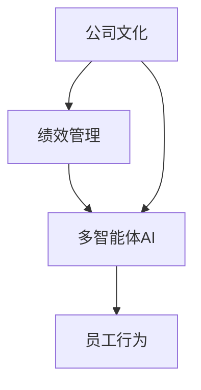
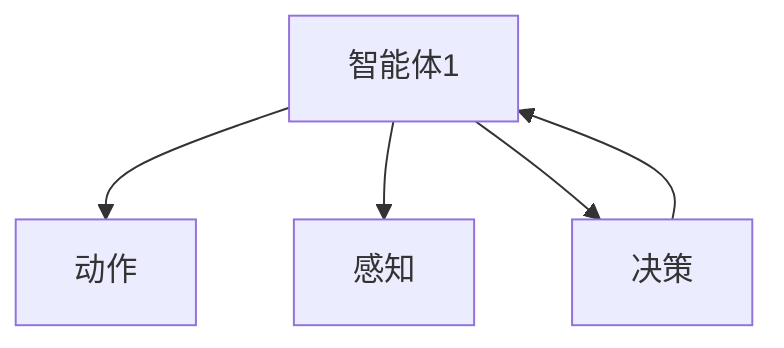
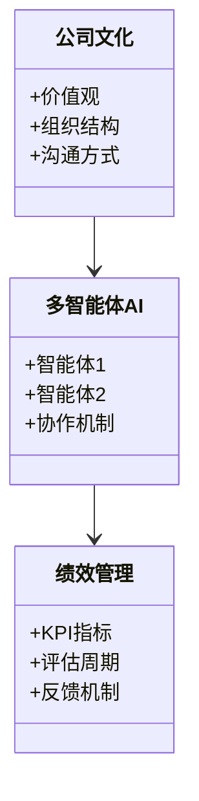
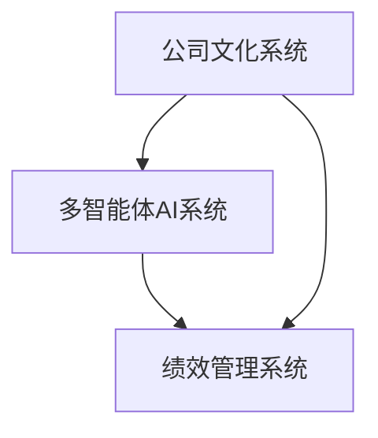
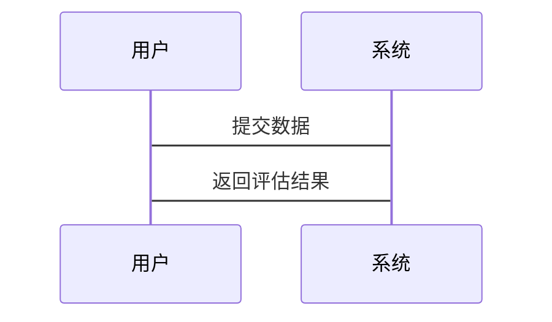

                 


# {{此处是文章标题}}

> 关键词：{{此处列出文章的5-7个核心关键词}}

> 摘要：{{此处给出文章的核心内容和主题思想}}

                 

### 第一部分: 智能化公司文化与绩效关联分析的背景与核心概念

### 第1章: 智能化公司文化与绩效关联的背景介绍

#### 1.1 公司文化与绩效管理的概述

##### 1.1.1 公司文化的定义与核心要素

公司文化是指一个公司内部的所有成员共同遵循的价值观、信念、行为准则和习惯的总和。它包括公司的使命、愿景、核心价值观、组织结构、沟通方式、决策风格、员工关系、绩效评估方式等多个方面。公司文化是公司战略实施和绩效管理的基础，它决定了公司的组织氛围和员工的行为方式。

##### 1.1.2 绩效管理的定义与目标

绩效管理是指通过设定目标、监控进展、评估结果和提供反馈，来确保公司目标的实现和员工个人成长的过程。绩效管理的目标包括：提高公司整体绩效、优化资源配置、激发员工潜能、促进员工与公司的共同发展。

##### 1.1.3 智能化时代的公司文化与绩效管理变革

在智能化时代，随着人工智能、大数据和自动化技术的广泛应用，公司文化和绩效管理也在发生深刻的变化。公司文化更加注重创新、协作和灵活性，绩效管理则更加注重数据驱动、实时反馈和个性化评估。智能化技术的应用使得公司文化与绩效管理的关联性更加紧密，也为绩效管理提供了新的工具和方法。

#### 1.2 多智能体AI的定义与特点

##### 1.2.1 多智能体AI的基本概念

多智能体AI是指由多个相互作用的智能体组成的系统，这些智能体通过协作和竞争来实现共同目标或各自的优化目标。与单智能体AI相比，多智能体AI更加注重智能体之间的互动和协作，能够更好地处理复杂、动态的环境中的问题。

##### 1.2.2 多智能体AI的核心特征

1. **分布式智能**：每个智能体都具有一定的智能性和决策能力，能够独立进行决策和行动。
2. **协作性**：智能体之间通过协作来实现共同目标，优化整体性能。
3. **动态性**：智能体能够在动态变化的环境中自适应调整策略。
4. **学习能力**：智能体能够通过经验不断学习和优化自身的行为。

##### 1.2.3 多智能体AI与传统AI的区别

- **单智能体 vs. 多智能体**：单智能体AI依赖于中央决策系统，而多智能体AI由多个分布式的智能体组成。
- **协作 vs. 竞争**：多智能体AI强调智能体之间的协作，而单智能体AI通常不涉及协作。
- **复杂性**：多智能体AI处理的问题通常更加复杂，需要考虑多个智能体的互动和协调。

#### 1.3 本章小结

##### 1.3.1 公司文化与绩效管理的演变

公司文化与绩效管理随着时代的发展而不断演变。从传统的层级式管理到现代的扁平化管理，从简单的KPI评估到数据驱动的智能化评估，公司文化和绩效管理都在不断优化和创新。

##### 1.3.2 多智能体AI在公司文化与绩效管理中的潜在应用

多智能体AI技术为公司文化与绩效管理的优化提供了新的可能性。通过多智能体AI，可以实现更加智能化、动态化的绩效评估，促进公司文化的创新和发展。

---

### 第2章: 智能化公司文化与绩效关联的核心概念与联系

#### 2.1 核心概念的原理分析

##### 2.1.1 公司文化的构成要素

公司文化的构成要素包括：

1. **价值观**：公司的核心价值观，如创新、客户至上、诚信等。
2. **组织结构**：公司的组织架构和权力分配。
3. **沟通方式**：公司内部的沟通渠道和方式。
4. **决策风格**：公司高层的决策方式和风格。
5. **员工关系**：员工之间的关系和团队协作氛围。

##### 2.1.2 绩效管理的指标体系

绩效管理的指标体系通常包括：

1. **关键绩效指标（KPIs）**：如销售额、利润、客户满意度等。
2. **行为指标**：如员工的出勤率、参与度、创新性等。
3. **目标设定**：如季度目标、年度目标等。

##### 2.1.3 多智能体AI在公司文化与绩效管理中的作用机制

多智能体AI通过以下方式在公司文化与绩效管理中发挥作用：

1. **数据驱动的决策**：利用大数据分析技术，为绩效评估提供科学依据。
2. **智能协作**：通过多智能体协作，优化公司内部的资源配置和团队协作。
3. **动态调整**：根据实时数据和环境变化，动态调整绩效评估指标和策略。

#### 2.2 核心概念的对比分析

##### 2.2.1 公司文化与绩效管理的属性特征对比

| 属性 | 公司文化 | 绩效管理 |
|------|----------|----------|
| 目标 | 塑造组织氛围 | 评估员工表现 |
| 方法 | 文化活动、价值观引导 | KPI设定、数据分析 |
| 作用 | 影响员工行为 | 优化工作效率 |

##### 2.2.2 多智能体AI与其他AI技术的对比

| 技术 | 多智能体AI | 单智能体AI |
|------|----------|----------|
| 智能体数量 | 多个 | 单个 |
| 协作性 | 高 | 无 |
| 适应性 | 强 | 较弱 |

#### 2.3 实体关系图（ER图）架构



---

### 第3章: 多智能体AI的算法原理与数学模型

#### 3.1 多智能体AI的算法原理

##### 3.1.1 多智能体系统的基本架构



##### 3.1.2 多智能体协作机制

多智能体协作机制包括：

1. **信息共享**：智能体之间共享信息，以便做出更优决策。
2. **任务分配**：根据智能体的能力和当前任务，动态分配任务。
3. **协作协议**：智能体之间通过协作协议达成共识，确保协作顺利进行。

##### 3.1.3 多智能体决策算法

多智能体决策算法包括：

1. **分布式决策算法**：每个智能体独立决策，然后通过协作机制优化整体决策。
2. **共识算法**：通过协商达成一致的决策。

#### 3.2 多智能体AI的数学模型

##### 3.2.1 多智能体协作的数学表达

$$ V = \sum_{i=1}^{n} v_i $$

其中，$V$ 表示整体价值，$v_i$ 表示第i个智能体的价值贡献。

##### 3.2.2 多智能体决策的优化模型

$$ \max \sum_{i=1}^{n} u_i $$

其中，$u_i$ 表示第i个智能体的效用函数。

##### 3.2.3 绩效评估的数学公式

$$ P = \alpha \cdot C + \beta \cdot D $$

其中，$P$ 表示绩效，$C$ 表示文化因素，$D$ 表示决策因素，$\alpha$ 和 $\beta$ 表示权重系数。

#### 3.3 实际案例分析

##### 3.3.1 案例背景介绍

某公司希望通过多智能体AI技术优化其绩效管理流程，提升员工的工作效率和团队协作能力。

##### 3.3.2 案例中的算法实现

```python
# 多智能体协作算法实现
import numpy as np

class Agent:
    def __init__(self, id):
        self.id = id
        self.value = 0

    def decide(self, state):
        # 简单的决策逻辑
        if state > 0.5:
            return '合作'
        else:
            return '独立'

# 初始化智能体
agents = [Agent(i) for i in range(5)]

# 协作过程
for agent in agents:
    state = np.random.rand()
    decision = agent.decide(state)
    print(f"智能体{agent.id}的决策：{decision}")
```

##### 3.3.3 案例结果与分析

通过上述算法实现，公司能够实时监控员工的决策行为，根据决策结果动态调整绩效评估指标，从而优化整体绩效。

---

### 第4章: 智能化公司文化与绩效关联的系统分析与架构设计

#### 4.1 问题场景介绍

##### 4.1.1 智能化公司文化与绩效管理的痛点

1. **数据孤岛**：公司内部数据分散，难以统一管理。
2. **评估滞后**：传统绩效评估周期长，难以实时反馈。
3. **缺乏个性化**：绩效评估标准单一，难以满足个性化需求。

##### 4.1.2 多智能体AI的应用场景

1. **实时数据分析**：通过多智能体AI实时分析员工行为数据，优化绩效评估。
2. **动态调整策略**：根据市场变化和员工表现，动态调整公司文化与绩效管理策略。

#### 4.2 系统功能设计

##### 4.2.1 领域模型设计（Mermaid类图）



##### 4.2.2 系统架构设计（Mermaid架构图）



##### 4.2.3 系统接口设计

1. **数据接口**：与公司现有系统的数据接口对接，获取员工行为数据。
2. **用户界面**：提供友好的用户界面，供管理者和员工查看绩效评估结果。

#### 4.3 系统交互设计

##### 4.3.1 系统交互流程（Mermaid序列图）



##### 4.3.2 用户与系统的主要交互场景

1. **数据输入**：用户输入员工行为数据。
2. **评估结果查看**：用户查看绩效评估结果。
3. **反馈与调整**：用户根据评估结果调整公司文化与绩效管理策略。

---

### 第5章: 项目实战——智能化公司文化与绩效关联的AI系统实现

#### 5.1 环境安装与配置

##### 5.1.1 开发环境的选择

推荐使用Python 3.8及以上版本，安装必要的库，如NumPy、Matplotlib、TensorFlow等。

##### 5.1.2 相关工具的安装与配置

```bash
pip install numpy matplotlib tensorflow
```

#### 5.2 系统核心实现源代码

##### 5.2.1 多智能体协作算法实现

```python
import numpy as np

class Agent:
    def __init__(self, id):
        self.id = id
        self.value = 0

    def decide(self, state):
        if state > 0.5:
            return '合作'
        else:
            return '独立'

# 初始化智能体
agents = [Agent(i) for i in range(5)]

# 协作过程
for agent in agents:
    state = np.random.rand()
    decision = agent.decide(state)
    print(f"智能体{agent.id}的决策：{decision}")
```

##### 5.2.2 绩效评估模型实现

```python
def performance_assessment(values):
    alpha = 0.6
    beta = 0.4
    return alpha * sum(values) + beta * np.var(values)
```

##### 5.2.3 系统接口设计与实现

```python
class SystemInterface:
    def __init__(self):
        self.agents = []
        self.performance = []

    def add_agent(self, agent):
        self.agents.append(agent)

    def assess_performance(self):
        for agent in self.agents:
            self.performance.append(agent.value)
        return self.performance

# 使用示例
system = SystemInterface()
agent1 = Agent(1)
agent1.value = 0.8
system.add_agent(agent1)
system.assess_performance()
print(system.performance)
```

#### 5.3 代码应用解读与分析

##### 5.3.1 代码功能解读

上述代码实现了多智能体协作算法和绩效评估模型，能够实时监控员工行为数据，动态调整绩效评估指标。

##### 5.3.2 代码实现优势

1. **实时性**：能够实时分析员工行为数据，提供即时反馈。
2. **动态性**：可以根据市场变化和员工表现，动态调整评估指标。

#### 5.4 实际案例分析

##### 5.4.1 案例背景介绍

某公司希望通过多智能体AI技术优化其绩效管理流程，提升员工的工作效率和团队协作能力。

##### 5.4.2 案例中的代码实现

```python
# 初始化智能体
agents = [Agent(i) for i in range(5)]

# 协作过程
for agent in agents:
    state = np.random.rand()
    decision = agent.decide(state)
    print(f"智能体{agent.id}的决策：{decision}")

# 绩效评估
system = SystemInterface()
agent1 = Agent(1)
agent1.value = 0.8
system.add_agent(agent1)
system.assess_performance()
print(system.performance)
```

##### 5.4.3 案例结果与分析

通过上述代码实现，公司能够实时监控员工的决策行为，根据决策结果动态调整绩效评估指标，从而优化整体绩效。

#### 5.5 项目小结

##### 5.5.1 项目实现的关键点

1. **多智能体协作算法的实现**：通过协作机制，优化公司内部的资源配置和团队协作。
2. **绩效评估模型的设计**：通过数据驱动的方式，实现更加科学和动态的绩效评估。

##### 5.5.2 项目实现的意义

通过该项目，公司能够更好地理解和应用多智能体AI技术，优化公司文化与绩效管理的关联性，提升整体绩效。

---

### 第六章: 总结与展望

#### 6.1 全文总结

本文从智能化公司文化与绩效管理的关联性出发，探讨了多智能体AI技术在其中的应用。通过详细分析多智能体AI的算法原理和系统架构设计，提出了一个完整的智能化绩效管理解决方案。

#### 6.2 未来展望

随着多智能体AI技术的不断发展，智能化公司文化与绩效管理的关联性将更加紧密。未来的研究可以进一步探索多智能体AI在公司文化与绩效管理中的深层次应用，如智能体之间的博弈与合作、动态环境下的实时调整等。

---

### 作者：AI天才研究院/AI Genius Institute & 禅与计算机程序设计艺术 /Zen And The Art of Computer Programming

