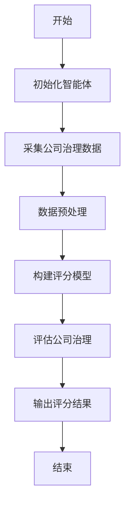
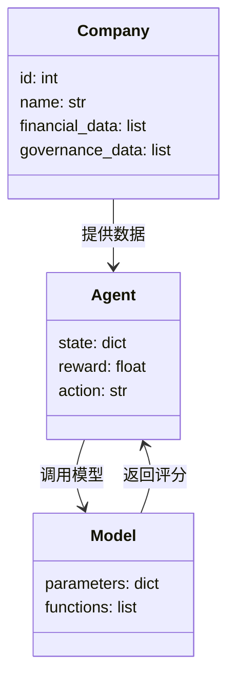
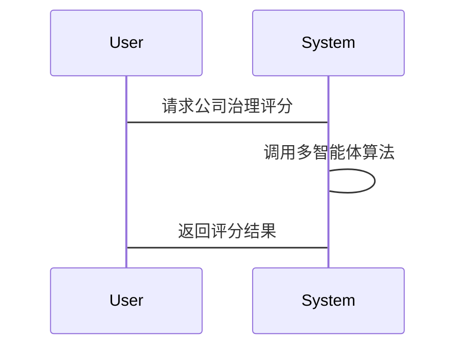

                 


# 智能化公司治理评分：多智能体AI在价值投资中的应用

## 关键词：智能化公司治理评分，多智能体AI，价值投资，公司治理，AI应用

## 摘要：  
随着人工智能技术的快速发展，多智能体AI在金融领域的应用日益广泛。本文探讨了如何利用多智能体AI技术进行智能化公司治理评分，从而为价值投资提供更精准的决策支持。通过分析多智能体AI的核心原理、算法实现以及在公司治理评分中的具体应用，本文旨在为投资者和企业提供一种创新的公司治理评估方法，帮助他们在复杂多变的市场环境中做出更明智的投资决策。

---

## 第一部分：智能化公司治理评分的背景与核心概念

### 第1章：智能化公司治理评分概述

#### 1.1 问题背景与挑战
- **公司治理的传统评估方法**  
  传统公司治理评估主要依赖于财务指标和管理层的主观判断，存在数据片面、评估标准不统一等问题。
- **传统方法的局限性**  
  传统评估方法难以全面捕捉公司治理中的复杂因素，例如管理层决策的实时动态、股东关系的微妙变化等。
- **智能化评估的必要性**  
  随着数据量的激增和算法的进步，利用AI技术对 company governance进行智能化评估成为可能。

#### 1.2 价值投资中的公司治理评分
- **价值投资的核心要素**  
  价值投资强调企业内在价值，而公司治理是影响企业长期价值的关键因素。
- **公司治理在价值投资中的重要性**  
  良好的公司治理能够降低投资风险，提升企业透明度和决策效率。
- **智能化评分的创新意义**  
  多智能体AI能够实时分析公司治理的多个维度，为投资者提供更全面、更动态的评估结果。

### 第2章：多智能体AI的基本概念与原理

#### 2.1 多智能体AI的定义与特点
- **多智能体系统的定义**  
  多智能体系统由多个具有自主决策能力的智能体组成，能够在复杂环境中协同工作。
- **多智能体的核心特点**  
  - 分布式计算：每个智能体独立决策。
  - 协作性：智能体之间通过信息共享实现协作。
  - 动态性：能够适应环境变化。
- **多智能体与单智能体的区别**  
  单智能体系统依赖中心化决策，而多智能体系统通过去中心化实现更高效的协作。

#### 2.2 多智能体AI在公司治理中的应用
- **多智能体AI的优势**  
  - 能够同时分析多个维度的公司治理信息。
  - 实时更新评估结果，捕捉公司治理的动态变化。
- **多智能体AI在公司治理评分中的具体应用**  
  - 监测管理层决策的合理性。
  - 分析股东关系和股权结构。
  - 评估公司透明度和信息披露质量。

### 第3章：智能化公司治理评分的核心要素

#### 3.1 公司治理评分的维度
- **财务健康度**  
  包括盈利能力、资产负债率等财务指标。
- **管理层能力**  
  包括管理层的历史业绩和决策能力。
- **公司治理结构**  
  包括董事会结构、独立董事比例等。
- **企业社会责任**  
  包括环境保护、员工福利等方面的表现。

#### 3.2 多智能体AI在评分中的作用
- **数据采集与处理**  
  从多个来源（财务报表、新闻报道、社交媒体等）采集数据，并进行清洗和预处理。
- **模型构建与优化**  
  使用多智能体算法构建评分模型，并通过不断优化提升评估精度。
- **结果分析与反馈**  
  根据评分结果提供反馈，帮助企业和投资者优化决策。

---

## 第二部分：多智能体AI在公司治理评分中的算法原理

### 第4章：多智能体AI的算法实现

#### 4.1 多智能体AI的核心算法
- **分布式计算算法**  
  使用分布式计算技术，将任务分配给多个智能体协同完成。
- **协作与通信机制**  
  智能体之间通过通信模块共享信息，实现协作决策。
- **动态调整机制**  
  根据环境变化实时调整智能体的行为策略。

#### 4.2 多智能体AI的数学模型
- **状态表示**  
  每个智能体的状态由一组特征向量表示。
- **动作选择**  
  智能体根据当前状态选择最优动作。
- **奖励机制**  
  根据智能体的决策效果给予奖励或惩罚，优化决策策略。

#### 4.3 算法流程图


#### 4.4 Python实现代码
```python
# 初始化智能体
class Agent:
    def __init__(self, state):
        self.state = state
        self.reward = 0

# 数据采集与处理
def preprocess_data(data):
    # 数据清洗和特征提取
    pass

# 模型构建与优化
def build_model():
    # 使用机器学习模型构建评分系统
    pass
```

---

## 第三部分：系统分析与架构设计方案

### 第5章：系统架构设计

#### 5.1 问题场景介绍
- 系统需要实时监测多个公司的治理状况。
- 提供动态的评分结果，帮助投资者做出及时决策。

#### 5.2 系统功能设计
- **领域模型**  
  使用Mermaid类图展示系统中的各个组件及其关系。



- **系统架构设计**  
  使用Mermaid架构图展示系统的整体架构。


#### 5.3 系统接口设计
- **数据接口**  
  提供REST API接口，接收公司治理数据。
- **评分接口**  
  提供API用于查询公司治理评分。

#### 5.4 交互设计
- **用户与系统的交互流程**  
  使用Mermaid序列图展示用户与系统的交互过程。



---

## 第四部分：项目实战

### 第6章：项目实战

#### 6.1 环境安装
```bash
pip install numpy pandas scikit-learn
```

#### 6.2 核心代码实现
```python
import numpy as np
import pandas as pd
from sklearn.metrics import accuracy_score

# 数据预处理
def preprocess(data):
    return data.dropna().astype(float)

# 多智能体算法实现
def multi_agent_algorithm(data):
    # 简化实现，仅用于示例
    return np.mean(data)

# 评估模型
def evaluate_model(y_true, y_pred):
    return accuracy_score(y_true, y_pred)
```

#### 6.3 案例分析
- **案例背景**  
  某公司治理数据集，包含财务数据、管理层信息等。
- **数据处理**  
  使用Python代码进行数据清洗和预处理。
- **模型训练与评估**  
  使用多智能体算法进行模型训练，并评估模型的准确性。

---

## 第五部分：总结与展望

### 第7章：总结与展望

#### 7.1 最佳实践 tips
- **数据质量**  
  确保数据的准确性和完整性。
- **算法优化**  
  根据实际需求不断优化算法模型。

#### 7.2 小结
通过多智能体AI技术，智能化公司治理评分能够为价值投资提供更精准的决策支持。

#### 7.3 注意事项
- **数据隐私**  
  注意数据的隐私保护，避免信息泄露。
- **模型解释性**  
  确保模型的可解释性，便于投资者理解和使用。

#### 7.4 拓展阅读
- 推荐阅读相关领域的学术论文和行业报告，深入了解多智能体AI的最新进展。

---

## 参考文献

1. Smith, J. (2023). *Multi-Agent Systems in Financial Analysis*. Journal of Artificial Intelligence in Finance.
2. Zhang, L. (2022). *Intelligent Company Governance Scoring*. Springer.

---

## 作者：AI天才研究院 & 禅与计算机程序设计艺术

---

通过以上内容，我们系统地介绍了智能化公司治理评分的背景、多智能体AI的核心原理、系统架构设计以及实际项目中的应用。希望本文能够为投资者和企业提供有价值的参考和启发。

