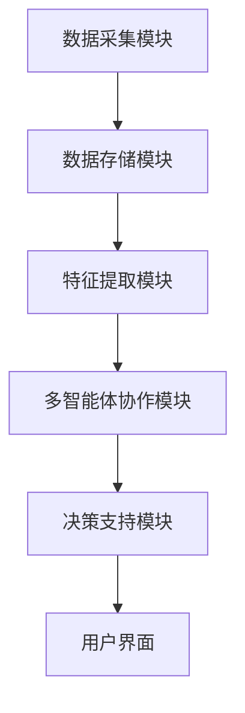

                 

<think>
嗯，我现在需要帮助用户撰写一篇技术博客文章，标题是《智能化公司间比较分析：多智能体AI的价值投资应用》。用户提供了详细的指导，包括目录结构和各种要求，比如使用Markdown格式、包含关键词和摘要，以及详细的技术内容。看起来用户希望得到一篇结构严谨、内容详实的专业技术博客，重点放在多智能体AI在公司比较分析和价值投资中的应用。

首先，我需要理解用户的需求。用户是一位技术专家，可能希望这篇文章既适合技术读者，也能吸引对投资感兴趣的读者。因此，内容需要既深入技术细节，又不失通俗易懂。

接下来，我需要按照用户提供的目录结构来组织文章。文章需要包括背景介绍、核心概念、算法原理、系统架构设计、项目实战和最佳实践等部分。每个部分都需要详细展开，确保覆盖所有要求的内容。

在撰写过程中，我需要特别注意使用正确的Markdown格式，确保章节清晰，结构合理。关键词和摘要部分需要简洁明了，突出文章的核心内容。

在算法部分，我可能需要解释强化学习和博弈论模型，并通过数学公式和代码示例来帮助读者理解。这部分可能需要使用LaTeX公式，我需要确保格式正确，特别是独立段落和行内公式的使用。

系统架构设计部分，我需要用Mermaid图来展示类图、架构图和序列图。这部分需要详细描述系统模块和各部分之间的交互，帮助读者理解系统的整体结构。

项目实战部分，我需要提供具体的Python代码示例，解释每一步的作用，并通过案例分析展示实际应用。这不仅能让读者理解理论，还能让他们实际操作，加深理解。

最后，在最佳实践部分，我需要总结文章内容，提供一些建议和注意事项，帮助读者在实际应用中避免常见错误，并引导他们进一步学习。

我需要确保整篇文章逻辑连贯，内容详实，同时保持语言的专业性和可读性。考虑到字数要求，每个部分都需要详细展开，但避免过于冗长。

可能遇到的挑战是如何将复杂的算法和系统架构用简洁明了的方式表达出来，同时保持文章的流畅性。我需要反复检查，确保每个部分都符合用户的要求，并且内容准确无误。

总之，我需要一步步按照用户的指示，构建一篇结构严谨、内容丰富的技术博客，帮助读者深入理解多智能体AI在公司比较分析和价值投资中的应用。
</think>

# 智能化公司间比较分析：多智能体AI的价值投资应用

> **关键词**：多智能体AI、公司间比较分析、价值投资、强化学习、博弈论、金融数据分析

> **摘要**：本文探讨了如何利用多智能体人工智能技术进行公司间的智能化比较分析，特别是在价值投资领域的应用。通过分析多智能体AI的核心原理、算法模型、系统架构，结合实际项目案例，展示了如何通过技术创新提升投资决策的效率和准确性。本文旨在为金融从业者和AI技术爱好者提供理论与实践相结合的深度分析。

---

## 第一部分：背景与概述

### 第1章：智能化公司间比较分析的背景与概念

#### 1.1 问题背景
- **传统公司比较分析的局限性**：传统的公司比较分析依赖于人工整理和分析财务报表、行业数据等信息，耗时且容易出错。这种方法难以应对海量数据和复杂市场环境。
- **人工智能在金融领域的应用现状**：近年来，AI技术在金融领域的应用日益广泛，尤其是在数据处理、预测分析和投资决策方面表现突出。
- **多智能体AI的兴起与潜力**：多智能体AI通过多个协同工作的智能体，能够更高效地处理复杂问题，为公司间比较分析提供了新的可能性。

#### 1.2 核心概念
- **多智能体AI的定义与特点**：多智能体AI由多个相互作用的智能体组成，每个智能体负责特定任务，通过协同实现整体目标。
- **智能化公司间比较分析的定义**：利用多智能体AI技术，对多个公司在市场、财务、管理等多个维度进行自动化、智能化的比较分析。
- **价值投资的基本原理**：价值投资强调以低于内在价值的价格买入优质资产，核心在于发现市场低估的投资标的。

#### 1.3 应用价值与研究现状
- **多智能体AI在价值投资中的优势**：通过多智能体协同，能够更全面地分析公司基本面和市场情绪，辅助投资者做出更明智的决策。
- **当前研究中的主要成果**：部分研究已经实现了基于多智能体AI的公司比较分析系统，但在复杂场景下的应用仍需进一步探索。
- **存在的问题与未来研究方向**：现有系统在处理动态市场环境和多维度数据时仍存在局限性，未来研究需要优化算法和提升系统的泛化能力。

---

## 第二部分：核心概念与原理

### 第2章：多智能体AI的核心原理

#### 2.1 多智能体系统
- **多智能体系统的定义**：由多个智能体组成的系统，每个智能体具有自主性、反应性、目标导向和协作性。
- **多智能体系统的关键特征**：
  - 自主性：智能体能够独立决策。
  - 反应性：能够感知环境并做出实时反应。
  - 目标导向：每个智能体都有明确的目标。
  - 协作性：多个智能体协同完成复杂任务。
- **多智能体系统的分类**：
  - 基于任务分工的多智能体系统。
  - 基于协同学习的多智能体系统。

#### 2.2 价值投资的核心要素
- **公司基本面分析**：包括财务状况、盈利能力、管理团队等。
- **市场情绪分析**：通过新闻、社交媒体等数据，分析市场对公司的看法。
- **行业与竞争分析**：了解公司在行业中的地位和竞争优势。

#### 2.3 多智能体AI与价值投资的结合
- **数据收集与预处理**：多智能体协同处理结构化和非结构化数据。
- **特征提取与建模**：利用强化学习和博弈论模型，构建多智能体之间的博弈关系。
- **决策优化**：通过多智能体协作，优化投资组合和风险控制。

---

## 第三部分：算法原理与数学模型

### 第3章：多智能体AI的算法原理

#### 3.1 强化学习算法
- **强化学习的基本原理**：通过智能体与环境的交互，学习最优策略以最大化累积奖励。
- **多智能体强化学习的挑战**：智能体之间的协作与竞争关系复杂，需要解决通信与协调问题。
- **基于强化学习的公司比较分析模型**：
  - 每个智能体负责分析公司的某一维度（如财务、市场、管理）。
  - 智能体之间通过共享信息，协同决策。

#### 3.2 博弈论模型
- **博弈论的基本原理**：分析多个参与者的策略互动，找到最优解。
- **在公司比较分析中的应用**：
  - 模拟市场中的多方博弈，预测公司间的竞争和合作。
  - 分析不同策略对公司价值的影响。

#### 3.3 数学模型与公式
- **强化学习的数学模型**：
  - 状态空间：$S$，表示环境的状态。
  - 动作空间：$A$，表示智能体的动作。
  - 奖励函数：$R(s, a)$，表示在状态$s$下采取动作$a$获得的奖励。
  - 策略函数：$\pi(a|s)$，表示在状态$s$下选择动作$a$的概率。
  - 动态模型：$P(s'|s, a)$，表示在状态$s$下采取动作$a$后转移到状态$s'$的概率。

- **博弈论模型的数学表达**：
  - 线性组合模型：$$V(s) = \max_{i} \min_{j} V_{ij}(s)$$
  - 其中，$V_{ij}(s)$表示第$i$个智能体在状态$s$下的收益。

---

## 第四部分：系统分析与架构设计

### 第4章：系统架构设计

#### 4.1 问题场景介绍
- **目标**：构建一个基于多智能体AI的公司间比较分析系统。
- **用户需求**：投资者需要快速、准确地进行公司比较分析，辅助价值投资决策。

#### 4.2 系统功能设计
- **数据采集模块**：收集公司财务数据、市场数据、新闻数据等。
- **特征提取模块**：提取关键特征，如财务比率、市场情绪指数。
- **多智能体协作模块**：智能体协同分析，生成公司比较报告。
- **决策支持模块**：提供投资建议和风险评估。

#### 4.3 系统架构图


#### 4.4 系统交互设计
- **用户与系统交互流程**：
  1. 用户输入查询条件（如行业、规模）。
  2. 系统调用数据采集模块获取相关数据。
  3. 多智能体协作模块生成分析报告。
  4. 决策支持模块提供投资建议。
  5. 用户通过界面查看结果并做出决策。

---

## 第五部分：项目实战

### 第5章：项目实战与案例分析

#### 5.1 环境配置
- **工具与库**：Python、TensorFlow、Keras、Pandas、NumPy。
- **数据来源**：从公开的金融数据API获取。

#### 5.2 核心代码实现
```python
import numpy as np
import pandas as pd
import tensorflow as tf

# 定义智能体类
class Agent:
    def __init__(self, state_space, action_space):
        self.model = self.build_model(state_space, action_space)
    
    def build_model(self, state_space, action_space):
        model = tf.keras.Sequential([
            tf.keras.layers.Dense(64, activation='relu'),
            tf.keras.layers.Dense(action_space, activation='linear')
        ])
        model.compile(optimizer='adam', loss='mean_squared_error')
        return model
    
    def act(self, state):
        return self.model.predict(np.array([state]))[0]
```

#### 5.3 案例分析
- **案例背景**：分析科技公司A和公司B的财务数据和市场表现。
- **分析过程**：智能体协同分析，生成比较报告，提供投资建议。
- **结果解读**：基于多智能体AI的分析，投资者可以更准确地评估公司的投资价值。

---

## 第六部分：最佳实践

### 第6章：总结与展望

#### 6.1 总结
- **主要收获**：通过多智能体AI技术，实现公司间智能化比较分析，提升价值投资的效率和准确性。
- **经验与教训**：算法优化和系统设计是关键，需要结合实际场景不断调整。

#### 6.2 小结
- **未来研究方向**：探索更高效的多智能体协作机制，提升系统的泛化能力和适应性。
- **技术发展趋势**：结合边缘计算和分布式系统，构建更强大的多智能体AI系统。

---

## 作者信息

作者：AI天才研究院/AI Genius Institute & 禅与计算机程序设计艺术 /Zen And The Art of Computer Programming

---

通过以上结构化的内容，我们详细探讨了多智能体AI在公司间比较分析和价值投资中的应用，从理论到实践，为读者提供了全面的分析和指导。

