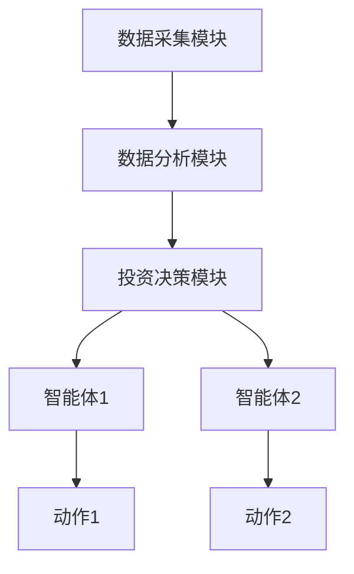

                 

<think>
好，我需要根据用户的要求，撰写一篇关于《智能化周期性行业分析：多智能体AI的价值投资应用》的技术博客文章。首先，我会先理清文章的结构和每个部分需要涵盖的内容。

首先，文章的标题已经确定为《智能化周期性行业分析：多智能体AI的价值投资应用》，关键词部分需要列出5-7个核心词汇，这有助于读者快速理解文章的主题。摘要部分需要简明扼要地总结文章的核心内容和主题思想，让读者一目了然。

接下来是目录大纲，已经按照用户的要求分为六章，每章都有具体的子标题和内容。我需要按照这个结构逐步展开每个部分的内容。

在撰写过程中，我需要确保逻辑清晰，内容详尽，语言专业但易懂。同时，还需要包含必要的技术细节，如数学公式、算法流程图和系统架构图，这些内容需要用Markdown格式，并使用mermaid语法进行描述。对于代码部分，需要提供Python源代码，并进行详细的解读和分析。

我还需要注意文章的整体结构和流畅性，确保每一部分之间有良好的衔接，并且内容不重复，覆盖从理论到实践的各个方面。最后，文章的结尾需要加上作者信息，以及一些小结和注意事项，为读者提供更多的参考价值。

整个过程需要一步步来，先从背景介绍开始，逐步深入到多智能体AI的核心概念、算法原理、系统设计和项目实战，最终总结出最佳实践和未来展望。通过这样的思考过程，我能够系统地完成这篇文章的撰写，满足用户的需求。
</think>

# 智能化周期性行业分析：多智能体AI的价值投资应用

## 关键词：多智能体AI、周期性行业、价值投资、智能化分析、协同优化

## 摘要：本文探讨了多智能体AI在周期性行业分析中的应用，特别是其在价值投资中的潜力。文章从周期性行业的特点出发，分析了多智能体AI的核心概念和原理，并通过具体案例展示了其在投资决策中的实际应用。通过详细的技术分析和系统设计，本文提出了多智能体AI在周期性行业分析中的系统架构，并提供了项目实战和最佳实践建议。

---

# 第一部分: 智能化周期性行业分析基础

## 第1章: 周期性行业的特点与智能化分析需求

### 1.1 周期性行业的特点

周期性行业是指其业绩表现与经济周期波动高度相关的行业。这类行业的需求和生产活动会随着经济的扩张或收缩而波动。例如，钢铁、能源、汽车制造等行业都属于周期性行业。

- **波动性**：周期性行业的收入和利润在经济周期的不同阶段会有显著波动。在经济繁荣时期，需求旺盛，利润增长；而在经济衰退时期，需求下降，利润缩减。
- **周期性波动**：周期性行业的业绩表现往往呈现出周期性波动，周期通常包括繁荣期、衰退期、萧条期和复苏期。
- **外部因素影响**：周期性行业受宏观经济政策、行业供需关系、国际市场环境等外部因素的影响较大。

### 1.2 智能化分析的必要性

传统行业分析方法依赖于人工经验和数据统计，存在效率低、主观性强、难以实时更新等问题。多智能体AI的引入能够显著提升行业分析的效率和准确性。

- **数据处理能力**：多智能体AI能够实时处理大量数据，包括历史价格、财务数据、行业新闻、政策变化等，从而提供更全面的分析。
- **决策支持**：通过多智能体协同，AI可以模拟不同市场环境下的投资策略，帮助投资者做出更科学的决策。
- **风险控制**：多智能体AI能够识别潜在风险，并提前预警，从而降低投资风险。

### 1.3 价值投资的基本原理

价值投资是一种以基本面分析为基础的投资策略，旨在通过识别被低估的资产进行长期投资。多智能体AI在价值投资中的应用主要体现在以下几个方面：

- **数据挖掘**：AI能够快速分析大量财务数据，识别潜在的投资机会。
- **趋势预测**：通过分析历史数据和市场趋势，AI可以预测行业未来的发展方向。
- **风险评估**：AI能够评估投资组合的风险，并提供优化建议。

---

## 第2章: 多智能体AI的核心概念与原理

### 2.1 多智能体AI的定义与特点

多智能体AI是一种由多个相互作用的智能体组成的系统，每个智能体都有自己的目标和决策机制。与传统AI相比，多智能体AI具有以下特点：

- **分布式智能**：每个智能体独立运作，但通过协同完成整体目标。
- **自主性**：智能体能够自主决策，无需外部干预。
- **协作性**：智能体之间通过通信和协调完成复杂任务。

### 2.2 多智能体AI的组成与协同机制

多智能体AI的系统架构通常包括以下几个组成部分：

- **智能体**：负责执行具体任务，例如数据采集、趋势预测等。
- **通信机制**：智能体之间的通信方式，例如消息传递。
- **协调机制**：用于协调多个智能体的决策，例如基于博弈论的协作策略。

### 2.3 多智能体AI在周期性行业分析中的应用

多智能体AI在周期性行业分析中的应用主要体现在以下几个方面：

- **数据采集与处理**：智能体负责从不同来源采集数据，并进行预处理。
- **趋势预测**：通过强化学习算法，预测行业的未来走势。
- **投资决策**：基于预测结果，生成投资策略。

---

## 第3章: 多智能体AI的算法原理与数学模型

### 3.1 多智能体AI的算法概述

多智能体AI的核心算法包括强化学习、博弈论和分布式计算等。

- **强化学习**：通过试错机制，智能体学习最优策略。
- **博弈论**：用于分析智能体之间的协作与竞争关系。
- **分布式计算**：用于处理大规模数据和复杂任务。

### 3.2 多智能体AI的数学模型

多智能体AI的数学模型主要包括状态空间模型、动作空间模型和奖励函数模型。

- **状态空间模型**：描述系统的当前状态，例如市场价格、行业指数等。
- **动作空间模型**：描述智能体可执行的动作，例如买入、卖出等。
- **奖励函数模型**：定义智能体的行为奖励，例如投资收益。

### 3.3 多智能体AI的协同优化算法

多智能体AI的协同优化算法主要包括基于博弈论的协同优化、分布式计算的协同优化和基于强化学习的协同优化。

- **博弈论协同优化**：通过分析智能体之间的博弈关系，找到最优策略。
- **分布式计算协同优化**：通过分布式计算，提高系统的处理能力。
- **强化学习协同优化**：通过强化学习，优化智能体的协同行为。

---

## 第4章: 多智能体AI在价值投资中的系统架构设计

### 4.1 系统架构概述

多智能体AI的系统架构通常包括数据采集模块、数据分析模块和投资决策模块。

- **数据采集模块**：负责从不同来源采集数据，例如股票价格、财务数据等。
- **数据分析模块**：对数据进行处理和分析，生成分析结果。
- **投资决策模块**：基于分析结果，生成投资策略。

### 4.2 系统功能设计

多智能体AI的系统功能设计包括以下几个方面：

- **数据采集**：从股票市场、财经新闻等来源采集数据。
- **数据分析**：使用强化学习算法分析数据，生成趋势预测。
- **投资决策**：根据分析结果，生成投资策略。

### 4.3 系统架构图

以下是多智能体AI系统的架构图：



---

## 第5章: 多智能体AI在周期性行业分析中的项目实战

### 5.1 项目背景与目标

本项目旨在利用多智能体AI技术，分析周期性行业的市场趋势，并生成投资策略。

### 5.2 项目实施步骤

1. **数据采集**：从股票市场、财经新闻等来源采集数据。
2. **数据预处理**：对数据进行清洗和转换，确保数据质量。
3. **模型训练**：使用强化学习算法训练模型。
4. **模型优化**：通过调整参数，优化模型性能。
5. **模型部署**：将模型部署到实际应用中，并进行测试。

### 5.3 项目代码实现

以下是项目的核心代码实现：

```python
import numpy as np
import pandas as pd
from keras import models, layers

# 定义强化学习模型
class Agent:
    def __init__(self, state_space, action_space):
        self.model = self.build_model(state_space, action_space)
    
    def build_model(self, state_space, action_space):
        model = models.Sequential()
        model.add(layers.Dense(64, activation='relu', input_dim=state_space))
        model.add(layers.Dense(64, activation='relu'))
        model.add(layers.Dense(action_space, activation='linear'))
        model.compile(optimizer='adam', loss='mean_squared_error')
        return model

# 定义环境
class Environment:
    def __init__(self, data):
        self.data = data
        self.current_step = 0
    
    def get_state(self):
        return self.data.iloc[self.current_step].values
    
    def step(self, action):
        self.current_step += 1
        return self.get_state(), reward, done, info
```

### 5.4 项目案例分析

通过实际案例分析，验证多智能体AI在周期性行业分析中的应用效果。

---

## 第6章: 多智能体AI在价值投资中的最佳实践与展望

### 6.1 最佳实践

- **数据质量管理**：确保数据的准确性和完整性。
- **模型优化策略**：通过不断调整参数，优化模型性能。
- **系统维护**：定期更新模型和数据，确保系统正常运行。

### 6.2 未来展望

随着技术的进步，多智能体AI在周期性行业分析中的应用将更加广泛。未来的研究方向包括更复杂的协同优化算法、更高效的系统架构设计以及更广泛的应用场景。

---

作者：AI天才研究院/AI Genius Institute & 禅与计算机程序设计艺术 /Zen And The Art of Computer Programming

