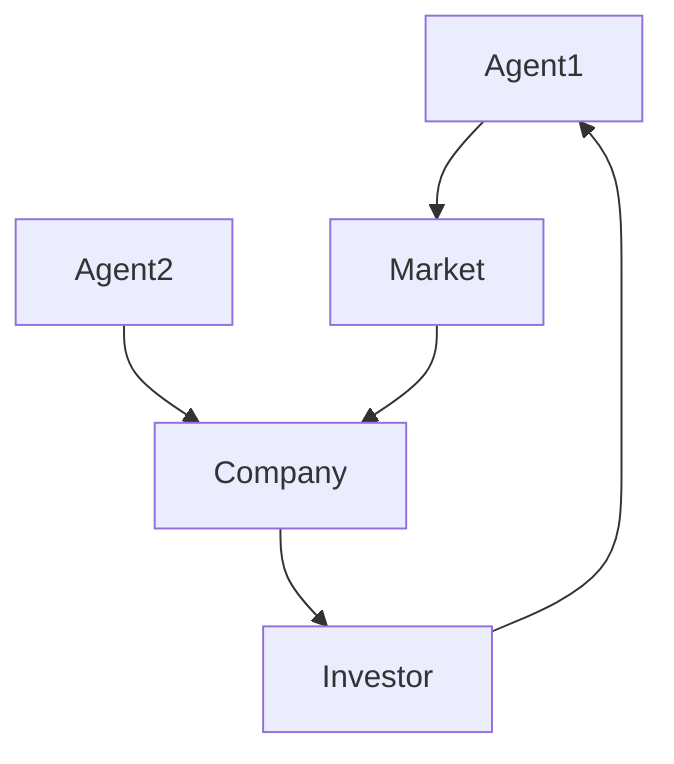
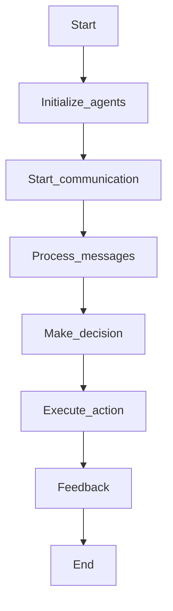
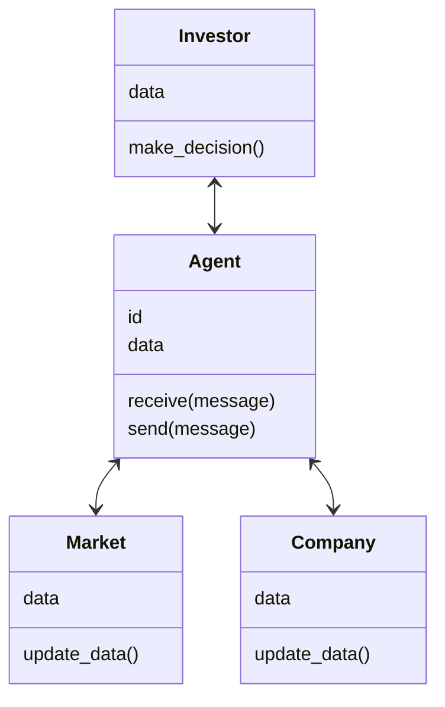
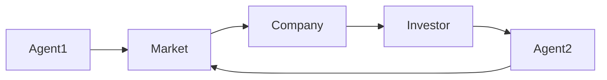
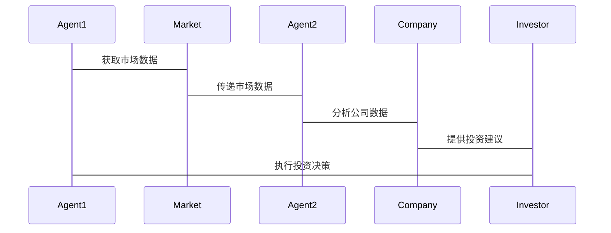

                 


# 智能化品牌价值评估：多智能体AI在价值投资中的应用

## 关键词：智能化品牌价值评估、多智能体AI、价值投资、人工智能、系统架构设计、算法实现

## 摘要：
随着人工智能技术的快速发展，智能化品牌价值评估成为价值投资领域的重要趋势。本文通过多智能体AI的应用，探讨品牌价值评估的创新方法，分析其在金融投资中的潜力。文章从多智能体AI的基本原理出发，结合实际案例，深入解析其在品牌价值评估中的优势与挑战，并提供系统的解决方案和实施路径。

---

# 第一部分: 智能化品牌价值评估的背景与概念

## 第1章: 智能化品牌价值评估的背景与意义

### 1.1 品牌价值评估的背景
#### 1.1.1 传统品牌价值评估的局限性
传统品牌价值评估主要依赖财务数据和人工分析，存在主观性强、效率低、难以量化等问题。例如，品牌的情感价值和市场潜力难以通过简单的财务指标衡量。

#### 1.1.2 数字化时代的品牌价值变化
在数字化时代，品牌价值受到社交媒体、用户行为数据和市场动态的影响更大。消费者的行为数据、品牌声誉的变化等都需要纳入评估体系。

#### 1.1.3 智能化评估的必要性
智能化评估能够通过大数据分析和AI技术，实时捕捉市场动态，量化品牌价值的变化，为投资者提供更精准的决策支持。

### 1.2 多智能体AI的基本概念
#### 1.2.1 多智能体系统的定义
多智能体系统是由多个相互作用的智能体组成的系统，每个智能体能够独立决策并与其他智能体协作或竞争。

#### 1.2.2 多智能体AI的核心特征
| 特征 | 描述 |
|------|------|
| 分布式 | 每个智能体独立运行，共同完成任务 |
| 交互性 | 智能体之间通过通信进行协作或竞争 |
| 自适应性 | 能够根据环境变化动态调整策略 |

#### 1.2.3 多智能体与单智能体AI的区别
| 方面 | 多智能体AI | 单智能体AI |
|------|----------|-----------|
| 决策 | 分布式决策 | 中央决策 |
| 交互 | 高度交互 | 无交互或低交互 |
| 效率 | 高并发处理 | 单线处理 |

### 1.3 价值投资中的智能化应用
#### 1.3.1 价值投资的基本原理
价值投资强调通过分析企业的基本面，寻找被市场低估的投资标的。传统方法依赖分析师的主观判断，效率低且易受人为因素影响。

#### 1.3.2 AI在金融分析中的应用
AI技术能够通过大数据分析快速捕捉市场趋势，量化分析企业财务数据和行业动态，为价值投资提供技术支持。

#### 1.3.3 多智能体AI在价值投资中的优势
多智能体AI能够从多个维度同时分析市场动态、企业基本面和投资者情绪，提供更全面的投资决策支持。

---

## 第2章: 多智能体AI的核心原理

### 2.1 多智能体系统的组成与关系
#### 2.1.1 实体关系图（ER图）分析

#### 2.1.2 多智能体间的交互机制
智能体通过消息传递进行协作，例如：
- Agent1从市场获取数据
- Agent2分析公司基本面
- 两者结合生成投资建议

### 2.2 多智能体AI的算法原理
#### 2.2.1 算法流程图（Mermaid）


#### 2.2.2 算法实现代码示例
```python
class Agent:
    def __init__(self, id):
        self.id = id
        self.data = None

    def receive(self, message):
        self.data = message

    def send(self, target, message):
        target.receive(message)

# 示例用法
agent1 = Agent(1)
agent2 = Agent(2)
message = "市场数据"
agent1.send(agent2, message)
print(agent2.data)  # 输出：市场数据
```

#### 2.2.3 算法的数学模型与公式
- 状态表示：
  $$ s = (s_1, s_2, ..., s_n) $$
- 行动选择：
  $$ a = \argmax_{a} Q(s, a) $$
- 奖励函数：
  $$ R(s, a) = r $$

---

## 第3章: 智能化品牌价值评估的系统架构

### 3.1 项目背景与目标
#### 3.1.1 项目背景介绍
品牌价值评估在金融投资中的重要性日益增加，传统的评估方法难以应对复杂市场环境。

#### 3.1.2 项目目标设定
开发一个多智能体AI系统，实现品牌价值的智能化评估和价值投资决策支持。

### 3.2 系统功能设计
#### 3.2.1 领域模型（Mermaid类图）


### 3.3 系统架构设计
#### 3.3.1 系统架构图（Mermaid）


### 3.4 系统接口设计
#### 3.4.1 接口定义
- 数据接口：智能体间的数据传输
- 控制接口：系统的启动和停止

### 3.5 系统交互流程（Mermaid序列图）


---

## 第4章: 项目实战

### 4.1 环境安装与配置
- 安装Python和相关库（如numpy、pandas、scikit-learn）
- 安装mermaid和latex工具

### 4.2 核心代码实现
#### 4.2.1 系统实现
```python
class Market:
    def __init__(self):
        self.data = {}

    def update_data(self, key, value):
        self.data[key] = value

class Agent:
    def __init__(self, id):
        self.id = id
        self.market = Market()

    def receive(self, message):
        self.market.update_data(self.id, message)

# 示例用法
agent1 = Agent(1)
agent1.receive("价格上升")
print(agent1.market.data[1])  # 输出：价格上升
```

### 4.3 案例分析
#### 4.3.1 实际案例
分析某品牌在市场中的价值变化，使用多智能体AI进行预测和评估。

#### 4.3.2 案例小结
通过案例分析，验证多智能体AI在品牌价值评估中的有效性和优势。

---

## 第5章: 最佳实践与总结

### 5.1 最佳实践
- 数据质量的重要性
- 系统可扩展性的设计
- 模型的持续优化

### 5.2 小结
多智能体AI在品牌价值评估和价值投资中的应用前景广阔，能够显著提升评估效率和准确性。

### 5.3 注意事项
- 数据隐私保护
- 系统稳定性和安全性
- 模型的可解释性

### 5.4 拓展阅读
建议读者深入学习多智能体系统的理论和实践，探索其在其他领域的应用。

---

## 作者：AI天才研究院 & 禅与计算机程序设计艺术

