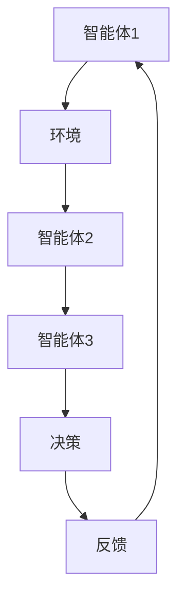
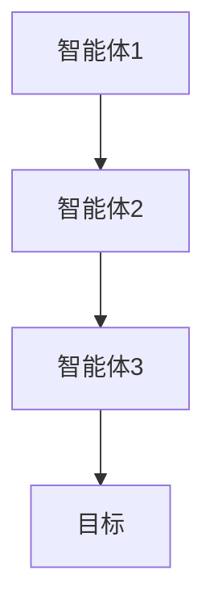
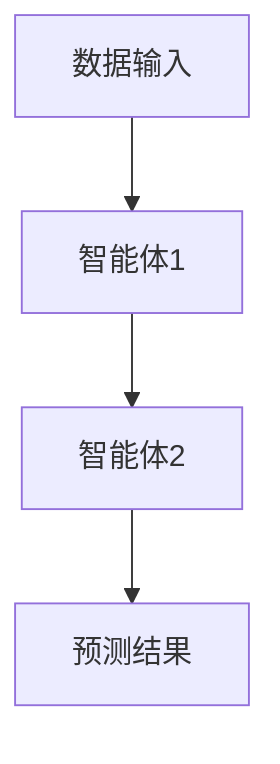
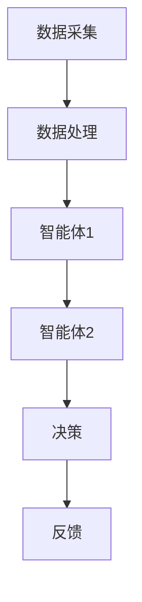

                 


# 智能化商业模式分析：多智能体AI在价值投资中的角色

> **关键词**：多智能体AI、价值投资、智能化商业模式、金融分析、投资决策  
> **摘要**：本文探讨了多智能体AI在价值投资中的应用，分析了多智能体AI的核心概念、算法原理以及在金融领域的实际应用。通过系统化的分析和实战案例，展示了多智能体AI如何优化投资决策，提升投资效率。

---

# 引言

在金融市场的复杂性和不确定性日益增加的今天，传统的价值投资方法正面临新的挑战。多智能体AI的出现，为价值投资注入了新的活力。本文将从多智能体AI的基本概念出发，逐步分析其在价值投资中的角色和应用。

---

# 第1章: 多智能体AI的核心概念与价值投资的基本原理

## 1.1 多智能体AI的定义与特点

### 1.1.1 多智能体AI的定义

多智能体AI（Multi-Agent AI）是由多个智能体组成的系统，每个智能体都有独立的目标和决策机制。这些智能体通过协作和竞争，共同完成复杂的任务。

### 1.1.2 多智能体AI的特点

| 特性 | 描述 |
|------|------|
| 分布式 | 智能体分布在不同的节点，独立运行 |
| 协作性 | 智能体之间可以协作完成任务 |
| 响应性 | 能够实时感知环境并做出反应 |
| 学习能力 | 具备自我学习和优化的能力 |

### 1.1.3 多智能体AI与传统AI的区别

| 方面 | 传统AI | 多智能体AI |
|------|--------|------------|
| 结构 | 单一中心 | 分布式结构 |
| 决策 | 中心化 | 去中心化 |
| 应用 | 单任务 | 多任务协作 |

## 1.2 价值投资的基本原理

### 1.2.1 价值投资的定义

价值投资是一种投资策略，强调以低于内在价值的价格购买优质资产。其核心是通过基本面分析，找到被市场低估的投资标的。

### 1.2.2 价值投资的核心原则

- **安全边际**：买入价格低于内在价值。
- **长期视角**：关注企业的长期盈利能力。
- **分散投资**：降低风险。

## 1.3 多智能体AI与价值投资的结合

### 1.3.1 多智能体AI在价值投资中的优势

- **数据处理能力**：多智能体AI能够处理海量数据，发现潜在的投资机会。
- **实时决策**：通过协作和实时反馈，优化投资决策。
- **风险控制**：通过分布式的决策机制，降低投资风险。

### 1.3.2 价值投资智能化的必要性

随着市场的复杂化，传统的人工分析难以应对日益增长的数据量和复杂性。多智能体AI的引入，能够显著提升分析效率和准确性。

---

# 第2章: 多智能体AI的算法原理与金融应用

## 2.1 多智能体AI的算法原理

### 2.1.1 多智能体强化学习

多智能体强化学习是一种通过智能体之间的协作和竞争来优化决策的算法。以下是其实现流程：



### 2.1.2 分布式计算与协作学习

多智能体AI通过分布式计算和协作学习，能够高效地完成复杂任务。以下是其实现框架：



### 2.1.3 联合推理与决策

联合推理是多智能体AI的核心机制，通过多个智能体的协同推理，实现更优的决策。

## 2.2 多智能体AI在金融领域的应用

### 2.2.1 多智能体AI在股票预测中的应用

通过多智能体协作，能够更准确地预测股票价格走势。以下是其实现流程：



### 2.2.2 多智能体AI在风险评估中的应用

多智能体AI能够实时监控市场风险，通过分布式的决策机制，降低投资风险。

### 2.2.3 多智能体AI在投资组合优化中的应用

通过多智能体协作，优化投资组合，实现收益最大化。

---

# 第3章: 价值投资的智能化分析与实战

## 3.1 价值投资的智能化转型

### 3.1.1 传统价值投资的局限性

- 数据处理能力有限
- 人工分析耗时且易出错
- 风险控制能力不足

### 3.1.2 智能化转型的必要性

- 提高数据分析效率
- 优化投资决策
- 提升风险控制能力

## 3.2 多智能体AI在价值投资中的应用

### 3.2.1 市场分析

通过多智能体AI，实时分析市场动态，发现投资机会。

### 3.2.2 风险评估

通过分布式的决策机制，评估投资风险，制定风险控制策略。

### 3.2.3 投资组合优化

通过协作学习，优化投资组合，实现收益最大化。

---

# 第4章: 多智能体AI的系统设计与实现

## 4.1 系统设计

### 4.1.1 系统架构设计

以下是多智能体AI系统的架构设计：



### 4.1.2 功能设计

| 模块 | 功能 |
|------|------|
| 数据采集 | 采集市场数据 |
| 数据处理 | 对数据进行清洗和预处理 |
| 智能体协作 | 智能体之间协作完成任务 |
| 决策模块 | 生成投资决策 |
| 反馈模块 | 提供反馈，优化决策 |

## 4.2 实战案例

### 4.2.1 实战环境安装

安装所需的库和工具：

```bash
pip install tensorflow keras numpy pandas matplotlib
```

### 4.2.2 核心代码实现

以下是多智能体AI的核心代码实现：

```python
import numpy as np
import tensorflow as tf
from keras.models import Sequential
from keras.layers import Dense

# 定义智能体类
class Agent:
    def __init__(self, input_dim, output_dim):
        self.model = self.build_model(input_dim, output_dim)
        self.model.compile(optimizer='adam', loss='mean_squared_error')
    
    def build_model(self, input_dim, output_dim):
        model = Sequential()
        model.add(Dense(64, activation='relu', input_dim=input_dim))
        model.add(Dense(output_dim, activation='linear'))
        return model

# 初始化多智能体
agents = [Agent(10, 1) for _ in range(3)]
```

### 4.2.3 案例分析

通过实际案例分析，展示多智能体AI在价值投资中的应用。

---

# 第5章: 结论与展望

## 5.1 结论

多智能体AI在价值投资中的应用，显著提升了投资决策的效率和准确性。通过协作和分布式的决策机制，优化了投资组合，降低了投资风险。

## 5.2 未来展望

随着技术的不断进步，多智能体AI在价值投资中的应用将更加广泛。未来的研究方向包括优化算法、提升系统的实时性和准确性。

---

# 作者

作者：AI天才研究院/AI Genius Institute & 禅与计算机程序设计艺术 /Zen And The Art of Computer Programming

---

# 深入阅读

1. 多智能体AI的算法原理与实现
2. 价值投资的数学模型与优化
3. 多智能体AI在金融领域的最新研究

---

通过本文的系统分析和实战案例，我们展示了多智能体AI在价值投资中的巨大潜力。未来，随着技术的不断发展，多智能体AI将在金融领域发挥越来越重要的作用。

