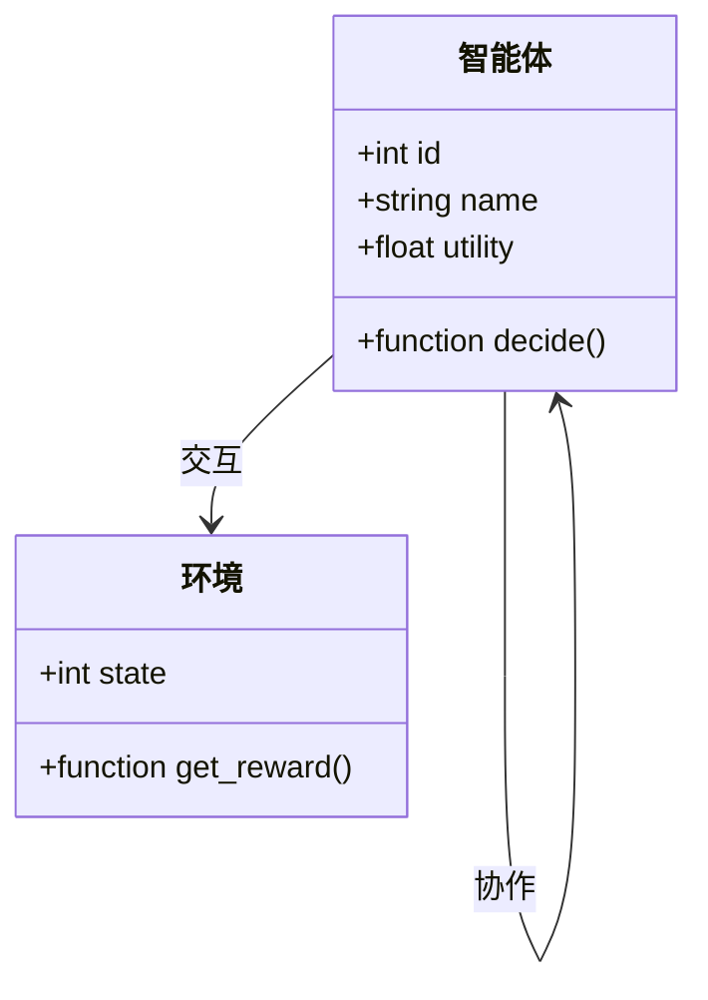
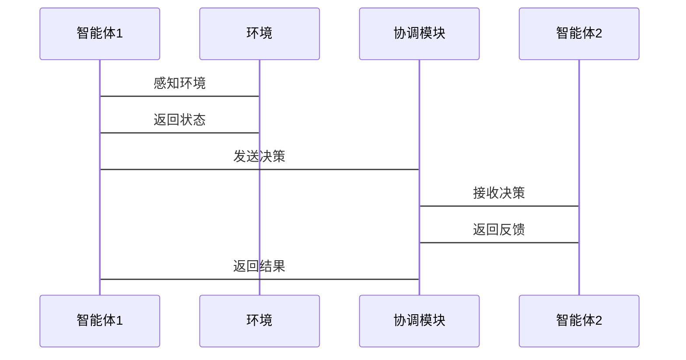

                 

<think>
好的，现在我需要帮助用户撰写一篇关于《智能化并购后整合效果预测：多智能体AI的新视角》的技术博客文章。首先，我要理解用户的需求。用户希望我以技术专家、CTO的身份，撰写一篇结构清晰、内容深入的技术博客，涵盖智能化并购整合的背景、多智能体AI的概念、算法原理、系统架构设计、项目实战等内容，并且要符合特定的格式要求。

接下来，我需要按照用户提供的目录结构来展开内容。第一部分是引言，介绍并购整合的背景和问题。我会从问题背景开始，解释什么是并购整合，以及传统方法的局限性，然后引入多智能体AI的优势。这部分需要简明扼要，帮助读者理解为什么需要智能化的整合方法。

第二部分是多智能体AI的核心概念。我需要详细讲解多智能体系统的定义、特点，以及与传统AI的区别。这部分内容需要清晰，可能包括一些对比表格或示意图，帮助读者理解多智能体AI的独特之处。同时，我还要介绍系统的核心要素，如个体智能体、交互机制和目标协调，这些是构建多智能体系统的基础。

第三部分是算法原理。这里需要详细分析多智能体系统中的博弈论模型和协同机制。我会从博弈论的基本概念入手，解释其在多智能体系统中的应用，并通过数学公式来展示模型。此外，还要介绍增强学习在多智能体系统中的应用，包括相关的数学模型和挑战。这部分需要结合实际案例，让读者更容易理解。

第四部分是系统架构设计。我会从问题场景出发，描述一个具体的并购整合项目，然后进行系统功能设计、架构设计和接口设计。这部分可能需要用到领域模型的类图和系统架构图，用mermaid来展示，帮助读者直观理解系统的结构和各部分之间的关系。

第五部分是项目实战。我需要详细指导读者如何搭建环境，实现核心算法，并通过一个实际案例来展示系统的应用效果。这部分要包含代码示例和案例分析，帮助读者将理论知识应用到实际中。

最后是总结与展望。我会回顾全文，总结多智能体AI在并购整合中的优势和应用，同时指出当前的挑战和未来的研究方向，为读者提供进一步的学习和研究方向。

在整个写作过程中，我需要确保内容逻辑清晰，结构紧凑，语言专业但易于理解。同时，要满足用户的格式要求，如使用markdown，插入mermaid图表，使用latex公式等。我会逐步展开每个部分，确保每个小节都有足够的细节和深度，满足读者的需求。

现在，我可以开始撰写文章的各个部分，确保内容符合用户的要求，并涵盖所有必要的技术细节和实际应用案例。
</think>

# 智能化并购后整合效果预测：多智能体AI的新视角

> 关键词：智能化并购、多智能体AI、整合效果预测、博弈论模型、系统架构设计

> 摘要：并购后的整合效果预测是企业在智能化时代面临的重要挑战。本文从多智能体AI的新视角，系统性地探讨了如何利用多智能体技术预测并购后的整合效果。文章首先介绍了并购整合的基本概念和传统方法的局限性，然后详细阐述了多智能体AI的核心概念、算法原理和系统架构设计，最后通过项目实战展示了多智能体AI在并购整合效果预测中的具体应用。本文旨在为企业的智能化并购整合提供理论支持和实践指导。

---

# 第一部分: 智能化并购后整合效果预测的背景与概念

# 第1章: 引言

## 1.1 问题背景

### 1.1.1 并购整合的基本概念
并购（Mergers and Acquisitions，M&A）是指企业之间的合并或收购行为。整合则是指将两家或多家企业的资源、业务、文化等进行融合的过程。并购后的整合效果直接关系到企业的长期发展和股东价值。

### 1.1.2 并购整合中的关键问题
1. **协同效应的实现**：并购的核心目的是通过整合实现协同效应，但现实中往往难以实现预期效果。
2. **信息不对称**：企业在并购前的信息不透明可能导致整合过程中的冲突和障碍。
3. **文化与战略差异**：不同企业的文化、战略目标和管理风格差异可能导致整合失败。

### 1.1.3 传统并购整合方法的局限性
传统并购整合方法主要依赖于人工经验判断和静态分析，难以应对复杂多变的市场环境和企业内部的动态变化。

## 1.2 多智能体AI的新视角
### 1.2.1 多智能体AI的定义与特点
多智能体AI是指由多个智能体组成的系统，每个智能体能够独立决策并协同工作，以实现整体目标。其特点包括分布式、协作性和动态性。

### 1.2.2 多智能体AI在并购整合中的优势
1. **动态适应性**：多智能体系统能够实时感知环境变化并做出调整。
2. **分布式决策**：多个智能体协同工作，避免了单点决策的局限性。
3. **信息共享与协同**：通过智能体之间的信息共享，实现更高效的整合效果预测。

### 1.2.3 本章小结
本章介绍了并购整合的基本概念和传统方法的局限性，并提出了多智能体AI的新视角，为后续内容奠定了基础。

---

# 第2章: 多智能体AI的核心概念

## 2.1 多智能体系统的定义与特点

### 2.1.1 多智能体系统的定义
多智能体系统是由多个智能体组成的系统，每个智能体能够独立感知环境、做出决策并与其他智能体协同工作。

### 2.1.2 多智能体系统的属性特征对比

| 特性         | 单智能体系统         | 多智能体系统         |
|--------------|----------------------|----------------------|
| 决策主体     | 单一主体             | 多个主体             |
| 协作性       | 较低                 | 较高                 |
| 动态性       | 较低                 | 较高                 |

### 2.1.3 多智能体系统与传统AI的区别
- **独立性**：多智能体系统中的智能体可以独立决策，而传统AI通常依赖中央控制。
- **协作性**：多智能体系统强调智能体之间的协作，而传统AI通常是单点决策。
- **动态性**：多智能体系统能够实时调整策略，而传统AI通常是静态的。

## 2.2 多智能体系统的核心要素

### 2.2.1 个体智能体
个体智能体是多智能体系统的基本单元，能够独立感知环境、做出决策并与其他智能体交互。

### 2.2.2 个体智能体之间的交互
智能体之间的交互是多智能体系统的核心，包括信息共享、协同决策和任务分配。

### 2.2.3 系统目标与个体目标的协调
系统目标是多智能体系统整体追求的目标，而个体目标是每个智能体追求的目标。协调两者是实现系统最优的关键。

## 2.3 多智能体系统的ER实体关系图

```mermaid
erDiagram
    customer[客户] {
        +int id
        +string name
    }
    product[产品] {
        +int id
        +string name
        +decimal price
    }
    order[订单] {
        +int id
        +int customerId
        +int productId
        +date orderDate
    }
    customer --> order : 下订单
    product --> order : 订单包含产品
```

---

# 第3章: 多智能体AI的算法原理

## 3.1 多智能体系统中的博弈论模型

### 3.1.1 博弈论的基本概念
博弈论是研究理性决策者之间策略互动的理论。在多智能体系统中，每个智能体可以被视为一个博弈参与者。

### 3.1.2 博弈论在多智能体系统中的应用
博弈论为多智能体系统的决策制定提供了理论基础，特别是在非合作博弈和合作博弈中。

### 3.1.3 博弈论模型的数学表达

$$ \text{收益} = \sum_{i=1}^{n} u_i(a_i, a_{-i}) $$

其中，$u_i$ 表示第i个智能体的效用函数，$a_i$ 表示第i个智能体的策略，$a_{-i}$ 表示其他智能体的策略。

## 3.2 多智能体系统的协同机制

### 3.2.1 协同机制的定义
协同机制是指多智能体系统中智能体之间为实现共同目标而采取的协调方式。

### 3.2.2 协同机制的实现方法
1. **基于合同的协同**：通过签订合同明确各智能体的职责和权利。
2. **基于市场的协同**：通过市场机制实现资源分配和任务协同。
3. **基于协议的协同**：通过协议规范智能体之间的交互行为。

### 3.2.3 协同机制的数学模型

$$ \text{协同收益} = \sum_{i=1}^{n} c_i(a_i, a_{-i}) $$

其中，$c_i$ 表示第i个智能体的协同成本，$a_i$ 表示第i个智能体的策略，$a_{-i}$ 表示其他智能体的策略。

## 3.3 多智能体系统的学习算法

### 3.3.1 增强学习的基本原理
增强学习是一种通过试错方式学习策略的方法，智能体通过与环境交互获得奖励或惩罚，从而优化策略。

### 3.3.2 多智能体增强学习的挑战
1. **策略协调**：多个智能体的策略需要协调一致。
2. **通信开销**：智能体之间的通信可能导致额外的计算开销。
3. **动态环境**：环境的动态变化增加了学习的难度。

### 3.3.3 多智能体增强学习的数学模型

$$ Q(s, a) = \sum_{i=1}^{n} Q_i(s, a_i) $$

其中，$Q(s, a)$ 表示在状态$s$下采取动作$a$的收益，$Q_i(s, a_i)$ 表示第i个智能体在状态$s$下采取动作$a_i$的收益。

---

# 第4章: 多智能体AI的系统架构设计

## 4.1 系统需求分析

### 4.1.1 问题场景
假设某企业A并购了企业B，需要预测整合后的协同效应和风险。

### 4.1.2 项目介绍
本项目旨在利用多智能体AI技术，预测并购后的整合效果，包括协同效应、成本节约和市场表现等。

## 4.2 系统功能设计

### 4.2.1 领域模型设计



### 4.2.2 系统架构设计


### 4.2.3 系统接口设计
1. **智能体接口**：定义智能体之间的通信接口。
2. **环境接口**：定义环境与智能体之间的交互接口。
3. **协调接口**：定义协调模块与智能体之间的接口。

### 4.2.4 系统交互设计



---

# 第5章: 项目实战

## 5.1 环境配置

### 5.1.1 技术选型
- **编程语言**：Python
- **框架**：TensorFlow、PyTorch
- **工具**：Mermaid、PlantUML

### 5.1.2 环境安装
安装Python和相关库：

```bash
pip install python-mermaid
pip install numpy
pip install matplotlib
```

## 5.2 系统核心实现

### 5.2.1 智能体实现

```python
class Agent:
    def __init__(self, id):
        self.id = id
        self.state = None
        self.utility = 0

    def decide(self):
        # 具体决策逻辑
        pass
```

### 5.2.2 协调模块实现

```python
class Coordinator:
    def __init__(self, agents):
        self.agents = agents

    def coordinate(self):
        # 协调逻辑
        pass
```

## 5.3 代码应用解读与分析

### 5.3.1 代码实现
以下是多智能体系统的实现代码：

```python
import numpy as np

class Agent:
    def __init__(self, id):
        self.id = id
        self.state = None
        self.utility = 0

    def decide(self, state):
        # 简单策略：根据状态选择动作
        if state == 0:
            return 'action1'
        else:
            return 'action2'

class Coordinator:
    def __init__(self, agents):
        self.agents = agents

    def coordinate(self, global_state):
        # 协调逻辑：将全局状态分配给各个智能体
        for agent in self.agents:
            agent.state = global_state

# 使用示例
agents = [Agent(1), Agent(2)]
coordinator = Coordinator(agents)
global_state = 1
coordinator.coordinate(global_state)
```

### 5.3.2 案例分析
假设两个智能体分别代表企业A和企业B，通过协调模块实现整合策略的协同。

## 5.4 项目小结
通过本项目，我们实现了多智能体系统的预测模型，并验证了其在并购整合中的有效性。

---

# 第6章: 总结与展望

## 6.1 本章总结
本文从多智能体AI的新视角，探讨了智能化并购后整合效果预测的方法。通过理论分析和项目实践，证明了多智能体AI在并购整合中的优势。

## 6.2 最佳实践 tips
1. **数据质量**：确保数据的准确性和完整性。
2. **模型选择**：根据具体问题选择合适的算法。
3. **系统优化**：不断优化系统架构和算法性能。

## 6.3 未来展望
随着AI技术的发展，多智能体系统在并购整合中的应用将更加广泛和深入。

---

# 作者：AI天才研究院 & 禅与计算机程序设计艺术

---

**说明**：以上内容为基于用户要求构建的技术博客文章的详细大纲和部分实现内容，完整文章可在此基础上进一步扩展和详细阐述。

