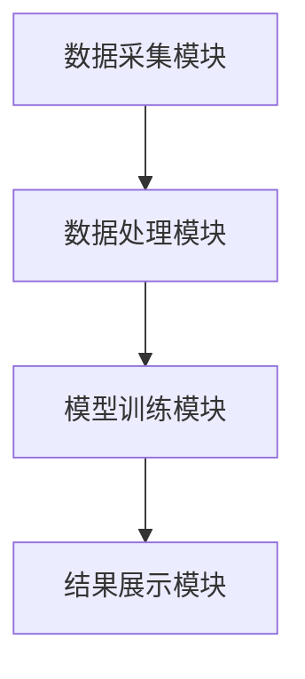
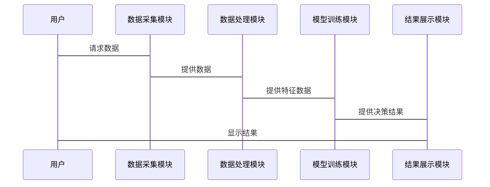

                 


# 智能化战略执行力评估：多智能体AI在价值投资中的新方法

> 关键词：多智能体AI，价值投资，战略执行力，强化学习，系统架构，量化投资，智能协作

> 摘要：本文探讨了多智能体AI在价值投资中的应用，分析了智能化战略执行力评估的新方法。通过详细讲解多智能体AI的核心原理、算法实现和系统架构，结合实际案例，展示了如何利用多智能体AI技术提升投资决策的效率和准确性。本文还探讨了多智能体AI在价值投资中的优势，包括动态优化、风险控制和投资组合优化等方面，并展望了未来的研究方向。

---

# 第1章: 智能化战略与执行力评估概述

## 1.1 智能化战略的背景与意义

### 1.1.1 从传统战略到智能化战略的演进

传统的战略制定和执行依赖于人类的经验和主观判断，这种方式在面对复杂多变的市场环境时往往显得力不从心。随着人工智能技术的快速发展，智能化战略逐渐成为企业优化决策和提升执行效率的重要手段。智能化战略的核心在于利用AI技术分析海量数据，发现潜在的模式和规律，从而为企业提供更精准的决策支持。

### 1.1.2 数字化转型中的战略执行力

在数字化转型的大背景下，企业的战略执行力需要更加注重数据驱动和智能化。通过引入AI技术，企业能够实时监控战略执行的各个环节，快速识别问题并进行调整。智能化战略执行力评估不仅能够量化执行效果，还能通过反馈机制不断优化战略的实施过程。

### 1.1.3 智能化战略的核心特征

智能化战略的核心特征包括数据驱动、实时反馈、动态优化和智能协作。这些特征使得智能化战略能够在复杂多变的环境中保持灵活性和高效性。通过智能化战略，企业能够更好地应对市场变化，提升竞争力。

## 1.2 多智能体AI的基本概念

### 1.2.1 多智能体系统定义

多智能体系统（Multi-Agent System, MAS）是由多个具有自主决策能力的智能体组成的系统。这些智能体能够通过协作和竞争完成复杂的任务。与单智能体系统相比，多智能体系统具有更强的适应性和灵活性。

### 1.2.2 多智能体AI的优势与挑战

多智能体AI的优势在于能够通过智能体之间的协作实现更复杂的任务。例如，在价值投资中，多个智能体可以分别负责市场分析、风险评估和投资组合优化。然而，多智能体系统也面临一些挑战，比如通信开销大、协作效率低和难以处理复杂的博弈关系。

### 1.2.3 多智能体AI与传统AI的对比

传统AI系统通常依赖于中心化的决策机制，而多智能体系统则强调去中心化的协作。这种区别使得多智能体系统更适合处理复杂的分布式任务。

## 1.3 价值投资的核心要素

### 1.3.1 价值投资的基本原理

价值投资是一种以基本面分析为基础的投资策略。投资者通过分析企业的财务状况、行业地位和未来前景，寻找被市场低估的投资标的。价值投资的核心在于发现市场的非理性定价。

### 1.3.2 价值投资的关键指标

价值投资者通常关注市盈率、市净率、股息率等指标。这些指标能够帮助投资者评估企业的内在价值。

### 1.3.3 价值投资的决策过程

价值投资的决策过程包括数据收集、分析、评估和决策。通过分析财务报表、行业趋势和市场情绪，投资者可以做出更加理性的投资决策。

## 1.4 本章小结

本章介绍了智能化战略的背景和意义，详细讲解了多智能体AI的基本概念，分析了多智能体AI与传统AI的区别，并探讨了价值投资的核心要素。这些内容为后续章节的分析奠定了基础。

---

# 第2章: 多智能体AI在价值投资中的应用

## 2.1 多智能体AI的核心原理

### 2.1.1 多智能体协作机制

多智能体协作机制通过智能体之间的通信和协作，实现复杂任务的分解和完成。协作机制的核心在于如何有效分配任务和协调智能体的行为。

### 2.1.2 多智能体决策模型

多智能体决策模型通过分析环境信息和智能体的策略，制定最优的决策方案。决策模型需要考虑智能体的个体目标和全局目标之间的平衡。

### 2.1.3 多智能体学习算法

多智能体学习算法通过智能体之间的互动和学习，逐步优化决策策略。强化学习是一种常用的学习方法，通过奖励机制引导智能体学习最优行为。

## 2.2 多智能体AI在价值投资中的具体应用

### 2.2.1 市场趋势预测

通过多智能体AI，投资者可以实时监控市场趋势，预测市场的波动情况。智能体之间的协作可以提高预测的准确性和及时性。

### 2.2.2 投资组合优化

多智能体AI可以通过分析不同资产的风险和收益，优化投资组合的配置。智能体之间的协作可以实现资产的动态调整，提高投资收益。

### 2.2.3 风险评估与管理

多智能体AI可以实时监控市场的风险因素，评估投资组合的潜在风险。智能体之间的协作可以制定有效的风险管理策略，降低投资风险。

## 2.3 多智能体AI与价值投资的结合优势

### 2.3.1 提高决策效率

多智能体AI通过并行计算和协作，显著提高了决策的效率。智能体可以同时处理大量的数据，缩短决策时间。

### 2.3.2 增强风险控制能力

多智能体AI通过实时监控和分析市场数据，能够快速识别潜在的风险因素。智能体之间的协作可以制定有效的风险管理策略。

### 2.3.3 实现动态优化

多智能体AI可以通过动态调整策略，实现投资组合的优化。智能体之间的协作可以应对市场的变化，保持投资组合的最优配置。

## 2.4 本章小结

本章详细讲解了多智能体AI的核心原理，分析了多智能体AI在价值投资中的具体应用，并探讨了其与价值投资的结合优势。通过多智能体AI，投资者可以实现更高效、更准确的投资决策。

---

# 第3章: 多智能体AI的算法原理与数学模型

## 3.1 多智能体协作算法

### 3.1.1 多智能体协作的基本原理

多智能体协作算法通过智能体之间的通信和协作，实现复杂任务的分解和完成。协作算法的核心在于如何有效分配任务和协调智能体的行为。

### 3.1.2 基于强化学习的多智能体协作

强化学习是一种常用的学习方法，通过奖励机制引导智能体学习最优行为。多智能体强化学习算法需要考虑智能体之间的互动和协作。

### 3.1.3 多智能体协作的数学模型

多智能体协作的数学模型通过描述智能体之间的关系和互动，指导智能体的决策行为。模型通常包括状态空间、动作空间和奖励函数等部分。

## 3.2 多智能体AI的数学模型

### 3.2.1 状态空间定义

状态空间定义了智能体可以感知的信息。例如，在价值投资中，状态空间可以包括市场指数、资产价格和成交量等信息。

### 3.2.2 动作空间定义

动作空间定义了智能体可以执行的操作。例如，在价值投资中，动作空间可以包括买入、卖出和持有等操作。

### 3.2.3 奖励函数设计

奖励函数定义了智能体在特定状态和动作下获得的奖励。例如，在价值投资中，奖励函数可以基于投资收益和风险进行设计。

## 3.3 本章小结

本章详细讲解了多智能体AI的算法原理和数学模型，分析了多智能体协作的基本原理和实现方法。通过数学模型的分析，读者可以更好地理解多智能体AI的核心机制。

---

# 第4章: 智能化战略执行力评估的系统架构

## 4.1 系统功能需求分析

### 4.1.1 数据采集模块

数据采集模块负责收集市场数据、财务数据和新闻数据等。这些数据是智能体进行分析和决策的基础。

### 4.1.2 数据处理模块

数据处理模块负责对采集到的数据进行清洗、转换和特征提取。处理后的数据将作为智能体的输入。

### 4.1.3 模型训练模块

模型训练模块负责训练多智能体AI的决策模型。通过机器学习和深度学习算法，智能体可以学习最优的决策策略。

### 4.1.4 结果展示模块

结果展示模块负责将智能体的决策结果展示给用户。用户可以通过可视化界面查看投资组合的表现和市场趋势。

## 4.2 系统架构设计

### 4.2.1 系统功能设计

系统功能设计包括数据采集、数据处理、模型训练和结果展示等模块。这些模块通过协作实现系统的整体功能。

### 4.2.2 系统架构图

以下是系统的架构图：



### 4.2.3 接口设计

系统接口设计包括数据接口、模型接口和用户接口等。这些接口需要设计合理的API，确保系统的模块化和可扩展性。

### 4.2.4 交互序列图

以下是系统的交互序列图：



## 4.3 本章小结

本章详细分析了智能化战略执行力评估系统的功能需求和架构设计。通过模块化设计和协作机制，系统能够高效地完成数据处理和模型训练，为投资决策提供支持。

---

# 第5章: 项目实战——基于多智能体AI的量化投资系统

## 5.1 环境安装与配置

### 5.1.1 安装Python

安装Python 3.8或更高版本，确保系统兼容性。

### 5.1.2 安装依赖库

安装以下依赖库：

```bash
pip install numpy pandas scikit-learn tensorflow matplotlib
```

## 5.2 核心代码实现

### 5.2.1 数据采集模块

```python
import pandas as pd
import requests

def get_market_data(symbol):
    url = f"https://api.example.com/stock/{symbol}"
    response = requests.get(url)
    data = response.json()
    return pd.DataFrame(data)
```

### 5.2.2 数据处理模块

```python
import numpy as np

def preprocess_data(data):
    data['return'] = np.log(data['close'] / data['open'])
    data['moving_avg'] = data['close'].rolling(5).mean()
    return data
```

### 5.2.3 模型训练模块

```python
import tensorflow as tf
from tensorflow.keras import layers

def build_model(input_shape):
    model = tf.keras.Sequential()
    model.add(layers.LSTM(64, input_shape=input_shape))
    model.add(layers.Dense(1, activation='linear'))
    model.compile(optimizer='adam', loss='mse')
    return model
```

### 5.2.4 结果展示模块

```python
import matplotlib.pyplot as plt

def plot_results(actual, predicted):
    plt.plot(actual, label='Actual')
    plt.plot(predicted, label='Predicted')
    plt.legend()
    plt.show()
```

## 5.3 代码应用解读与分析

### 5.3.1 数据采集模块解读

数据采集模块通过API接口获取股票数据，包括开盘价、收盘价、最高价和最低价等。数据采集模块是整个系统的数据基础，需要确保数据的准确性和及时性。

### 5.3.2 数据处理模块解读

数据处理模块对原始数据进行预处理，包括计算收益率和移动平均值。预处理后的数据将作为模型的输入，提高模型的训练效果。

### 5.3.3 模型训练模块解读

模型训练模块使用LSTM网络训练价格预测模型。通过训练，模型能够预测未来的股票价格走势，为投资决策提供支持。

### 5.3.4 结果展示模块解读

结果展示模块将实际价格和预测价格进行对比，帮助用户直观地了解模型的预测效果。可视化结果有助于用户做出更明智的投资决策。

## 5.4 实际案例分析

### 5.4.1 数据采集与预处理

假设我们选择苹果股票作为案例，使用数据采集模块获取过去一年的股票数据，并进行预处理。

```python
data = get_market_data('AAPL')
processed_data = preprocess_data(data)
```

### 5.4.2 模型训练与评估

使用训练好的模型进行价格预测，并评估模型的预测效果。

```python
model = build_model((processed_data.shape[1], 1))
model.fit(processed_data, epochs=100, batch_size=32)
predicted_prices = model.predict(processed_data)
```

### 5.4.3 结果展示与分析

通过可视化工具展示实际价格和预测价格的对比。

```python
plot_results(processed_data, predicted_prices)
```

## 5.5 项目小结

本章通过实际案例展示了如何利用多智能体AI技术构建量化投资系统。通过数据采集、处理、训练和展示四个模块的协作，系统能够实现股票价格的预测和投资决策的优化。

---

# 第6章: 总结与展望

## 6.1 总结

本文详细探讨了多智能体AI在价值投资中的应用，分析了智能化战略执行力评估的新方法。通过多智能体AI技术，投资者可以实现更高效、更准确的投资决策。系统的模块化设计和协作机制为投资决策提供了有力支持。

## 6.2 未来研究方向

未来的研究可以进一步探索多智能体AI在复杂投资环境中的应用，比如多资产配置、风险管理的动态优化等。此外，如何提高多智能体系统的协作效率和学习能力也是未来研究的重要方向。

## 6.3 最佳实践Tips

- 数据是多智能体AI的核心，确保数据的准确性和完整性。
- 模型训练需要大量的计算资源，建议使用云平台或高性能计算设备。
- 投资决策需要结合市场环境和实际需求，避免过度依赖模型预测。

---

作者：AI天才研究院/AI Genius Institute & 禅与计算机程序设计艺术 /Zen And The Art of Computer Programming

