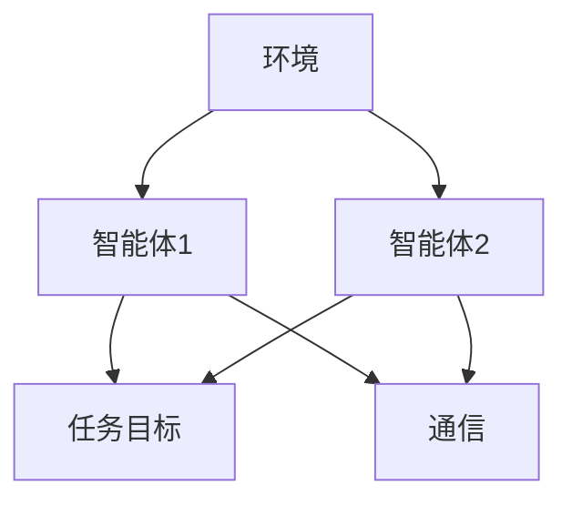
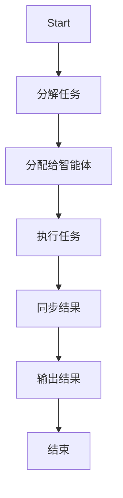
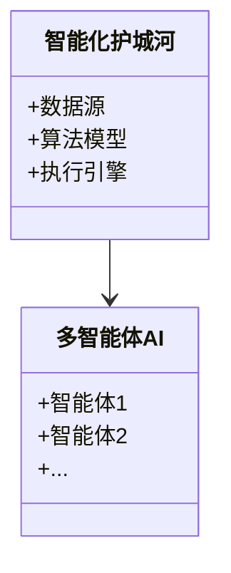
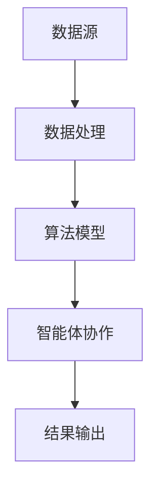

                 


# 智能化护城河持久性评估：多智能体AI的新视角

> 关键词：智能化护城河，多智能体AI，持久性评估，分布式计算，系统架构，数学模型

> 摘要：本文从多智能体AI的新视角，详细探讨了智能化护城河的持久性评估方法。通过分析多智能体系统的组成、算法原理、系统架构和实际案例，提出了基于多智能体协作的护城河评估模型，为企业的智能化发展提供了理论和实践指导。

---

# 第1章: 智能化护城河与多智能体AI概述

## 1.1 智能化护城河的定义与背景

### 1.1.1 什么是智能化护城河
智能化护城河是指企业在技术、数据、算法和生态系统等方面的竞争优势，通过智能化手段构建的长期壁垒。在数字化转型的背景下，智能化护城河不仅是企业核心竞争力的体现，也是抵御竞争对手的关键。

### 1.1.2 智能化护城河的重要性
智能化护城河的重要性体现在以下几个方面：
1. **竞争优势**：通过智能化技术提升产品和服务的附加值。
2. **数据闭环**：构建数据采集、处理、分析和反馈的闭环系统。
3. **生态协同**：形成上下游合作伙伴的协同效应，增强整体竞争力。

### 1.1.3 多智能体AI在护城河中的作用
多智能体AI通过分布式协作和智能决策，帮助企业优化资源分配、提升效率和增强创新能力，从而强化智能化护城河。

## 1.2 多智能体AI的基本概念

### 1.2.1 多智能体系统简介
多智能体系统（Multi-Agent System, MAS）是由多个独立或协作的智能体组成的系统，每个智能体都能感知环境、做出决策并执行任务。

### 1.2.2 多智能体AI的核心特征
| 特征 | 描述 |
|------|------|
| 分布式 | 智能体独立运行，通过通信协作完成任务 |
| 协作性 | 智能体之间通过协调机制实现目标一致 |
| 响应性 | 能够实时感知环境变化并做出反应 |

### 1.2.3 多智能体AI与传统AI的区别
| 方面 | 多智能体AI | 传统AI |
|------|----------|--------|
| 结构 | 分布式 | 集中式 |
| 智能体 | 多个 | 单个 |
| 协作 | 强调协作 | 单点决策 |

---

# 第2章: 多智能体AI的核心概念与联系

## 2.1 多智能体系统的组成与结构

### 2.1.1 智能体的定义与分类
智能体是具有感知、决策和执行能力的实体，分为简单反射型、基于模型的反射型和目标驱动型。

### 2.1.2 多智能体系统的整体架构


### 2.1.3 智能体之间的关系与交互
智能体之间的交互主要通过通信和协作完成，形成任务分配、状态同步和结果反馈的闭环。

## 2.2 多智能体AI与智能化护城河的关系

### 2.2.1 多智能体AI在护城河中的角色
多智能体AI通过分布式协作和智能决策，优化企业资源分配，提升效率和创新能力。

### 2.2.2 护城河持久性评估的多智能体视角
从多智能体视角看，护城河的持久性评估需要考虑智能体的协作效率、数据共享和决策优化。

### 2.2.3 多智能体AI如何增强护城河的持久性
通过分布式计算和协作机制，多智能体AI能够快速响应变化，增强护城河的适应性和持久性。

---

# 第3章: 多智能体AI的算法原理

## 3.1 分布式计算与多智能体协作

### 3.1.1 分布式计算的基本原理
分布式计算将任务分解为多个子任务，分配给不同的智能体执行，通过通信和同步实现目标。

### 3.1.2 多智能体协作的算法流程


### 3.1.3 分布式计算在多智能体AI中的应用
分布式计算通过并行处理和资源优化，提升多智能体协作的效率和性能。

## 3.2 多智能体系统的协调机制

### 3.2.1 协调机制的定义与作用
协调机制是智能体之间通过通信和协作实现目标一致的过程。

### 3.2.2 基于博弈论的协调机制
```latex
$$\text{收益} = \sum_{i=1}^{n} v_i$$
其中，\(v_i\)是智能体i的贡献值。
```

### 3.2.3 协调机制的实现方法
通过任务分配、状态同步和结果反馈，实现智能体之间的高效协作。

---

# 第4章: 智能化护城河评估的系统架构

## 4.1 系统功能设计

### 4.1.1 领域模型设计


### 4.1.2 系统功能模块
系统功能模块包括数据采集、分析、评估和反馈。

## 4.2 系统架构设计

### 4.2.1 系统架构图


### 4.2.2 接口与交互设计
通过API接口实现智能体之间的通信和协作。

---

# 第5章: 项目实战

## 5.1 环境安装与配置

### 5.1.1 环境要求
需要安装Python、Mermaid和相关库。

### 5.1.2 核心代码实现
```python
class Agent:
    def __init__(self, id):
        self.id = id
        self.data = None
    def receive(self, data):
        self.data = data
    def process(self):
        return self.data * 2
    def send(self):
        return self.process()

# 初始化智能体
agents = [Agent(i) for i in range(3)]

# 分配任务
for agent in agents:
    agent.receive(10)

# 执行任务
for agent in agents:
    result = agent.send()
    print(f"Agent {agent.id} 结果：{result}")
```

## 5.2 代码解读与分析
上述代码实现了多智能体的通信和协作，通过数据处理和反馈机制完成任务。

## 5.3 实际案例分析
以电商平台为例，通过多智能体协作实现用户行为分析和推荐系统优化。

## 5.4 项目总结
通过实战，验证了多智能体AI在智能化护城河评估中的应用价值。

---

# 第6章: 最佳实践与总结

## 6.1 最佳实践 tips
1. **模块化设计**：智能体设计应模块化，便于扩展和维护。
2. **通信协议**：选择合适的通信协议，确保高效协作。
3. **容错机制**：设计容错机制，确保系统稳定性。

## 6.2 小结
本文从多智能体AI的新视角，详细探讨了智能化护城河的持久性评估方法，提出了基于多智能体协作的评估模型。

## 6.3 注意事项
- 确保数据安全和隐私保护。
- 定期优化算法模型，适应业务需求变化。

## 6.4 拓展阅读
推荐阅读《多智能体系统》和《人工智能与分布式计算》等书籍。

---

# 作者：AI天才研究院 & 禅与计算机程序设计艺术

