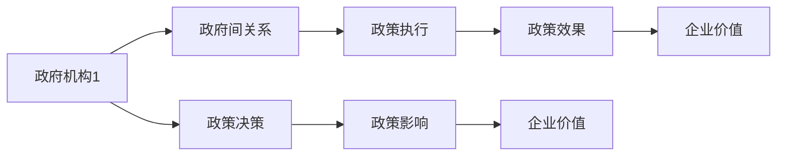
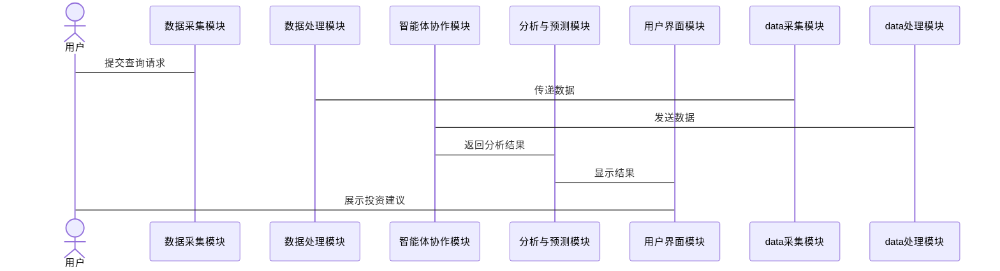

                 


# 智能化政府关系分析：多智能体AI在价值投资中的角色

> 关键词：多智能体AI，政府关系分析，价值投资，智能化决策，博弈论

> 摘要：本文详细探讨了多智能体AI在智能化政府关系分析中的核心作用，特别是其在价值投资中的独特角色。通过分析多智能体AI的基本原理、算法模型、系统架构以及实际应用案例，本文揭示了多智能体AI如何通过协作、博弈和学习等机制，优化政府决策过程并提升投资决策的准确性与效率。文章最后总结了多智能体AI在相关领域的应用前景及挑战。

---

## 第一部分: 智能化政府关系分析的背景与基础

### 第1章: 智能化政府关系分析概述

#### 1.1 政府关系分析的背景与意义
- **政府关系分析**：研究政府机构之间、政府与企业之间、政府与公众之间的互动关系，旨在优化资源配置、提高决策效率并促进社会和谐。
- **智能化政府关系分析的必要性**：传统政府关系分析依赖人工经验，存在效率低、覆盖面有限等问题。智能化分析通过AI技术，能够实时处理海量数据，发现隐性关联，为政府决策提供支持。
- **核心目标与边界**：核心目标是通过AI技术提升政府关系分析的效率和准确性，边界包括数据收集、分析、预测与决策支持。

#### 1.2 多智能体AI的基本概念与特点
- **多智能体系统**：由多个相互作用的智能体组成的系统，每个智能体都有一定的自主性、反应性和协作性。
- **多智能体AI的特点**：
  1. 分布式计算：智能体独立运行，通过通信进行协作。
  2. 协作与竞争：智能体之间既有协作也有竞争，模拟真实世界的关系动态。
  3. 自适应性：能够根据环境变化动态调整行为。

#### 1.3 价值投资的基本原理
- **价值投资**：基于对公司内在价值的评估，寻找市场价格低于内在价值的投资机会。
- **价值投资的核心要素**：公司基本面分析（财务状况、盈利能力）、行业地位、管理团队、市场环境等。
- **政府关系与价值投资的结合**：政府政策直接影响企业经营环境，通过分析政府关系，投资者可以更准确地评估企业的潜在价值。

---

### 第2章: 多智能体AI在政府关系分析中的核心作用

#### 2.1 多智能体AI在政府关系分析中的应用场景
- **政策分析与预测**：通过分析历史政策数据，预测未来政策走向，为企业投资提供参考。
- **政府间关系的动态建模**：模拟政府机构之间的互动，预测政策执行中的潜在冲突与合作机会。
- **政府决策过程的优化**：通过多智能体协作，优化决策流程，提高决策效率。

#### 2.2 多智能体AI在价值投资中的角色
- **信息处理需求**：多智能体AI能够实时处理海量信息，识别潜在投资机会。
- **价值评估中的应用**：通过多智能体协作，分析企业与政府的关系，评估政府政策对企业价值的影响。
- **投资决策的支持**：基于多智能体AI的分析结果，投资者可以做出更精准的投资决策。

---

## 第二部分: 多智能体AI的核心概念与联系

### 第3章: 多智能体AI的核心概念与联系

#### 3.1 多智能体AI的核心概念
- **实体关系与交互机制**：智能体之间的关系包括协作、竞争和中立，交互机制包括信息共享、任务分配和冲突解决。
- **协作与竞争关系**：在政府关系分析中，智能体可能代表不同的政府机构或利益相关者，它们之间既有协作也有竞争。
- **知识共享与信息整合**：多智能体AI通过知识共享，整合不同智能体的信息，形成全面的分析结果。

#### 3.2 核心概念属性特征对比表
| 智能体类型 | 独立性 | 协作性 | 竞争性 | 信息共享 |
|------------|--------|--------|--------|----------|
| 单智能体    | 高     | 低     | 低     | 无       |
| 多智能体    | 中     | 高     | 高     | 高       |

#### 3.3 ER实体关系图


---

## 第三部分: 多智能体AI的算法原理

### 第4章: 多智能体AI的算法原理

#### 4.1 多智能体AI的算法概述
- **多智能体协作算法**：通过协作机制，智能体共同完成复杂任务。
- **多智能体博弈算法**：模拟智能体之间的博弈过程，预测最优决策。
- **多智能体学习算法**：通过学习，智能体不断提升自身的决策能力。

#### 4.2 多智能体协作算法的数学模型
$$ V = \sum_{i=1}^{n} v_i $$
其中，$v_i$ 表示第i个智能体的贡献值。

#### 4.3 多智能体博弈算法的数学模型
$$ U_i = \sum_{j=1}^{m} u_{ij} $$
其中，$u_{ij}$ 表示智能体i与智能体j之间的互动收益。

---

## 第四部分: 系统架构与项目实战

### 第5章: 系统架构设计与项目实战

#### 5.1 项目介绍
- **项目背景**：本项目旨在利用多智能体AI技术，构建智能化政府关系分析系统，支持价值投资决策。
- **系统功能设计**：
  1. 数据采集模块：收集政府政策、企业信息等数据。
  2. 智能体协作模块：实现多智能体协作与博弈。
  3. 分析与预测模块：生成政策分析报告和投资建议。

#### 5.2 系统架构设计


#### 5.3 系统交互流程


#### 5.4 核心代码实现
```python
class MultiAgentSystem:
    def __init__(self, agents):
        self.agents = agents  # 列表，包含多个智能体

    def collaborate(self, task):
        # 协作过程，每个智能体贡献部分解决方案
        solutions = []
        for agent in self.agents:
            solutions.append(agent.solve_task(task))
        return solutions

    def predict_policy_impact(self, policy):
        # 预测政策影响，通过博弈模型计算
        impact = 0
        for agent in self.agents:
            impact += agent.predict_impact(policy)
        return impact / len(self.agents)
```

#### 5.5 实际案例分析
- **案例背景**：某地方政府出台新政策，可能影响当地企业的投资价值。
- **分析过程**：
  1. 数据采集模块收集政策信息和企业数据。
  2. 智能体协作模块分析政策对企业的影响。
  3. 分析与预测模块生成投资建议，供投资者参考。

---

## 第五部分: 总结与展望

### 第6章: 总结与展望

#### 6.1 总结
- 多智能体AI在智能化政府关系分析和价值投资中具有重要地位。
- 通过协作、博弈和学习，多智能体AI能够优化政府决策并提升投资效率。

#### 6.2 展望
- **技术进步**：随着AI技术的发展，多智能体系统将更加智能化和高效。
- **应用拓展**：多智能体AI在更多领域（如金融、医疗、教育）的应用将逐步展开。
- **挑战与建议**：未来需要解决数据隐私、算法优化等问题，推动多智能体AI的广泛应用。

---

## 作者

作者：AI天才研究院/AI Genius Institute & 禅与计算机程序设计艺术 /Zen And The Art of Computer Programming

