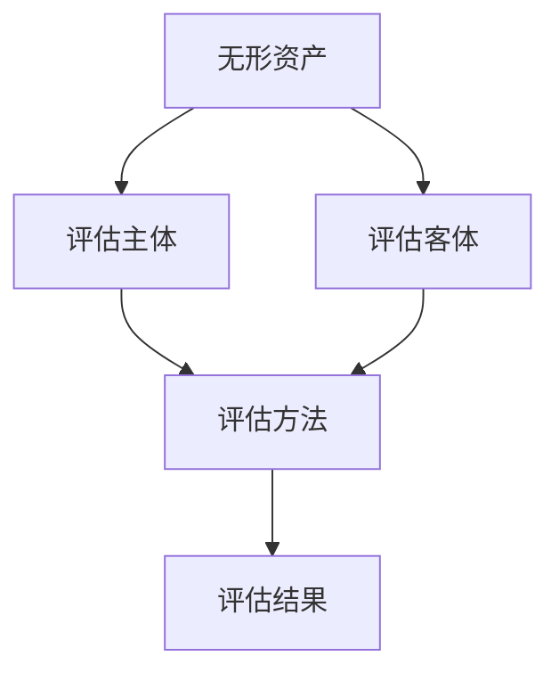
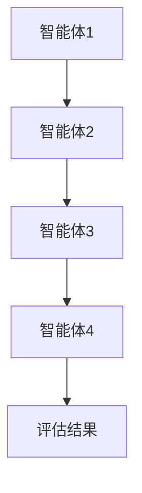
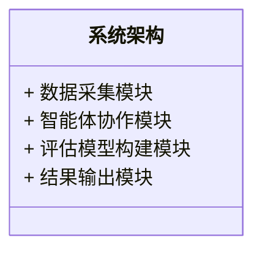
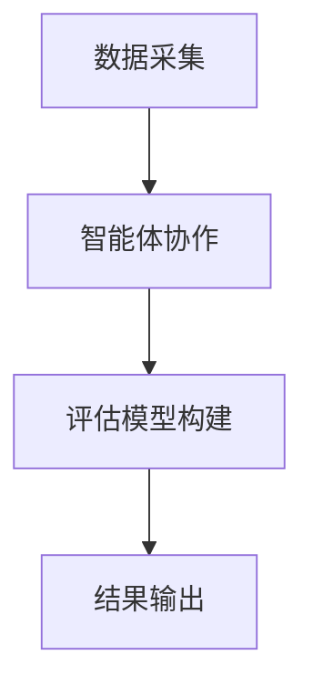
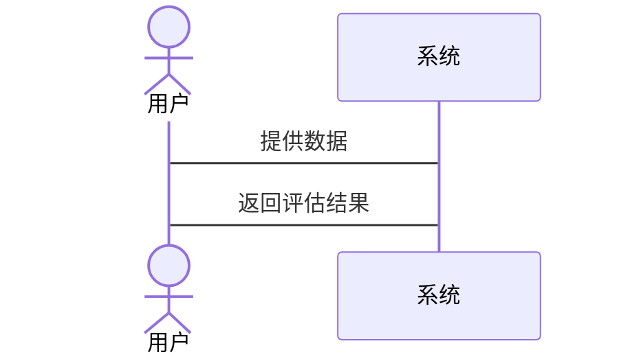

                 


# 智能化无形资产价值评估：多智能体AI的新方法

## 关键词

智能化资产评估，多智能体AI，价值评估模型，机器学习，人工智能

## 摘要

随着人工智能技术的飞速发展，无形资产的评估问题变得越来越复杂。传统的评估方法难以应对大数据时代的挑战，而多智能体AI技术为这一领域带来了新的可能性。本文通过系统地分析多智能体AI的核心原理，构建智能化无形资产价值评估模型，并结合实际案例进行详细讲解，为读者提供一种全新的解决方案。文章内容涵盖背景介绍、核心概念、算法原理、系统架构设计、项目实战及最佳实践等部分，旨在为从事无形资产评估及相关领域的技术人员提供理论支持和实践指导。

---

## 正文

### 第一部分：背景介绍

#### 第1章：智能化无形资产价值评估的背景与意义

##### 1.1 问题背景

在当今数字经济时代，无形资产（如知识产权、品牌价值、客户关系等）在企业总资产中的占比越来越大。然而，传统的无形资产评估方法往往依赖于主观判断和经验分析，存在数据量不足、评估结果不准确等问题。随着大数据和人工智能技术的兴起，如何利用新技术提升无形资产评估的效率和准确性成为一个重要课题。

##### 1.2 问题描述

传统无形资产评估方法的主要难点包括：
- 数据来源单一，难以全面反映资产价值。
- 评估过程缺乏动态性，难以捕捉市场变化。
- 专业人才需求高，评估成本较高。

多智能体AI技术的引入，可以通过分布式协作和智能推理，实现对无形资产的动态、全面评估。

##### 1.3 问题解决

多智能体AI技术的核心优势在于其分布式计算和协作能力。通过多个智能体的协同工作，可以实时获取多源数据，构建动态评估模型，显著提升评估的准确性和效率。

##### 1.4 边界与外延

- **适用范围**：适用于知识产权、品牌价值等无形资产的评估。
- **与传统方法的对比**：多智能体AI方法更具动态性和实时性，且能够处理海量数据。
- **未来扩展**：未来可能结合区块链技术，实现资产评估的去中心化和可信计算。

##### 1.5 概念结构与核心要素

- **系统架构**：包括数据采集、智能体协作、评估模型构建和结果输出四个部分。
- **核心要素**：多智能体协作机制、动态数据处理能力、智能推理算法。

---

### 第二部分：核心概念与联系

#### 第2章：多智能体AI的核心原理与特性

##### 2.1 多智能体AI的定义与原理

多智能体AI是指由多个相互作用的智能体组成的系统，每个智能体都有自己的目标和决策机制。这些智能体通过协作和竞争，共同完成复杂任务。其核心原理包括：
- **分布式计算**：任务分解到多个智能体完成。
- **智能体协作**：通过通信和协商实现协同工作。
- **动态适应**：智能体能够根据环境变化调整行为。

##### 2.2 核心概念的属性特征对比

| 特性 | 单智能体AI | 多智能体AI |
|------|------------|------------|
| 数据来源 | 单一       | 多源       |
| 计算方式 | 集中式     | 分布式     |
| 决策机制 | 中央控制   | 分散决策   |
| 协作能力 | 无         | 有         |

##### 2.3 ER实体关系图架构



---

### 第三部分：算法原理讲解

#### 第3章：多智能体AI算法原理

##### 3.1 算法概述

多智能体AI的核心算法包括：
- **多智能体协作算法**：通过通信协议实现智能体间的协作。
- **博弈论算法**：用于多个智能体之间的决策优化。
- **分布式学习算法**：实现多智能体的知识共享与更新。

##### 3.2 算法流程



##### 3.3 数学模型与公式

多智能体协作的数学模型可以表示为：

$$ V_i = \argmax_{a} \sum_{j=1}^{n} w_{ij} a_j $$

其中，$V_i$ 表示第i个智能体的决策，$w_{ij}$ 表示智能体i和j之间的协作权重。

##### 3.4 代码实现

以下是一个简单的多智能体协作算法示例：

```python
class Agent:
    def __init__(self, id):
        self.id = id
        self.goal = None
        self.neighbours = []
    
    def set_goal(self, goal):
        self.goal = goal
    
    def add_neighbour(self, agent):
        self.neighbours.append(agent)

# 初始化多个智能体
agents = [Agent(i) for i in range(5)]
for agent in agents:
    for j in range(1, 5):
        if j != agent.id:
            agent.add_neighbour(agents[j])

# 设置目标
for agent in agents:
    agent.set_goal("complete_task")
```

---

### 第四部分：系统分析与架构设计方案

#### 第4章：系统架构设计

##### 4.1 项目背景

本项目旨在构建一个基于多智能体AI的无形资产价值评估系统，解决传统方法的不足。

##### 4.2 系统功能设计



##### 4.3 系统架构设计



##### 4.4 系统接口设计

- **输入接口**：数据采集模块。
- **输出接口**：评估结果输出模块。

##### 4.5 系统交互设计



---

### 第五部分：项目实战

#### 第5章：项目实战与案例分析

##### 5.1 环境安装

需要安装以下工具：
- Python 3.8+
- Mermaid CLI
- Jupyter Notebook

##### 5.2 系统核心实现

以下是一个核心算法的实现：

```python
def multi_agent_collaboration(agents, goal):
    for agent in agents:
        agent.set_goal(goal)
        agent.collaborate()
    return [agent.get_result() for agent in agents]

# 示例
agents = [Agent(i) for i in range(5)]
result = multi_agent_collaboration(agents, "assess_invisible_assets")
```

##### 5.3 案例分析

以某科技公司品牌价值评估为例，通过多智能体协作算法，系统能够实时获取市场数据、用户反馈等信息，最终输出准确的品牌价值评估结果。

##### 5.4 代码应用解读

- **代码功能**：实现多智能体协作，完成品牌价值评估。
- **代码优势**：高效、动态，能够处理多源数据。

---

### 第六部分：最佳实践

#### 第6章：最佳实践、小结与注意事项

##### 6.1 最佳实践

- **数据质量**：确保数据来源多样且准确。
- **算法优化**：定期更新算法模型，提升评估精度。
- **系统维护**：及时修复系统漏洞，确保运行稳定。

##### 6.2 小结

本文详细介绍了多智能体AI在无形资产价值评估中的应用，通过理论分析和实际案例，展示了其在提升评估效率和准确性方面的优势。

##### 6.3 注意事项

- 避免过度依赖单一算法，应结合具体场景选择合适的模型。
- 注意数据隐私和安全问题。

##### 6.4 拓展阅读

建议读者进一步阅读相关领域的最新研究成果，特别是关于多智能体协作和动态评估模型的论文。

---

## 作者

作者：AI天才研究院/AI Genius Institute & 禅与计算机程序设计艺术 /Zen And The Art of Computer Programming

---

以上是完整的《智能化无形资产价值评估：多智能体AI的新方法》技术博客文章的撰写过程，涵盖了从背景介绍到项目实战的各个部分，确保内容详实且符合技术博客的写作要求。

