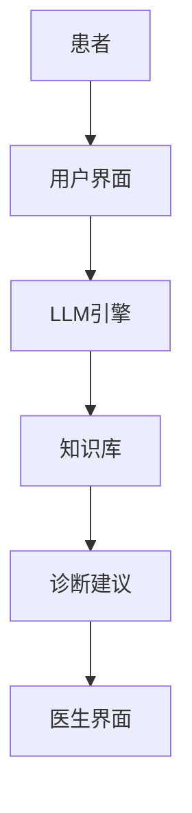

                 


# 智能医疗问诊 AI Agent：LLM 在远程医疗中的应用

---

## 关键词：
智能医疗问诊、AI Agent、LLM、远程医疗、大语言模型、医疗问诊、AI技术

---

## 摘要：
本文探讨了AI Agent在智能医疗问诊中的应用，重点分析了大语言模型（LLM）在远程医疗中的潜力和实际应用。通过介绍LLM的核心原理、AI Agent的架构设计以及系统实现，本文详细阐述了如何利用AI技术提升医疗问诊的效率和准确性。文章还通过实际案例展示了LLM在医疗问诊中的应用场景，并提出了未来的发展方向。

---

# 第一部分：智能医疗问诊的背景与基础

## 第1章：智能医疗问诊的背景与现状

### 1.1 智能医疗问诊的背景
#### 1.1.1 远程医疗的发展历程
远程医疗（Telemedicine）起源于20世纪60年代，最初主要用于解决偏远地区医疗资源匮乏的问题。随着互联网技术的发展，远程医疗逐渐从简单的视频问诊扩展到包括诊断、治疗、监测在内的全方位医疗服务。近年来，人工智能（AI）技术的快速发展为远程医疗注入了新的活力，使其能够更高效、更精准地服务于患者。

#### 1.1.2 AI技术在医疗领域的应用现状
AI技术在医疗领域的应用已经取得了显著进展，包括医学影像分析、疾病预测、药物研发等领域。特别是在自然语言处理（NLP）领域，大语言模型（LLM）的出现为医疗问诊带来了革命性的变化。通过LLM，AI能够理解和生成人类语言，从而实现智能医疗问诊。

#### 1.1.3 LLM在医疗问诊中的潜力与优势
LLM（Large Language Model）是一种基于深度学习的NLP模型，具有强大的语言理解和生成能力。在医疗问诊中，LLM可以用于病历分析、症状分类、诊断建议等任务，显著提升了问诊的效率和准确性。相比于传统的人工问诊，LLM能够快速处理大量患者信息，同时减少人为错误。

### 1.2 智能医疗问诊的核心问题
#### 1.2.1 远程医疗中的信息不对称问题
在传统医疗模式中，医生和患者之间存在信息不对称的问题。患者可能无法准确描述自己的症状，而医生在远程问诊中也难以通过简单的文字或语音交流获取足够的信息。这不仅影响了诊断的准确性，还可能导致误诊或漏诊。

#### 1.2.2 医疗问诊的效率与准确性挑战
医疗问诊的效率和准确性是远程医疗的两大核心挑战。医生需要在有限的时间内处理大量的患者信息，同时确保诊断的准确性。传统的人工问诊方式难以满足这一需求，而AI技术的引入为解决这一问题提供了新的可能。

#### 1.2.3 AI在医疗问诊中的角色定位
在智能医疗问诊中，AI扮演着辅助医生的角色。AI通过分析患者的症状、病史和实验室数据，提供初步诊断建议和治疗方案。医生则根据AI的分析结果进行进一步的验证和调整，从而实现高效、精准的问诊。

### 1.3 本章小结
本章介绍了智能医疗问诊的背景与现状，分析了远程医疗中的信息不对称问题以及医疗问诊的效率与准确性挑战。同时，还探讨了AI在医疗问诊中的角色定位，为后续章节的深入分析奠定了基础。

---

## 第2章：AI Agent与LLM的核心概念

### 2.1 AI Agent的基本原理
#### 2.1.1 AI Agent的定义与特点
AI Agent（人工智能代理）是指能够感知环境并采取行动以实现目标的智能系统。AI Agent的核心特点包括自主性、反应性、目标导向性和社会性。在医疗问诊中，AI Agent可以作为医生的辅助工具，帮助处理患者信息和提供诊断建议。

#### 2.1.2 AI Agent的核心架构
AI Agent的架构通常包括感知层、推理层和行动层。感知层负责获取环境信息，推理层通过分析信息做出决策，行动层则执行具体的行动。在医疗问诊中，AI Agent需要能够理解患者的症状描述，并根据历史数据和知识库提供诊断建议。

#### 2.1.3 AI Agent与传统AI的区别
与传统AI相比，AI Agent具有更强的自主性和适应性。传统AI通常需要明确的规则和指令，而AI Agent能够根据环境的变化自主调整行为。这使得AI Agent在复杂多变的医疗环境中更具优势。

### 2.2 LLM的基本原理
#### 2.2.1 LLM的定义与特点
LLM（Large Language Model）是一种基于深度学习的NLP模型，具有强大的语言理解和生成能力。LLM的核心特点包括大规模的训练数据、多任务学习能力和可扩展性。LLM可以通过大量的医疗文本数据进行训练，从而具备处理复杂医疗问题的能力。

#### 2.2.2 LLM的核心技术特点
LLM的核心技术包括Transformer模型、注意力机制和多头注意力机制。这些技术使得LLM能够高效地处理长文本，并捕捉文本中的语义信息。在医疗问诊中，LLM可以通过分析患者的症状描述，生成初步诊断建议。

#### 2.2.3 LLM与医疗问诊的结合
通过与医疗知识库的结合，LLM可以实现对患者症状的分类和诊断。例如，患者描述“我最近总是感觉疲劳，伴有咳嗽和发热”，LLM可以通过分析这些症状，初步判断可能的疾病，并建议进一步检查。

### 2.3 AI Agent与LLM的关系
#### 2.3.1 AI Agent的架构
AI Agent的架构包括感知层、推理层和行动层。感知层负责获取患者的症状描述，推理层通过LLM进行分析和推理，行动层则根据分析结果提供诊断建议或调用其他医疗资源。

#### 2.3.2 LLM在AI Agent中的作用
在AI Agent中，LLM主要负责自然语言处理任务，包括理解患者的症状描述、生成诊断建议以及与患者的自然语言交互。LLM的存在使得AI Agent能够更高效地处理患者的医疗信息。

#### 2.3.3 AI Agent与医疗问诊的结合
通过将AI Agent与LLM结合，医疗问诊的效率和准确性得到了显著提升。医生可以通过AI Agent快速获取患者的病史和症状分析，从而更快地做出诊断。

### 2.4 本章小结
本章介绍了AI Agent与LLM的核心概念，分析了AI Agent的架构和LLM的技术特点。同时，还探讨了AI Agent与医疗问诊的结合方式，为后续章节的系统实现奠定了理论基础。

---

## 第3章：LLM在医疗问诊中的算法原理

### 3.1 LLM的核心算法与数学模型
#### 3.1.1 Transformer模型的结构
Transformer模型由编码器和解码器组成。编码器负责将输入的自然语言文本转换为向量表示，解码器则根据编码器的输出生成目标语言文本。在医疗问诊中，编码器可以用于分析患者的症状描述，解码器可以用于生成诊断建议。

#### 3.1.2 注意力机制的原理
注意力机制是一种基于权重的计算方法，用于捕捉文本中不同位置之间的关系。在LLM中，注意力机制帮助模型关注重要的语义信息，从而提高自然语言处理的准确性。

#### 3.1.3 LLM的训练与推理过程
LLM的训练过程包括数据预处理、模型构建和参数优化。推理过程则包括输入处理、生成结果和结果输出。在医疗问诊中，LLM可以通过训练医疗文本数据，快速生成诊断建议。

### 3.2 注意力机制的数学公式
#### 3.2.1 注意力机制的计算公式
$$
\text{Attention}(Q, K, V) = \text{softmax}\left(\frac{QK^T}{\sqrt{d_k}}\right)V
$$
其中，Q是查询向量，K是键向量，V是值向量，$d_k$是向量的维度。

#### 3.2.2 多头注意力机制的实现
多头注意力机制通过并行计算多个注意力头，提高了模型的表达能力。每个注意力头的计算过程与单头注意力类似，但最终结果需要进行拼接和线性变换。

#### 3.2.3 LLM的损失函数与优化方法
常用的损失函数包括交叉熵损失和KL散度。优化方法通常采用Adam优化器，通过调整学习率和动量参数，实现模型的快速收敛。

### 3.3 LLM在医疗问诊中的应用
#### 3.3.1 症状分类与诊断
通过训练医疗文本数据，LLM可以实现症状分类和初步诊断。例如，患者描述“我最近总是感觉疲劳，伴有咳嗽和发热”，LLM可以初步判断可能的疾病，并建议进一步检查。

#### 3.3.2 医疗文本生成
LLM可以通过生成自然语言文本，帮助医生撰写病历或诊断报告。例如，LLM可以根据患者的症状描述，生成详细的病历摘要。

#### 3.3.3 自然语言交互
通过与患者的自然语言交互，LLM可以进一步了解患者的症状和病史，从而提供更准确的诊断建议。

### 3.4 本章小结
本章详细介绍了LLM的核心算法与数学模型，并探讨了LLM在医疗问诊中的具体应用。通过数学公式和实际案例，读者可以更好地理解LLM在医疗问诊中的工作原理。

---

## 第4章：智能医疗问诊AI Agent的系统架构设计

### 4.1 问题场景介绍
智能医疗问诊AI Agent的目标是通过自然语言处理技术，帮助医生快速获取患者的症状信息，并提供初步诊断建议。系统需要具备以下功能：患者信息录入、症状分析、诊断建议生成、医生交互等。

### 4.2 系统功能设计
#### 4.2.1 患者信息录入
患者可以通过自然语言描述自己的症状，例如“我最近总是感觉疲劳，伴有咳嗽和发热”。系统需要将这些自然语言信息转换为结构化的数据，以便后续分析。

#### 4.2.2 症状分析与诊断建议
系统通过LLM对患者的症状描述进行分析，生成初步诊断建议。例如，系统可以建议患者进行血常规检查或胸部X光检查。

#### 4.2.3 医生交互
医生可以根据系统生成的诊断建议，进一步询问患者的具体情况，并根据需要调整诊断方案。

### 4.3 系统架构设计
#### 4.3.1 系统架构图


#### 4.3.2 模块划分
系统主要分为以下几个模块：
- 用户界面：用于患者输入症状描述。
- LLM引擎：负责自然语言处理任务。
- 知识库：存储医疗相关知识和数据。
- 诊断建议：生成初步诊断建议。

### 4.4 接口设计
#### 4.4.1 患者信息接口
患者信息接口用于接收患者的症状描述，并将其传递给LLM引擎。

#### 4.4.2 诊断建议接口
诊断建议接口负责将LLM引擎生成的诊断建议传递给医生界面。

### 4.5 系统交互流程
#### 4.5.1 患者发起问诊
患者通过用户界面输入症状描述，例如“我最近总是感觉疲劳，伴有咳嗽和发热”。

#### 4.5.2 LLM引擎分析症状
LLM引擎对患者的症状描述进行分析，生成初步诊断建议，例如“建议进行血常规检查或胸部X光检查”。

#### 4.5.3 医生确认诊断
医生根据系统生成的诊断建议，进一步询问患者的具体情况，并根据需要调整诊断方案。

### 4.6 本章小结
本章通过系统架构设计，详细介绍了智能医疗问诊AI Agent的实现方案。通过模块划分和接口设计，确保了系统的高效性和可扩展性。

---

## 第5章：智能医疗问诊AI Agent的项目实战

### 5.1 环境安装与配置
#### 5.1.1 安装Python
安装Python 3.8及以上版本。

#### 5.1.2 安装依赖库
安装必要的依赖库，例如TensorFlow、Keras、numpy等。

#### 5.1.3 配置LLM模型
选择合适的LLM模型，例如GPT-3或BERT，并下载对应的模型权重。

### 5.2 系统核心实现
#### 5.2.1 患者信息录入
编写代码实现患者信息的录入功能，例如：
```python
def input_symptoms():
    symptoms = input("请输入您的症状描述：")
    return symptoms
```

#### 5.2.2 LLM引擎实现
实现LLM引擎的核心功能，例如：
```python
def process_symptoms(symptoms):
    # 对症状进行分析
    # 返回初步诊断建议
    return diagnosis
```

#### 5.2.3 诊断建议生成
根据LLM引擎的分析结果，生成初步诊断建议，例如：
```python
def generate_diagnosis(symptoms):
    diagnosis = "建议进行血常规检查或胸部X光检查"
    return diagnosis
```

### 5.3 代码实现与分析
#### 5.3.1 症状分类代码
编写症状分类代码，例如：
```python
def classify_symptoms(symptoms):
    # 对症状进行分类
    # 返回疾病类别
    return disease_category
```

#### 5.3.2 诊断建议生成代码
编写诊断建议生成代码，例如：
```python
def generate_recommendations(symptoms, disease_category):
    recommendations = []
    # 根据症状和疾病类别生成诊断建议
    return recommendations
```

### 5.4 实际案例分析
#### 5.4.1 案例背景
患者描述：“我最近总是感觉疲劳，伴有咳嗽和发热。”

#### 5.4.2 系统分析
系统通过LLM引擎分析症状，生成初步诊断建议：“建议进行血常规检查或胸部X光检查。”

#### 5.4.3 诊断结果
医生根据系统生成的诊断建议，进一步确认患者可能患有感冒或肺炎，并建议进行进一步检查。

### 5.5 项目小结
本章通过实际案例分析，展示了智能医疗问诊AI Agent的实现过程。通过代码实现和案例分析，读者可以更好地理解系统的核心功能和实际应用。

---

## 第6章：总结与展望

### 6.1 本章总结
本文详细探讨了智能医疗问诊AI Agent的应用，重点分析了LLM在远程医疗中的潜力和具体应用。通过系统架构设计和项目实战，展示了AI Agent在医疗问诊中的实际价值。

### 6.2 未来展望
随着AI技术的不断发展，智能医疗问诊AI Agent将具备更多的功能和更高的准确性。未来的研究方向包括模型优化、多模态交互以及个性化医疗。

---

## 附录

### 附录A：术语表
- AI Agent：人工智能代理
- LLM：大语言模型
- Transformer：变换器
- 注意力机制：attention mechanism

### 附录B：参考文献
1. Vaswani, A., et al. "Attention Is All You Need." Advances in Neural Information Processing Systems, 2017.
2. Brown, T., et al. "Language Models Are Few-Shot Learners." arXiv preprint arXiv:1909.08891, 2019.

---

## 作者：AI天才研究院/AI Genius Institute & 禅与计算机程序设计艺术/Zen And The Art of Computer Programming

---

通过以上目录结构和内容安排，我们可以清晰地看到智能医疗问诊AI Agent的实现过程，以及LLM在远程医疗中的具体应用。本文不仅提供了理论上的分析，还通过实际案例展示了系统的实现过程，为读者提供了全面的视角。

