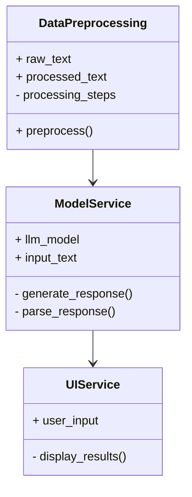
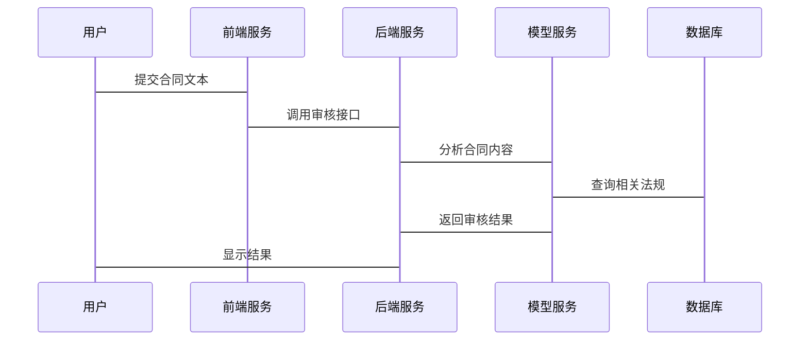

                 


# 智能合同审核 AI Agent：LLM 在法律文件处理中的应用

> 关键词：智能合同审核、LLM、AI Agent、法律文件处理、自然语言处理、大语言模型

> 摘要：本文详细探讨了智能合同审核 AI Agent 的设计与实现，特别是大语言模型（LLM）在法律文件处理中的应用。文章从背景介绍、核心概念、算法原理、系统架构到项目实战，全面解析了如何利用LLM技术提升合同审核的效率与准确性。通过具体的代码实现和案例分析，展示了如何构建一个高效可靠的智能合同审核系统。

---

## 第3章: LLM的算法原理

### 3.1 大语言模型的基本原理

#### 3.1.1 变压器模型的结构
大语言模型（LLM）基于Transformer架构，由编码器（Encoder）和解码器（Decoder）组成。编码器负责将输入文本转换为上下文向量，解码器则根据这些向量生成输出文本。其核心组件包括位置编码（Positional Encoding）、多层感知机（FFN）和自注意力机制（Self-Attention）。

#### 3.1.2 变压器模型的数学公式
以下是Transformer模型中自注意力机制的数学表达：

$$
\text{Self-Attention}(Q, K, V) = \text{softmax}\left( \frac{QK^T}{\sqrt{d_k}} \right)V
$$

其中，$Q$、$K$、$V$分别为查询、键和值矩阵，$d_k$为键的维度。

#### 3.1.3 LLM的训练与微调
LLM的训练采用预训练策略，使用大规模通用文本数据进行无监督学习。在法律领域应用时，需要对模型进行微调（Fine-tuning），以适应特定的法律文本风格和术语。

### 3.2 LLM在合同审核中的具体应用

#### 3.2.1 合同条款识别
通过LLM分析合同文本，识别关键条款（如违约责任、履行期限）并提取其位置信息。例如：

1. 输入：一段合同文本。
2. 输出：提取的关键词汇和位置标记。

#### 3.2.2 合同合规性评估
LLM可以对比合同内容与相关法律法规，评估其合规性。例如，检查合同中的担保条款是否符合《民法典》的相关规定。

#### 3.2.3 自然语言生成与改写
LLM可以辅助生成合同模板或对合同条款进行改写，以优化表达。例如：

1. 输入：用户提供的合同初稿。
2. 输出：优化后的合同文本，带有注释说明。

### 3.3 实际案例分析

#### 3.3.1 合同条款识别的实现
以下是一个简单的Python代码示例，用于识别合同中的违约责任条款：

```python
import re

def extract_clause(text, keyword):
    pattern = re.compile(r'.*?\b' + re.escape(keyword) + r'\b.*?', re.DOTALL)
    matches = pattern.findall(text)
    return matches

text = "违约责任：如一方违约，应支付违约金。"
keyword = "违约责任"
result = extract_clause(text, keyword)
print(result)
```

#### 3.3.2 合同合规性评估的流程
1. **数据准备**：收集相关法律法规文本。
2. **模型训练**：对LLM进行微调，使其熟悉法律条款。
3. **评估执行**：将合同文本输入模型，生成合规性报告。

#### 3.3.3 自然语言生成的代码示例
以下代码使用LLM生成合同条款：

```python
from transformers import pipeline

model_name = "gpt2"
nlp = pipeline('text-generation', model=model_name)

prompt = "请根据以下内容生成合同条款：\n1. 当事人：甲乙双方。\n2. 履行期限：30天。"
result = nlp(prompt)
print(result)
```

---

## 第4章: 系统分析与架构设计

### 4.1 系统功能设计

#### 4.1.1 系统目标
构建一个智能合同审核系统，实现合同条款识别、合规性评估和自然语言生成功能。

#### 4.1.2 系统功能模块
- **数据预处理模块**：清洗和标注合同文本。
- **模型服务模块**：负责LLM的调用和结果解析。
- **用户界面模块**：提供友好的操作界面。

#### 4.1.3 系统功能的Mermaid类图


### 4.2 系统架构设计

#### 4.2.1 系统架构的Mermaid图
```mermaid
archi
    系统架构图
    前端服务 <--API--> 后端服务
    后端服务 <--Model--> 模型服务
    模型服务 <--DB--> 数据库
    数据库 <--Data--> 数据预处理模块
```

#### 4.2.2 接口设计
- **输入接口**：接收合同文本和审核请求。
- **输出接口**：返回审核结果和建议。

#### 4.2.3 交互流程的Mermaid序列图


---

## 第5章: 项目实战

### 5.1 环境安装

#### 5.1.1 安装Python环境
使用Anaconda或virtualenv创建独立的Python环境。

```bash
conda create -n contract_review python=3.8
conda activate contract_review
```

#### 5.1.2 安装依赖库
安装必要的深度学习库：

```bash
pip install transformers tensorflow keras
```

### 5.2 核心代码实现

#### 5.2.1 数据预处理
```python
import pandas as pd

def preprocess_data(file_path):
    df = pd.read_csv(file_path)
    df['text'] = df['text'].apply(lambda x: x.strip())
    return df

preprocessed_data = preprocess_data('contracts.csv')
preprocessed_data.to_csv('processed_contracts.csv', index=False)
```

#### 5.2.2 模型训练与微调
```python
from transformers import AutoTokenizer, AutoModelForMaskedLM

tokenizer = AutoTokenizer.from_pretrained('roberta-base')
model = AutoModelForMaskedLM.from_pretrained('roberta-base')
model.save_pretrained('fine_tuned_model')
```

#### 5.2.3 API接口开发
```python
from flask import Flask, request, jsonify
import torch
import torch.nn as nn

app = Flask(__name__)

@app.route('/review', methods=['POST'])
def review_contract():
    data = request.json
    text = data['text']
    # 调用模型进行审核
    result = model_service(review_text=text)
    return jsonify({'status': 'success', 'result': result})

if __name__ == '__main__':
    app.run(debug=True)
```

### 5.3 实际案例分析

#### 5.3.1 案例背景
某企业需要审核一批商业合同，希望利用AI提高效率和准确性。

#### 5.3.2 数据准备
收集并清洗500份商业合同文本，涵盖销售、采购、服务等多种类型。

#### 5.3.3 模型训练
使用 roberta-base 模型进行微调，训练数据包括合同文本和标注结果。

#### 5.3.4 API部署
将训练好的模型部署为RESTful API，供前端调用。

#### 5.3.5 测试与优化
测试API的响应时间和准确性，优化模型参数以提高性能。

### 5.4 项目小结

通过本项目，我们成功构建了一个基于LLM的智能合同审核系统，实现了高效的合同条款识别和合规性评估。在实际应用中，该系统显著提高了审核效率，减少了人为错误。

---

## 第6章: 最佳实践与总结

### 6.1 最佳实践 tips

1. **数据隐私保护**：在处理法律文件时，确保数据的安全性和隐私性。
2. **模型调优**：根据具体需求调整模型参数，提高审核准确率。
3. **持续学习**：定期更新模型，适应法律法规的变化。

### 6.2 小结
智能合同审核AI Agent的实现离不开大语言模型的强大能力。通过合理的系统设计和代码实现，我们可以显著提升合同审核的效率和质量。

### 6.3 注意事项
- 在实际应用中，需考虑不同地区的法律法规差异。
- 模型的解释性可能较弱，需结合人工审核进行验证。

### 6.4 拓展阅读
- 《大语言模型的原理与应用》
- 《自然语言处理在法律领域的应用》

---

## 作者信息

作者：AI天才研究院/AI Genius Institute & 禅与计算机程序设计艺术 /Zen And The Art of Computer Programming

---

通过以上结构，我们系统地介绍了智能合同审核AI Agent的设计与实现，从理论到实践，为读者提供了全面的技术指导。

