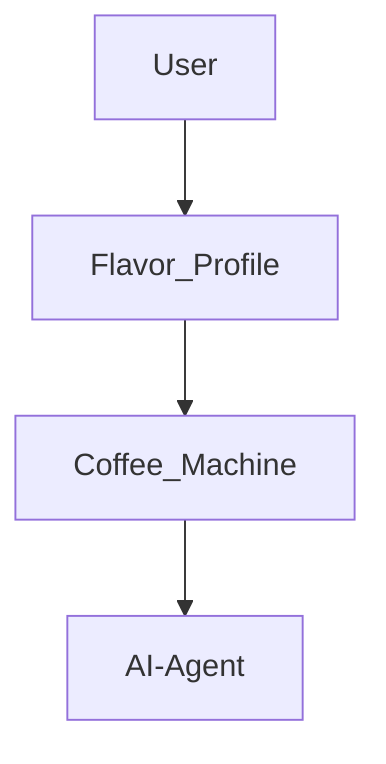
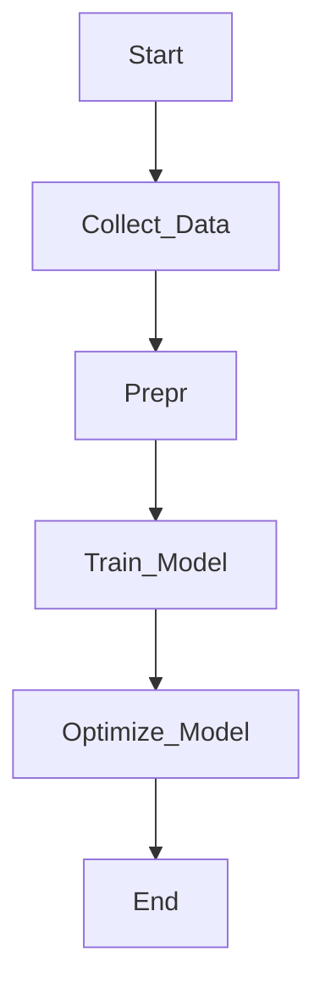
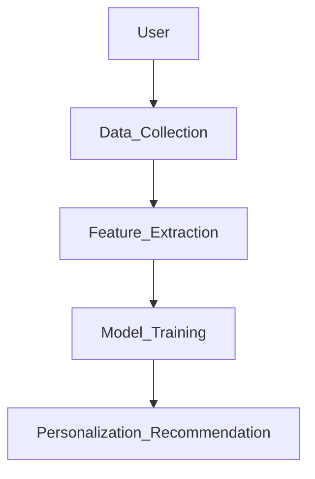
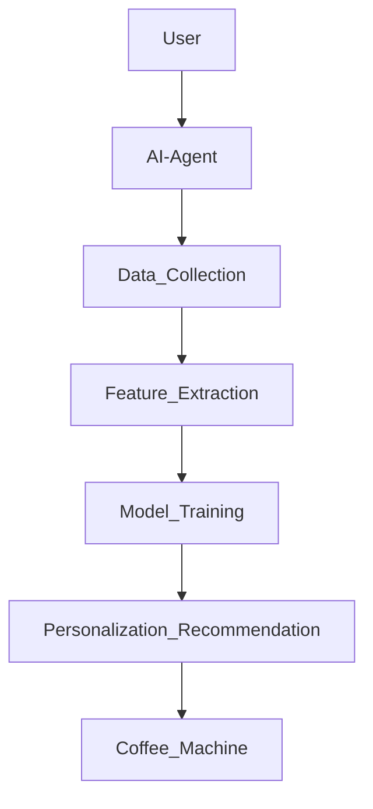

                 


# 智能咖啡机：AI Agent的个性化口味定制系统

> 关键词：智能咖啡机、AI Agent、个性化口味、机器学习、系统架构

> 摘要：本文探讨了如何利用AI Agent技术实现智能咖啡机的个性化口味定制系统。通过分析用户需求和市场趋势，提出了一种基于机器学习的解决方案，详细介绍了系统的背景、核心概念、算法原理、系统架构及项目实现，最后给出了最佳实践建议。

---

## 第一部分: 背景介绍

### 第1章: 个性化口味定制系统的背景与问题背景

#### 1.1 问题背景
- **咖啡消费市场的现状与趋势**：咖啡市场增长迅速，消费者越来越注重个性化体验。
- **用户对个性化口味的需求**：不同用户有不同的口味偏好，传统咖啡机难以满足。
- **现有咖啡机的局限性**：无法根据用户反馈实时调整口味。

#### 1.2 问题描述
- **传统咖啡机的功能局限**：只能固定预设几种口味，缺乏灵活性。
- **用户口味偏好的多样性**：用户可能偏好特定的咖啡浓度、温度或配料组合。
- **个性化口味定制的实现难点**：需要实时学习用户偏好并动态调整配方。

#### 1.3 问题解决
- **引入AI技术的必要性**：AI能够实时学习并优化咖啡配方。
- **AI Agent在咖啡机中的应用**：AI Agent负责数据收集、分析和决策。
- **个性化口味定制系统的实现目标**：实现个性化、智能化的咖啡制作。

#### 1.4 边界与外延
- **系统的边界定义**：仅关注咖啡机的口味定制功能，不涉及咖啡豆供应链。
- **个性化口味定制的外延**：可能扩展到其他饮品，但本文仅讨论咖啡。
- **系统与其他模块的交互**：通过API与用户交互模块和硬件控制模块通信。

#### 1.5 核心概念
- **AI Agent**：能够感知环境、学习并做出决策的智能体。
- **个性化口味定制系统**：基于用户反馈调整咖啡配方的系统。
- **核心要素**：数据采集、特征提取、模型训练、实时反馈。

---

## 第二部分: 核心概念与联系

### 第2章: 核心概念与联系

#### 2.1 AI Agent的核心原理
- **基本概念**：AI Agent通过传感器或用户输入获取数据，利用机器学习模型生成决策。
- **学习机制**：监督学习（用户评分）和强化学习（试错优化）结合。
- **决策过程**：根据用户反馈调整咖啡参数，如温度、萃取时间、奶量等。

#### 2.2 个性化口味定制系统的原理
- **系统架构**：用户输入偏好，AI Agent分析数据，调整配方，咖啡机制作。
- **核心功能**：数据采集、特征提取、模型训练、个性化推荐。
- **实现流程**：用户输入 -> 数据采集 -> 特征提取 -> 模型训练 -> 个性化推荐。

#### 2.3 核心概念对比
| 对比项 | AI Agent | 传统算法 |
|--------|-----------|-----------|
| 数据需求 | 高         | 低         |
| 灵活性 | 高         | 低         |
| 决策能力 | 强         | 弱         |

#### 2.4 ER实体关系图


---

## 第三部分: 算法原理讲解

### 第3章: AI Agent的算法原理

#### 3.1 数据收集与处理
- **数据来源**：用户评分、传感器数据（温度、压力）。
- **数据预处理**：归一化、缺失值处理。
- **特征提取**：提取温度、压力、时间等关键特征。

#### 3.2 机器学习模型
- **模型选择**：随机森林（回归任务）。
- **模型训练**：使用用户评分作为标签，特征向量作为输入。
- **模型优化**：网格搜索调参，交叉验证。

#### 3.3 算法流程图


#### 3.4 数学模型
- **损失函数**：均方误差（MSE）
  $$ \text{MSE} = \frac{1}{n}\sum_{i=1}^{n}(y_i - \hat{y}_i)^2 $$
- **优化器**：Adam优化器，学习率调整。
- **概率模型**：计算用户偏好的概率。

---

## 第四部分: 系统分析与架构设计

### 第4章: 系统分析与架构设计

#### 4.1 系统功能设计
- **领域模型**：用户、订单、口味配置、AI Agent。
- **功能模块**：数据采集、特征提取、模型训练、个性化推荐。

#### 4.2 系统架构设计


#### 4.3 系统接口设计
- **用户界面**：设置偏好、查看推荐。
- **API接口**：AI Agent与硬件交互。

#### 4.4 系统交互流程图


---

## 第五部分: 项目实战

### 第5章: 项目实战

#### 5.1 环境安装
- **Python库**：numpy、scikit-learn、pandas。
- **框架**：TensorFlow或PyTorch。

#### 5.2 核心代码实现
```python
import numpy as np
from sklearn.ensemble import RandomForestRegressor
from sklearn.metrics import mean_squared_error

# 数据预处理
X = df.drop('score', axis=1)
y = df['score']

# 训练模型
model = RandomForestRegressor(n_estimators=100)
model.fit(X, y)

# 模型优化
from sklearn.model_selection import GridSearchCV
param_grid = {'n_estimators': [100, 200], 'max_depth': [None, 10]}
grid_search = GridSearchCV(model, param_grid, cv=5)
grid_search.fit(X, y)
best_model = grid_search.best_estimator_
```

#### 5.3 项目小结
- **经验总结**：实时反馈和模型迭代是关键。
- **优化建议**：增加更多传感器数据，优化模型复杂度。

---

## 第六部分: 最佳实践

### 第6章: 最佳实践

#### 6.1 小结
- **系统优势**：个性化、智能化、易用性。
- **优化方向**：动态调整模型复杂度，增加用户反馈频率。

#### 6.2 注意事项
- **数据隐私**：保护用户数据。
- **系统稳定性**：确保实时反馈机制稳定。

#### 6.3 拓展阅读
- 书籍推荐：《机器学习实战》、《深度学习入门》。
- 网站推荐：Towards Data Science、Kaggle。

---

## 结语

通过本文的详细讲解，我们了解了智能咖啡机中AI Agent个性化口味定制系统的实现过程。从背景分析到系统设计，再到项目实战，每一步都离不开AI技术的支持。未来，随着技术进步，个性化体验将进一步提升，为用户带来更完美的咖啡体验。

---

作者：AI天才研究院/AI Genius Institute  
禅与计算机程序设计艺术 /Zen And The Art of Computer Programming

