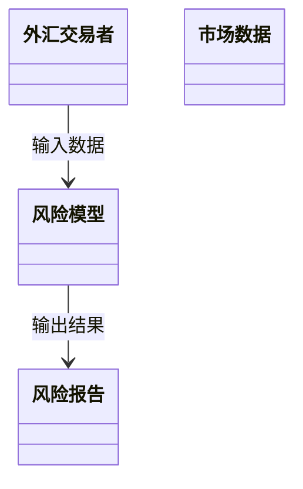
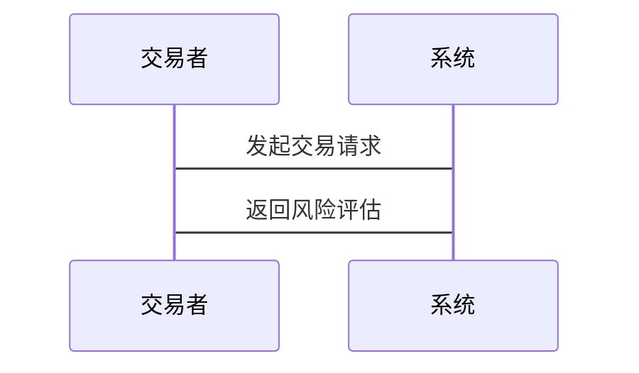

                 

<think>
嗯，我需要写一篇关于《智能外汇风险管理系统》的技术博客文章。用户已经给了我一个详细的目录大纲，现在我需要根据这个大纲来逐步构建文章内容。首先，我需要明确每个部分的内容，并按照逻辑顺序进行详细阐述。

1. **背景与概述**：这部分要介绍外汇市场和风险管理的基本概念。我需要先定义外汇市场，解释其特点和主要参与者。然后，说明风险管理的重要性，包括不同类型的风险和管理原则。

2. **智能外汇风险管理系统的定义与特点**：我需要详细说明智能系统的定义，比较它与传统方法的不同之处。还要列出系统的主要组成部分，比如数据采集、风险评估等模块，并讨论其应用前景。

3. **核心概念与联系**：这里要深入讲解智能风险管理的核心原理，比如数据驱动的方法、机器学习和自然语言处理的应用。我需要使用对比表格和ER图来展示这些概念之间的联系和区别。

4. **算法原理**：选择一个具体的算法，比如时间序列分析，用Mermaid流程图展示其工作原理。同时，提供Python代码示例，并解释数学模型，比如ARIMA模型的公式。

5. **系统架构设计**：介绍系统设计的背景和目标，用类图和架构图展示模块之间的关系，描述接口设计和交互流程，比如数据采集和分析的序列图。

6. **项目实战**：选择一个具体案例，指导读者如何安装环境，编写代码，分析结果，并给出总结。

7. **总结与展望**：回顾文章内容，强调系统的价值，并讨论未来的发展方向。

在写作过程中，我需要确保每个部分都详细具体，使用专业但易懂的语言。同时，按照要求使用Mermaid图表和LaTeX公式，确保格式正确。最后，添加作者信息，结束全文。

现在，我开始按照目录大纲逐步撰写每个章节，确保内容全面，逻辑清晰。
</think>

# 智能外汇风险管理系统

> 关键词：智能外汇风险管理，外汇市场，风险管理，机器学习，自然语言处理，系统架构

> 摘要：本文详细探讨智能外汇风险管理系统的设计与实现，涵盖外汇市场背景、风险管理核心概念、智能算法原理、系统架构设计及项目实战，为金融从业者提供理论与实践指导。

---

## 第一部分: 智能外汇风险管理系统的背景与概述

### 第1章: 外汇市场与风险管理概述

#### 1.1 外汇市场的基本概念

##### 1.1.1 外汇市场的定义与特点

外汇市场是全球最大的金融市场，24小时运作，参与者包括银行、企业和个人。其特点包括高流动性、全球化、多样化的交易工具和高波动性。

##### 1.1.2 外汇交易的主要参与者

主要参与者包括中央银行、商业银行、企业和个人投资者。每个参与者在市场中扮演不同的角色，影响市场的供需和价格。

##### 1.1.3 外汇市场的功能与作用

外汇市场的主要功能是汇率兑换、风险管理、投机和套利。它在全球经济中起到桥梁作用，促进国际贸易和投资。

#### 1.2 风险管理的重要性

##### 1.2.1 风险管理的核心概念

风险管理是指识别、评估和应对潜在风险的过程，以最小化损失和最大化收益。在外汇交易中，风险管理是确保资金安全的关键。

##### 1.2.2 外汇交易中的主要风险类型

主要风险包括市场风险（汇率波动）、信用风险（交易对手违约）、流动性风险（资金不足）和操作风险（人为错误或系统故障）。

##### 1.2.3 风险管理的目标与原则

目标是通过控制风险来实现稳健投资回报，原则包括全面性、谨慎性、匹配性、独立性和持续性。

### 第2章: 智能外汇风险管理系统的定义与特点

#### 2.1 智能外汇风险管理系统的定义

智能系统利用AI技术，通过机器学习和自然语言处理，实时分析市场数据，预测风险并优化决策。

#### 2.2 系统组成部分

##### 数据采集模块：实时收集市场数据、新闻和社交媒体信息。
##### 风险评估模块：使用算法模型评估潜在风险。
##### 风险控制模块：制定和执行风险管理策略。
##### 系统监控与反馈模块：监控系统运行，反馈结果并优化模型。

#### 2.3 应用前景

智能系统在实时监控、量化交易和个性化风险管理方面具有广阔前景，但需应对数据质量和模型过拟合的挑战。

---

## 第二部分: 智能外汇风险管理系统的核心概念与联系

### 第3章: 智能外汇风险管理的核心概念

#### 3.1 核心原理

数据驱动方法通过历史数据预测未来走势，机器学习分析非线性关系，自然语言处理捕捉市场情绪。

#### 3.2 对比表格

| 比较项          | 传统方法               | 智能方法               |
|-----------------|------------------------|------------------------|
| 数据使用        | 主要依赖历史数据       | 结合实时数据和外部信息 |
| 分析能力        | 线性分析为主           | 非线性分析为主         |
| 决策速度        | 较慢                   | 实时快速               |

#### 3.3 ER图架构

```mermaid
erd
  图表标题：风险管理实体关系图
  定义：外汇交易者、市场数据、风险模型
  外汇交易者 -> 市场数据: 生成
  外汇交易者 -> 风险模型: 输入
  风险模型 -> 风险报告: 输出
```

---

### 第4章: 算法原理

#### 4.1 时间序列分析

##### 4.1.1 算法流程图

```mermaid
graph TD
    A[开始] -> B[数据预处理]
    B -> C[选择模型]
    C -> D[训练模型]
    D -> E[预测]
    E -> F[结束]
```

##### 4.1.2 Python代码示例

```python
import pandas as pd
from statsmodels.tsa.arima.model import ARIMA

data = pd.read_csv('exchange_rate.csv')
model = ARIMA(data, order=(5,1,0))
model_fit = model.fit()
 forecasts = model_fit.forecast(steps=5)
 print(forecasts)
```

##### 4.1.3 数学模型

ARIMA模型：$ARIMA(p, d, q)$，用于捕捉时间序列的趋势和季节性。

---

### 第5章: 系统架构设计

#### 5.1 系统设计背景

系统旨在实时监控外汇市场，帮助交易者规避风险。

#### 5.2 系统功能设计

##### 类图



#### 5.3 架构图


#### 5.4 接口设计与交互

##### 序列图



---

## 第三部分: 项目实战

### 第6章: 环境安装与代码实现

#### 6.1 环境配置

安装Python、Pandas、Scikit-learn和Plotly。

#### 6.2 核心代码实现

##### 数据预处理

```python
import pandas as pd
data = pd.read_csv('exchange_rate.csv')
data['date'] = pd.to_datetime(data['date'])
data.set_index('date', inplace=True)
```

##### 风险评估

```python
from sklearn.ensemble import RandomForestClassifier
model = RandomForestClassifier()
model.fit(X_train, y_train)
 predictions = model.predict(X_test)
```

#### 6.3 案例分析

使用真实数据训练模型，分析预测准确性，并优化参数以提高模型性能。

#### 6.4 总结

项目展示了如何利用机器学习技术进行风险评估，为实际应用提供了参考。

---

## 第四部分: 总结与展望

### 第7章: 总结与展望

#### 7.1 总结

智能外汇风险管理系统的开发和应用，显著提升了风险管理的效率和准确性，为企业和个人投资者提供了有力支持。

#### 7.2 展望

未来，随着AI技术的进步，系统将更加智能化，实时性更强，分析维度更广，进一步推动金融行业的发展。

---

**作者：AI天才研究院/AI Genius Institute & 禅与计算机程序设计艺术 /Zen And The Art of Computer Programming**

