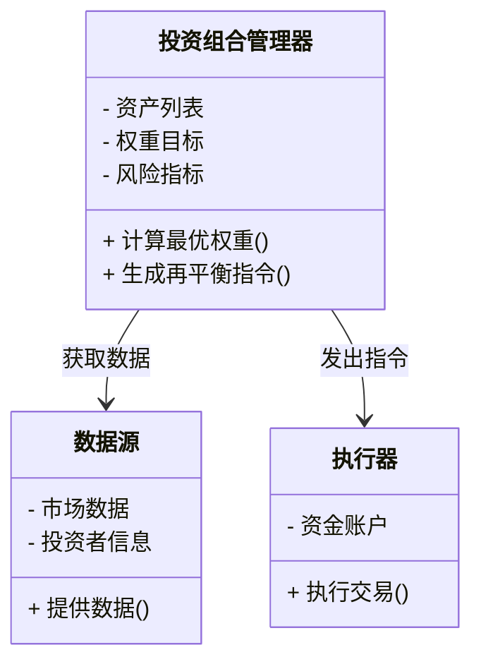
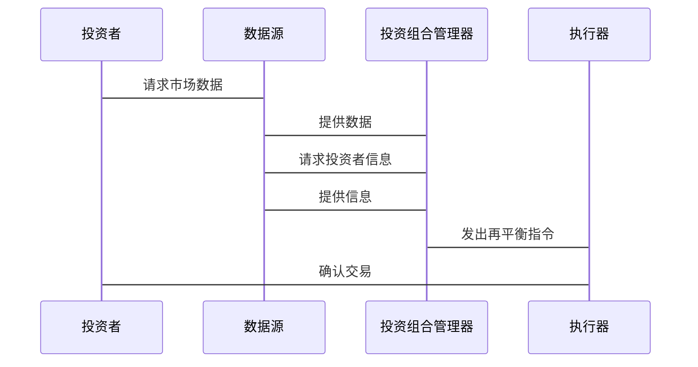

                 


# 智能投资组合再平衡算法

> 关键词：智能投资组合，再平衡算法，机器学习，投资组合优化，风险控制

> 摘要：本文深入探讨智能投资组合再平衡算法的原理、实现和应用。通过分析投资组合再平衡的必要性，介绍智能算法的核心概念，详细讲解算法的数学模型和优化策略，并通过实际案例展示其在投资组合管理中的应用价值。

---

# 第一部分: 智能投资组合再平衡算法概述

## 第1章: 投资组合再平衡的背景与意义

### 1.1 投资组合的基本概念

#### 1.1.1 投资组合的定义与特点
- 投资组合的定义：由多种金融资产组成的集合，旨在通过多样化降低风险。
- 投资组合的特点：分散化、风险与收益的权衡、动态调整。

#### 1.1.2 投资组合的目标与风险控制
- 最大化收益：通过科学的资产配置实现收益最大化。
- 风险控制：通过分散化和动态调整降低投资风险。

#### 1.1.3 再平衡在投资组合管理中的作用
- 再平衡的定义：定期调整投资组合以维持预设的资产配置比例。
- 再平衡的必要性：应对市场波动、投资者风险承受能力变化和目标调整。

### 1.2 投资组合再平衡的必要性

#### 1.2.1 市场波动对投资组合的影响
- 市场波动导致资产比例偏离目标。
- 不再平衡的投资组合可能导致过度风险或收益不足。

#### 1.2.2 投资目标变化的需求
- 风险偏好变化：投资者可能在不同阶段有不同的风险承受能力。
- 资金流入流出：新资金或赎回可能导致比例失衡。

#### 1.2.3 资产配置与风险分散的重要性
- 资产配置的理论基础：现代投资组合理论（MPT）。
- 风险分散：通过多样化投资降低非系统性风险。

### 1.3 智能再平衡算法的背景与优势

#### 1.3.1 传统再平衡方法的局限性
- 定期再平衡的低效性：可能错过市场机会或增加交易成本。
- 静态调整：不考虑实时市场数据和动态变化。

#### 1.3.2 智能算法在投资组合管理中的应用
- 机器学习的应用：预测市场趋势和资产表现。
- 动态优化：实时调整资产配置以应对市场变化。

#### 1.3.3 智能再平衡算法的核心优势
- 高效性：基于实时数据和预测模型进行优化。
- 精准性：通过复杂算法实现最优配置。

### 1.4 本章小结
本章介绍了投资组合再平衡的重要性和必要性，探讨了传统方法的局限性，并引出了智能再平衡算法的优势。

---

# 第二部分: 智能投资组合再平衡算法的核心概念与原理

## 第2章: 智能再平衡算法的核心概念

### 2.1 投资组合再平衡的数学模型

#### 2.1.1 投资组合的优化目标
- 最大化收益：通过优化权重分配实现。
- 最小化风险：通过控制波动性和VaR等风险指标。

#### 2.1.2 资产分配的数学表达
- 资产权重表示：$w_i$ 表示第i个资产的权重，$\sum w_i = 1$。
- 收益和风险的数学关系：收益$=\sum w_i r_i$，风险$=\sqrt{\sum_{i,j} w_i w_j \sigma_{ij}}$。

#### 2.1.3 再平衡的条件与触发机制
- 预设阈值：当资产比例偏离目标时触发再平衡。
- 实时监控：基于实时市场数据调整。

### 2.2 智能再平衡算法的原理

#### 2.2.1 基于机器学习的预测模型
- 使用回归分析预测资产收益。
- 利用神经网络分析市场趋势。

#### 2.2.2 基于动态资产配置的优化策略
- 动态调整权重：根据市场变化实时优化。
- 分阶段优化：分步调整资产配置以减少交易成本。

#### 2.2.3 基于风险平价的再平衡方法
- 风险平价定义：每个资产承担的风险与其权重相等。
- 风险平价模型：$w_i = \frac{1}{n \sigma_i}$，其中$\sigma_i$是资产i的风险贡献。

### 2.3 智能再平衡算法的核心要素

#### 2.3.1 数据输入与特征提取
- 市场数据：包括价格、收益率、波动率等。
- 风险偏好：投资者的VaR水平和风险承受能力。

#### 2.3.2 算法选择与参数优化
- 算法选择：基于预测准确性和计算效率。
- 参数优化：调整模型参数以提高预测精度。

#### 2.3.3 执行策略与成本控制
- 交易成本：包括佣金和买卖价差。
- 税费优化：考虑税务影响，降低整体成本。

### 2.4 本章小结
本章详细介绍了智能再平衡算法的核心概念，包括数学模型、机器学习的应用和优化策略。

---

## 第3章: 投资组合优化的数学模型

### 3.1 投资组合优化的目标函数

#### 3.1.1 最大化收益的数学表达
$$ \text{Maximize } \sum_{i=1}^{n} w_i r_i $$

#### 3.1.2 最小化风险的数学表达
$$ \text{Minimize } \sum_{i=1}^{n} \sum_{j=1}^{n} w_i w_j \sigma_{ij} $$

### 3.2 资产分配的约束条件

#### 3.2.1 投资比例的约束
$$ \sum_{i=1}^{n} w_i = 1 $$

#### 3.2.2 风险承受能力的约束
$$ \text{VaR} \leq \text{预设风险水平} $$

### 3.3 再平衡算法的数学推导

#### 3.3.1 优化模型的构建
$$ \text{优化目标: } \min_{w} \sum_{i=1}^{n} w_i r_i - \lambda \sum_{i=1}^{n} \sum_{j=1}^{n} w_i w_j \sigma_{ij} $$

#### 3.3.2 求解过程
- 使用拉格朗日乘数法求解约束优化问题。
- 推导得出最优权重公式：$w_i = \frac{r_i}{\lambda \sum_{j=1}^{n} \sigma_{ij}}$。

### 3.4 本章小结
本章通过数学推导展示了投资组合优化的核心模型和求解方法。

---

# 第三部分: 智能投资组合再平衡算法的系统分析与架构设计

## 第4章: 智能投资组合再平衡系统的架构设计

### 4.1 问题场景介绍

#### 4.1.1 系统目标
- 实时监控市场数据。
- 动态优化资产配置。
- 执行再平衡操作。

#### 4.1.2 功能需求
- 数据采集：获取实时市场数据和投资者信息。
- 模型计算：运行智能再平衡算法。
- 策略执行：生成交易指令并执行。

### 4.2 系统功能设计

#### 4.2.1 领域模型类图


#### 4.2.2 系统架构图


#### 4.2.3 系统交互序列图


### 4.3 本章小结
本章通过系统架构设计展示了智能再平衡算法的应用场景和实现方式。

---

## 第5章: 智能投资组合再平衡算法的项目实战

### 5.1 环境安装与配置

#### 5.1.1 安装Python环境
- 安装Anaconda或Miniconda。
- 安装必要的库：numpy、pandas、scipy、matplotlib。

#### 5.1.2 安装机器学习库
- 安装scikit-learn和xgboost。

### 5.2 核心算法实现

#### 5.2.1 数据预处理
```python
import pandas as pd
import numpy as np

data = pd.read_csv('market_data.csv')
data = data.dropna().sort_index()
```

#### 5.2.2 模型训练与预测
```python
from sklearn.ensemble import RandomForestRegressor

model = RandomForestRegressor(n_estimators=100, random_state=42)
model.fit(X_train, y_train)
```

#### 5.2.3 再平衡策略实现
```python
def rebalance(weights, predicted_returns, target_risk):
    # 计算最优权重
    optimal_weights = optimize_weights(predicted_returns, target_risk)
    # 执行交易
    execute_trade(weights, optimal_weights)
    return optimal_weights
```

#### 5.2.4 性能测试与评估
```python
def evaluate Strategy(weights, returns):
    # 计算收益和风险
    portfolio_return = sum(weights * returns.mean(axis=0))
    portfolio_risk = np.sqrt(weights.T.dot(returns.cov()).dot(weights))
    return portfolio_return, portfolio_risk
```

### 5.3 本章小结
本章通过实际代码展示了智能再平衡算法的实现过程，包括数据预处理、模型训练和策略执行。

---

## 第6章: 最佳实践与小结

### 6.1 最佳实践 tips
- 定期监控和优化模型。
- 合理设置交易成本和税费。
- 结合市场变化调整策略。

### 6.2 小结
智能投资组合再平衡算法通过机器学习和优化算法实现了高效的风险控制和收益最大化，是现代投资组合管理的重要工具。

### 6.3 注意事项
- 算法依赖市场预测的准确性。
- 需要考虑交易成本和执行难度。
- 要定期评估和更新模型。

### 6.4 拓展阅读
- 建议阅读《投资学》和《机器学习实战》以深入理解相关内容。

---

作者：AI天才研究院/AI Genius Institute & 禅与计算机程序设计艺术 /Zen And The Art of Computer Programming

