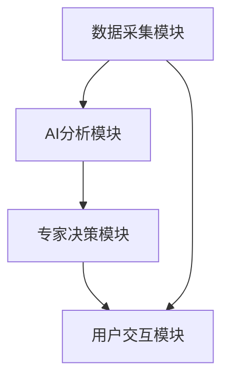
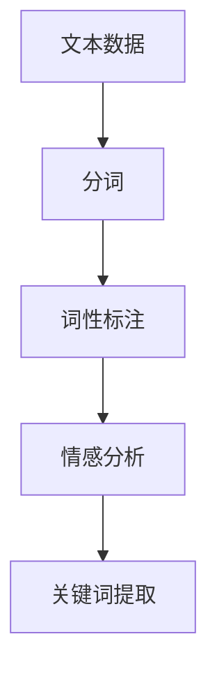
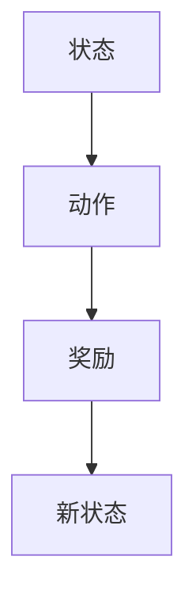
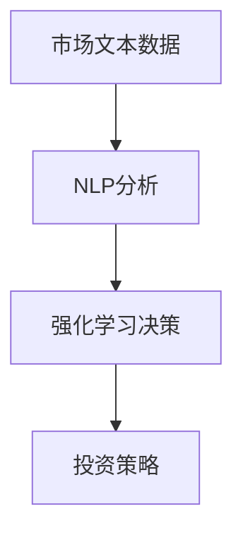
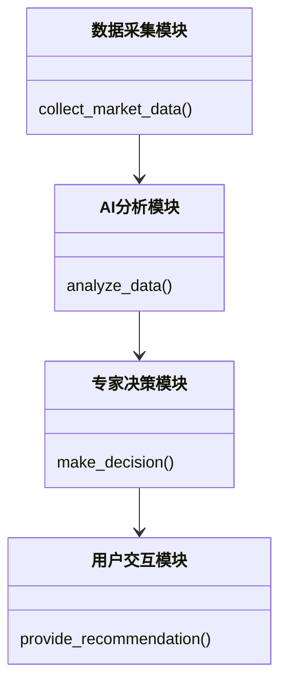
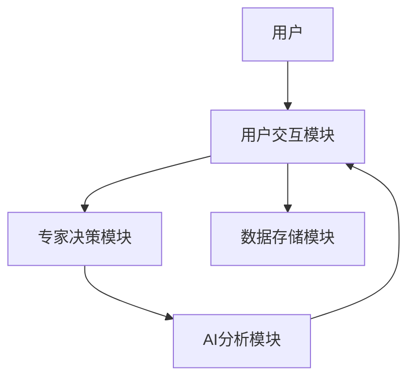
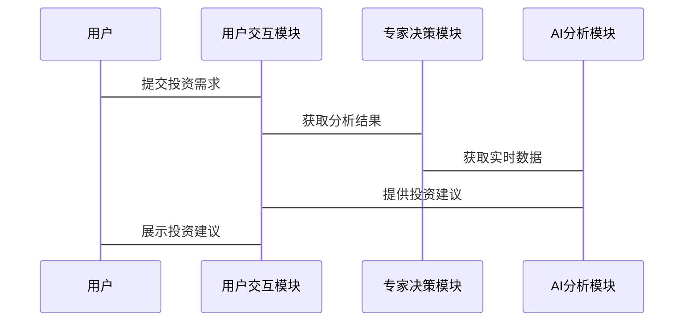

                 

<think>
好，我现在要帮用户撰写一篇关于《智能投资顾问：AI与人类专家的协同策略》的技术博客文章。首先，我需要明确用户的需求，他们希望文章结构清晰，逻辑严谨，技术深入，同时语言要专业但易懂。用户还特别强调了要包括背景介绍、核心概念、算法原理、系统设计、项目实战和总结等部分，并且每个部分都要有详细的分析和图表支持。

首先，我会从背景介绍开始，这部分需要说明为什么需要智能投资顾问，以及传统投资顾问的局限性。我会对比AI和人类专家在投资中的优缺点，让读者明白两者的协同合作是必要的。

接下来是核心概念与联系，这部分需要详细讲解AI和人类专家如何协同工作。我会使用表格和Mermaid图来展示协同机制和实体关系，帮助读者更好地理解。

然后是算法原理，这部分是技术重点。我会选择自然语言处理和强化学习作为主要算法，用Mermaid流程图展示流程，并附上数学公式。确保公式使用LaTeX格式，正确无误。

系统分析与架构设计部分，我需要介绍系统的各个模块和它们的交互。使用领域模型图和架构图来展示系统结构，并详细描述接口设计和交互流程。

项目实战部分，我会选择一个具体的案例，比如使用Python实现一个简单的投资策略。给出核心代码，并详细解读每一步的功能，最后分析案例的效果。

最后是总结与展望，我会回顾全文内容，并指出未来的发展方向，同时给出一些最佳实践的建议，帮助读者更好地应用智能投资顾问。

在撰写过程中，我要确保每一部分都符合用户的要求，内容详实，结构合理，图表清晰，公式准确。同时，语言要专业但易懂，避免过于晦涩，让读者能够轻松理解并应用这些知识。

现在，我开始按照这个思路撰写文章，确保每个章节都涵盖用户提到的各个方面，同时保持文章的流畅性和逻辑性。
</think>

# 智能投资顾问：AI与人类专家的协同策略

> 关键词：智能投资顾问，AI，人类专家，协同策略，投资决策，系统架构

> 摘要：智能投资顾问通过结合人工智能和人类专家的知识与经验，提供更加精准、高效的金融服务。本文将深入分析智能投资顾问的核心概念、算法原理、系统架构，以及实际项目中的应用，探讨AI与人类专家协同的策略与实践。

---

## 第1章：智能投资顾问的背景与问题背景

### 1.1 传统投资顾问的局限性

传统投资顾问的服务模式依赖于人类专家的市场分析和投资经验，但存在以下问题：
- **服务范围有限**：传统顾问通常服务于高净值客户，无法覆盖更广泛的投资者。
- **信息处理能力受限**：面对海量数据和复杂市场变化，人类专家难以快速做出最优决策。
- **主观性较强**：投资决策可能受到顾问主观判断的影响，缺乏客观性和一致性。

### 1.2 智能投资顾问的兴起

智能投资顾问通过AI技术实现了自动化、智能化的投资服务，具有以下优势：
- **高效性**：AI能够快速处理海量数据，提供实时市场分析。
- **个性化服务**：通过大数据分析，智能顾问可以为每位投资者提供定制化的投资建议。
- **成本低**：相比传统顾问，智能投资顾问的边际成本更低，可以服务更多客户。

### 1.3 智能投资顾问的核心问题

智能投资顾问需要解决的关键问题包括：
- 如何有效结合AI算法与人类专家的判断？
- 如何确保投资决策的准确性和稳定性？
- 如何构建高效的协同机制？

---

## 第2章：智能投资顾问的核心概念与联系

### 2.1 AI与人类专家的协同机制

AI与人类专家的协同可以通过以下方式实现：
- **数据预处理与分析**：AI负责整理和分析市场数据，为人类专家提供决策支持。
- **策略优化**：AI根据市场变化实时优化投资策略，人类专家进行最终决策确认。
- **风险控制**：AI实时监控市场风险，协助人类专家制定风险管理方案。

**协同机制对比表**

| 对比维度      | AI优势                     | 人类专家优势               |
|---------------|----------------------------|-----------------------------|
| 数据处理速度  | 快速处理海量数据           | 数据处理速度较慢           |
| 模型准确性     | 高度依赖算法模型           | 依赖经验和市场直觉         |
| 创新能力      | 算法可以快速迭代优化       | 创新能力有限               |

### 2.2 核心概念对比分析

智能投资顾问的系统架构可以分为以下几个核心模块：
- **数据采集模块**：负责收集市场数据、新闻资讯等。
- **AI分析模块**：利用NLP和强化学习等算法进行市场分析。
- **专家决策模块**：人类专家结合AI分析结果进行最终决策。
- **用户交互模块**：为用户提供个性化的投资建议和实时反馈。

**系统架构图（Mermaid）**



### 2.3 实体关系图与协同流程

**实体关系图（ER图）**

```mermaid
erd
    客户 --|{投资需求}|> 投资顾问系统
    市场数据 --|{输入}|> AI分析模块
    AI分析模块 --|{分析结果}|> 专家决策模块
    专家决策模块 --|{决策}|> 用户交互模块
```

---

## 第3章：智能投资顾问的算法原理

### 3.1 自然语言处理在投资分析中的应用

自然语言处理（NLP）用于分析新闻、财报等文本数据，提取市场情绪和关键词。

**NLP分析流程（Mermaid）**



**案例：市场情绪分析**

假设某新闻标题为“科技股今日大涨”，NLP模型分析后得出市场情绪为“正面”，并提取关键词“科技股”。

### 3.2 强化学习在投资决策中的应用

强化学习用于动态调整投资策略，通过奖励机制优化模型。

**强化学习算法流程（Mermaid）**



**数学模型**

- **价值函数**：$$ V(s) = \max_{a} [r + V(s') ] $$
- **Q-learning**：$$ Q(s,a) = r + \gamma \max_{a'} Q(s',a') $$

### 3.3 算法流程图与数学模型

**NLP与强化学习结合流程**



---

## 第4章：智能投资顾问的系统分析与架构设计

### 4.1 系统功能设计

**系统功能模块划分**

- 数据采集模块
- AI分析模块
- 专家决策模块
- 用户交互模块

**领域模型图（Mermaid）**



### 4.2 系统架构设计

**系统架构图（Mermaid）**



**接口设计**

- 用户交互接口：API或Web界面
- 数据接口：与数据源连接

**交互序列图（Mermaid）**



---

## 第5章：项目实战与案例分析

### 5.1 环境安装与配置

- 安装Python、TensorFlow、Keras等工具
- 配置数据源（如Yahoo Finance API）

### 5.2 核心代码实现

```python
import numpy as np
import pandas as pd
from tensorflow.keras.models import Sequential
from tensorflow.keras.layers import LSTM, Dense

# 数据加载
data = pd.read_csv('stock_data.csv')

# 数据预处理
train_data = data[:800]
test_data = data[800:]

# 模型构建
model = Sequential()
model.add(LSTM(128, input_shape=(None, 1)))
model.add(Dense(1))
model.compile(loss='mean_squared_error', optimizer='adam')

# 训练
model.fit(train_data, epochs=10, batch_size=32)

# 预测
predicted_prices = model.predict(test_data)
```

### 5.3 代码解读与分析

- **数据加载**：读取股票数据
- **数据预处理**：分割训练集和测试集
- **模型构建**：使用LSTM网络进行预测
- **训练**：训练模型，优化投资策略
- **预测**：基于模型预测股票价格

### 5.4 案例分析

以某科技股为例，模型预测其价格将在未来一个月上涨10%。结合市场分析，专家确认该预测，并建议投资者买入该股票。

---

## 第6章：总结与展望

### 6.1 小结

智能投资顾问通过AI与人类专家的协同，实现了高效、精准的投资服务。本文详细探讨了其核心概念、算法原理和系统架构，并通过实际案例展示了其应用。

### 6.2 注意事项

- 数据隐私和安全问题需要重视
- 模型的可解释性需要进一步提升
- 算法的实时性和稳定性需要优化

### 6.3 最佳实践 tips

- 定期更新模型，适应市场变化
- 结合多种算法，提高决策准确性
- 加强与人类专家的协同，确保决策的合理性

### 6.4 未来展望

随着AI技术的进步，智能投资顾问将在以下方面进一步发展：
- 更加智能化的投资决策
- 更加个性化的客户服务
- 更加高效的协同机制

---

## 作者：AI天才研究院 & 禅与计算机程序设计艺术

感谢您的阅读！如需进一步探讨，欢迎随时联系。

