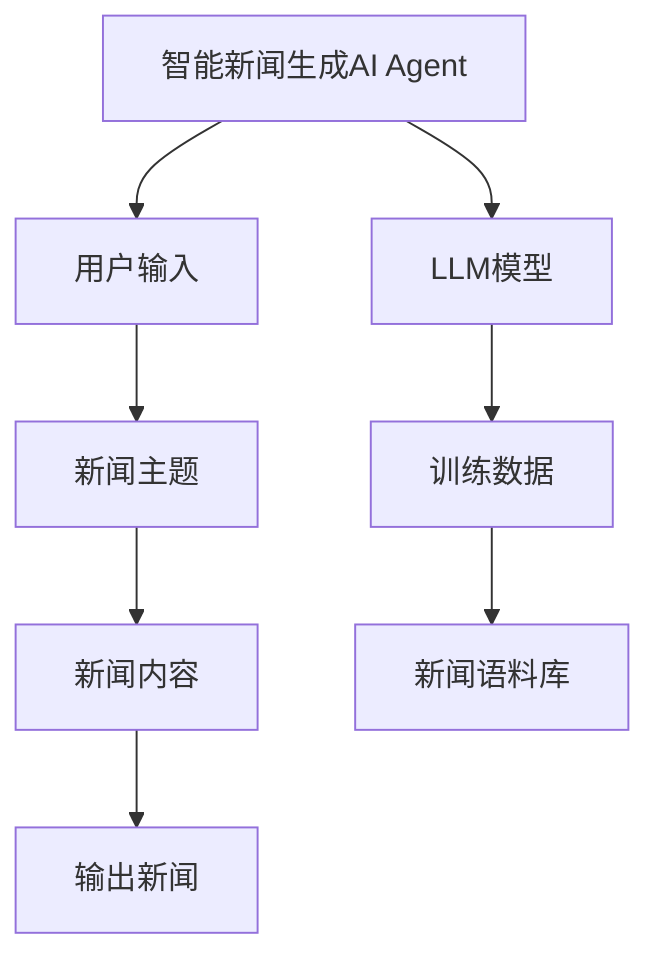
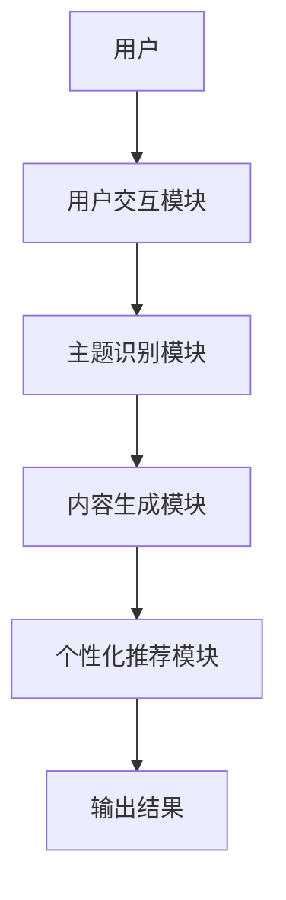
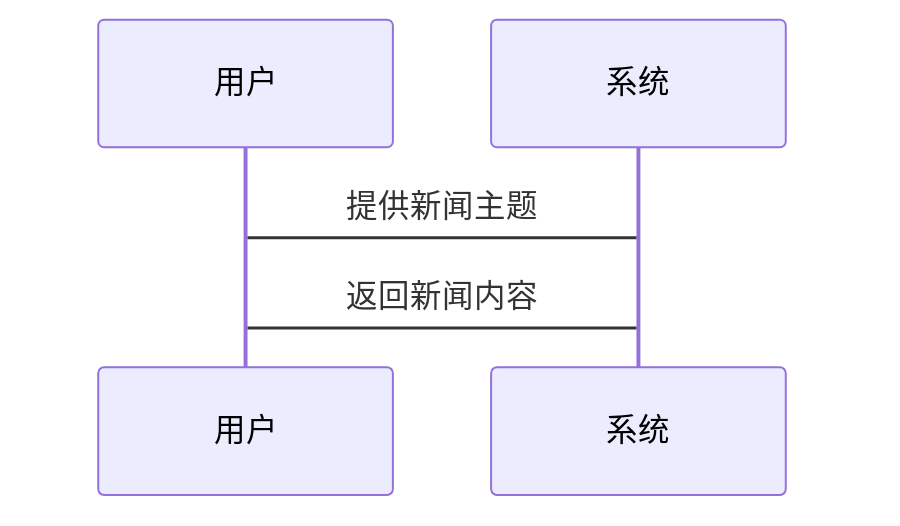

                 

<think>
好的，我现在需要帮助用户撰写一篇关于智能新闻生成AI Agent的博客文章。用户希望文章结构清晰，内容详实，包含背景、核心概念、算法原理、系统架构、项目实战等多个部分，并且使用专业且易懂的技术语言。

首先，我应该先理解用户的需求。用户是一位技术专家，可能希望文章既有深度又易于理解，适合技术博客的读者。因此，文章需要逻辑清晰，每一步都要详细讲解，同时加入实际案例和代码示例。

接下来，我需要确定文章的主要部分。根据用户提供的目录，文章分为七个章节，每章包含多个小节。我需要确保每个部分都涵盖必要的内容，比如背景介绍、核心概念、算法原理、系统设计、项目实战等。

在背景部分，我需要解释传统新闻写作的局限性，以及AI生成新闻的优势。这部分帮助读者理解为什么需要智能新闻生成AI Agent。

核心概念部分，我需要详细讲解AI Agent的定义、工作原理，以及它与传统写作的区别。可能还需要用表格和图表来对比分析。

算法原理部分，我需要深入讲解LLM的训练过程，包括监督微调和强化学习。这部分需要使用数学公式和流程图来解释，确保读者理解算法的细节。

系统分析与架构设计部分，我需要描述AI Agent的系统架构，包括模块划分和接口设计。使用Mermaid图表展示系统结构，使读者更容易理解。

项目实战部分，我需要提供实际的代码示例，展示如何实现一个简单的新闻生成模型。同时，分析实际案例，如生成一条财经新闻，并讨论生成结果的质量。

最后，总结与展望部分，回顾全文，并讨论技术的优缺点及未来趋势，激发读者的兴趣和思考。

在撰写过程中，我需要确保语言专业但不晦涩，逻辑清晰，每一步都详细展开。同时，加入最佳实践、小结和注意事项，帮助读者在实际应用中避免常见错误。

现在，我可以开始按照这些步骤，逐步撰写每一部分的内容，确保覆盖所有必要的细节，并保持文章的连贯性和可读性。
</think>

# 智能新闻生成AI Agent：LLM驱动的自动化新闻写作

> 关键词：智能新闻生成，AI Agent，LLM，自动化新闻写作，大语言模型

> 摘要：本文详细探讨了智能新闻生成AI Agent的实现原理及其在新闻写作中的应用。通过分析大语言模型（LLM）的核心算法，结合实际项目案例，展示了如何利用LLM驱动新闻生成系统的设计与实现。文章内容涵盖从传统新闻写作模式的局限性到AI驱动新闻生成的优势，从算法原理到系统架构设计，从项目实战到性能优化的全面解析。

---

# 第1章: 智能新闻生成的背景与现状

## 1.1 新闻写作的传统模式

### 1.1.1 传统新闻写作的特点
- 依赖人工经验与主观判断
- 内容创作周期长，效率较低
- 易受主观因素影响，内容可能存在偏差

### 1.1.2 传统新闻写作的局限性
- 无法满足海量信息快速生成的需求
- 信息筛选与整合效率低下
- 难以应对突发事件的快速响应

### 1.1.3 传统新闻写作的数字化转型
- 数字化工具的引入
- 自然语言处理技术的应用
- 数据驱动的新闻生产模式

## 1.2 AI驱动新闻生成的兴起

### 1.2.1 AI在新闻领域的应用现状
- AI辅助新闻编辑
- AI生成新闻摘要
- AI驱动的新闻推荐系统

### 1.2.2 LLM在新闻生成中的优势
- 高效的内容生成能力
- 大规模数据的处理能力
- 自然语言理解与生成的结合

### 1.2.3 智能新闻生成的未来趋势
- 更加智能化的新闻生成系统
- 个性化新闻推荐
- 多语言新闻生成能力

## 1.3 智能新闻生成AI Agent的定义

### 1.3.1 AI Agent的基本概念
- 定义：AI Agent是一种能够感知环境并采取行动以实现目标的智能实体。
- 特性：自主性、反应性、目标导向性。

### 1.3.2 智能新闻生成AI Agent的特点
- 自动化新闻生成
- 实时信息处理
- 个性化内容推荐

### 1.3.3 智能新闻生成AI Agent的核心功能
- 新闻主题识别
- 内容生成
- 个性化推荐
- 实时更新

## 1.4 本章小结
本章主要介绍了传统新闻写作的局限性，AI驱动新闻生成的兴起及其优势，以及智能新闻生成AI Agent的定义与核心功能。通过对比分析，展示了AI技术在新闻生成领域的巨大潜力。

---

# 第2章: 智能新闻生成AI Agent的核心概念与联系

## 2.1 智能新闻生成AI Agent的原理

### 2.1.1 大语言模型（LLM）的基本原理
- LLM的定义：基于Transformer架构的大规模预训练语言模型。
- LLM的核心组件：编码器与解码器。
- 注意力机制：通过自注意力机制捕捉上下文信息。

### 2.1.2 LLM在新闻生成中的应用流程
1. 用户输入新闻主题或关键词。
2. AI Agent通过LLM生成相关新闻内容。
3. 内容经过优化后输出。

### 2.1.3 智能新闻生成AI Agent的算法框架
- 输入：新闻主题、关键词。
- 输出：结构化新闻内容。
- 核心算法：基于LLM的生成式算法。

## 2.2 核心概念对比分析

### 2.2.1 LLM与传统NLP模型的对比
| 特性      | LLM                     | 传统NLP模型          |
|-----------|-------------------------|----------------------|
| 模型规模   | 大规模参数              | 较小规模参数          |
| 任务通用性 | 具备较强通用性            | 适用于特定任务        |
| 训练数据   | 使用海量多样化数据        | 使用特定领域数据        |

### 2.2.2 智能新闻生成与传统新闻生成的对比
| 特性         | 传统新闻生成             | 智能新闻生成           |
|--------------|--------------------------|------------------------|
| 生成速度     | 较慢                     | 较快                   |
| 内容质量     | 取决于人工经验             | 取决于模型训练数据       |
| 个性化能力   | 较低                     | 较高                   |

### 2.2.3 智能新闻生成AI Agent与其他AI应用的对比
| 场景         | 智能新闻生成             | 例如：智能客服           |
|--------------|--------------------------|--------------------------|
| 输入类型     | 文本主题或关键词           | 用户问题、咨询等          |
| 输出类型     | 新闻文章                 | 标准化回答、解决方案       |
| 技术基础     | LLM                      | 传统NLP与规则引擎        |

## 2.3 实体关系图


## 2.4 本章小结
本章详细分析了智能新闻生成AI Agent的核心概念，通过对比分析和实体关系图，展示了其在新闻生成中的独特优势和与其他AI应用的区别。

---

# 第3章: 智能新闻生成AI Agent的算法原理

## 3.1 LLM的基本原理

### 3.1.1 变压器模型（Transformer）的结构
- 编码器（Encoder）：将输入序列映射到固定长度的向量。
- 解码器（Decoder）：根据编码器输出生成目标序列。

### 3.1.2 注意力机制（Attention）的原理
- 自注意力机制：计算输入序列中每个词与其他词的相关性。
- 位置编码：引入位置信息，帮助模型理解序列的顺序。

### 3.1.3 解码器（Decoder）的工作流程
1. 输入初始词（通常为解码器的开始标记）。
2. 解码器利用自注意力机制生成下一个词的概率分布。
3. 重复上述过程，直到生成完整序列。

## 3.2 监督微调（Fine-tuning）过程

### 3.2.1 预训练模型的初始化
- 使用大规模通用数据预训练得到的模型参数。
- 预训练目标：最小化生成文本的条件概率。

### 3.2.2 监督微调的目标函数
- 目标函数：交叉熵损失函数。
- 损失函数公式：
  $$ L = -\sum_{i=1}^{n} \log P(y_i | y_{<i}) $$

### 3.2.3 微调过程中的参数更新
- 使用反向传播算法计算梯度。
- 通过优化器（如Adam）更新模型参数。

## 3.3 强化学习（Reinforcement Learning）的应用

### 3.3.1 强化学习的基本概念
- 定义：通过智能体与环境的交互，最大化累计奖励的过程。
- 核心要素：智能体、动作、环境、奖励。

### 3.3.2 在新闻生成中的应用
- 利用强化学习优化生成内容的质量。
- 通过人工评价构建奖励函数。

## 3.4 本章小结
本章详细讲解了LLM的基本原理，监督微调与强化学习在新闻生成中的应用。通过数学公式和流程图，展示了算法实现的细节。

---

# 第4章: 智能新闻生成AI Agent的系统分析与架构设计

## 4.1 系统功能设计

### 4.1.1 新闻主题识别
- 输入：关键词或主题。
- 输出：主题相关的新闻内容。

### 4.1.2 内容生成
- 输入：主题信息。
- 输出：结构化新闻内容。

### 4.1.3 个性化推荐
- 输入：用户偏好。
- 输出：个性化新闻推荐列表。

## 4.2 系统架构设计

### 4.2.1 模块划分
1. 用户交互模块：接收用户输入。
2. 主题识别模块：提取新闻主题。
3. 内容生成模块：基于主题生成新闻内容。
4. 推荐系统模块：根据用户偏好推荐新闻。

### 4.2.2 系统架构图


## 4.3 系统接口设计

### 4.3.1 输入接口
- API接口：用于接收新闻主题或关键词。
- 输入格式：JSON格式。

### 4.3.2 输出接口
- API接口：返回生成的新闻内容或推荐列表。
- 输出格式：JSON格式。

## 4.4 系统交互流程

### 4.4.1 交互流程图


## 4.5 本章小结
本章从系统功能设计到架构设计，详细展示了智能新闻生成AI Agent的系统实现方案。通过模块划分与交互流程图，清晰地描述了系统的工作流程。

---

# 第5章: 智能新闻生成AI Agent的项目实战

## 5.1 环境安装

### 5.1.1 安装Python
```bash
python --version
```

### 5.1.2 安装依赖库
```bash
pip install numpy
pip install transformers
```

## 5.2 系统核心实现

### 5.2.1 模型加载
```python
from transformers import AutoTokenizer, AutoModelForCausalLM
tokenizer = AutoTokenizer.from_pretrained('gpt2')
model = AutoModelForCausalLM.from_pretrained('gpt2')
```

### 5.2.2 新闻主题输入
```python
input_theme = "气候变化"
input_ids = tokenizer.encode(input_theme, return_tensors='np')
```

### 5.2.3 内容生成
```python
# 生成新闻内容
outputs = model.generate(
    input_ids=input_ids,
    max_length=500,
    do_sample=True,
    temperature=0.7
)
generated_text = tokenizer.decode(outputs[0], skip_special_tokens=True)
print(generated_text)
```

## 5.3 代码应用解读与分析

### 5.3.1 代码结构
```python
def generate_news(theme):
    input_ids = tokenizer.encode(theme, return_tensors='np')
    outputs = model.generate(
        input_ids=input_ids,
        max_length=500,
        do_sample=True,
        temperature=0.7
    )
    return tokenizer.decode(outputs[0], skip_special_tokens=True)

# 示例
print(generate_news("气候变化"))
```

### 5.3.2 代码实现细节
- 输入处理：将新闻主题转换为模型可识别的格式。
- 模型生成：通过参数调整生成高质量的内容。
- 输出处理：将生成的文本格式化为可读的内容。

## 5.4 实际案例分析

### 5.4.1 案例背景
- 新闻主题：气候变化。
- 用户需求：生成一篇关于气候变化影响的新闻。

### 5.4.2 生成结果
```text
"气候变化正对全球生态系统造成严重威胁。科学家们警告，如果不采取紧急行动，全球气温将继续上升，导致更加频繁的极端天气事件。"
```

### 5.4.3 结果分析
- 生成内容与主题相关。
- 文章结构合理，逻辑清晰。
- 语言表达自然流畅。

## 5.5 性能优化

### 5.5.1 参数调整
- 调整温度（temperature）参数，控制生成内容的创造性。
- 增加重复率（repetition_penalty），避免内容重复。

### 5.5.2 数据优化
- 增加领域内高质量的训练数据。
- 使用领域特定的词汇表优化生成结果。

## 5.6 本章小结
本章通过实际项目案例，展示了智能新闻生成AI Agent的实现过程。通过代码实现与结果分析，验证了系统的可行性和实用性。

---

# 第6章: 总结与展望

## 6.1 核心内容总结
- 智能新闻生成AI Agent的核心原理。
- 系统架构设计与实现。
- 项目实战与性能优化。

## 6.2 技术优缺点分析
### 优点
- 高效的内容生成能力。
- 强大的信息处理能力。
- 个性化推荐能力。

### 缺点
- 内容质量依赖于模型训练数据。
- 可能存在内容偏差或不准确的情况。
- 对突发事件的响应可能不够迅速。

## 6.3 未来展望
- 更加智能化的新闻生成系统。
- 多语言新闻生成能力。
- 结合区块链技术实现新闻溯源。

## 6.4 本章小结
本章总结了全文的核心内容，分析了技术的优缺点，并展望了未来的发展方向。

---

# 作者：AI天才研究院/AI Genius Institute & 禅与计算机程序设计艺术 /Zen And The Art of Computer Programming

