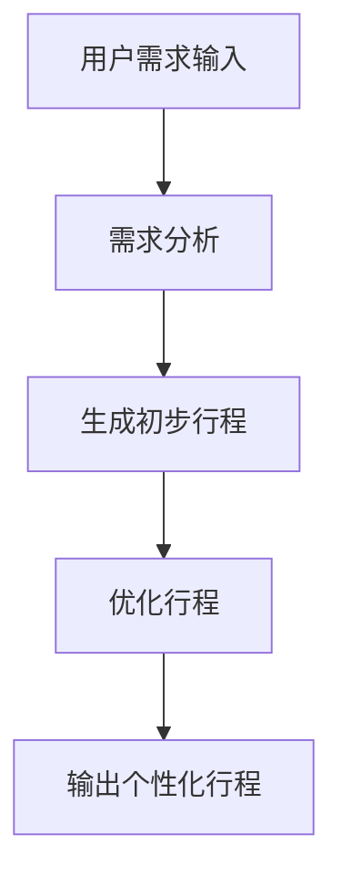
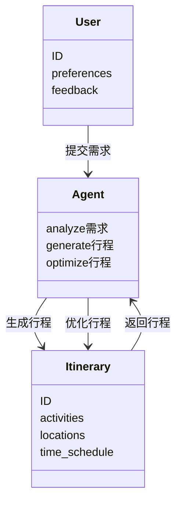

                 


# 智能旅游规划 AI Agent：LLM 辅助个性化旅行定制

> 关键词：智能旅游规划，AI Agent，LLM，个性化旅行，定制旅行

> 摘要：本文探讨了如何利用大语言模型（LLM）构建智能旅游规划 AI Agent，实现个性化旅行定制。通过分析 LLM 在旅游规划中的应用，详细阐述了 AI Agent 的核心算法、系统架构以及项目实战，为读者提供全面的技术指导。

---

## 第一部分：智能旅游规划 AI Agent 背景与概述

### 第1章：智能旅游规划 AI Agent 概述

#### 1.1 智能旅游规划的背景与需求
- 1.1.1 传统旅游规划的痛点
  - 信息过载：用户难以从海量信息中筛选出适合自己的旅行计划。
  - 个性化需求未满足：传统旅游产品千篇一律，难以满足用户的个性化需求。
  - 时间成本高：用户需要花费大量时间进行行程规划和预订。
- 1.1.2 智能化旅游规划的必要性
  - 提高效率：通过 AI 技术快速生成个性化行程。
  - 降低决策成本：基于用户偏好和行为数据，提供精准推荐。
  - 满足多样需求：支持不同用户的个性化需求，提升用户体验。
- 1.1.3 个性化旅行定制的需求
  - 用户对个性化旅行的需求日益增长。
  - 旅行场景多样化：包括蜜月、商务、探险等多种类型。
  - 旅行预算与时间的灵活性：用户需要根据自身情况定制行程。

#### 1.2 AI Agent 在旅游规划中的作用
- 1.2.1 AI Agent 的定义与特点
  - AI Agent 是一种能够感知环境、自主决策的智能体。
  - 具备学习能力、推理能力和自适应能力。
- 1.2.2 LLM 在旅游规划中的应用
  - LLM（Large Language Model）能够理解自然语言，生成个性化的旅行建议。
  - 通过对话交互，实时响应用户需求。
- 1.2.3 智能旅游规划 AI Agent 的核心功能
  - 用户需求分析：通过对话或问卷收集用户偏好。
  - 旅游行程推荐：基于用户需求生成行程方案。
  - 个性化定制与优化：根据用户反馈实时调整行程。

#### 1.3 本书内容与目标
- 1.3.1 本书的核心目标
  - 探讨如何利用 LLM 构建智能旅游规划 AI Agent。
  - 提供从理论到实践的全面指导。
- 1.3.2 本书的读者群体
  - 开发者、旅游行业从业者、技术爱好者。
- 1.3.3 本书的结构安排
  - 从背景介绍到算法原理，再到系统设计和项目实战。

---

## 第二部分：智能旅游规划 AI Agent 核心概念与联系

### 第2章：智能旅游规划 AI Agent 的核心概念

#### 2.1 智能旅游规划 AI Agent 的定义与特点
- 2.1.1 AI Agent 的定义
  - AI Agent 是一种能够感知环境、自主决策的智能系统。
- 2.1.2 LLM 在 AI Agent 中的作用
  - 提供自然语言处理能力，实现人机交互。
  - 生成个性化建议，提升用户体验。
- 2.1.3 智能旅游规划 AI Agent 的核心要素
  - 用户需求分析模块。
  - 行程推荐模块。
  - 个性化定制模块。

#### 2.2 智能旅游规划 AI Agent 的工作原理
- 2.2.1 用户需求分析
  - 通过对话或问卷收集用户偏好。
  - 分析用户的旅行目标、预算和时间。
- 2.2.2 旅游行程推荐
  - 基于用户需求生成初步行程方案。
  - 使用推荐算法优化行程。
- 2.2.3 个性化定制与优化
  - 根据用户反馈实时调整行程。
  - 提供多种选项供用户选择。

#### 2.3 智能旅游规划 AI Agent 的核心算法
- 2.3.1 基于 LLM 的自然语言处理
  - 使用 LLM 进行对话生成和文本理解。
- 2.3.2 个性化推荐算法
  - 基于协同过滤和深度学习的推荐算法。
- 2.3.3 多目标优化算法
  - 在满足用户需求的前提下，优化行程成本和时间。

#### 2.4 核心概念对比与联系
- 2.4.1 LLM 与其他推荐算法的对比
  - 基于协同过滤的推荐算法：基于用户行为数据，找到相似用户的偏好。
  - 基于深度学习的推荐算法：利用神经网络建模用户行为。
  - LLM 的优势：能够理解语义，生成个性化的文本建议。
- 2.4.2 智能旅游规划 AI Agent 与传统旅游规划工具的对比
  - 传统工具：基于规则和模板，缺乏个性化。
  - AI Agent：具备学习和自适应能力，能够实时优化行程。
- 2.4.3 智能旅游规划 AI Agent 的 ER 实体关系图
  - 用户表：记录用户信息和偏好。
  - 行程表：记录行程信息，包括地点、时间、活动等。
  - 预订单表：记录用户的预订信息。

---

## 第三部分：智能旅游规划 AI Agent 的算法原理

### 第3章：基于 LLM 的旅游行程推荐算法

#### 3.1 基于监督微调的 LLM 训练
- 3.1.1 监督微调的定义与流程
  - 监督微调：在预训练模型的基础上，使用特定领域数据进行微调。
- 3.1.2 基于旅游数据的监督微调
  - 使用旅游相关的文本数据，对 LLM 进行微调。
- 3.1.3 基于用户反馈的强化学习
  - 通过用户反馈，优化模型的生成策略。

#### 3.2 个性化推荐算法实现
- 3.2.1 基于协同过滤的推荐算法
  - 基于用户的相似性，推荐相似用户的偏好。
- 3.2.2 基于深度学习的推荐算法
  - 使用神经网络建模用户行为和物品特征。
- 3.2.3 基于 LLM 的多目标优化推荐
  - 在生成行程时，同时优化多个目标，如成本、时间和用户体验。

#### 3.3 算法实现的 Mermaid 流程图


#### 3.4 算法实现的 Python 代码示例
```python
import pandas as pd
from sklearn.metrics.pairwise import cosine_similarity

# 假设 users 表示用户表，包含用户ID和偏好
# items 表示行程表，包含行程ID和地点
# interactions 表示用户与行程的交互记录

# 计算用户相似性矩阵
user_features = ...  # 基于用户偏好的特征向量
similarity_matrix = cosine_similarity(user_features)

# 生成推荐列表
def generate_recommendations(user_id, similarity_matrix):
    # 找出与当前用户相似性最高的几个用户
    top_k_users = [i for i in range(len(similarity_matrix[user_id])) if similarity_matrix[user_id][i] > threshold]
    # 根据这些用户的偏好生成推荐行程
    recommendations = []
    for u in top_k_users:
        recommendations.extend(users[u]['preferred_items'])
    return recommendations

# 使用 LLM 进行行程优化
def optimize_itinerary(itinerary, feedback):
    # 基于反馈调整行程
    pass
```

---

## 第四部分：智能旅游规划 AI Agent 的系统分析与架构设计

### 第4章：智能旅游规划 AI Agent 的系统分析

#### 4.1 问题场景介绍
- 用户需求：个性化旅行定制。
- 问题：如何高效地生成和优化个性化行程。

#### 4.2 项目介绍
- 项目目标：构建一个基于 LLM 的智能旅游规划 AI Agent。
- 项目范围：涵盖行程推荐、个性化定制和实时优化。

#### 4.3 系统功能设计
- 领域模型：用户需求分析、行程推荐、个性化定制。
- Mermaid 类图：


#### 4.4 系统架构设计
- 前端：用户交互界面，包括对话框和可视化展示。
- 后端：AI Agent 逻辑，包括需求分析和行程优化。
- 数据库：存储用户信息、行程数据和交互记录。
- Mermaid 架构图：


#### 4.5 系统接口设计
- API 接口：提供 RESTful API，供前端调用。
- 数据接口：与第三方服务（如酒店、航空公司）对接。

#### 4.6 系统交互流程
- 用户提交需求。
- AI Agent 分析需求并生成初步行程。
- 根据用户反馈优化行程。
- 输出个性化行程。

---

## 第五部分：智能旅游规划 AI Agent 的项目实战

### 第5章：智能旅游规划 AI Agent 的项目实战

#### 5.1 环境安装
- Python 3.8+
- 安装必要的库：transformers、scikit-learn、flask。

#### 5.2 系统核心实现
- 数据预处理：清洗和整理用户数据。
- 模型训练：使用旅游数据对 LLM 进行微调。
- 接口开发：构建 RESTful API，供前端调用。

#### 5.3 代码实现
```python
from transformers import AutoTokenizer, AutoModelForCausalLM
import torch

# 加载预训练模型
model = AutoModelForCausalLM.from_pretrained('facebook/opt-125m')
tokenizer = AutoTokenizer.from_pretrained('facebook/opt-125m')

# 定义生成行程的函数
def generate_itinerary(user_input):
    inputs = tokenizer(user_input, return_tensors='pt')
    outputs = model.generate(**inputs, max_length=500)
    return tokenizer.decode(outputs[0], skip_special_tokens=True)

# 优化行程的函数
def optimize_itinerary(itinerary, feedback):
    # 实现优化逻辑
    pass
```

#### 5.4 实际案例分析
- 案例1：蜜月旅行。
  - 用户需求：浪漫、预算高、5天4晚。
  - AI Agent 生成行程：包括高端酒店、浪漫晚餐、景点推荐。
- 案例2：商务旅行。
  - 用户需求：商务会议、交通便利、预算中等。
  - AI Agent 生成行程：推荐附近的酒店和会议室，安排交通。

#### 5.5 项目小结
- 项目目标实现：成功构建了一个基于 LLM 的智能旅游规划 AI Agent。
- 项目意义：为用户提供高效、个性化的旅行定制服务。

---

## 第六部分：智能旅游规划 AI Agent 的最佳实践

### 第6章：智能旅游规划 AI Agent 的最佳实践

#### 6.1 项目总结
- 项目实现了基于 LLM 的智能旅游规划 AI Agent。
- 提供了从理论到实践的全面指导。

#### 6.2 注意事项
- 数据隐私：保护用户数据不被滥用。
- 算法优化：不断优化模型和推荐算法，提升用户体验。
- 系统维护：定期更新数据和模型，确保系统稳定运行。

#### 6.3 未来的发展方向
- 拓展应用场景：如跨国旅行、特殊需求旅行。
- 提升模型能力：优化 LLM 的生成能力和推荐算法。
- 结合其他技术：如增强现实技术，提供更丰富的旅行体验。

#### 6.4 拓展阅读
- 推荐书籍：《大语言模型与人工智能》。
- 推荐博客：AI Genius Institute 技术博客。

---

## 作者信息

作者：AI天才研究院/AI Genius Institute & 禅与计算机程序设计艺术/Zen And The Art of Computer Programming

---

以上是《智能旅游规划 AI Agent：LLM 辅助个性化旅行定制》的技术博客文章的完整大纲和内容概要。

