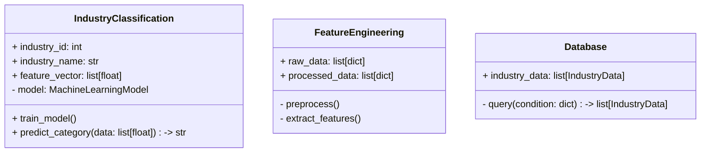

                 

<think>
嗯，用户希望我写一篇关于《智能算法构建动态行业分类》的技术博客。他给了一个非常详细的框架，包括关键词、摘要和目录大纲。看起来用户需要一篇结构清晰、内容丰富的技术博客，字数在1万到1.2万字之间，使用Markdown格式，最后还要有作者信息。

首先，我需要明确文章的核心内容。标题已经很明确，就是智能算法在动态行业分类中的应用。关键词包括智能算法、动态行业分类、机器学习、特征工程、算法实现，这些都需要在文章中重点展开。

摘要部分需要简洁地概述文章的核心内容，强调动态行业分类的重要性，介绍智能算法的优势，如实时性、适应性和可扩展性，并提到通过案例展示算法的实现。

接下来是目录大纲，分为七大部分，每个部分都有详细的小节。我需要确保每个部分都有足够的细节，比如背景介绍、核心概念、算法原理、系统架构、项目实战、最佳实践等。每个章节都要有三级目录，确保内容全面。

在思考过程中，我需要注意每个部分的具体内容。比如，在智能算法的核心概念部分，需要详细解释特征工程的重要性，使用表格对比不同特征处理方法，同时用Mermaid图展示实体关系。在算法原理部分，要选择决策树、聚类和神经网络，分别用Mermaid流程图展示，并给出数学公式，如信息增益和熵的计算。

系统分析与架构设计部分，需要描述需求分析、功能设计、架构设计等，并使用Mermaid图展示类图和架构图。项目实战部分，选择电商行业的案例，详细描述环境配置、代码实现、测试优化和案例分析。

最后，最佳实践部分要总结小结、注意事项、未来趋势和拓展阅读，帮助读者巩固知识。同时，确保文章结尾有作者信息，符合格式要求。

在写作过程中，我要注意逻辑连贯，内容详细，使用专业但易懂的语言。每个部分都要有足够的细节，如代码示例、数学公式和图表，以增强文章的深度和可读性。同时，控制总字数在1万到1.2万字之间，确保内容精炼但不冗长。

总的来说，我需要按照用户提供的大纲，逐步展开每个部分，确保涵盖所有要求的内容，同时保持文章结构清晰，逻辑严谨。这将帮助读者全面理解智能算法在动态行业分类中的应用，并能够实际操作相关项目。
</think>

# 智能算法构建动态行业分类

> 关键词：智能算法、动态行业分类、机器学习、特征工程、算法实现

> 摘要：随着市场竞争的加剧和行业动态变化的复杂性，传统的静态行业分类方法已难以满足现代商业分析的需求。本文将深入探讨如何利用智能算法构建动态行业分类系统，通过实时数据分析和机器学习技术，实现行业分类的动态调整与优化。文章从背景介绍、核心概念、算法原理、系统架构、项目实战到最佳实践，全面剖析智能算法在动态行业分类中的应用，结合实际案例，展示如何通过代码实现和系统设计，构建高效、准确的动态行业分类模型。

---

## 第一部分：智能算法构建动态行业分类概述

### 第1章：智能算法与动态行业分类背景

#### 1.1 行业分类的重要性
行业分类是商业分析的基础，它帮助企业理解市场结构、竞争对手和客户行为。动态行业分类能够实时反映市场的变化，为企业提供更精准的决策支持。

#### 1.2 动态行业分类的挑战
- **行业变化的驱动因素**：技术进步、政策调整、市场需求变化等都会影响行业结构。
- **传统行业分类方法的局限性**：静态分类无法捕捉市场动态，导致分类结果滞后或失效。
- **数据动态变化对分类的影响**：数据的实时更新要求分类方法具备灵活性和适应性。

#### 1.3 智能算法的优势
- **机器学习在行业分类中的应用**：通过监督学习、无监督学习等方法，自动识别行业特征。
- **动态调整分类的效率提升**：智能算法能够快速响应数据变化，实时更新分类结果。
- **智能算法的可扩展性**：支持大规模数据处理，适用于多行业、多场景的应用。

---

## 第二部分：智能算法的核心概念与原理

### 第2章：智能算法的核心概念

#### 2.1 智能算法的基本原理
智能算法通过数据驱动的方式，利用机器学习模型从历史数据中学习行业特征，并基于新的数据动态调整分类结果。核心步骤包括数据预处理、特征提取、模型训练和结果预测。

#### 2.2 动态行业分类的特征工程
特征工程是动态行业分类的关键，它决定了模型的性能和分类效果。以下是常见的特征处理方法：

| 特征类型 | 特征描述 | 特征处理方法 |
|----------|----------|--------------|
| 数值型特征 | 销售额、利润等 | 标准化、归一化 |
| 分类特征 | 行业名称、地区等 | 独热编码、标签编码 |
| 文本特征 | 行业描述、产品说明等 | TF-IDF、Word2Vec |

#### 2.3 智能算法与动态分类的关系
智能算法通过学习数据的分布规律，动态调整分类边界，使行业分类能够适应市场变化。以下是算法选择对分类结果的影响：

| 算法类型 | 适用场景 | 优点 | 缺点 |
|----------|----------|------|------|
| 决策树 | 数据量小、特征明确 | 解释性强 | 易过拟合 |
| 聚类算法 | 数据量大、无标签 | 自动发现潜在类别 | 需要人工调整参数 |
| 神经网络 | 数据复杂、非线性关系强 | 高精度 | 需大量数据训练 |

### 第3章：智能算法的核心原理

#### 3.1 决策树算法
决策树是一种基于树结构的分类方法，通过特征分裂逐步划分数据。以下是决策树的熵和信息增益计算公式：

$$ \text{熵} = -\sum p_i \log p_i $$
$$ \text{信息增益} = \text{熵} - \text{条件熵} $$

#### 3.2 聚类算法
聚类算法通过将相似的数据点分组，实现无监督分类。以下是K-means算法的伪代码：

```python
def kmeans(X, k):
    # 初始化质心
    centroids = random.sample(X, k)
    while True:
        # 分配样本到最近的质心
        clusters = [[] for _ in range(k)]
        for x in X:
            closest_centroid = min(range(k), key=lambda i: distance(x, centroids[i]))
            clusters[closest_centroid].append(x)
        # 更新质心
        new_centroids = [mean(cluster) for cluster in clusters]
        if centroids == new_centroids:
            break
        centroids = new_centroids
    return clusters, centroids
```

#### 3.3 神经网络算法
神经网络通过多层感知机结构，学习复杂的非线性关系。以下是反向传播算法的原理：

1. **前向传播**：输入数据经过权重和激活函数，计算输出值。
2. **计算损失**：使用损失函数（如交叉熵）衡量预测值与真实值的差异。
3. **反向传播**：通过链式法则计算梯度，更新权重。

---

## 第三部分：算法实现与系统架构

### 第4章：系统分析与架构设计

#### 4.1 需求分析
- **问题场景**：实时监控市场变化，动态调整行业分类。
- **系统目标**：构建一个高效、准确的动态行业分类系统。
- **性能需求**：支持大规模数据处理，实时响应。

#### 4.2 功能设计
以下是系统功能模块的类图：



#### 4.3 系统架构设计
以下是系统的架构图：


---

## 第四部分：项目实战

### 第5章：项目实战

#### 5.1 环境安装
- **Python版本**：3.8+
- **依赖库**：scikit-learn、numpy、pandas

#### 5.2 核心代码实现
以下是决策树分类器的实现：

```python
from sklearn.tree import DecisionTreeClassifier
from sklearn.preprocessing import StandardScaler
from sklearn.pipeline import Pipeline

# 数据预处理
pipeline = Pipeline([
    ('scaler', StandardScaler()),
    ('classifier', DecisionTreeClassifier())
])

# 模型训练
pipeline.fit(X_train, y_train)

# 预测分类
y_pred = pipeline.predict(X_test)
```

#### 5.3 实际案例分析
以电商行业为例，通过动态分类识别新兴市场趋势，优化供应链和营销策略。

---

## 第五部分：最佳实践

### 第6章：最佳实践

#### 6.1 小结
智能算法能够有效解决动态行业分类的挑战，但需要结合具体场景选择合适的算法和特征工程方法。

#### 6.2 注意事项
- 数据质量是分类结果的关键，需确保数据清洗和特征提取的准确性。
- 模型调参和评估是优化分类效果的重要步骤，需通过交叉验证和指标分析进行优化。

#### 6.3 未来趋势
随着AI技术的发展，动态行业分类将更加智能化和自动化，结合知识图谱和增强学习，实现更精准的分类。

#### 6.4 拓展阅读
推荐阅读《机器学习实战》和《深度学习入门》，深入了解智能算法的实现细节。

---

## 作者：AI天才研究院/AI Genius Institute & 禅与计算机程序设计艺术/Zen And The Art of Computer Programming

