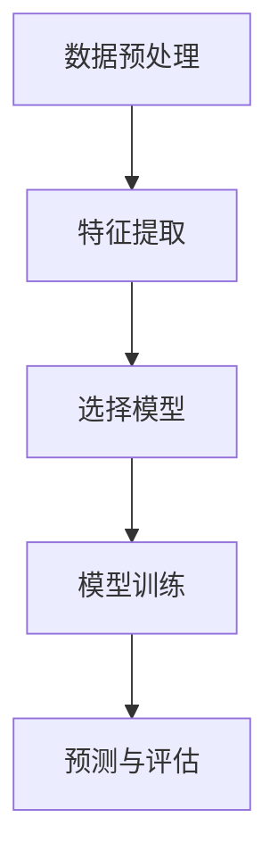
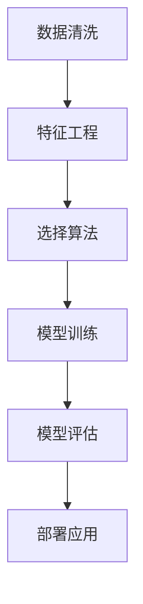
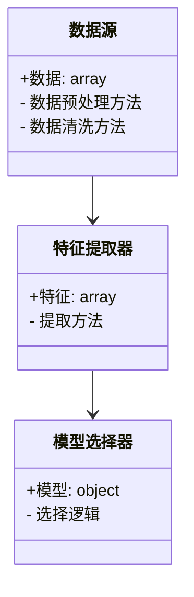
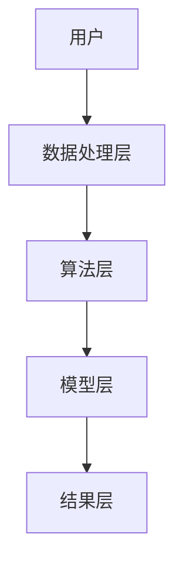

                 


# 智能算法构建动态行业景气指标

## 关键词：智能算法、行业景气指标、动态分析、机器学习、时间序列分析

## 摘要：本文探讨如何利用智能算法构建动态行业景气指标，通过分析行业数据，运用时间序列分析和机器学习模型，实现实时行业趋势预测。文章涵盖概念、算法原理、系统设计和项目实战，为行业分析提供新思路。

---

## 第一部分：行业景气指标与智能算法概述

### 第1章：行业景气指标的基本概念

#### 1.1 行业景气指标的定义与作用

- **行业景气指标**是衡量某一行业在特定时间段内发展状况的量化标准，涵盖行业规模、增长速度、盈利能力等多维度数据。它帮助企业和投资者了解行业趋势，做出战略决策。

- **动态变化的重要性**：行业景气指标并非静态，受市场环境、政策变化和技术进步等因素影响，呈现波动性。动态分析能捕捉这些变化，提供实时洞察。

- **智能算法的应用**：传统方法依赖固定模型和经验判断，而智能算法通过机器学习和大数据分析，能自动适应数据变化，提升预测精度和效率。

#### 1.2 智能算法的基本概念

- **智能算法**指模拟人类智能的算法，包括机器学习、深度学习和自然语言处理等技术。它们擅长处理复杂数据模式，适用于动态指标的构建。

- **优势与特点**：智能算法具有自适应性、高精度和自动化特征。它们能从海量数据中提取价值，实时更新模型，适应动态变化。

- **应用前景**：在金融、医疗和制造业等领域，智能算法已被广泛应用。未来，随着技术进步，其应用范围将更加广泛。

---

## 第二部分：动态行业景气指标的核心概念与联系

### 第2章：动态行业景气指标的核心要素

#### 2.1 动态行业景气指标的构成

- **数据来源与特征**：包括行业报告、市场数据和企业财报等多源数据。这些数据具有实时性、多样性和动态变化的特点。

- **指标权重与计算方法**：不同数据源的重要性不同，需赋予不同权重。动态调整权重能反映变化趋势，提升指标的准确性。

- **动态调整机制**：根据市场变化实时更新指标，确保反映最新行业状况。这需要算法具备自适应能力，能快速响应变化。

#### 2.2 智能算法与行业数据的关系

- **数据预处理**：清洗和特征提取是关键步骤，确保输入数据的质量和一致性。

- **算法选择与模型构建**：选择合适的算法，如时间序列分析和机器学习模型，构建预测模型。

- **模型训练与优化**：通过训练数据优化模型参数，提升预测精度。

---

## 第三部分：智能算法的原理与实现

### 第3章：时间序列分析与预测算法

#### 3.1 时间序列分析的基本原理

- **时间序列的分解与特征提取**：将序列分解为趋势、周期性和随机成分，提取有用特征用于预测。

- **常见预测模型**：介绍ARIMA、LSTM等模型。ARIMA适合平稳序列，LSTM适合有复杂模式的序列。

#### 3.2 基于机器学习的行业景气预测

- **机器学习算法的选择**：根据数据特性选择线性回归或随机森林等算法。

- **特征工程与数据预处理**：处理缺失值、标准化数据，提取特征。

- **模型训练与评估**：训练模型并评估其性能，选择最佳模型。

---

## 第四部分：数学模型与算法流程图

### 第4章：数学模型与公式

#### 4.1 时间序列分析模型

- **ARIMA模型**：公式为 ARIMA(p, d, q)，用于预测平稳序列。

- **LSTM模型**：公式为 f(t) = LSTM(x_t, h_{t-1})，适合捕捉长期依赖关系。

#### 4.2 机器学习模型的数学基础

- **线性回归模型**：公式为 y = β0 + β1x + ε。

- **神经网络模型**：激活函数如ReLU：f(x) = max(0, x)。

### 第5章：算法流程图

#### 5.1 时间序列预测流程图



#### 5.2 机器学习模型构建流程图



---

## 第五部分：系统分析与架构设计方案

### 第5章：系统功能设计

#### 5.1 领域模型类图



#### 5.2 系统架构设计



---

## 第六部分：项目实战

### 第6章：环境安装与核心代码实现

#### 6.1 环境安装

- **安装Python和相关库**：如numpy、pandas、sklearn、keras等。

#### 6.2 核心代码实现

- **数据预处理**：清洗和特征提取。

```python
import pandas as pd
import numpy as np

data = pd.read_csv('industry_data.csv')
data = data.dropna()
```

- **模型训练**：使用机器学习模型。

```python
from sklearn.ensemble import RandomForestRegressor

model = RandomForestRegressor()
model.fit(X_train, y_train)
```

#### 6.3 案例分析

- **预测结果展示**：通过可视化工具展示预测趋势。

---

## 第七部分：优化与扩展

### 第7章：优化算法性能

- **优化策略**：参数调优、模型集成等。

### 第8章：扩展应用场景

- **新领域的应用**：将算法应用于其他行业分析。

---

## 结语

本文系统地介绍了智能算法在动态行业景气指标构建中的应用，从理论到实践，提供了详细的实现步骤和案例分析。未来，随着技术进步，智能算法将在行业分析中发挥更大作用。

---

## 作者：AI天才研究院/AI Genius Institute & 禅与计算机程序设计艺术 /Zen And The Art of Computer Programming

