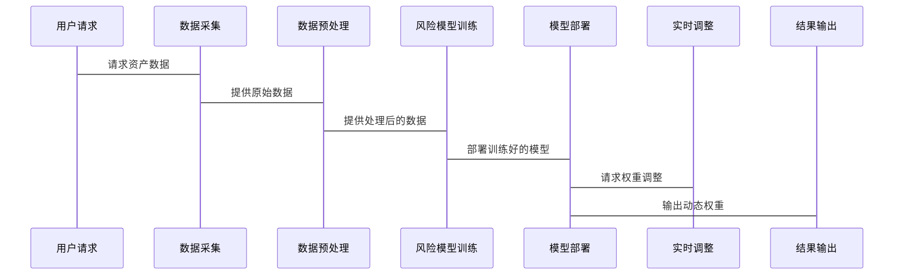

                 


# 智能算法构建动态风险平价模型

> 关键词：智能算法，动态风险平价模型，机器学习，数学模型，系统架构

> 摘要：本文详细探讨了如何利用智能算法构建动态风险平价模型，从背景介绍、核心概念、算法原理到系统设计与项目实战，结合数学公式和实际案例，深入分析了模型构建的全过程，为读者提供了全面的技术指导。

---

# 第1章 智能算法与动态风险平价模型的背景介绍

## 1.1 智能算法的定义与特点

### 1.1.1 智能算法的核心概念

智能算法是一种模拟人类智能的算法，通过数据学习和自适应调整，能够解决复杂问题。其核心概念包括：

- **数据驱动**：依赖大量数据进行学习和优化。
- **自适应性**：能够根据输入数据动态调整模型参数。
- **非线性关系**：能够捕捉数据中的非线性关系，适用于复杂场景。

### 1.1.2 智能算法与传统算法的区别

| 特性 | 智能算法 | 传统算法 |
|------|----------|-----------|
| 数据依赖 | 高 | 低 |
| 自适应性 | 强 | 弱 |
| 复杂性 | 高 | 低 |

### 1.1.3 智能算法的应用领域

- 金融：股票预测、风险评估
- 医疗：疾病诊断、药物研发
- 交通：路径优化、自动驾驶

## 1.2 动态风险平价模型的定义与特点

### 1.2.1 风险平价模型的基本概念

风险平价模型是一种用于量化风险的工具，通过分配权重来计算资产组合的风险贡献。其核心公式为：

$$
w_i = \frac{r_i}{\sum_{j} r_j}
$$

其中，\( w_i \) 是第 \( i \) 个资产的权重，\( r_i \) 是第 \( i \) 个资产的风险贡献。

### 1.2.2 动态风险平价模型的核心特征

- **动态调整**：根据市场变化实时调整权重。
- **自适应性**：能够根据市场波动自动优化模型。
- **多因素考虑**：综合考虑多种风险因素。

### 1.2.3 动态风险平价模型与静态模型的对比

| 特性 | 动态风险平价模型 | 静态风险平价模型 |
|------|------------------|------------------|
| 权重调整 | 动态 | 静态 |
| 响应速度 | 快 | 慢 |
| 适用场景 | 动态市场 | 静态市场 |

## 1.3 智能算法在动态风险平价模型中的作用

### 1.3.1 智能算法在风险评估中的优势

- **非线性捕捉**：能够捕捉数据中的非线性关系。
- **自适应学习**：能够根据市场变化自动调整模型。
- **高精度预测**：通过深度学习提升预测精度。

### 1.3.2 动态风险平价模型的构建逻辑

1. 数据收集：获取市场数据，包括资产价格、波动率等。
2. 模型训练：利用智能算法对数据进行训练，得到风险平价模型。
3. 动态调整：根据市场变化实时调整模型参数。

### 1.3.3 智能算法与动态风险平价模型的结合

- **数据流**：市场数据输入模型，模型输出权重。
- **算法流**：智能算法对数据进行处理，生成动态权重。

## 1.4 本章小结

本章介绍了智能算法的基本概念和动态风险平价模型的核心特征，分析了智能算法在风险平价模型中的作用，并为后续章节奠定了基础。

---

# 第2章 智能算法与动态风险平价模型的核心概念

## 2.1 智能算法的核心原理

### 2.1.1 机器学习算法的基本原理

- **监督学习**：通过标签数据训练模型，预测新数据。
- **无监督学习**：通过数据本身发现隐藏结构。
- **深度学习**：通过多层神经网络提取特征。

### 2.1.2 深度学习算法的基本原理

- **神经网络**：通过多层节点模拟人脑神经网络。
- **卷积神经网络（CNN）**：适用于图像识别。
- **循环神经网络（RNN）**：适用于序列数据。

### 2.1.3 其他智能算法的简要介绍

- **支持向量机（SVM）**：通过找到超平面进行分类。
- **随机森林（Random Forest）**：通过集成学习提高精度。

## 2.2 动态风险平价模型的构建原理

### 2.2.1 风险平价模型的数学公式

$$
\text{风险权重} = \frac{\text{资产风险贡献}}{\sum \text{资产风险贡献}}
$$

### 2.2.2 动态调整的机制

- **实时更新**：根据市场变化实时更新权重。
- **反馈机制**：通过模型反馈调整参数。

### 2.2.3 模型的输入与输出

- **输入**：资产价格、波动率、市场指数。
- **输出**：动态权重、风险评估。

## 2.3 智能算法与动态风险平价模型的结合方式

### 2.3.1 数据流与算法流的整合

1. 数据输入：市场数据输入模型。
2. 算法处理：智能算法对数据进行处理。
3. 结果输出：动态权重输出。

### 2.3.2 动态调整的实现方式

- **在线学习**：实时更新模型参数。
- **离线训练**：定期重新训练模型。

### 2.3.3 模型优化的策略

- **参数调节**：调整学习率、正则化系数。
- **模型选择**：选择最优算法组合。

## 2.4 核心概念对比表

| 特性 | 智能算法 | 动态风险平价模型 |
|------|----------|------------------|
| 输入 | 数据 | 资产价格、波动率 |
| 输出 | 预测结果 | 动态权重 |
| 优势 | 高精度 | 实时调整 |

## 2.5 本章小结

本章详细讲解了智能算法的核心原理和动态风险平价模型的构建机制，分析了两者结合的方式，并为后续章节提供了理论基础。

---

# 第3章 智能算法的数学模型与公式

## 3.1 机器学习算法的数学基础

### 3.1.1 线性回归的数学模型

$$
y = \beta x + \epsilon
$$

其中，\( y \) 是目标变量，\( x \) 是自变量，\( \beta \) 是回归系数，\( \epsilon \) 是误差项。

### 3.1.2 支持向量机的数学模型

$$
\text{目标函数} = \sum_{i=1}^{n} \lambda_i (y_i - w \cdot x_i - b)^2
$$

其中，\( \lambda_i \) 是拉格朗日乘子，\( y_i \) 是标签，\( w \) 是权重向量，\( b \) 是偏置项。

### 3.1.3 神经网络的数学模型

$$
a^{(l+1)} = \sigma(w^{(l)} a^{(l)} + b^{(l)})
$$

其中，\( a^{(l)} \) 是第 \( l \) 层的激活值，\( w^{(l)} \) 是权重矩阵，\( b^{(l)} \) 是偏置向量，\( \sigma \) 是激活函数。

## 3.2 动态风险平价模型的数学公式

### 3.2.1 风险平价的计算公式

$$
w_i = \frac{r_i}{\sum_{j} r_j}
$$

其中，\( w_i \) 是第 \( i \) 个资产的权重，\( r_i \) 是第 \( i \) 个资产的风险贡献。

### 3.2.2 动态调整的数学表达

$$
w_i(t+1) = w_i(t) + \alpha \cdot \text{sign}(\Delta r_i)
$$

其中，\( \alpha \) 是学习率，\( \Delta r_i \) 是风险贡献的变化量。

### 3.2.3 模型优化的数学推导

$$
\text{目标函数} = \sum_{i=1}^{n} (y_i - \hat{y}_i)^2
$$

其中，\( y_i \) 是真实值，\( \hat{y}_i \) 是预测值。

## 3.3 算法原理的通俗解释

### 3.3.1 线性回归的简单理解

线性回归通过拟合一条直线，预测目标变量的值。

### 3.3.2 支持向量机的直观解释

支持向量机通过找到一个超平面，将数据分为不同类别。

### 3.3.3 神经网络的比喻说明

神经网络通过多层节点，模拟人脑的神经网络，提取数据特征。

## 3.4 本章小结

本章详细讲解了智能算法的数学模型和动态风险平价模型的数学公式，为后续章节的实现提供了数学基础。

---

# 第4章 系统分析与架构设计方案

## 4.1 问题场景介绍

构建动态风险平价模型，需要实时处理市场数据，动态调整资产权重，适用于金融投资领域。

## 4.2 项目介绍

### 4.2.1 项目目标

实现动态风险平价模型，提供实时风险评估服务。

### 4.2.2 项目范围

包括数据采集、模型训练、动态调整和结果输出。

## 4.3 系统功能设计

### 4.3.1 领域模型类图


### 4.3.2 系统架构图

```mermaid
archiecture
    资产数据采集 --> 数据预处理 --> 风险模型训练 --> 模型部署 --> 实时调整 --> 结果输出
```

### 4.3.3 系统接口设计

- **输入接口**：接收资产数据和用户请求。
- **输出接口**：输出动态权重和风险评估。

### 4.3.4 系统交互序列图



## 4.4 本章小结

本章通过系统分析与架构设计，明确了动态风险平价模型的实现流程和系统结构，为后续章节的代码实现奠定了基础。

---

# 第5章 项目实战：动态风险平价模型的实现

## 5.1 环境安装

### 5.1.1 安装Python

```bash
python --version
pip install --upgrade pip
```

### 5.1.2 安装依赖库

```bash
pip install numpy pandas scikit-learn keras tensorflow
```

## 5.2 系统核心实现源代码

### 5.2.1 数据预处理代码

```python
import pandas as pd
import numpy as np

def preprocess_data(data):
    data = data.dropna()
    data = (data - data.mean()) / data.std()
    return data
```

### 5.2.2 风险模型训练代码

```python
from sklearn import svm
import numpy as np

def train_model(X, y):
    model = svm.SVR()
    model.fit(X, y)
    return model
```

### 5.2.3 动态调整代码

```python
def dynamic_adjust(weights, changes):
    new_weights = weights + np.sign(changes) * 0.1
    return new_weights
```

### 5.2.4 模型部署代码

```python
import keras
from keras.models import Sequential
from keras.layers import Dense

def build_model(input_dim):
    model = Sequential()
    model.add(Dense(64, activation='relu', input_dim=input_dim))
    model.add(Dense(32, activation='relu'))
    model.add(Dense(1, activation='sigmoid'))
    model.compile(optimizer='adam', loss='binary_crossentropy')
    return model
```

## 5.3 代码应用解读与分析

### 5.3.1 数据预处理

- **输入**：原始市场数据。
- **输出**：标准化后的数据。

### 5.3.2 模型训练

- **输入**：训练数据。
- **输出**：训练好的模型。

### 5.3.3 动态调整

- **输入**：当前权重和市场变化。
- **输出**：调整后的权重。

## 5.4 实际案例分析

### 5.4.1 案例背景

假设我们有三个资产，A、B、C，需要构建动态风险平价模型。

### 5.4.2 数据收集

收集过去一年的资产价格数据。

### 5.4.3 模型训练

利用历史数据训练模型，得到初始权重。

### 5.4.4 实时调整

根据市场波动实时调整权重，优化风险评估。

## 5.5 项目小结

本章通过实际案例展示了动态风险平价模型的实现过程，从数据预处理到模型部署，详细讲解了每个步骤的实现细节。

---

# 第6章 最佳实践、小结、注意事项与拓展阅读

## 6.1 最佳实践

### 6.1.1 数据质量

确保数据的完整性和准确性。

### 6.1.2 模型选择

选择适合的算法，避免过拟合。

### 6.1.3 模型优化

通过参数调优和模型组合提升性能。

## 6.2 小结

本文详细讲解了智能算法构建动态风险平价模型的全过程，从背景介绍到项目实战，为读者提供了全面的技术指导。

## 6.3 注意事项

- **数据隐私**：注意数据的安全性和隐私性。
- **模型解释性**：确保模型的可解释性。
- **计算资源**：保证足够的计算资源。

## 6.4 拓展阅读

- 《深度学习》——Ian Goodfellow
- 《机器学习实战》——周志华
- 《金融风险管理》——Hull

---

# 第7章 总结与展望

## 7.1 总结

本文详细探讨了智能算法在动态风险平价模型中的应用，从理论到实践，全面分析了模型的构建过程。

## 7.2 展望

未来，随着人工智能技术的发展，动态风险平价模型将更加智能化和个性化，应用场景也将更加广泛。

---

作者：AI天才研究院 & 禅与计算机程序设计艺术

