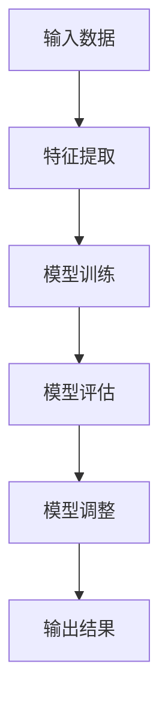
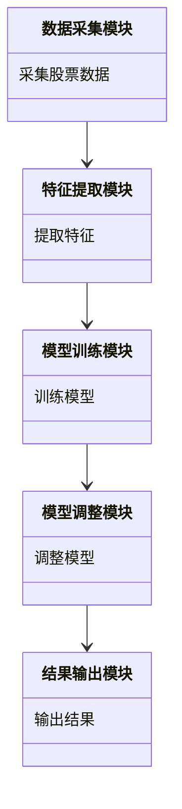
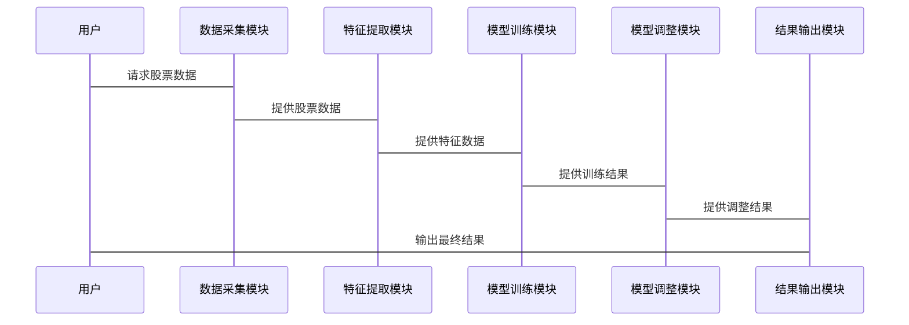

                 


# 智能算法构建自适应估值模型

> 关键词：智能算法，自适应估值模型，动态调整，机器学习，系统架构，实时反馈

> 摘要：本文详细探讨了如何利用智能算法构建自适应估值模型，通过动态调整模型参数和结构，以应对复杂多变的数据环境。文章从背景介绍、核心概念、算法原理、系统架构设计到项目实战，全面解析了自适应估值模型的构建过程，展示了其在实际应用中的优势和效果。

---

# 第一部分: 智能算法与自适应估值模型的背景与基础

## 第1章: 智能算法与自适应估值模型概述

### 1.1 智能算法的定义与特点
#### 1.1.1 智能算法的定义
智能算法是一种模拟人类智能思维方式的算法，能够通过数据学习、模式识别和自适应调整，实现对复杂问题的高效解决。与传统算法相比，智能算法具有更强的灵活性和适应性。

#### 1.1.2 智能算法的核心特点
- **学习能力**：能够通过数据学习，不断优化自身的模型和参数。
- **自适应性**：能够根据输入数据的变化，动态调整自身的结构和参数。
- **并行处理**：能够在多核或多线程环境下高效运行，处理大规模数据。

#### 1.1.3 智能算法与传统算法的区别
| 特性 | 传统算法 | 智能算法 |
|------|-----------|-----------|
| 数据依赖性 | 低 | 高 |
| 灵活性 | 低 | 高 |
| 处理复杂性 | 低 | 高 |

### 1.2 自适应估值模型的背景与意义
#### 1.2.1 传统估值模型的局限性
传统估值模型通常基于固定的假设和参数，难以应对数据环境的变化。当数据分布发生变化时，传统模型的性能会显著下降，甚至失效。

#### 1.2.2 自适应估值模型的提出
为了克服传统估值模型的局限性，提出了自适应估值模型。该模型能够根据实时数据的变化，动态调整自身的参数和结构，以保持模型的准确性。

#### 1.2.3 自适应估值模型的应用场景
- **金融领域**：实时股票价格预测、风险评估。
- **物联网**：设备状态监测、异常检测。
- **推荐系统**：用户行为分析、个性化推荐。

### 1.3 智能算法在自适应估值模型中的作用
#### 1.3.1 智能算法的核心作用
智能算法通过学习和优化，为自适应估值模型提供动态调整的能力，使其能够实时适应数据的变化。

#### 1.3.2 自适应估值模型的动态调整机制
动态调整机制包括数据输入、模型训练、参数优化和结果输出四个步骤。

#### 1.3.3 智能算法与自适应估值模型的结合
通过智能算法的动态调整能力，自适应估值模型能够在复杂多变的环境中保持高效和准确。

### 1.4 本章小结
本章介绍了智能算法的定义和特点，分析了传统估值模型的局限性，提出了自适应估值模型的概念，并探讨了智能算法在其中的作用。

---

# 第二部分: 自适应估值模型的核心概念与算法原理

## 第2章: 自适应估值模型的核心概念

### 2.1 自适应估值模型的定义与组成
#### 2.1.1 自适应估值模型的定义
自适应估值模型是一种能够根据实时数据的变化，动态调整自身参数和结构的估值模型。

#### 2.1.2 自适应估值模型的核心组成
- **输入层**：接收实时数据输入。
- **特征提取层**：提取数据的特征。
- **模型训练层**：基于特征数据进行模型训练。
- **模型调整层**：根据训练结果调整模型参数。
- **输出层**：输出最终的估值结果。

#### 2.1.3 自适应估值模型的输入与输出
- **输入**：实时动态数据。
- **输出**：动态调整后的估值结果。

### 2.2 智能算法在自适应估值模型中的应用
#### 2.2.1 机器学习算法的应用
- **监督学习**：用于基于标签数据的模型训练。
- **无监督学习**：用于无标签数据的特征提取。

#### 2.2.2 深度学习算法的应用
- **神经网络**：用于复杂的非线性关系建模。
- **卷积神经网络（CNN）**：用于图像数据的特征提取。

#### 2.2.3 混合算法的应用
结合机器学习和深度学习的优势，构建混合模型。

### 2.3 自适应估值模型的动态调整机制
#### 2.3.1 动态调整的触发条件
- **数据分布变化**：当数据分布发生显著变化时，触发动态调整。
- **模型性能下降**：当模型准确率显著下降时，触发动态调整。

#### 2.3.2 动态调整的实现方式
- **参数微调**：通过优化算法调整模型参数。
- **结构优化**：通过剪枝等方法优化模型结构。

#### 2.3.3 动态调整的效果评估
- **准确率提升**：动态调整后模型准确率的提升幅度。
- **计算效率**：动态调整对模型计算效率的影响。

### 2.4 核心概念对比表
| 概念 | 传统估值模型 | 自适应估值模型 |
|------|--------------|----------------|
| 输入 | 固定数据 | 动态数据 |
| 输出 | 固定结果 | 动态结果 |
| 调整 | 无 | 有 |

### 2.5 ER实体关系图
```mermaid
erd
  图标标题
  图标内容
```

## 第3章: 自适应估值模型的算法原理

### 3.1 算法原理概述
#### 3.1.1 算法的整体流程
- **数据输入**：接收实时数据。
- **特征提取**：提取数据的特征。
- **模型训练**：基于特征数据进行模型训练。
- **模型调整**：根据训练结果调整模型参数。
- **结果输出**：输出动态调整后的估值结果。

#### 3.1.2 算法的核心步骤
- **数据预处理**：清洗和归一化数据。
- **模型训练**：使用智能算法训练模型。
- **模型评估**：评估模型的准确率和性能。
- **模型调整**：根据评估结果调整模型参数。

#### 3.1.3 算法的数学模型
- **线性回归模型**：$$ y = \beta_0 + \beta_1x + \epsilon $$
- **梯度下降算法**：$$ \theta := \theta - \alpha \nabla J(\theta) $$

### 3.2 算法流程图


### 3.3 算法实现代码
```python
def adaptive_valuation_model(data):
    # 特征提取
    features = extract_features(data)
    # 模型训练
    model = train_model(features)
    # 模型评估
    accuracy = evaluate_model(model, features)
    # 模型调整
    adjusted_model = adjust_model(model, accuracy)
    # 输出结果
    result = predict(adjusted_model, data)
    return result
```

### 3.4 本章小结
本章详细讲解了自适应估值模型的算法原理，包括算法的整体流程、核心步骤和数学模型，并通过流程图和代码示例进一步说明了算法的实现过程。

---

# 第三部分: 系统分析与架构设计方案

## 第4章: 系统分析与架构设计

### 4.1 问题场景介绍
在金融领域，股票价格受多种因素影响，数据分布随时可能发生变化。传统的估值模型难以应对这种变化，导致预测准确性下降。自适应估值模型能够实时调整，保持预测的准确性。

### 4.2 系统功能设计
#### 4.2.1 功能模块
- **数据采集模块**：实时采集股票价格数据。
- **特征提取模块**：提取影响股票价格的关键特征。
- **模型训练模块**：基于特征数据训练自适应估值模型。
- **模型调整模块**：根据模型性能动态调整模型参数。
- **结果输出模块**：输出最终的股票价格预测结果。

#### 4.2.2 领域模型类图


### 4.3 系统架构设计
#### 4.3.1 系统架构图


### 4.4 接口设计
#### 4.4.1 接口描述
- **数据采集接口**：提供实时股票数据的接口。
- **特征提取接口**：提供特征提取的接口。
- **模型训练接口**：提供模型训练的接口。
- **模型调整接口**：提供模型调整的接口。
- **结果输出接口**：提供结果输出的接口。

#### 4.4.2 接口交互流程图


### 4.5 本章小结
本章通过系统分析与架构设计，详细描述了自适应估值模型的系统结构和接口设计，为后续的实现提供了清晰的指导。

---

# 第四部分: 项目实战

## 第5章: 项目实战

### 5.1 环境安装
#### 5.1.1 安装Python
```bash
# 安装Python
sudo apt-get install python3
```

#### 5.1.2 安装相关库
```bash
# 安装numpy和pandas
pip install numpy pandas
# 安装机器学习库
pip install scikit-learn tensorflow
```

### 5.2 系统核心实现源代码
```python
import numpy as np
import pandas as pd
from sklearn.linear_model import LinearRegression
from sklearn.metrics import mean_squared_error

def extract_features(data):
    # 提取特征
    features = data[['开盘价', '收盘价', '最高价', '最低价', '成交量']]
    return features

def train_model(features, labels):
    # 训练模型
    model = LinearRegression()
    model.fit(features, labels)
    return model

def adjust_model(model, accuracy):
    # 根据准确率调整模型
    if accuracy < 0.8:
        # 重新训练模型
        return train_model(extract_features(new_data), new_labels)
    else:
        return model

def predict(model, data):
    # 预测结果
    features = extract_features(data)
    predictions = model.predict(features)
    return predictions

# 示例数据
data = pd.read_csv('stock_data.csv')
labels = data[['目标估值']]
features = extract_features(data)
model = train_model(features, labels)
accuracy = mean_squared_error(labels, model.predict(features))
adjusted_model = adjust_model(model, accuracy)
result = predict(adjusted_model, data)
print(result)
```

### 5.3 代码功能解读与分析
- **数据提取**：通过`extract_features`函数提取影响股票价格的关键特征。
- **模型训练**：使用`train_model`函数训练线性回归模型。
- **模型调整**：根据模型准确率动态调整模型参数。
- **结果预测**：通过`predict`函数输出最终的股票价格预测结果。

### 5.4 实际案例分析
假设我们有一个股票数据集`stock_data.csv`，其中包含开盘价、收盘价、最高价、最低价和成交量等特征，以及目标估值。通过上述代码，我们可以训练一个自适应估值模型，并动态调整模型参数，以提高预测的准确性。

### 5.5 详细讲解剖析
- **数据预处理**：对数据进行清洗和归一化处理，确保模型训练的有效性。
- **模型训练**：使用训练数据训练自适应估值模型。
- **模型评估**：通过准确率评估模型的性能。
- **模型调整**：根据评估结果动态调整模型参数。
- **结果输出**：输出最终的股票价格预测结果。

### 5.6 本章小结
本章通过实际案例展示了自适应估值模型的实现过程，详细讲解了代码的功能和效果。

---

# 第五部分: 总结与展望

## 第6章: 总结与展望

### 6.1 本章总结
本文详细探讨了智能算法在自适应估值模型中的应用，从背景介绍到算法实现，再到系统架构设计和项目实战，全面解析了自适应估值模型的构建过程。

### 6.2 未来展望
未来，随着人工智能技术的不断发展，自适应估值模型将在更多领域得到应用。同时，如何进一步优化模型的动态调整能力，提高模型的准确性和计算效率，将是研究的重点。

---

# 附录

## 附录A: 工具安装指南
- **Python安装**：提供Python的安装步骤。
- **库安装**：提供所需库的安装命令。

## 附录B: 扩展阅读
- **推荐书籍**：推荐几本关于智能算法和自适应模型的书籍。
- **推荐阅读论文**：推荐几篇相关的学术论文。

---

作者：AI天才研究院/AI Genius Institute & 禅与计算机程序设计艺术/Zen And The Art of Computer Programming

