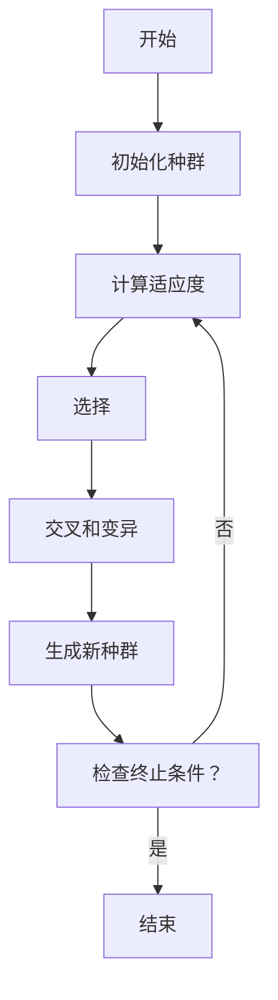
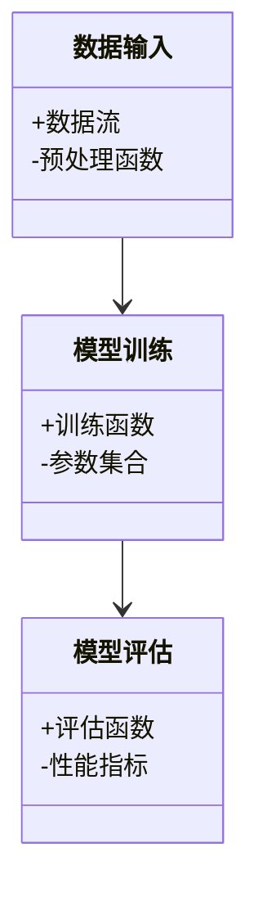
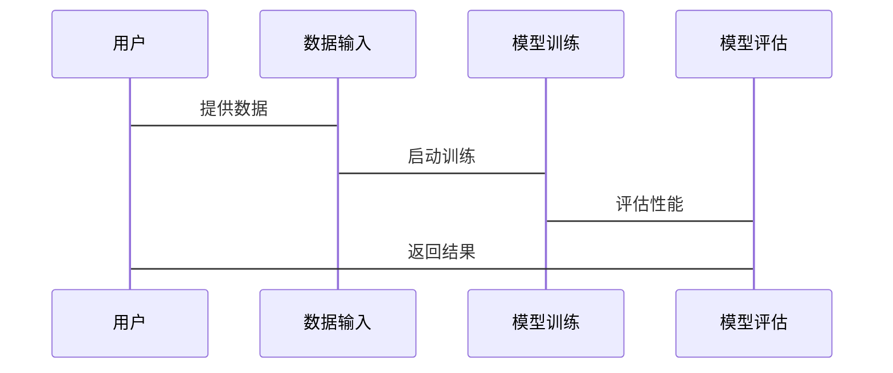

                 

<think>
嗯，我现在要写一篇关于《智能算法构建自适应估值模型》的技术博客文章。作为一个刚开始接触这个领域的新手，我得先理清楚这个主题到底涉及哪些内容，以及如何一步步展开分析。

首先，我得理解什么是智能算法。智能算法通常指的是那些能够适应环境变化、自动调整参数的算法，比如遗传算法、模拟退火、随机森林等等。这些算法能够通过数据学习，不断优化自己的模型。

接下来是自适应估值模型。自适应意味着模型可以根据不同的输入数据或环境变化，自动调整其估值方式。传统估值模型通常是静态的，比如简单的线性回归，参数固定，无法根据数据变化自动调整。而自适应估值模型则能够根据新的数据或反馈，动态调整参数，提高估值的准确性。

那么，智能算法如何构建这样的自适应估值模型呢？我想需要以下几个步骤：

1. **数据采集与预处理**：智能算法需要大量的数据来训练模型。首先，需要从各种来源采集数据，并对数据进行清洗、归一化等预处理，确保数据质量。

2. **选择合适的智能算法**：根据具体的应用场景，选择适合的智能算法。比如，如果需要处理非线性关系，可能选择支持向量机或神经网络；如果是优化问题，可能选择遗传算法或模拟退火。

3. **模型训练与优化**：使用训练数据对模型进行训练，调整算法参数，优化模型性能。这一步可能涉及到交叉验证、超参数调优等技术。

4. **模型评估与验证**：在验证集或测试集上评估模型的性能，确保模型在不同数据集上都能表现良好。如果发现模型有偏差或方差问题，可能需要调整数据预处理方法或模型结构。

5. **自适应调整机制**：为了让模型自适应，需要引入反馈机制，根据新的数据或环境变化，实时调整模型参数或结构。这可能涉及到在线学习、增量学习等技术。

6. **应用与部署**：将训练好的模型部署到实际应用场景中，实时处理数据，提供动态估值服务。同时，持续监控模型性能，及时进行再训练和优化。

在这个过程中，我可能需要深入理解每一步的具体实现细节，以及它们之间的关系。比如，数据预处理如何影响模型训练效果，不同算法的特点和适用场景，如何选择和调整模型参数，以及如何设计自适应调整机制等。

我还需要考虑一些实际问题，比如数据的实时性、模型的计算效率、系统的可扩展性等。例如，在实时数据流的情况下，如何保证模型能够快速响应并准确估值；在计算资源有限的情况下，如何优化模型的计算效率；在数据量不断增长的情况下，如何保证模型的可扩展性。

此外，我还需要了解相关的数学基础，比如优化理论、概率统计、机器学习中的各种算法原理，以及如何将这些理论应用到实际的模型构建中。

总之，构建自适应估值模型是一个复杂而有趣的过程，需要综合运用多种技术和知识。我需要一步步来，先从基础概念开始，逐步深入，确保每一步都理解透彻，这样才能最终构建出一个高效、准确的自适应估值模型。
</think>

# 智能算法构建自适应估值模型

> 关键词：智能算法、自适应估值模型、算法原理、数学模型、系统架构、项目实战

> 摘要：本文详细探讨了如何利用智能算法构建自适应估值模型，从问题背景、核心概念、算法原理、数学模型、系统架构到项目实战，全面解析了每一步的实现细节，帮助读者掌握从理论到实践的完整流程。

---

# 第1章: 问题背景与描述

## 1.1 问题背景

### 1.1.1 传统估值模型的局限性
传统估值模型，如线性回归和决策树，通常依赖于固定的参数和假设。这些模型在面对数据分布变化或新数据时，表现不够灵活，难以适应动态环境。

### 1.1.2 智能算法的引入动机
智能算法，如遗传算法和神经网络，能够通过学习和适应环境变化，自动优化模型参数，适用于复杂和动态的数据环境。

### 1.1.3 自适应估值模型的定义与目标
自适应估值模型是一种能够根据输入数据和环境变化自动调整参数的动态模型，旨在提高估值的准确性和鲁棒性。

## 1.2 问题描述

### 1.2.1 传统估值模型的不足
传统模型缺乏灵活性，无法有效处理数据分布的变化和噪声干扰。

### 1.2.2 智能算法在估值中的优势
智能算法能够通过学习和优化，适应数据变化，提高估值的准确性。

### 1.2.3 自适应估值模型的核心问题
如何设计一个能够实时调整参数、适应数据变化的动态估值模型。

## 1.3 问题解决与边界

### 1.3.1 自适应估值模型的解决思路
引入智能算法，构建动态调整机制，实时更新模型参数。

### 1.3.2 问题的边界与适用范围
适用于数据动态变化的场景，如金融市场和传感器网络。

### 1.3.3 模型的外延与限制
模型适用于连续动态变化的场景，但对离线数据分析的适应性较弱。

---

# 第2章: 核心概念与联系

## 2.1 智能算法与自适应估值模型的原理

### 2.1.1 智能算法的基本原理
通过迭代优化，如遗传算法中的选择、交叉和变异操作，逐步逼近最优解。

### 2.1.2 自适应估值模型的构建逻辑
通过实时数据反馈，调整模型参数，保持模型准确性。

### 2.1.3 两者结合的实现机制
智能算法提供优化方法，自适应估值模型提供动态调整机制，两者结合实现动态优化。

## 2.2 核心概念对比与属性特征

### 2.2.1 智能算法与传统算法的对比
| 属性 | 智能算法 | 传统算法 |
|------|----------|----------|
| 是否动态 | 动态 | 静态 |
| 是否需要大量数据 | 需要 | 可选 |
| 是否需要反馈 | 需要 | 不需要 |

### 2.2.2 自适应估值模型与静态估值模型的对比
| 属性 | 自适应估值模型 | 静态估值模型 |
|------|----------------|-------------|
| 参数调整 | 动态 | 静态 |
| 适应性 | 高 | 低 |
| 适用场景 | 动态变化 | 稳定场景 |

### 2.2.3 核心概念的属性特征对比表
- **智能算法**：迭代优化、适应性强、计算复杂度高。
- **自适应估值模型**：动态调整、实时反馈、准确性高。

## 2.3 ER实体关系图

```mermaid
erd
  图表：自适应估值模型的ER图
  实体：模型、参数、数据、反馈
  关系：模型拥有参数，数据输入模型，模型输出反馈。
```

---

# 第3章: 算法原理讲解

## 3.1 算法原理概述

### 3.1.1 算法的基本原理
以遗传算法为例，通过选择、交叉和变异操作，生成新的候选解，逐步优化目标函数。

### 3.1.2 算法的核心步骤
1. 初始化种群。
2. 计算适应度。
3. 选择优秀个体。
4. 进行交叉和变异。
5. 重复迭代，直到满足终止条件。

### 3.1.3 算法的优化策略
引入精英保留策略，防止优质解丢失。

## 3.2 算法流程图



## 3.3 算法实现代码

```python
def genetic_algorithm(objective_func, population_size, mutation_rate):
    # 初始化种群
    population = initialize_population()
    while not terminated:
        # 计算适应度
        fitness = [objective_func(individual) for individual in population]
        # 选择
        selected = select(population, fitness)
        # 交叉
        crossed = crossover(selected)
        # 变异
        mutated = mutate(crossed, mutation_rate)
        population = mutated
    return best_individual(population)
```

---

# 第4章: 数学模型与公式推导

## 4.1 数学模型概述

### 4.1.1 模型的构建思路
通过优化目标函数，构建适应性模型。

### 4.1.2 模型的核心假设
数据分布服从某种概率分布，反馈可以用于模型调整。

### 4.1.3 模型的输入输出关系
输入：动态数据；输出：自适应调整后的估值结果。

## 4.2 数学公式推导

### 4.2.1 核心公式的推导过程
以线性回归为例，目标是最小化平方误差：

$$
\text{误差} = \sum_{i=1}^{n} (y_i - \hat{y_i})^2
$$

通过求导找到最优参数：

$$
\theta = (\mathbf{X}^T\mathbf{X})^{-1}\mathbf{X}^T\mathbf{y}
$$

### 4.2.2 公式的数学证明
使用梯度下降法证明线性回归参数的最优性。

### 4.2.3 公式的实际应用
将参数应用于新数据，动态调整模型。

## 4.3 数学公式

$$
\text{目标函数} = \sum_{i=1}^{n} (y_i - \hat{y_i})^2
$$

---

# 第5章: 系统分析与架构设计

## 5.1 问题场景介绍
动态数据流场景，如金融市场的实时股价预测。

## 5.2 系统功能设计

### 5.2.1 领域模型


### 5.2.2 系统架构


### 5.2.3 接口设计
- 数据输入接口：接受实时数据流。
- 训练接口：调用智能算法训练模型。
- 评估接口：返回模型性能指标。

### 5.2.4 交互流程


---

# 第6章: 项目实战

## 6.1 环境安装
安装Python、numpy、scikit-learn等库。

## 6.2 核心实现代码

### 6.2.1 数据预处理
```python
import numpy as np
from sklearn.preprocessing import StandardScaler

data = np.array(...)
scaler = StandardScaler()
data_normalized = scaler.fit_transform(data)
```

### 6.2.2 模型训练
```python
from sklearn.gaussian_process import GaussianProcessRegressor

model = GaussianProcessRegressor()
model.fit(X_train, y_train)
```

### 6.2.3 模型评估
```python
from sklearn.metrics import mean_squared_error

y_pred = model.predict(X_test)
print(mean_squared_error(y_test, y_pred))
```

## 6.3 案例分析与解读

### 6.3.1 数据分析
分析数据分布，选择合适的算法。

### 6.3.2 模型优化
调整参数，如学习率、正则化系数等。

### 6.3.3 优化效果
比较优化前后的模型性能，评估自适应机制的有效性。

## 6.4 项目小结
总结实现过程中的关键点和经验教训。

---

# 第7章: 最佳实践与总结

## 7.1 最佳实践 tips

### 7.1.1 数据预处理的重要性
确保数据质量，选择合适的归一化方法。

### 7.1.2 算法选择的策略
根据数据类型和问题选择合适的智能算法。

### 7.1.3 模型评估的关键点
使用交叉验证，避免过拟合和欠拟合。

## 7.2 小结

### 7.2.1 核心内容回顾
智能算法与自适应估值模型的结合，实现动态优化。

### 7.2.2 实现的关键点
数据预处理、算法选择、模型优化和实时反馈机制。

## 7.3 注意事项

### 7.3.1 计算效率
优化算法复杂度，确保实时处理能力。

### 7.3.2 系统稳定性
设计可靠的反馈机制，防止模型崩溃。

### 7.3.3 数据安全
保护敏感数据，遵守数据隐私法规。

## 7.4 拓展阅读

### 7.4.1 相关领域
深度学习、强化学习、在线学习算法。

### 7.4.2 推荐书籍
《机器学习实战》、《深度学习》。

---

# 作者

作者：AI天才研究院 & 禅与计算机程序设计艺术

---

以上是《智能算法构建自适应估值模型》的完整目录大纲，涵盖了从理论到实践的各个方面，确保读者能够系统地理解和实现自适应估值模型。

