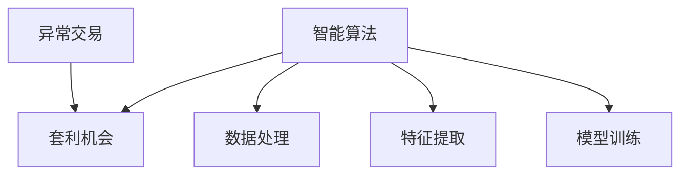
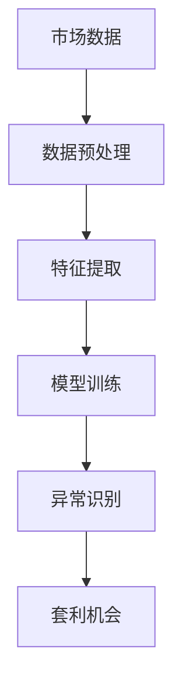
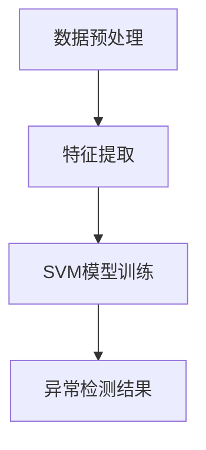
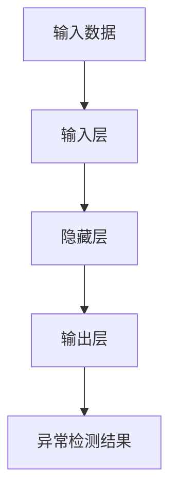
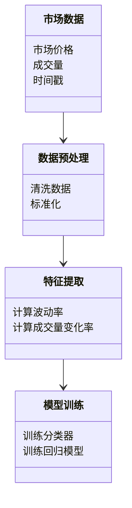
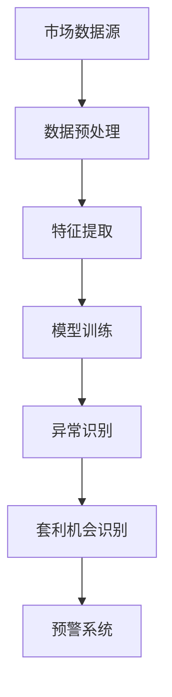
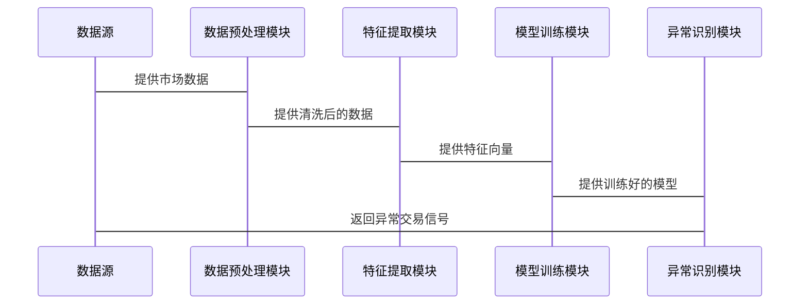

                 


# 智能算法识别市场异常与套利机会

## 关键词：智能算法、金融市场、异常交易、套利机会、机器学习、深度学习、算法原理

## 摘要：智能算法在金融市场中的应用日益广泛，特别是在识别市场异常交易和套利机会方面。本文从背景、核心概念、算法原理、系统设计、项目实战等多个维度，详细分析了智能算法在识别市场异常与套利机会中的作用和实现方法。文章通过具体案例和数学模型，深入探讨了多种算法的应用场景和优势，为读者提供了理论和实践相结合的全面指导。

---

## 第一部分: 智能算法识别市场异常与套利机会的背景与核心概念

### 第1章: 问题背景与目标

#### 1.1 问题背景介绍

##### 1.1.1 金融市场中的异常交易与套利现象

金融市场中的异常交易是指偏离正常市场规律的交易行为，通常表现为价格的突然波动、成交量的异常变化等。套利机会则是指利用市场价差或信息不对称，通过低买高卖或相反操作获利的机会。这两种现象在金融市场中普遍存在，但它们的出现往往具有隐蔽性和短暂性，难以被传统的人工分析所及时捕捉。

##### 1.1.2 智能算法在金融领域的应用现状

随着计算机技术的发展，智能算法（如机器学习、深度学习等）在金融领域的应用越来越广泛。智能算法能够快速处理海量数据，发现隐藏在数据中的模式和规律，从而帮助交易员、投资机构等做出更明智的决策。特别是在高频交易和量化投资领域，智能算法已经成为不可或缺的工具。

##### 1.1.3 本研究的目标与意义

本研究旨在探讨智能算法在识别市场异常交易和套利机会中的应用。通过对异常交易的识别和套利机会的预测，帮助投资者和交易机构在复杂的金融市场中找到获利的机会，同时减少因异常交易带来的市场波动风险。

#### 1.2 核心概念与问题描述

##### 1.2.1 异常交易的定义与分类

异常交易可以分为以下几类：
- **市场操纵**：通过虚假交易或散布谣言 manipulate 市场价格。
- **高频交易异常**：高频交易导致短时间内价格剧烈波动。
- **突发事件引发的异常**：如自然灾害、政策变化等突发事件导致的市场异常。

##### 1.2.2 套利机会的识别与分类

套利机会主要分为以下几种：
- **跨市场套利**：利用不同市场之间的价格差异进行套利。
- **时间套利**：利用同一资产在不同时间点的价格差异进行套利。
- **统计套利**：基于统计模型发现的价格偏离均值的机会。

##### 1.2.3 智能算法的核心优势与局限性

**核心优势**：
- 高效性：能够快速处理海量数据，发现隐藏的模式。
- 精准性：通过复杂的数学模型提高识别的准确性。
- 自适应性：能够根据市场变化动态调整模型。

**局限性**：
- 对数据的依赖性强，数据质量直接影响算法性能。
- 模型过拟合风险：可能导致算法在训练数据上表现优异，但在实际市场中效果不佳。
- 市场变化的不可预测性：智能算法难以完全捕捉市场中的所有因素。

#### 1.3 问题解决思路与边界

##### 1.3.1 智能算法在识别异常交易中的应用

智能算法可以通过分析历史数据，识别出潜在的异常交易模式。例如，使用聚类分析识别交易量突然增加的股票，或使用异常检测算法识别价格波动异常的情况。

##### 1.3.2 套利机会的算法识别框架

套利机会的识别框架通常包括以下几个步骤：
1. 数据收集：收集相关市场的历史数据和实时数据。
2. 数据预处理：清洗数据，去除噪声。
3. 特征提取：提取有助于识别套利机会的特征。
4. 模型训练：训练分类器或回归模型，识别套利机会。
5. 风险评估：评估套利机会的风险，决定是否进行交易。

##### 1.3.3 问题解决的边界与外延

智能算法的应用需要明确边界，例如：
- 数据范围：限定在某一时间段或特定市场。
- 风险控制：设定止损点，防止亏损过大。
- 法律合规：确保套利行为不违反相关法律法规。

#### 1.4 核心概念结构与要素

##### 1.4.1 异常交易与套利机会的关系

异常交易和套利机会密切相关。异常交易可能导致价格偏离正常水平，从而产生套利机会。套利机会的存在也可能引发异常交易，例如套利者为了获利而大量买入或卖出资产，导致价格波动异常。

##### 1.4.2 智能算法的核心要素与功能模块

智能算法的核心要素包括：
- 数据来源：市场数据、新闻数据等。
- 数据处理：数据清洗、特征提取。
- 模型选择：分类器、回归模型等。
- 模型训练：使用训练数据训练模型。
- 模型评估：测试模型的准确性和稳定性。

##### 1.4.3 核心概念的系统架构图（Mermaid）



---

## 第二部分: 算法原理与数学模型

### 第2章: 智能算法的核心概念与联系

#### 2.1 智能算法的原理与特点

##### 2.1.1 机器学习算法的原理

机器学习算法通过学习数据中的模式和规律，生成能够预测新数据的模型。常用的机器学习算法包括支持向量机（SVM）、随机森林（Random Forest）、神经网络等。

##### 2.1.2 深度学习算法的特点

深度学习是一种机器学习的分支，通过多层神经网络模型来学习数据的高层次特征。深度学习在处理复杂数据和非线性关系方面具有显著优势。

##### 2.1.3 异常检测与套利识别的算法对比

异常检测和套利识别在算法选择上有所不同：
- 异常检测通常使用无监督学习算法，如孤立森林（Isolation Forest）和基于聚类的方法。
- 套利识别通常使用监督学习算法，如逻辑回归和随机森林。

#### 2.2 核心概念的属性特征对比

##### 2.2.1 不同算法的性能对比表格

| 算法类型      | 监督学习 | 无监督学习 | 深度学习 |
|---------------|----------|------------|----------|
| 代表算法      | SVM、LR  | K-means   | CNN、RNN |
| 适用场景      | 套利识别 | 异常检测   | 复杂模式识别 |
| 优势          | 高准确性 | 发现潜在模式 | 处理复杂数据 |
| 局限性         | 数据需求高 | 需要人工干预 | 计算资源消耗大 |

##### 2.2.2 算法适用场景的对比分析

- **监督学习**：适用于已知类别标签的数据，如套利机会的分类。
- **无监督学习**：适用于未知类别标签的数据，如异常交易的检测。
- **深度学习**：适用于处理高维数据和复杂模式，如图像识别和自然语言处理。

#### 2.3 实体关系图与系统架构

##### 2.3.1 实体关系图（Mermaid）



---

## 第三部分: 算法原理与数学模型

### 第3章: 异常检测算法原理

#### 3.1 异常检测算法的分类

##### 3.1.1 基于统计的方法

基于统计的方法通过分析数据的分布情况，识别偏离正常分布的点。常用的方法包括z-score方法和Grubbs检验。

##### 3.1.2 基于机器学习的方法

基于机器学习的异常检测方法包括聚类分析、孤立森林等。

##### 3.1.3 基于深度学习的方法

基于深度学习的异常检测方法包括自动编码器（Autoencoder）和生成对抗网络（GAN）。

#### 3.2 基于支持向量机的异常检测

##### 3.2.1 SVM算法原理

支持向量机（SVM）是一种监督学习算法，适用于分类问题。SVM通过找到一个超平面，将数据分成两类，使得两类数据的间隔最大化。

##### 3.2.2 SVM算法的数学模型

$$ \text{目标函数: } \min_{w,b,\xi} \frac{1}{2}||w||^2 + C\sum_{i=1}^n \xi_i $$
$$ \text{约束条件: } y_i(w \cdot x_i + b) \geq 1 - \xi_i $$
$$ \xi_i \geq 0 $$

##### 3.2.3 SVM算法的流程图（Mermaid）



#### 3.3 基于神经网络的异常检测

##### 3.3.1 神经网络算法的原理

神经网络是一种模仿人脑结构的算法，通过多层神经元之间的连接来学习数据的特征。

##### 3.3.2 神经网络的数学模型

神经网络的前向传播过程可以表示为：
$$ a^{(l+1)} = \sigma(w^{(l)} a^{(l)} + b^{(l)}) $$
其中，$\sigma$ 是激活函数，$w$ 是权重矩阵，$b$ 是偏置。

##### 3.3.3 神经网络的流程图（Mermaid）



---

## 第四部分: 系统分析与架构设计

### 第4章: 系统分析与架构设计

#### 4.1 问题场景介绍

系统需要实时监测多个市场的数据，识别异常交易和套利机会，并发出预警信号。

#### 4.2 系统功能设计

##### 4.2.1 领域模型（Mermaid 类图）



#### 4.3 系统架构设计

##### 4.3.1 系统架构图（Mermaid）



#### 4.4 系统接口设计

系统需要与数据源、交易系统和预警系统进行交互。

#### 4.5 系统交互设计（Mermaid 序列图）



---

## 第五部分: 项目实战

### 第5章: 项目实战

#### 5.1 环境安装与配置

需要安装 Python、numpy、pandas、scikit-learn 等库。

#### 5.2 核心代码实现

##### 5.2.1 数据预处理代码

```python
import pandas as pd
import numpy as np

# 读取数据
data = pd.read_csv('market_data.csv')

# 数据清洗
data.dropna(inplace=True)
data = data[~data['volume'].is outlier]

# 标准化
from sklearn.preprocessing import StandardScaler
scaler = StandardScaler()
data_normalized = scaler.fit_transform(data[['open', 'high', 'low', 'close', 'volume']])
```

##### 5.2.2 特征提取代码

```python
import pandas as pd
import numpy as np
from sklearn.manifold import IsolationForest

# 计算波动率
data['volatility'] = np.log(data['close'] / data['open']).abs()

# 计算成交量变化率
data['volume_change_rate'] = data['volume'].pct_change()

# 提取特征
features = data[['volatility', 'volume_change_rate']]
```

##### 5.2.3 模型训练代码

```python
from sklearn.ensemble import IsolationForest

# 训练模型
model = IsolationForest(n_estimators=100, contamination=0.1)
model.fit(features)

# 预测异常值
data['is_anomaly'] = model.predict(features)
```

#### 5.3 案例分析与解读

以某只股票为例，分析异常交易的发生和套利机会的识别。

#### 5.4 项目小结

通过实际案例分析，验证了智能算法在识别市场异常和套利机会中的有效性。

---

## 第六部分: 总结与展望

### 第6章: 总结与展望

#### 6.1 最佳实践 tips

- 数据质量是关键，确保数据的完整性和准确性。
- 模型选择要结合实际场景，选择合适的算法。
- 风险控制是套利策略的重要组成部分。

#### 6.2 小结

智能算法在识别市场异常和套利机会方面具有显著优势，但需要结合实际场景进行调整和优化。

#### 6.3 注意事项

- 避免模型过拟合。
- 注意市场规则和法律法规。
- 定期更新模型，适应市场变化。

#### 6.4 拓展阅读

推荐阅读相关领域的书籍和论文，深入学习智能算法在金融领域的应用。

---

## 作者

作者：AI天才研究院/AI Genius Institute & 禅与计算机程序设计艺术/Zen And The Art of Computer Programming

