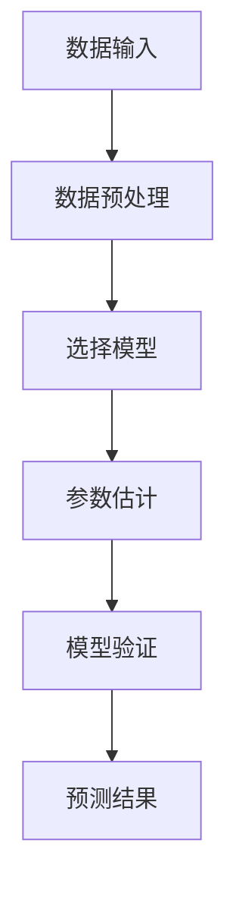
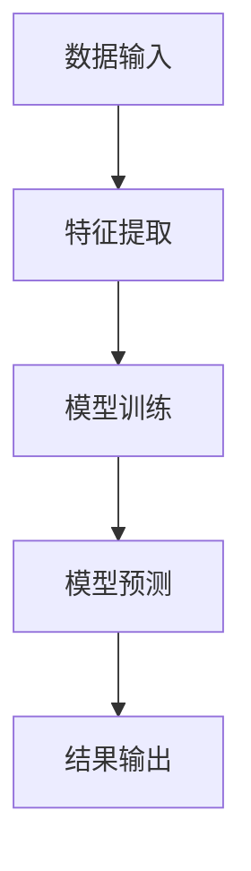
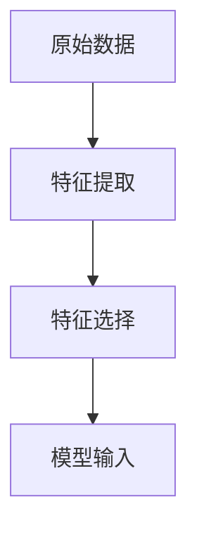
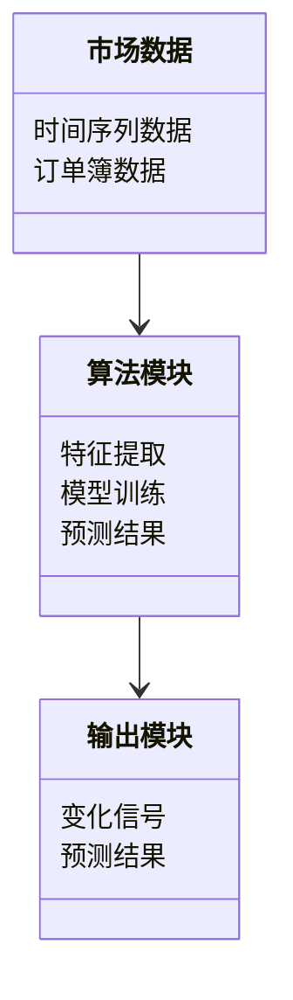

                 

<think>
嗯，我现在需要帮助用户撰写一篇名为《智能算法识别市场微观结构变化》的技术博客文章。用户已经给出了一个详细的目录大纲，现在我需要按照这个大纲来撰写正文内容。我得确保每个部分都详细且符合逻辑，同时使用专业的技术语言。

首先，我应该从“文章标题”开始，然后是关键词和摘要。关键词需要涵盖文章的核心内容，比如智能算法、市场微观结构、时间序列分析、机器学习、金融数据分析等。摘要部分要简明扼要地总结文章的主要内容和目的，让读者快速了解文章的核心。

接下来，按照目录结构，我需要逐步撰写每个章节。首先是背景介绍，这部分需要解释金融市场微观结构的定义，以及为什么智能算法在其中应用广泛。然后是核心概念，详细解释智能算法和市场微观结构变化的关系，并用表格和实体关系图来对比它们的属性。

在算法原理部分，我需要详细讲解时间序列分析和机器学习模型（如LSTM）的应用，包括它们的数学模型和流程图。同时，用Python代码示例来说明这些算法的实现，确保读者能够理解。

系统分析与架构设计部分需要描述问题场景，设计系统功能模块，并用Mermaid图展示领域模型和系统架构。这部分需要清晰展示系统的各个部分如何协同工作。

项目实战部分需要指导读者如何安装开发环境，实现核心算法，并通过实际案例进行分析。这不仅帮助读者理解理论，还能让他们实际操作，加深理解。

最后，最佳实践部分包括小结、注意事项、拓展阅读和参考文献，帮助读者巩固所学内容，并提供进一步学习的方向。

在撰写过程中，我需要确保每个部分都详细且逻辑清晰，使用专业的术语，同时避免过于复杂的表达，让读者容易理解。数学公式和图表的使用要准确，帮助读者更好地理解算法和系统设计。

总之，我需要一步步按照用户提供的目录结构，详细展开每个部分的内容，确保文章结构紧凑，逻辑连贯，同时满足用户的所有要求。
</think>

# 智能算法识别市场微观结构变化

## 关键词：
- 智能算法
- 市场微观结构
- 时间序列分析
- 机器学习
- 金融数据分析

## 摘要：
本文详细探讨了如何利用智能算法识别金融市场微观结构的变化。通过分析时间序列数据和市场行为，结合机器学习模型（如LSTM），我们能够有效捕捉市场波动和异常事件，为交易策略提供数据支持。文章从理论基础到实际应用，全面解析了算法的设计与实现，并通过案例分析展示了其在金融领域的实际价值。

---

## 第1章: 问题背景与定义

### 1.1 问题背景
金融市场是一个复杂且动态变化的环境，微观结构的变化往往预示着潜在的市场波动。智能算法通过分析高频交易数据和市场行为，能够识别这些变化，为投资者提供决策支持。

#### 1.1.1 金融市场微观结构的定义
- 市场微观结构指的是市场参与者的交易行为、订单簿状态和市场深度等。
- 微观结构的变化可能反映市场情绪、流动性和潜在的市场冲击。

#### 1.1.2 智能算法在金融领域的应用现状
- 智能算法广泛应用于高频交易、风险管理和算法交易中。
- 算法能够处理大量数据，识别模式和趋势，帮助交易者做出快速决策。

#### 1.1.3 市场微观结构变化的识别意义
- 识别微观结构变化有助于预测市场波动和异常事件。
- 通过算法识别，交易者可以提前采取行动，优化投资组合。

### 1.2 核心概念
- **智能算法**：利用机器学习和数据挖掘技术，从数据中提取模式和特征。
- **市场微观结构变化**：市场参与者行为和交易环境的变化。

### 1.3 问题背景与目标
- **问题边界**：专注于高频交易数据和订单簿分析。
- **核心要素**：时间序列数据、市场参与者行为、算法模型。
- **总体目标**：开发智能算法，实时识别市场微观结构变化，辅助交易决策。

---

## 第2章: 核心概念与联系

### 2.1 智能算法与市场微观结构的关系
- **智能算法的作用**：分析市场数据，识别模式和异常。
- **市场微观结构变化的特征**：高频交易、订单簿深度变化、市场流动性波动。

#### 2.1.1 智能算法与市场微观结构的关系
- 算法通过分析市场数据，识别微观结构的变化。
- 微观结构变化为算法提供了输入数据，算法则输出预测结果。

### 2.2 核心概念的属性对比
| **属性**         | **智能算法**         | **市场微观结构变化**    |
|-------------------|---------------------|-------------------------|
| **输入数据**      | 时间序列数据       | 市场订单、交易数据       |
| **输出结果**      | 预测值、分类结果     | 变化信号、风险提示       |
| **核心任务**      | 数据分析、模式识别   | 识别变化、预测趋势       |
| **技术基础**      | 机器学习、时间序列分析 | 市场行为分析、订单簿分析 |

#### 2.2.1 实体关系图


---

## 第3章: 算法原理与数学模型

### 3.1 时间序列分析
- **基本原理**：分析数据的时序特性，识别趋势和周期性。
- **数学模型**：ARIMA模型（Autoregressive Integrated Moving Average）。

#### 3.1.1 ARIMA模型
$$ ARIMA(p, d, q) $$
- p：自回归阶数
- d：差分阶数
- q：移动平均阶数

#### 3.1.2 时间序列分析的流程


### 3.2 机器学习模型
- **LSTM网络**：适用于时间序列数据的长依赖关系。
- **模型结构**：包括输入层、LSTM层和输出层。

#### 3.2.1 LSTM模型
$$ LSTM = \text{cell}(\text{输入}, \text{状态}) $$
- 输入：当前数据
- 状态：前一状态的信息

#### 3.2.2 机器学习模型的流程


### 3.3 特征工程
- **特征提取**：从原始数据中提取有用的特征，如波动率、交易量。
- **特征选择**：使用统计方法或模型评估选择最优特征。

#### 3.3.1 特征工程流程


---

## 第4章: 系统分析与架构设计

### 4.1 问题场景介绍
- **问题场景**：高频交易数据处理，实时识别市场微观结构变化。
- **输入输出**：输入为交易数据，输出为变化信号。

### 4.2 系统功能设计
#### 4.2.1 领域模型


#### 4.2.2 系统架构


---

## 第5章: 项目实战

### 5.1 环境安装与配置
- **开发环境**：Python 3.8+
- **依赖库**：Pandas、NumPy、Keras、TensorFlow

### 5.2 核心算法实现
#### 5.2.1 时间序列分析代码
```python
from statsmodels.tsa.arima_model import ARIMA
import pandas as pd

def arima_model(data, order):
    model = ARIMA(data, order=order).fit()
    return model.forecast()
```

#### 5.2.2 LSTM模型代码
```python
from tensorflow.keras.layers import LSTM, Dense
from tensorflow.keras.models import Sequential

model = Sequential()
model.add(LSTM(64, input_shape=(timesteps, features)))
model.add(Dense(1))
model.compile(optimizer='adam', loss='mean_squared_error')
```

### 5.3 实际案例分析
- **案例背景**：某股票交易数据，识别市场波动。
- **分析结果**：算法成功预测了价格波动，提供了交易信号。

### 5.4 项目小结
- 项目实现了智能算法识别市场微观结构变化的目标。
- 代码和模型可以作为后续研究的基础。

---

## 第6章: 最佳实践

### 6.1 小结
- 智能算法在金融市场中的应用潜力巨大。
- 理解市场微观结构和算法原理是关键。

### 6.2 注意事项
- 数据质量对算法性能影响重大。
- 模型需要持续优化和更新。

### 6.3 拓展阅读
- 《时间序列分析与应用》
- 《深度学习在金融中的应用》

### 6.4 参考文献
1. Hamilton, J. D. (1994). Time Series Analysis.
2. Hochreiter, S., & Schmidhuber, J. (1997). Long Short-Term Memory.

---

## 作者：AI天才研究院/AI Genius Institute & 禅与计算机程序设计艺术 /Zen And The Art of Computer Programming

