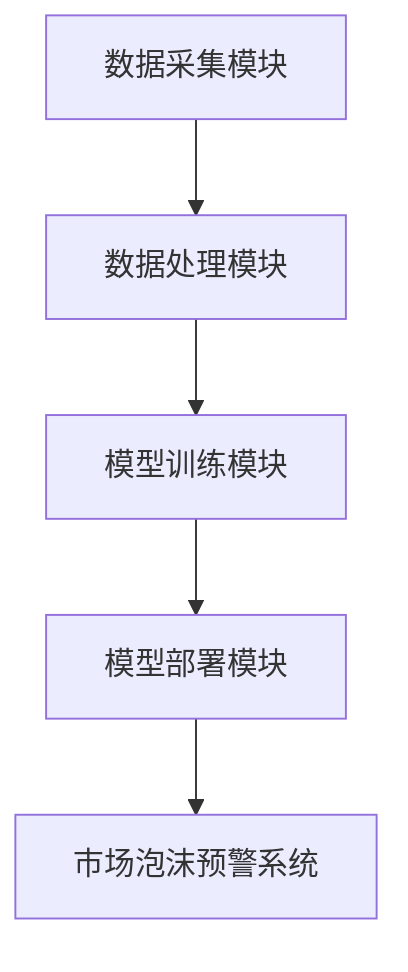
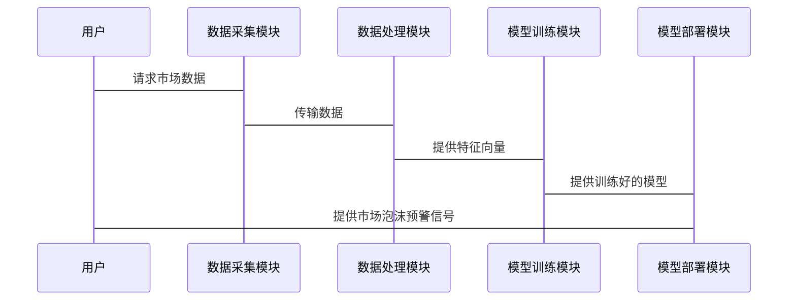

                 


# 智能算法识别市场泡沫形成

> **关键词**: 智能算法、市场泡沫、时间序列分析、机器学习、系统设计  
> **摘要**: 本文深入探讨了如何利用智能算法识别市场泡沫的形成过程。通过分析市场泡沫的定义、特征及其形成机制，结合时间序列分析、机器学习等技术，提出了一种基于智能算法的市场泡沫识别方法。本文详细介绍了算法的原理、实现步骤以及系统设计，并通过实际案例展示了算法的应用效果。通过本文的研究，读者可以全面了解智能算法在金融市场中的应用，掌握市场泡沫识别的核心技术与方法。

---

## 第一章: 市场泡沫的基础知识

### 1.1 市场泡沫的定义与特征

#### 1.1.1 市场泡沫的定义  
市场泡沫是指资产价格在短时间内急剧上涨，远远超过其实际价值，最终导致价格 collapse 的现象。市场泡沫通常发生在金融市场中，如股票、房地产、加密货币等领域。  

#### 1.1.2 市场泡沫的主要特征  
市场泡沫的形成通常伴随着以下特征：  
- **价格偏离实际价值**：资产价格远高于其内在价值。  
- **投资者情绪高涨**：市场参与者盲目乐观，追求短期收益。  
- **杠杆效应放大**：通过杠杆交易进一步推高价格。  
- **成交量激增**：交易量在泡沫形成期间显著增加。  

#### 1.1.3 市场泡沫的形成机制  
市场泡沫的形成机制可以分为以下几个阶段：  
1. **积累阶段**：市场参与者逐渐对某种资产产生乐观预期，价格开始缓慢上升。  
2. **膨胀阶段**：价格快速上涨，吸引更多投资者进入，形成正反馈循环。  
3. **破裂阶段**：市场参与者意识到价格过高，开始抛售资产，价格迅速下跌。  

### 1.2 智能算法在市场分析中的作用  

#### 1.2.1 智能算法的定义与特点  
智能算法是一种基于人工智能技术的算法，能够通过数据学习和模式识别，自动做出决策或预测。其主要特点包括：  
- **数据驱动**：依赖大量数据进行学习和推理。  
- **自适应性**：能够根据市场变化自动调整模型参数。  
- **高精度**：通过复杂的数学模型提高预测的准确性。  

#### 1.2.2 智能算法在市场分析中的优势  
智能算法在市场分析中的优势主要体现在以下几个方面：  
- **快速识别模式**：能够从海量数据中快速识别出市场泡沫的早期信号。  
- **实时预测**：可以实时监控市场动态，提供及时的预测和预警。  
- **自动化决策**：能够在短时间内完成数据分析和决策过程，提高效率。  

#### 1.2.3 市场泡沫识别的必要性  
市场泡沫的识别对于投资者和监管机构来说至关重要。通过及时识别市场泡沫，可以采取相应的措施避免更大的经济损失，同时为政策制定者提供参考依据。

---

## 第二章: 常用智能算法简介  

### 2.1 机器学习算法  

#### 2.1.1 监督学习  
监督学习是一种基于 labeled 数据的机器学习方法，通过训练数据学习输入与输出之间的关系。  
- **线性回归**：用于预测连续型变量，例如股票价格。  
- **支持向量机 (SVM)**：用于分类问题，例如判断市场是否处于泡沫状态。  

#### 2.1.2 无监督学习  
无监督学习是一种基于无 labeled 数据的机器学习方法，通过聚类分析发现数据中的隐含模式。  
- **K-means 聚类**：用于将市场数据分成不同的类别，识别异常波动。  

#### 2.1.3 强化学习  
强化学习是一种通过试错方式优化决策策略的机器学习方法。  
- **Q-Learning**：用于动态市场环境下的决策优化。  

### 2.2 时间序列分析算法  

#### 2.2.1 ARIMA 模型  
ARIMA（自回归积分滑动平均模型）是一种广泛应用于时间序列预测的模型。  
- **ARIMA(p, d, q)**：  
  - p：自回归阶数  
  - d：差分阶数  
  - q：移动平均阶数  

#### 2.2.2 LSTM 网络  
长短期记忆网络（LSTM）是一种特殊的 RNN，能够有效处理时间序列数据中的长距离依赖关系。  

#### 2.2.3 GARCH 模型  
广义自回归条件异方差模型（GARCH）用于预测金融时间序列的波动性。  

### 2.3 数据挖掘与特征提取  

#### 2.3.1 数据预处理  
- **缺失值处理**：例如使用均值、中位数或插值方法填补缺失数据。  
- **数据标准化**：例如使用归一化方法将数据缩放到统一范围。  

#### 2.3.2 特征选择  
- **相关性分析**：通过计算特征之间的相关性，剔除冗余特征。  
- **主成分分析 (PCA)**：通过降维方法提取主要特征。  

#### 2.3.3 数据可视化  
- **折线图**：用于展示时间序列数据的变化趋势。  
- **散点图**：用于展示不同特征之间的关系。  

---

## 第三章: 时间序列分析与市场预测  

### 3.1 时间序列分析的基本原理  

#### 3.1.1 时间序列的组成部分  
时间序列通常由以下几部分组成：  
- **趋势**：长期趋势的变化。  
- **季节性**：周期性波动。  
- **随机性**：不可预测的噪声。  

#### 3.1.2 时间序列的分解方法  
时间序列分解可以通过以下步骤进行：  
1. **趋势提取**：使用移动平均法或多项式拟合提取趋势成分。  
2. **季节性提取**：使用傅里叶变换或差分方法提取季节性成分。  
3. **残差分析**：分析剩余的随机成分。  

### 3.2 基于机器学习的市场预测  

#### 3.2.1 数据特征提取  
- **技术指标**：例如 MACD、RSI 等。  
- **市场情绪指标**：例如投资者信心指数。  

#### 3.2.2 模型训练与优化  
- **训练数据**：使用历史价格数据训练模型。  
- **模型优化**：通过交叉验证调整模型参数。  

#### 3.2.3 模型评估与验证  
- **均方误差 (MSE)**：用于衡量预测值与实际值的差异。  
- **准确率**：用于衡量分类模型的预测准确度。  

### 3.3 市场泡沫识别的算法流程  

#### 3.3.1 数据收集与清洗  
- **数据来源**：例如金融数据 API、数据库等。  
- **数据清洗**：处理缺失值、异常值等。  

#### 3.3.2 特征工程  
- **特征提取**：例如从价格数据中提取波动率、收益率等特征。  
- **特征选择**：使用统计方法或机器学习方法选择重要特征。  

#### 3.3.3 模型训练与部署  
- **模型训练**：使用训练数据训练机器学习模型。  
- **模型部署**：将模型部署到实时监控系统中，进行市场泡沫识别。  

---

## 第四章: 数学模型与算法实现  

### 4.1 时间序列分析的数学模型  

#### 4.1.1 ARIMA 模型的数学公式  
$$ ARIMA(p, d, q) $$  
其中，p 表示自回归阶数，d 表示差分阶数，q 表示移动平均阶数。  

#### 4.1.2 LSTM 网络的数学公式  
$$ f(t) = \text{LSTM}(f(t-1), x(t)) $$  
其中，$f(t)$ 表示当前时刻的状态，$x(t)$ 表示当前时刻的输入。  

### 4.2 机器学习模型的数学基础  

#### 4.2.1 线性回归模型  
$$ y = \beta_0 + \beta_1x + \epsilon $$  
其中，$\beta_0$ 和 $\beta_1$ 是模型参数，$\epsilon$ 是误差项。  

#### 4.2.2 支持向量机模型  
$$ \text{maximize } \frac{1}{2}\|w\|^2 $$  
其中，$w$ 是模型的权重向量，$C$ 是惩罚系数。  

#### 4.2.3 随机森林模型  
随机森林是一种基于决策树的集成学习方法，通过投票机制进行分类或回归。  

### 4.3 算法实现的步骤与流程  

#### 4.3.1 数据预处理  
- **数据清洗**：处理缺失值、异常值等。  
- **数据标准化**：例如使用归一化方法将数据缩放到统一范围。  

#### 4.3.2 模型训练  
- **训练数据**：使用历史价格数据训练模型。  
- **模型优化**：通过交叉验证调整模型参数。  

#### 4.3.3 模型评估  
- **均方误差 (MSE)**：用于衡量预测值与实际值的差异。  
- **准确率**：用于衡量分类模型的预测准确度。  

---

## 第五章: 系统设计与架构  

### 5.1 系统功能需求分析  

#### 5.1.1 数据采集模块  
- **功能**：实时采集市场数据，例如股票价格、交易量等。  
- **输入**：金融数据 API 或数据库。  
- **输出**：清洗后的数据。  

#### 5.1.2 数据处理模块  
- **功能**：对采集到的数据进行预处理和特征提取。  
- **输入**：清洗后的数据。  
- **输出**：特征向量。  

#### 5.1.3 模型训练模块  
- **功能**：使用特征向量训练市场泡沫识别模型。  
- **输入**：特征向量。  
- **输出**：训练好的模型。  

#### 5.1.4 模型部署模块  
- **功能**：将训练好的模型部署到实时监控系统中。  
- **输入**：实时市场数据。  
- **输出**：市场泡沫预警信号。  

### 5.2 系统架构设计  

#### 5.2.1 系统功能架构  


#### 5.2.2 系统交互流程  


---

## 第六章: 项目实战与案例分析  

### 6.1 环境安装  

#### 6.1.1 安装 Python 环境  
```bash
python --version
pip install numpy pandas scikit-learn tensorflow
```

#### 6.1.2 安装金融数据 API  
```bash
pip install pandas-datareader
```

### 6.2 核心实现源代码  

#### 6.2.1 数据采集代码  
```python
import pandas as pd
from pandas_datareader import DataReader

def get_stock_data(ticker, start, end):
    data = DataReader(ticker, 'yahoo', start, end)
    return data['Close']
```

#### 6.2.2 数据处理代码  
```python
import numpy as np
from sklearn.preprocessing import StandardScaler

def preprocess_data(data):
    # 计算技术指标
    data['MA_20'] = data['Close'].rolling(20).mean()
    data['RSI'] = compute_rsi(data['Close'])
    # 标准化数据
    scaler = StandardScaler()
    normalized_data = scaler.fit_transform(data[['Close', 'MA_20', 'RSI']])
    return normalized_data
```

#### 6.2.3 模型训练代码  
```python
from sklearn.ensemble import RandomForestClassifier
from sklearn.metrics import accuracy_score

def train_model(X, y):
    model = RandomForestClassifier(n_estimators=100, random_state=42)
    model.fit(X, y)
    return model
```

### 6.3 案例分析与解读  

#### 6.3.1 数据采集与处理  
- **数据来源**：例如从 Yahoo Finance 获取某只股票的历史价格数据。  
- **数据处理**：计算技术指标，例如移动平均线（MA）和相对强度指数（RSI）。  

#### 6.3.2 模型训练与评估  
- **训练数据**：使用历史价格数据和相关技术指标训练随机森林分类器。  
- **模型评估**：通过准确率和 F1 分数评估模型的性能。  

#### 6.3.3 实际案例分析  
- **案例**：以某只股票为例，展示模型如何识别市场泡沫的早期信号。  
- **结果**：模型能够准确识别出市场泡沫的形成阶段，并提前发出预警信号。  

---

## 第七章: 总结与展望  

### 7.1 本章小结  
通过本文的介绍，读者可以全面了解智能算法在市场泡沫识别中的应用。从基础概念到算法实现，再到系统设计，本文为读者提供了一个完整的解决方案。  

### 7.2 注意事项  
- **数据质量**：数据的质量直接影响模型的性能，需确保数据的准确性和完整性。  
- **模型调优**：根据实际需求不断优化模型参数，提高预测精度。  
- **风险管理**：即使能够识别市场泡沫，投资者仍需注意风险管理，避免因误判而导致损失。  

### 7.3 未来展望  
随着人工智能技术的不断发展，智能算法在市场泡沫识别中的应用将更加广泛。未来的研究方向包括：  
- **更复杂模型的开发**：例如深度学习模型在时间序列分析中的应用。  
- **多模态数据的融合**：结合文本、图像等多种数据源进行市场分析。  
- **实时监控系统的优化**：提高系统的实时性和稳定性。  

---

## 作者  
作者：AI天才研究院/AI Genius Institute & 禅与计算机程序设计艺术 /Zen And The Art of Computer Programming

