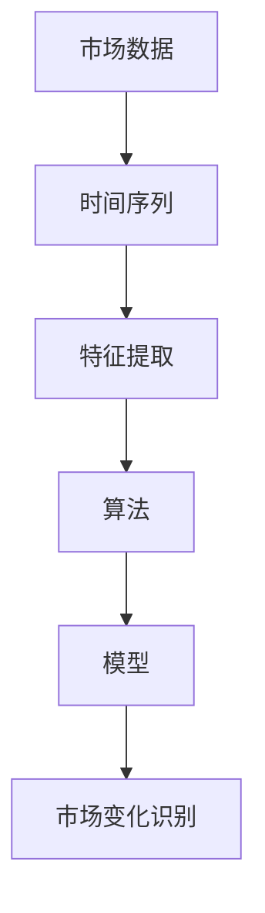

                 

# 智能算法识别市场结构性变化

> 关键词：智能算法、市场结构性变化、数据分析、时间序列分析、机器学习、算法实现、市场预测

> 摘要：本文详细探讨了智能算法在识别市场结构性变化中的应用，通过数据分析和机器学习技术，分析市场变化的特征，提出了一种基于智能算法的解决方案，并通过实际案例展示了算法的实现过程和效果。文章内容涵盖问题背景、算法原理、系统架构设计、项目实战等，为读者提供了一套完整的智能算法识别市场结构性变化的方法论。

---

# 第1章: 问题背景与问题描述

## 1.1 问题背景

### 1.1.1 市场结构性变化的定义与特征
市场结构性变化是指市场中供需关系、价格波动、竞争格局等核心要素发生显著变化的过程。这种变化通常表现为市场数据的时间序列特征变化、模式转变或异常波动。市场结构性变化的特征包括：

1. **时间依赖性**：市场变化通常与时间相关，表现出趋势、周期性或季节性特征。
2. **非线性关系**：市场变化可能受到多种复杂因素的影响，表现出非线性特征。
3. **数据稀疏性**：在某些情况下，市场数据可能较为稀疏，导致难以直接观察到结构性变化。

### 1.1.2 智能算法在市场分析中的作用
智能算法通过数据驱动的方法，能够自动识别市场数据中的模式和趋势，帮助分析师发现潜在的市场变化。与传统市场分析方法相比，智能算法具有以下优势：

1. **高效性**：智能算法能够快速处理海量数据，发现隐藏在数据中的规律。
2. **准确性**：通过机器学习模型，智能算法能够提高市场预测的准确性。
3. **适应性**：智能算法能够根据市场环境的变化动态调整模型参数，适应新的市场条件。

### 1.1.3 当前市场分析的痛点与挑战
当前市场分析中存在以下痛点和挑战：

1. **数据复杂性**：市场数据通常具有高维性、噪声多、关联性弱等特点，增加了分析的难度。
2. **模型选择**：不同市场问题可能需要不同的算法，如何选择合适的算法是市场分析中的一个挑战。
3. **计算效率**：在处理大规模数据时，计算效率成为影响模型性能的重要因素。

---

## 1.2 问题描述

### 1.2.1 市场结构性变化的识别需求
市场结构性变化的识别需求主要体现在以下几个方面：

1. **预测市场趋势**：通过识别市场变化，预测未来市场走势，为投资决策提供支持。
2. **优化资源配置**：根据市场变化调整企业战略，优化资源配置。
3. **风险控制**：通过识别潜在的市场风险，制定相应的风险管理策略。

### 1.2.2 智能算法在识别市场变化中的应用场景
智能算法在识别市场结构性变化中的应用场景包括：

1. **时间序列分析**：通过分析市场数据的时间序列特征，识别趋势和周期性变化。
2. **异常检测**：通过检测市场数据中的异常值，发现潜在的市场波动。
3. **模式识别**：通过识别市场数据中的模式，预测市场变化。

### 1.2.3 问题解决的必要性与可行性分析
解决问题的必要性在于市场变化的不可预测性，企业需要通过智能算法提前识别潜在风险和机会。问题解决的可行性体现在以下方面：

1. **技术可行性**：机器学习和深度学习技术的快速发展为市场分析提供了强有力的技术支持。
2. **数据可行性**：随着数据采集技术的进步，企业能够获取大量高维数据，为智能算法提供了丰富的数据来源。
3. **应用可行性**：智能算法已经在金融、零售等多个领域得到了广泛应用，证明了其在市场分析中的有效性。

---

## 1.3 问题解决思路

### 1.3.1 数据驱动的市场分析方法
数据驱动的市场分析方法强调通过数据挖掘和机器学习技术，从市场数据中提取有用的信息，帮助分析师制定决策。这种方法的核心在于数据的采集、处理和分析。

### 1.3.2 智能算法的核心优势
智能算法的核心优势在于其能够通过数据学习市场变化的规律，并自动调整模型参数以适应市场环境的变化。具体优势包括：

1. **自动化学习**：智能算法能够通过大量数据自动学习市场规律，减少人工干预。
2. **高准确性**：通过优化算法参数，智能算法能够提高市场预测的准确性。
3. **实时性**：智能算法能够实时处理市场数据，快速响应市场变化。

### 1.3.3 解决方案的整体架构
解决方案的整体架构包括以下几个步骤：

1. **数据采集**：通过数据接口采集市场数据，包括价格、成交量、用户行为等。
2. **数据预处理**：对采集到的数据进行清洗、归一化和特征提取。
3. **模型训练**：使用机器学习算法对数据进行建模，训练市场变化识别模型。
4. **模型部署**：将训练好的模型部署到生产环境，实时监控市场变化。
5. **结果分析**：根据模型输出的结果，分析市场变化的特征，制定相应的决策。

---

## 1.4 边界与外延

### 1.4.1 市场结构性变化的边界条件
市场结构性变化的边界条件包括：

1. **时间范围**：市场变化可能只在特定的时间范围内发生，因此需要明确时间范围。
2. **数据范围**：市场变化的识别可能仅限于特定的数据范围，例如某一行业的市场数据。
3. **变化幅度**：市场变化的幅度可能有 thresholds，超过一定幅度才被视为结构性变化。

### 1.4.2 智能算法的应用范围与限制
智能算法的应用范围包括：

1. **金融市场**：股票价格预测、汇率波动分析等。
2. **零售市场**：销售预测、库存管理等。
3. **工业市场**：生产成本预测、设备故障预测等。

智能算法的限制包括：

1. **数据依赖性**：智能算法依赖于大量的高质量数据，数据不足可能导致模型性能下降。
2. **计算成本**：复杂算法的计算成本较高，可能限制其在小规模数据上的应用。
3. **模型解释性**：一些复杂的机器学习模型（如深度学习模型）具有较低的解释性，可能影响用户的信任度。

### 1.4.3 相关领域的联系与区别
智能算法与传统统计分析的区别主要体现在以下几个方面：

1. **数据处理能力**：智能算法能够处理高维、非结构化数据，而传统统计分析通常依赖于低维、结构化数据。
2. **模型复杂性**：智能算法通常使用复杂的模型，而传统统计分析使用简单的线性模型。
3. **计算效率**：智能算法需要大量的计算资源，而传统统计分析通常计算成本较低。

---

## 1.5 概念结构与核心要素

### 1.5.1 核心概念的层次分解
市场结构性变化识别的智能算法可以分解为以下几个层次：

1. **数据层**：包括市场数据的采集、预处理和特征提取。
2. **算法层**：包括各种机器学习算法，如时间序列分析、聚类分析、分类算法等。
3. **模型层**：包括训练好的市场变化识别模型。
4. **应用层**：包括模型的应用场景和结果分析。

### 1.5.2 核心要素的特征对比
以下是核心要素的特征对比表：

| 核心要素 | 特征描述 |
|----------|----------|
| 数据特征 | 高维性、时序性、噪声多 |
| 算法特征 | 自动性、高效性、适应性 |
| 模型特征 | 高准确性、可解释性、可部署性 |

### 1.5.3 概念结构的可视化图解
以下是概念结构的ER实体关系图：

---

## 1.6 总结

本章详细介绍了智能算法在识别市场结构性变化中的背景与问题描述。通过分析市场结构性变化的定义、特征和识别需求，提出了智能算法在市场分析中的作用和解决方案的整体架构。同时，讨论了智能算法的应用范围和限制，为后续的算法实现和系统设计奠定了基础。

---

接下来是第2章的核心概念与联系，包括智能算法的基本原理、核心概念对比分析以及ER实体关系图等内容。

