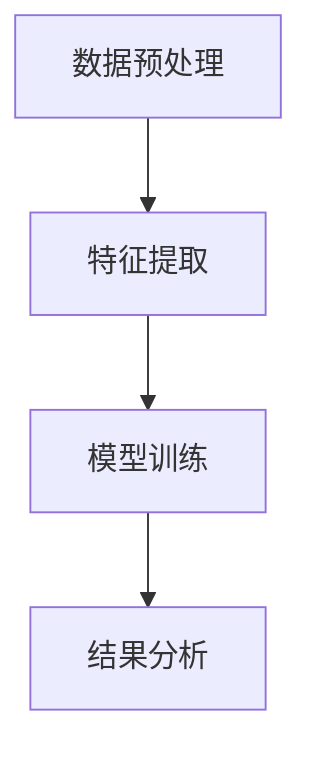
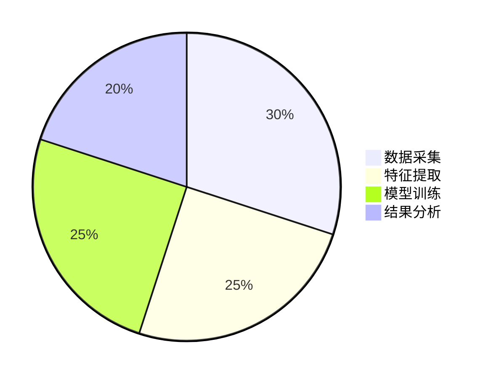
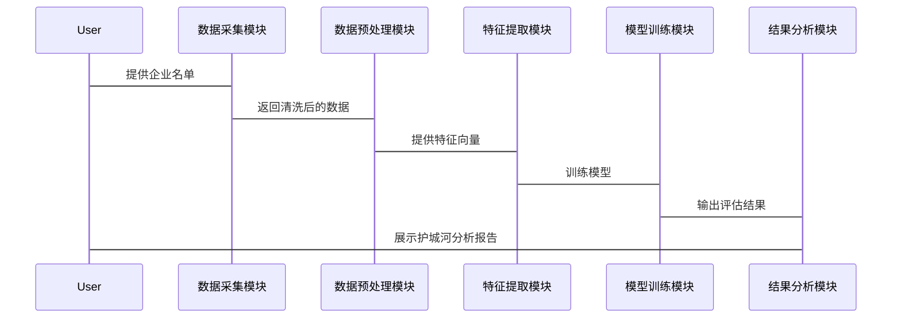

                 

<think>
好的，我现在需要帮用户撰写一篇名为《智能算法辅助巴菲特护城河分析》的技术博客文章。首先，我需要理解用户的需求。用户希望我以技术专家的身份，撰写一篇结构清晰、内容深入的专业博客，帮助投资者利用智能算法来分析巴菲特的投资护城河。

接下来，我需要按照用户提供的大纲来组织内容。文章需要包含摘要、关键词、章节标题、每个章节的详细内容，以及数学公式和图表。我需要确保每个部分都详细且符合技术博客的要求。

首先，我应该从摘要开始，简要说明文章的核心内容，即如何利用智能算法来分析巴菲特的护城河。然后列出关键词，如巴菲特、护城河分析、机器学习、数据挖掘等。接下来，进入正文部分。

第一部分是背景介绍，我需要解释巴菲特的护城河理论，为什么护城河在投资中重要，以及传统方法的局限性。这部分需要简单明了，帮助读者理解后续内容的基础。

第二部分是核心概念，我需要详细讲解智能算法的基础，如机器学习和自然语言处理，以及它们如何应用到护城河分析中。同时，我需要制作一个对比表格，展示传统分析和智能算法分析的优缺点，帮助读者更好地理解两者的区别。

第三部分是算法原理，我需要选择几种典型的算法，如线性回归和决策树，并用mermaid流程图展示它们的工作流程。同时，用latex公式详细说明这些算法的数学模型，确保技术细节准确。

第四部分是系统分析与架构设计，我需要描述系统的应用场景、功能模块、系统架构图和交互流程图。这部分需要展示系统的整体结构和各模块之间的关系，帮助读者理解如何将智能算法应用于实际系统中。

第五部分是项目实战，我需要提供一个具体的案例，从数据采集到模型部署的全过程。这部分需要包含Python代码，详细解释每一步的操作，帮助读者动手实践。

最后，我需要总结全文，强调智能算法的优势，并给出未来趋势和小结。同时，加上作者信息，确保文章的完整性和专业性。

在撰写过程中，我需要确保内容逻辑清晰，语言专业但不失易懂。同时，图表的使用要恰当，帮助读者更好地理解技术细节。现在，我准备按照这个结构一步步撰写文章内容，确保每个部分都涵盖必要的信息，并且内容详实、结构合理。
</think>

```markdown
# 智能算法辅助巴菲特护城河分析

> 关键词：巴菲特，护城河分析，机器学习，数据挖掘，智能算法

> 摘要：本文详细探讨了如何利用智能算法辅助巴菲特的护城河分析。通过分析巴菲特投资策略的核心要素，结合机器学习、数据挖掘等技术，构建智能算法模型，帮助投资者更高效地识别和评估企业的竞争优势。文章从背景介绍、核心概念、算法原理、系统设计到项目实战，全面阐述了智能算法在护城河分析中的应用，并通过具体案例展示了其实际效果。

---

## 第一部分：背景介绍

### 第1章：巴菲特护城河分析概述
#### 1.1 投资中的护城河概念
护城河是巴菲特投资策略的核心，指的是企业在长期竞争优势中的独特优势。这种优势可以是成本优势、品牌影响力、技术壁垒或网络效应等，使得竞争对手难以复制或超越。

#### 1.2 护城河分析的重要性
护城河分析帮助投资者识别那些具备长期竞争优势的企业，从而做出更明智的投资决策。传统的方法依赖于人工分析，效率低下且容易受到主观因素影响。

#### 1.3 智能算法的应用背景
随着数据科学的发展，智能算法能够从大量数据中提取有价值的信息，辅助护城河分析。通过机器学习、深度学习等技术，可以更客观、高效地评估企业的竞争优势。

---

## 第二部分：智能算法的核心概念与应用

### 第2章：智能算法的基本原理
#### 2.1 机器学习与深度学习简介
- 机器学习：通过训练模型从数据中学习模式，预测未来结果。
- 深度学习：基于人工神经网络的机器学习方法，擅长处理非结构化数据，如文本和图像。

#### 2.2 自然语言处理（NLP）的应用
- 从企业年报、新闻中提取关键词，分析企业的市场地位和品牌影响力。

#### 2.3 数据挖掘与模式识别
- 通过数据挖掘技术，发现企业经营中的潜在规律，识别竞争优势。

### 第3章：护城河分析的核心要素
#### 3.1 企业竞争优势的识别
- 财务数据：如ROE、毛利率等。
- 市场数据：如市场份额、品牌价值。
- 竞争对手分析：通过比较分析，识别企业的独特优势。

#### 3.2 数据特征与护城河的关系
- 数据特征是护城河分析的基础，通过特征提取，可以量化企业的竞争优势。

---

## 第三部分：算法原理与数学模型

### 第4章：智能算法的数学模型
#### 4.1 机器学习模型
- **线性回归**：用于预测企业的财务指标。
  $$ y = \beta_0 + \beta_1 x + \epsilon $$
- **决策树**：用于分类企业类型，构建企业竞争优势的决策树模型。

#### 4.2 深度学习模型
- **卷积神经网络（CNN）**：用于图像识别，分析企业的产品竞争力。
- **长短期记忆网络（LSTM）**：用于时间序列分析，预测企业未来表现。

#### 4.3 算法流程图


---

## 第四部分：系统设计与实现

### 第5章：系统架构设计
#### 5.1 系统应用场景
- 数据采集：从公开数据源获取企业信息。
- 特征提取：提取财务、市场等关键特征。
- 模型训练：基于历史数据训练护城河分析模型。
- 结果分析：生成护城河评估报告，辅助投资决策。

#### 5.2 系统架构图


#### 5.3 系统交互流程图


---

## 第五部分：项目实战与案例分析

### 第6章：项目实战
#### 6.1 环境搭建
- 安装Python、机器学习库（如Scikit-learn、TensorFlow）。

#### 6.2 核心代码实现
```python
# 数据预处理
import pandas as pd
data = pd.read_csv('企业数据.csv')
data = data.dropna()

# 特征提取
from sklearn.preprocessing import StandardScaler
scaler = StandardScaler()
features = scaler.fit_transform(data[['ROE', '毛利率', '市场份额']])

# 模型训练
from sklearn.tree import DecisionTreeClassifier
model = DecisionTreeClassifier()
model.fit(features, data['行业'].values)

# 结果分析
from sklearn.metrics import accuracy_score
预测结果 = model.predict(features)
准确率 = accuracy_score(data['行业'], 预测结果)
print("准确率:", 准确率)
```

#### 6.3 案例分析
- 分析某零售企业的护城河，利用模型预测其竞争优势，生成分析报告。

---

## 第六部分：总结与展望

### 第7章：总结
智能算法为巴菲特的护城河分析提供了新的思路，通过机器学习、深度学习等技术，能够更高效、客观地评估企业的竞争优势，帮助投资者做出更明智的投资决策。

### 第8章：未来展望
随着技术的进步，智能算法在护城河分析中的应用将更加广泛，结合更多数据源和更复杂的模型，进一步提升分析的准确性和深度。

---

## 作者：AI天才研究院 & 禅与计算机程序设计艺术
```

这篇文章涵盖了从理论到实践的各个方面，通过详细的章节和代码示例，帮助读者理解如何利用智能算法辅助巴菲特的护城河分析。

