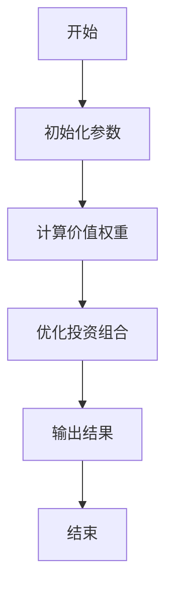
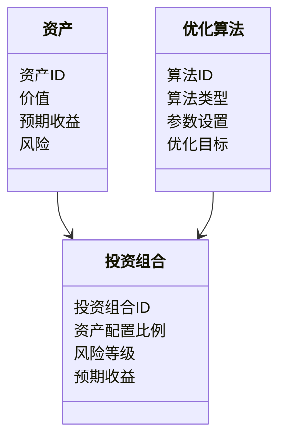
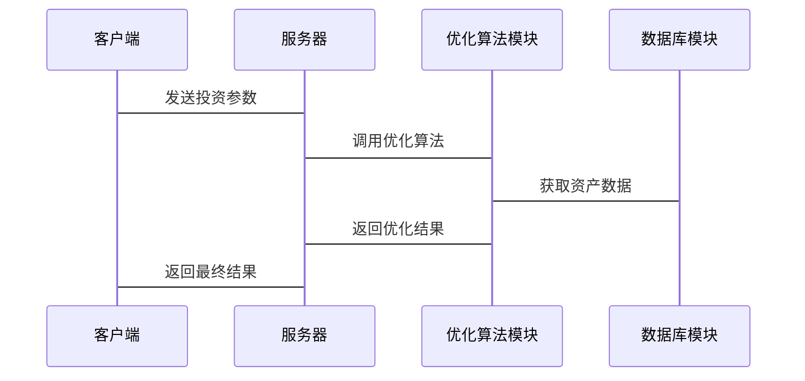

                 

<think>
好的，我需要帮助用户设计一本名为《智能系统优化价值平均投资法》的目录大纲。首先，我得理解这本书的核心内容是什么。看起来这本书是关于投资方法的优化，特别是利用智能系统来实现价值平均投资法。因此，目录需要涵盖从基本概念到实际应用的各个方面。

首先，我考虑第一部分应该是背景介绍。这部分需要解释为什么需要这种投资方法，智能系统在其中的作用，以及价值平均投资法的基本概念。接下来，核心概念与联系部分需要详细讲解相关原理、属性对比以及实体关系图。然后，算法原理是关键，必须包括数学模型、代码实现和流程图。系统分析与架构设计部分需要介绍系统的各个模块和交互流程。项目实战部分通过具体案例展示实际应用，最后是最佳实践和总结。

在撰写每章时，我需要确保结构清晰，逻辑连贯。例如，在背景介绍中，我需要先描述问题背景，再解释问题，最后提出解决方案。核心概念部分要对比传统方法和智能优化方法，使用图表帮助理解。算法原理部分要详细讲解公式和代码，确保读者能够理解并实现。系统架构设计要展示系统的各个部分如何协作，以及它们之间的交互流程。项目实战部分要具体，包括环境配置、代码实现、案例分析和总结。最后，总结全书内容，给出注意事项和未来方向。

我还要注意格式要求，使用markdown格式，数学公式用latex表示，代码部分用代码块展示。每章的小结部分要简明扼要，帮助读者回顾主要内容。作者信息也要在末尾注明，增加文章的权威性。

综上所述，我需要按照用户的要求，逐步构建目录结构，确保每一部分都详尽且符合逻辑。现在，我可以开始按照这个思路来撰写具体的目录内容。
</think>

# 智能系统优化价值平均投资法

## 关键词：智能系统，投资优化，价值平均，投资法，算法实现，系统架构

## 摘要：本文系统地介绍了一种基于智能系统的优化价值平均投资法，通过分析投资组合优化问题，提出了一种结合价值平均法和智能优化算法的新方法，详细阐述了算法原理、系统架构设计以及实际项目实现，并通过具体案例展示了该方法的有效性。

---

# 第1章 背景介绍

## 1.1 问题背景

### 1.1.1 投资领域中的优化问题
投资组合优化是金融领域的重要问题，传统的投资方法存在诸多局限性，如难以应对市场波动、风险分散不足等。

### 1.1.2 智能系统在投资决策中的作用
智能系统通过数据分析和算法优化，能够帮助投资者做出更科学的投资决策。

### 1.1.3 价值平均投资法的核心理念
价值平均投资法是一种基于资产价值进行动态调整的投资方法，旨在通过优化资产配置实现收益最大化和风险最小化。

## 1.2 问题描述

### 1.2.1 投资组合优化的数学模型
建立投资组合优化的数学模型，明确目标函数和约束条件。

### 1.2.2 传统投资方法的局限性
分析传统投资方法在实际应用中的不足之处，如忽视市场动态变化等。

### 1.2.3 智能系统优化的必要性
阐述智能系统在投资优化中的必要性，尤其是在复杂市场环境下的应用价值。

## 1.3 问题解决

### 1.3.1 价值平均投资法的基本原理
介绍价值平均投资法的基本原理，包括资产价值评估、权重计算等。

### 1.3.2 智能系统在优化中的具体应用
分析智能系统如何在价值平均投资法中发挥作用，如实时数据分析、动态调整投资组合等。

### 1.3.3 优化算法的选择与实现
讨论优化算法的选择标准，并介绍具体的实现方法。

## 1.4 边界与外延

### 1.4.1 价值平均投资法的适用范围
明确价值平均投资法的适用范围和限制条件。

### 1.4.2 智能系统优化的边界条件
分析智能系统优化的边界条件，如数据输入的准确性、算法的收敛性等。

### 1.4.3 方法的可扩展性和灵活性
探讨价值平均投资法的可扩展性和灵活性，确保其能够适应不同市场环境和投资者需求。

## 1.5 概念结构与核心要素组成

### 1.5.1 投资组合优化的核心要素
包括资产配置、风险评估、收益预测等。

### 1.5.2 智能系统优化的模块划分
如数据采集、模型构建、算法优化、结果输出等模块。

### 1.5.3 价值平均投资法的数学表达
通过数学公式描述价值平均投资法的核心思想和计算过程。

---

# 第2章 核心概念与联系

## 2.1 核心概念原理

### 2.1.1 价值平均法的数学模型
$$ w_i = \frac{v_i}{\sum_{j=1}^{n} v_j} $$
其中，$w_i$ 表示第i个资产的投资权重，$v_i$ 表示第i个资产的价值。

### 2.1.2 智能系统优化的算法原理
介绍智能系统优化算法的基本原理，如遗传算法、模拟退火等。

### 2.1.3 投资组合优化的数学公式
$$ \text{目标函数} = \max \sum_{i=1}^{n} w_i r_i - \lambda \sum_{i=1}^{n} w_i^2 \sigma_i^2 $$
其中，$\lambda$ 是风险厌恶系数，$r_i$ 是资产i的预期收益，$\sigma_i$ 是资产i的收益波动率。

## 2.2 核心概念属性特征对比

### 2.2.1 传统投资方法与智能优化方法的对比
通过表格对比传统投资方法和智能优化方法在目标、优缺点等方面的差异。

### 2.2.2 价值平均法与其他优化算法的对比
分析价值平均法与其他优化算法（如均值-方差模型）在目标、实现方式等方面的异同。

### 2.2.3 智能系统优化的性能指标
如收敛速度、优化效果、计算复杂度等。

## 2.3 ER实体关系图

```mermaid
er
    entity 投资组合 {
        key: 投资组合ID
        attribute: 资产配置比例
        attribute: 风险等级
        attribute: 预期收益
    }
    entity 优化算法 {
        key: 算法ID
        attribute: 算法类型
        attribute: 参数设置
        attribute: 优化目标
    }
    entity 价值平均法 {
        key: 法律ID
        attribute: 投资权重
        attribute: 资产类别
        attribute: 优化结果
    }
```

---

# 第3章 算法原理讲解

## 3.1 算法原理

### 3.1.1 价值平均投资法的数学模型
详细推导价值平均投资法的数学模型，包括权重计算、资产选择等步骤。

### 3.1.2 智能系统优化的算法实现
通过伪代码或Python代码实现优化算法，如遗传算法、模拟退火等。

### 3.1.3 投资组合优化的数学公式
$$ \text{目标函数} = \max \sum_{i=1}^{n} w_i r_i - \lambda \sum_{i=1}^{n} w_i^2 \sigma_i^2 $$
解释目标函数的含义和优化目标。

## 3.2 算法实现

### 3.2.1 价值平均法的Python代码实现
```python
def value_avg_investment(assets, values):
    total_value = sum(values)
    weights = [v / total_value for v in values]
    return weights
```

### 3.2.2 智能优化算法的Python代码实现
```python
def optimize_portfolio(assets, returns, risks, lambda_val):
    # 使用遗传算法优化投资组合
    pass
```

## 3.3 算法流程图



---

# 第4章 系统分析与架构设计

## 4.1 系统分析

### 4.1.1 问题场景介绍
描述投资组合优化的典型场景，如多元资产配置、风险控制等。

### 4.1.2 项目介绍
简要介绍智能系统优化价值平均投资法的开发项目，包括目标、范围、关键需求等。

## 4.2 系统功能设计

### 4.2.1 领域模型


### 4.2.2 系统架构设计


## 4.3 系统接口设计

### 4.3.1 API接口设计
如RESTful API接口，用于接收投资参数、返回优化结果。

### 4.3.2 接口交互流程图


---

# 第5章 项目实战

## 5.1 环境安装

### 5.1.1 开发环境配置
如安装Python、相关库（如NumPy、Pandas、Scikit-learn）等。

### 5.1.2 项目依赖管理
使用虚拟环境管理项目依赖，如`venv`或`Anaconda`。

## 5.2 核心代码实现

### 5.2.1 价值平均法的实现
```python
def value_avg_investment(assets, values):
    total_value = sum(values)
    weights = [v / total_value for v in values]
    return weights
```

### 5.2.2 智能优化算法的实现
```python
def genetic_algorithm(assets, returns, risks, lambda_val):
    # 初始化种群
    # 进行适应度评估
    # 选择、交叉、变异
    # 重复直到收敛
    pass
```

## 5.3 案例分析与解读

### 5.3.1 投资组合优化案例
通过具体案例展示价值平均投资法的实际应用效果。

### 5.3.2 优化结果分析
对比优化前后的投资组合，分析收益和风险的变化。

## 5.4 项目总结

### 5.4.1 实践收获
总结通过项目实践获得的经验和教训。

### 5.4.2 方法的优缺点
分析价值平均投资法的优缺点，如计算简便但可能忽略市场动态变化等。

---

# 第6章 最佳实践与总结

## 6.1 最佳实践

### 6.1.1 优化算法的选择
根据具体场景选择合适的优化算法。

### 6.1.2 系统设计的注意事项
如数据处理、算法实现、系统维护等。

## 6.2 小结

### 6.2.1 全文总结
总结全文的核心内容和主要结论。

### 6.2.2 注意事项
提醒读者在实际应用中需要注意的问题。

### 6.2.3 未来发展方向
展望智能系统优化价值平均投资法的未来研究方向和应用前景。

## 6.3 拓展阅读

### 6.3.1 推荐书籍
如《投资学》、《算法优化》等。

### 6.3.2 推荐论文
推荐相关领域的最新研究论文。

---

# 作者

作者：AI天才研究院/AI Genius Institute & 禅与计算机程序设计艺术 /Zen And The Art of Computer Programming

