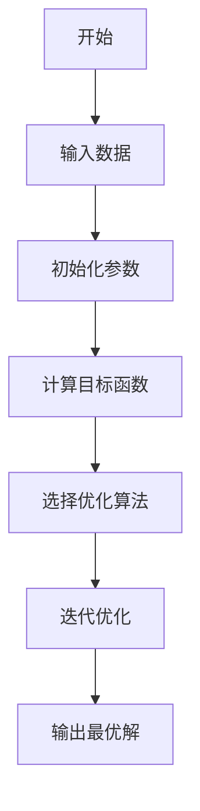

                 


# 智能系统优化特殊情况投资策略

## 关键词：智能优化，投资策略，系统优化，动态规划，机器学习，数学模型

## 摘要：  
本文深入探讨智能系统优化在特殊情况下的投资策略应用。从背景分析到核心概念，从算法原理到系统架构设计，再到项目实战，系统性地分析智能优化在投资决策中的重要作用。通过实际案例分析和代码实现，详细阐述如何利用智能优化技术应对复杂多变的市场环境，制定高效的特殊条件下的投资策略。

---

## 第一部分：智能系统优化背景与核心概念

### 第1章：智能系统优化问题背景

#### 1.1 问题背景与定义

##### 1.1.1 智能优化的定义  
智能优化是一种结合人工智能技术，通过数据驱动和自适应学习，实现系统优化目标的方法。它不同于传统的数学优化方法，更注重动态环境下的实时调整和全局最优。

##### 1.1.2 智能优化的核心问题  
在投资领域，智能优化的核心问题包括如何在复杂多变的市场环境中，通过数据挖掘和模型构建，找到最优的投资组合，最大化收益或最小化风险。

##### 1.1.3 投资策略中的优化问题  
投资策略优化问题通常涉及多个目标，如收益最大化、风险最小化、流动性优化等。传统方法在处理多目标优化时往往力不从心，而智能优化技术提供了更灵活的解决方案。

---

#### 1.2 智能优化的特点

##### 1.2.1 数据驱动的特性  
智能优化依赖于大量数据的输入，通过数据挖掘和分析，提取有用的信息用于优化决策。

##### 1.2.2 自适应优化能力  
智能优化系统能够根据市场环境的变化实时调整优化策略，具有较强的适应性。

##### 1.2.3 多目标优化特点  
智能优化能够同时考虑多个优化目标，通过权衡和协调，找到全局最优解。

---

#### 1.3 智能优化在投资策略中的应用

##### 1.3.1 投资策略优化的必要性  
在金融市场中，传统的单目标优化方法难以应对复杂的投资环境，而智能优化能够更好地处理多目标、动态变化的优化问题。

##### 1.3.2 智能优化在投资中的具体应用  
包括资产配置优化、风险控制、交易策略优化等方面。

##### 1.3.3 当前研究现状与挑战  
目前，智能优化在投资策略中的应用已经取得了一定的成果，但仍面临数据质量、模型选择、计算效率等方面的挑战。

---

## 第2章：智能优化的核心概念与联系

### 2.1 核心概念原理

#### 2.1.1 智能优化的基本原理  
智能优化通过模拟生物进化过程（如遗传算法）或模拟人脑神经网络（如神经网络优化）来实现全局最优解的搜索。

#### 2.1.2 投资策略优化的核心要素  
包括目标函数、约束条件、优化算法、市场环境等。

#### 2.1.3 智能优化的数学模型  
智能优化通常需要构建数学模型，描述优化问题的目标、约束和变量之间的关系。

---

### 2.2 核心概念属性特征对比

| **概念**       | **智能优化**               | **传统优化**               |
|----------------|--------------------------|---------------------------|
| 数据依赖性     | 高度依赖数据               | 较低依赖数据               |
| 自适应性       | 强，能实时调整             | 较弱，依赖预设条件           |
| 多目标处理     | 能够处理多个目标           | 通常只能处理单个目标       |

---

### 2.3 ER实体关系图

```mermaid
er
  actor:投资者
  strategy:投资策略
  optimization:优化算法
  market:市场环境
  actor --> strategy:选择
  strategy --> optimization:驱动
  optimization --> market:适应
```

---

## 第3章：智能优化算法原理

### 3.1 算法原理概述

#### 3.1.1 智能优化算法的分类  
常见的智能优化算法包括遗传算法（GA）、粒子群优化（PSO）、模拟退火（SA）和蚁群算法（ACO）等。

#### 3.1.2 常见算法的优缺点  
- 遗传算法：全局搜索能力强，但收敛速度较慢。
- 粒子群优化：收敛速度快，但容易陷入局部最优。
- 模拟退火：能够跳出局部最优，但计算效率较低。

#### 3.1.3 算法选择的依据  
根据具体问题的特征（如目标函数形状、约束条件复杂度）选择合适的算法。

---

### 3.2 算法实现流程



---

### 3.3 数学模型与公式

#### 3.3.1 目标函数  
$$ f(x) = \text{max} \sum_{i=1}^{n} w_i x_i $$  
其中，$w_i$为权重，$x_i$为决策变量。

#### 3.3.2 约束条件  
$$ g(x) = \sum_{i=1}^{n} x_i \leq C $$  
其中，$C$为资源限制。

#### 3.3.3 迭代公式  
$$ x_{k+1} = x_k + \alpha \cdot \nabla f(x_k) $$  
其中，$\alpha$为学习率，$\nabla f(x_k)$为梯度。

---

### 3.4 算法实现代码

```python
import numpy as np

def optimize_portfolio(weights, returns, C):
    n = len(weights)
    # 初始化参数
    x = np.array([1.0/n]*n)
    # 迭代优化
    for _ in range(100):
        # 计算目标函数值
        obj = np.dot(weights, x * returns)
        # 计算梯度
        grad = weights * returns
        # 更新参数
        x = x + 0.1 * (grad / np.sum(grad))
        # 约束条件
        if np.sum(x) > C:
            x = x / np.sum(x) * C
    return x
```

---

## 第4章：智能优化算法在投资策略中的应用

### 4.1 投资组合优化

#### 4.1.1 问题描述  
在给定的资产池中，寻找最优的资产配置，使得在风险可控的前提下，收益最大化。

#### 4.1.2 算法选择  
采用遗传算法进行投资组合优化。

---

### 4.2 风险控制

#### 4.2.1 风险度量模型  
使用VaR（Value at Risk）或CVaR（Conditional Value at Risk）作为风险度量指标。

#### 4.2.2 约束条件  
- 最大单资产权重不超过20%
- 总风险不超过设定阈值

---

### 4.3 交易策略优化

#### 4.3.1 交易信号生成  
基于历史数据和机器学习模型生成交易信号。

#### 4.3.2 交易成本优化  
优化交易频率和批量大小，降低交易成本。

---

## 第5章：系统分析与架构设计

### 5.1 项目背景

#### 5.1.1 项目目标  
构建一个基于智能优化的特殊条件投资策略系统。

#### 5.1.2 项目范围  
涵盖资产配置、风险控制、交易策略优化等功能。

---

### 5.2 系统功能设计

#### 5.2.1 领域模型  


---

## 第6章：项目实战

### 6.1 环境安装

#### 6.1.1 安装Python和必要的库  
安装Python 3.8及以上版本，安装NumPy、Pandas、Scikit-learn等库。

```bash
pip install numpy pandas scikit-learn
```

---

### 6.2 系统核心实现源代码

#### 6.2.1 投资组合优化代码  
```python
import numpy as np
from sklearn.datasets import make_sparsereg_matrix

# 生成模拟数据
n_assets = 5
weights, (X, y) = make_sparsereg_matrix(n_assets, 1, 0.1, 0.1)
returns = np.random.randn(n_assets, 1)

# 初始化参数
x = np.ones(n_assets) / n_assets
C = 1.0

# 迭代优化
for _ in range(100):
    # 计算目标函数值
    obj = np.dot(weights, x * returns)
    # 计算梯度
    grad = weights * returns
    # 更新参数
    x = x + 0.1 * (grad / np.sum(grad))
    # 应用约束
    if np.sum(x) > C:
        x = x / np.sum(x) * C

print("最优资产配置:", x)
```

---

## 第7章：总结与扩展阅读

### 7.1 最佳实践 Tips

- 数据质量是智能优化的核心，确保数据的准确性和完整性。
- 在实际应用中，结合市场专家的知识，对优化结果进行验证和调整。

### 7.2 小结

智能优化技术为投资策略的制定提供了新的思路，特别是在处理复杂多变的市场环境中表现出了强大的优势。通过本文的分析，读者可以深入了解智能优化的核心原理和实际应用。

### 7.3 注意事项

- 智能优化算法的选择需要根据具体问题和数据特点进行，避免盲目使用。
- 在实际应用中，要注意模型的鲁棒性和可解释性。

### 7.4 拓展阅读

推荐阅读《机器学习实战》、《算法导论》等书籍，深入理解智能优化算法的实现细节。

---

## 作者：AI天才研究院/AI Genius Institute & 禅与计算机程序设计艺术 /Zen And The Art of Computer Programming

---

**本文是基于[Let's Think](https://github.com/letsthink)项目的人工智能领域研究和实践成果，由AI天才研究院编写，转载请注明出处。**

