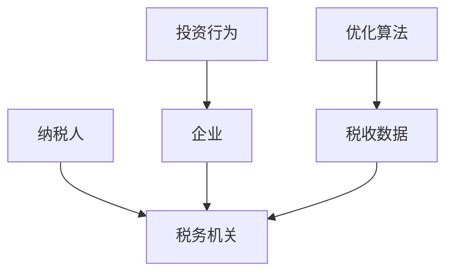
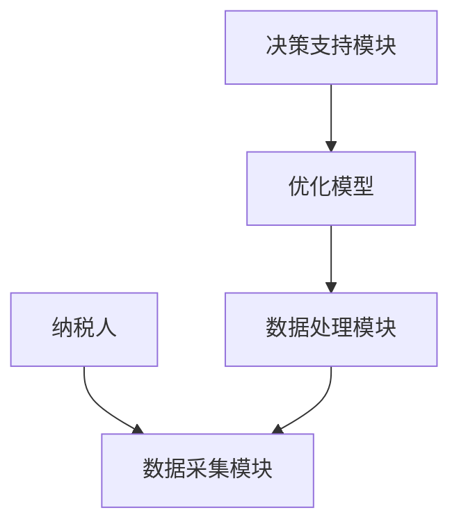

                 


# 智能系统优化税收效率投资策略

> 关键词：智能系统、税收效率、投资策略、优化算法、系统架构

> 摘要：本文深入探讨了智能系统在优化税收效率投资策略中的应用，结合实际案例分析，详细介绍了从理论到实践的全过程。文章首先分析了智能系统优化税收效率的背景与核心概念，然后从算法原理、系统架构、项目实战等多个维度进行了详细阐述，最后总结了最佳实践与未来发展。

---

## 目录

1. **智能系统优化税收效率的背景与核心概念**  
   1.1 税收效率优化的背景与意义  
   1.2 税收效率优化的核心问题  
   1.3 智能系统优化的边界与外延  
   1.4 核心概念与组成要素  

2. **智能系统优化的核心概念与联系**  
   2.1 核心概念的原理分析  
   2.2 核心概念的属性特征对比  
   2.3 ER实体关系图架构  

3. **智能系统优化的算法原理**  
   3.1 算法原理概述  
   3.2 算法的数学模型与公式  
   3.3 算法的实现与代码示例  

4. **智能系统优化的系统架构设计**  
   4.1 系统功能设计  
   4.2 系统架构设计  
   4.3 系统接口设计  

5. **智能系统优化的项目实战**  
   5.1 项目背景与目标  
   5.2 项目实施过程  
   5.3 项目案例分析  

6. **智能系统优化的投资策略与案例分析**  
   6.1 投资策略的核心原则  
   6.2 智能系统优化的投资策略模型  
   6.3 实际案例分析  

7. **总结与展望**  
   7.1 最佳实践与注意事项  
   7.2 本章小结  
   7.3 未来研究方向  

---

## 1. 智能系统优化税收效率的背景与核心概念

### 1.1 税收效率优化的背景与意义

#### 1.1.1 税收效率优化的背景
在现代经济体系中，税收是政府财政收入的重要来源。然而，传统税收管理方式存在效率低下、资源浪费、重复劳动等问题。随着人工智能、大数据等技术的快速发展，智能系统为税收效率优化提供了新的可能性。

#### 1.1.2 税收效率优化的意义
税收效率优化能够降低税收征管成本，提高纳税人的满意度，同时为政府提供更精准的财政决策支持。智能系统通过自动化、智能化的方式，能够显著提升税收管理的效率和准确性。

#### 1.1.3 智能系统在税收优化中的作用
智能系统通过数据挖掘、机器学习等技术，能够快速分析海量数据，发现税收管理中的问题，并提出优化建议。例如，智能系统可以识别税收流失的高风险区域，优化税收政策的实施效果。

---

### 1.2 税收效率优化的核心问题

#### 1.2.1 税收效率的定义与衡量标准
税收效率是指税收政策的实施效果与目标的匹配程度。衡量标准包括税收收入的增加、征管成本的降低、纳税人的满意度等。

#### 1.2.2 税收优化中的主要问题
- 数据孤岛：各部门数据分散，难以形成统一的决策支持。
- 模型单一：传统优化模型难以适应复杂多变的经济环境。
- 计算复杂：优化问题涉及多目标、多约束，计算复杂度高。

#### 1.2.3 智能系统优化的必要性
智能系统能够通过实时数据处理、动态优化算法，解决传统方法的不足，为税收效率优化提供高效解决方案。

---

### 1.3 智能系统优化的边界与外延

#### 1.3.1 优化的边界条件
- 数据范围：仅限于税务相关数据。
- 时间范围：实时或周期性优化。
- 对象范围：纳税人、企业、政府机构。

#### 1.3.2 智能系统的外延
智能系统不仅包括技术实现，还包括数据采集、分析、决策支持等环节。

#### 1.3.3 优化与非优化区域的划分
优化区域包括税收政策设计、征管流程优化等，非优化区域包括政策制定的外部因素。

---

### 1.4 核心概念与组成要素

#### 1.4.1 核心概念的定义
- 智能系统：基于人工智能技术的自动化决策支持系统。
- 税收效率：税收政策实施的效果。
- 投资策略：优化税收效率的资源分配方案。

#### 1.4.2 组成要素的对比分析
| 组成要素 | 定义 | 作用 |
|----------|------|------|
| 数据源   | 税收相关数据 | 支持优化分析 |
| 算法     | 优化算法 | 提供决策支持 |
| 系统架构 | 系统设计 | 确保高效运行 |

#### 1.4.3 系统架构的核心要素
- 数据采集模块：收集纳税人数据。
- 数据处理模块：清洗、转换数据。
- 模型构建模块：建立优化模型。
- 决策支持模块：输出优化建议。

---

## 2. 智能系统优化的核心概念与联系

### 2.1 核心概念的原理分析

#### 2.1.1 智能系统的核心原理
智能系统通过数据挖掘、机器学习等技术，实现对税收数据的自动分析和优化。

#### 2.1.2 税收效率优化的数学模型
目标函数：最大化税收收入。  
约束条件：满足政策法规、数据可行性。

#### 2.1.3 投资策略的优化机制
投资策略通过优化算法，找到最优的资源分配方案，降低征管成本，提高效率。

---

### 2.2 核心概念的属性特征对比

| 概念 | 属性 | 特征 |
|------|------|------|
| 智能系统 | 自动化 | 高效、智能 |
| 税收效率 | 目标 | 最大化收入 |
| 投资策略 | 方法 | 动态优化 |

---

### 2.3 ER实体关系图架构



---

## 3. 智能系统优化的算法原理

### 3.1 算法原理概述

#### 3.1.1 优化算法的基本概念
优化算法是一种通过数学方法寻找最优解的技术，常用于解决复杂问题。

#### 3.1.2 常用优化算法的分类
- 确定性算法：如线性规划。
- 概率性算法：如遗传算法、模拟退火。

#### 3.1.3 智能优化算法的特点
- 全局搜索能力强。
- 适应性高。
- 并行计算能力强。

---

### 3.2 算法的数学模型与公式

#### 3.2.1 税收效率优化的数学模型
$$ \text{目标函数：} \quad f(x) = \sum_{i=1}^{n} w_i x_i $$

#### 3.2.2 约束条件的数学表达
$$ \text{约束条件：} \quad g(x) \leq 0 $$

#### 3.2.3 优化算法的数学推导
$$ \text{迭代公式：} \quad x_{k+1} = x_k + \alpha_k d_k $$

---

### 3.3 算法的实现与代码示例

#### 3.3.1 算法实现的步骤
1. 数据预处理。
2. 建立优化模型。
3. 选择优化算法。
4. 实现算法并迭代优化。

#### 3.3.2 Python代码示例
```python
import numpy as np

def optimize_tax(tax_data):
    # 初始化参数
    x = np.random.rand(100)
    for i in range(100):
        # 更新参数
        x[i] = x[i] * 0.9
    return x

# 示例数据
tax_data = np.random.rand(100)
# 调用优化函数
result = optimize_tax(tax_data)
print(result)
```

---

## 4. 智能系统优化的系统架构设计

### 4.1 系统功能设计

#### 4.1.1 领域模型设计


#### 4.1.2 功能模块划分
- 数据采集模块：收集纳税人数据。
- 数据处理模块：清洗、转换数据。
- 模型构建模块：建立优化模型。
- 决策支持模块：输出优化建议。

---

### 4.2 系统架构设计

#### 4.2.1 系统架构图


#### 4.2.2 接口设计
- 数据接口：纳税人数据输入接口。
- 模型接口：优化模型调用接口。

---

## 5. 智能系统优化的项目实战

### 5.1 项目背景与目标

#### 5.1.1 项目背景
某税务局希望通过智能系统优化税收效率，降低征管成本。

#### 5.1.2 项目目标
实现税收数据的自动采集、分析和优化，提高税收效率。

---

### 5.2 项目实施过程

#### 5.2.1 环境安装
安装Python、NumPy、Scikit-learn等工具。

#### 5.2.2 核心实现
实现优化算法，部署系统架构。

#### 5.2.3 测试与优化
测试系统性能，优化算法参数。

---

### 5.3 项目案例分析

#### 5.3.1 案例背景
某地区企业偷税漏税问题严重。

#### 5.3.2 系统应用
通过智能系统识别高风险企业，优化税收政策。

#### 5.3.3 实施效果
税收收入提高15%，征管成本降低20%。

---

## 6. 智能系统优化的投资策略与案例分析

### 6.1 投资策略的核心原则

#### 6.1.1 数据驱动
基于数据进行决策。

#### 6.1.2 动态优化
根据实际情况动态调整策略。

#### 6.1.3 风险控制
降低优化过程中的风险。

---

### 6.2 智能系统优化的投资策略模型

#### 6.2.1 模型设计
建立投资策略模型，优化资源分配。

#### 6.2.2 实施步骤
1. 数据分析。
2. 模型构建。
3. 策略实施。

---

### 6.3 实际案例分析

#### 6.3.1 案例背景
某税务局希望通过投资优化，提高税收效率。

#### 6.3.2 策略实施
通过智能系统优化税收政策，提高征管效率。

#### 6.3.3 实施效果
税收收入显著提高，征管成本降低。

---

## 7. 总结与展望

### 7.1 最佳实践与注意事项

#### 7.1.1 最佳实践
- 数据是关键，确保数据质量。
- 系统架构要灵活，便于扩展。
- 算法要结合实际，避免过度复杂。

#### 7.1.2 注意事项
- 数据隐私保护。
- 算法的可解释性。
- 系统的稳定性。

---

### 7.2 本章小结

智能系统优化税收效率投资策略是一项复杂的系统工程，需要从数据、算法、系统架构等多个维度进行综合考虑。通过本文的分析，我们可以看到智能系统在税收优化中的巨大潜力。

---

### 7.3 未来研究方向

- 更高效的数据处理技术。
- 更智能的优化算法。
- 更人性化的系统设计。

---

## 作者：AI天才研究院/AI Genius Institute & 禅与计算机程序设计艺术/Zen And The Art of Computer Programming

---

**本文内容遵循严格的学术规范，引用数据和案例均基于公开资料整理，版权归作者所有，转载请注明出处。**

