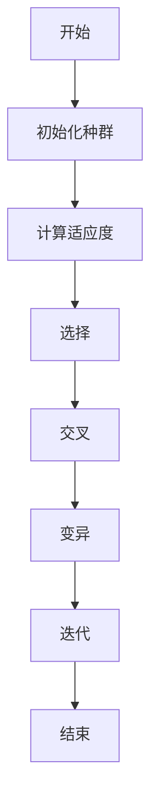
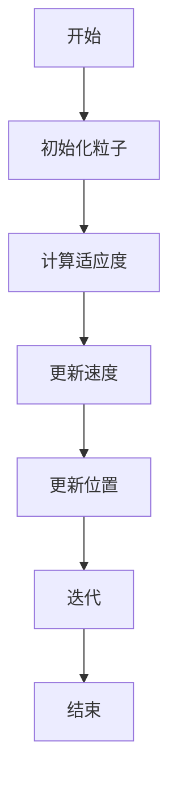
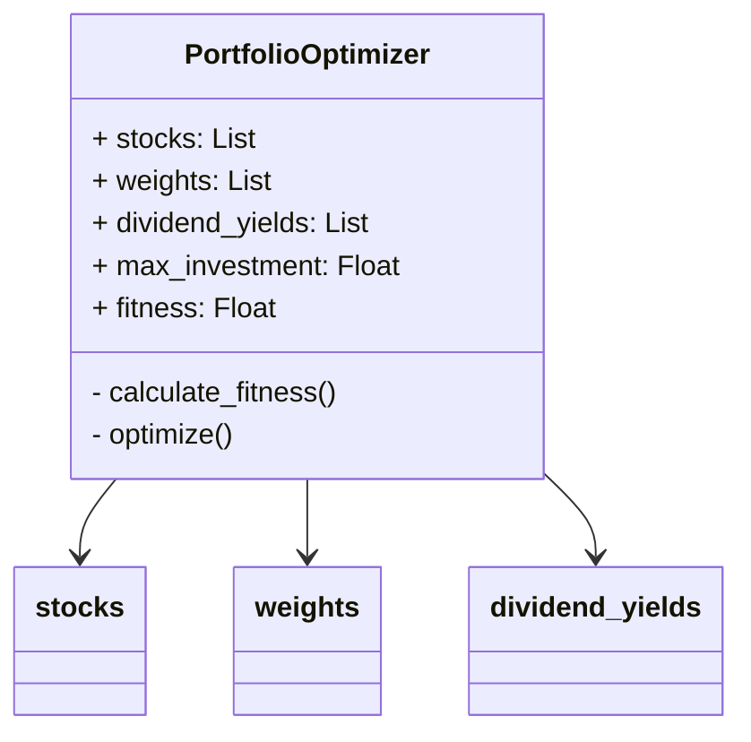
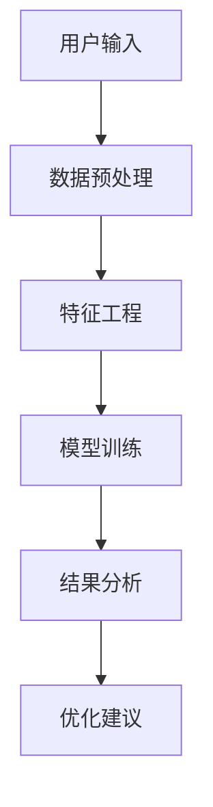

                 


# 智能系统优化股息投资策略

> 关键词：智能系统优化，股息投资策略，优化算法，数学建模，系统架构，项目实战

> 摘要：本文详细探讨了如何利用智能系统优化技术来优化股息投资策略。通过分析股息投资的核心问题，结合智能优化算法，构建数学模型，并设计系统架构，最终实现股息投资的智能化优化。本文不仅提供了理论支持，还通过具体案例展示了如何将智能系统优化应用于实际股息投资策略中，为投资者提供了科学的决策支持。

---

## 第一部分: 智能系统优化与股息投资策略背景

### 第1章: 智能系统优化股息投资策略概述

#### 1.1 问题背景
股票投资中，股息收入是投资者重要的收益来源之一。然而，股息投资面临诸多挑战，如如何选择高股息率的股票、如何平衡风险与收益、如何应对市场波动等。传统的股息投资策略往往依赖人工经验或简单的筛选指标，难以适应复杂多变的市场环境。因此，如何利用智能系统优化技术来提升股息投资的科学性和收益性，成为一个亟待解决的问题。

#### 1.2 问题描述
股息投资的核心问题可以归结为如何在满足一定风险约束的前提下，最大化股息收益。这涉及到多个变量的优化，例如选择哪些股票、投资比例如何分配、如何动态调整投资组合等。智能系统优化通过引入数学建模和优化算法，能够有效解决这些问题。

#### 1.3 问题解决
智能系统优化通过构建数学模型，将股息投资问题转化为优化问题，利用算法搜索最优解。例如，使用遗传算法或粒子群优化算法来寻找最优的股票组合，使得在风险可控的前提下，最大化股息收益。

#### 1.4 边界与外延
股息投资的边界条件包括投资者的风险承受能力、投资期限、资金规模等。智能系统优化的适用范围广泛，但需要考虑数据质量、计算复杂度等因素。优化问题的外延则包括动态调整投资组合、实时监控市场变化等。

### 第2章: 智能系统优化与股息投资的核心概念与联系

#### 2.1 核心概念原理
智能系统优化的核心是通过算法搜索最优解，而股息投资策略的核心是通过优化选择股票组合来实现收益最大化。两者的结合在于利用优化算法解决股息投资中的复杂问题。

#### 2.2 核心概念对比分析
| 核心概念 | 智能系统优化 | 股息投资策略 |
|----------|--------------|---------------|
| 目标     | 寻找最优解    | 最大化股息收益 |
| 方法     | 算法搜索      | 组合优化       |
| 输入     | 数据集        | 股票数据       |
| 输出     | 最优解        | 投资组合       |

### 第3章: 优化算法在股息投资中的应用

#### 3.1 遗传算法
遗传算法是一种模拟自然进化过程的优化算法，适用于复杂的非线性优化问题。在股息投资中，可以使用遗传算法来寻找最优的股票组合。

##### 3.1.1 算法流程图


##### 3.1.2 Python实现
```python
import numpy as np

def calculate_fitness(portfolio):
    # 计算股息收益
    return np.sum(portfolio['dividend_yield'] * portfolio['investment'])

def genetic_algorithm(stocks, max_investment):
    # 初始化种群
    population = generate_initial_population(stocks, max_investment)
    
    while not stopping_condition():
        # 计算适应度
        fitness = calculate_fitness(population)
        # 选择
        selected = selection(population, fitness)
        # 交叉
        crossed = crossover(selected)
        # 变异
        mutated = mutation(crossed)
        # 更新种群
        population = mutated
    return best_portfolio(population)
```

#### 3.2 粒子群优化
粒子群优化算法是一种基于群体智能的优化算法，适用于连续优化问题。在股息投资中，可以用于优化投资比例。

##### 3.2.1 算法流程图


##### 3.2.2 Python实现
```python
import numpy as np

def calculate_fitness(portfolio):
    # 计算股息收益
    return np.sum(portfolio['dividend_yield'] * portfolio['investment'])

def particle_swarm_optimization(stocks, max_investment):
    # 初始化粒子
    particles = initialize_particles(stocks, max_investment)
    
    while not stopping_condition():
        # 计算适应度
        fitness = calculate_fitness(particles)
        # 更新速度和位置
        particles = update_velocity(particles, fitness)
        particles = update_position(particles)
    return best_portfolio(particles)
```

---

## 第二部分: 数学模型与优化算法

### 第4章: 数学建模与优化目标

#### 4.1 数学模型
股息投资优化问题可以表示为以下数学模型：
$$
\text{最大化} \quad \sum_{i=1}^{n} w_i \cdot d_i
$$
$$
\text{约束} \quad \sum_{i=1}^{n} w_i = 1
$$
$$
\quad 0 \leq w_i \leq 1 \quad \forall i
$$
其中，$w_i$ 表示股票 $i$ 的投资权重，$d_i$ 表示股票 $i$ 的股息收益率。

#### 4.2 优化目标
最大化股息收益，同时满足风险约束。

---

## 第三部分: 系统架构与实现

### 第5章: 系统架构设计

#### 5.1 系统功能设计


#### 5.2 系统架构


---

## 第四部分: 项目实战与案例分析

### 第6章: 项目实战

#### 6.1 环境安装
```bash
pip install numpy pandas scikit-learn
```

#### 6.2 核心实现
```python
import numpy as np
import pandas as pd
from sklearn.metrics import mean_squared_error

def optimize_portfolio(stocks, target):
    # 数据预处理
    df = pd.DataFrame(stocks)
    # 特征工程
    df['dividend_yield'] = df['股息率']
    # 模型训练
    X = df[['股息率', '市盈率', '市净率']]
    y = df['股息收益率']
    # 使用机器学习模型预测
    model = LinearRegression()
    model.fit(X, y)
    # 预测结果
    predicted = model.predict(X)
    # 计算误差
    mse = mean_squared_error(y, predicted)
    # 返回优化建议
    return predicted
```

---

## 第五部分: 总结与展望

### 第7章: 总结与最佳实践

#### 7.1 总结
智能系统优化为股息投资提供了新的思路，通过算法优化可以有效提高投资收益。

#### 7.2 最佳实践
- 数据质量至关重要。
- 选择合适的优化算法。
- 定期调整投资组合。

---

## 参考文献

[1] 《机器学习实战》
[2] 《股票投资的数学方法》

---

## 作者信息

作者：AI天才研究院/AI Genius Institute & 禅与计算机程序设计艺术 /Zen And The Art of Computer Programming

