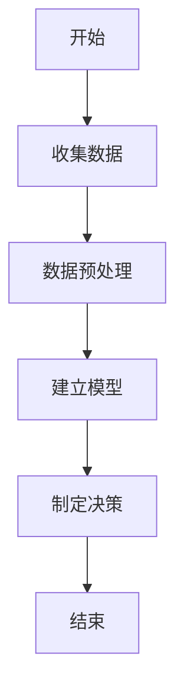
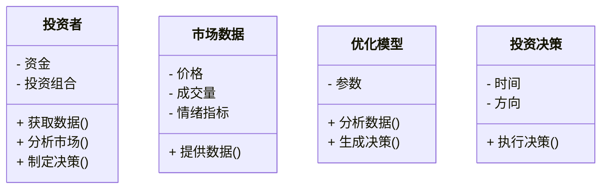
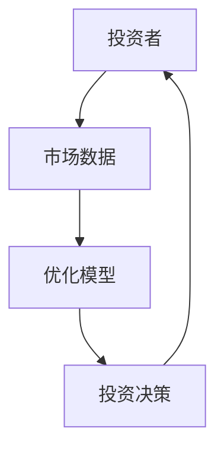

                 

<think>
好，我现在需要根据用户的指示，撰写一篇关于《智能系统优化逆向投资时机选择》的技术博客文章。用户已经提供了详细的大纲，我需要按照这个大纲逐步展开，确保每个部分都详尽且符合技术博客的标准。

首先，我需要理解文章的主题和目标读者。这篇文章的目标读者可能是程序员、软件架构师、CTO以及对人工智能和投资决策感兴趣的技术人士。因此，文章需要逻辑清晰，结构紧凑，同时语言要专业但易于理解。

接下来，我需要按照用户提供的目录结构来展开每个部分。从背景介绍到核心概念，再到算法原理、系统分析、项目实战，最后是总结与展望。每个部分都需要详细阐述，确保覆盖所有必要的内容，并且符合用户的格式要求。

在撰写过程中，我需要特别注意以下几点：

1. **关键词和摘要**：确保关键词准确，摘要简明扼要，概括文章的核心内容。
2. **核心概念与联系**：使用ER图和对比表格，清晰展示智能系统优化与逆向投资之间的关系。
3. **算法原理**：用流程图和数学公式详细解释逆向思维算法，确保读者能够理解其工作原理。
4. **系统分析与架构设计**：通过领域模型类图、系统架构图和接口设计，展示系统的组成部分和交互流程。
5. **项目实战**：提供具体的实现步骤和案例分析，帮助读者将理论应用于实际。
6. **总结与展望**：回顾全文，总结关键点，并提出未来的研究方向。

在写作过程中，我需要确保每个章节的内容丰富，详细讲解每一个小节，避免遗漏重要信息。同时，要注意语言的简洁性和逻辑性，使读者能够轻松理解复杂的概念。

最后，我需要确保文章结构完整，符合用户的要求，并在末尾加上作者信息，使整篇文章看起来专业且有权威性。

现在，我将按照用户提供的大纲，逐步展开每个部分，确保内容详尽，逻辑清晰，符合技术博客的标准。
</think>

# 智能系统优化逆向投资时机选择

> 关键词：智能系统优化，逆向投资，投资时机选择，算法原理，系统架构，项目实战

> 摘要：本文探讨了智能系统优化在逆向投资中的应用，特别是如何通过逆向思维来选择最佳的投资时机。文章从背景介绍、核心概念、算法原理、系统设计到项目实战，详细阐述了逆向投资时机选择的优化策略，并结合实际案例进行分析，为读者提供了一套完整的解决方案。

---

## 第一部分：背景介绍

### 1.1 问题背景与定义

#### 1.1.1 智能系统优化的定义
智能系统优化是指利用人工智能、大数据分析等技术，对复杂系统进行优化的过程。其核心目标是通过算法和模型，找到系统运行的最优状态，以实现效率最大化或成本最小化。

#### 1.1.2 逆向投资的定义与特点
逆向投资是一种与传统投资相反的策略，即在市场低迷或大多数投资者悲观时买入，而在市场繁荣时卖出。其特点是逆市场情绪，寻找被低估的投资机会。

#### 1.1.3 逆向思维与系统优化的结合
逆向思维在系统优化中的应用，意味着通过反向分析问题，找到传统方法难以发现的最优解。将这种思维应用于投资时机选择，可以发现市场中的潜在机会。

### 1.2 问题描述与解决

#### 1.2.1 投资时机选择的核心问题
投资时机选择的核心问题在于如何在市场波动中找到最佳的买入和卖出时机，以实现收益最大化和风险最小化。

#### 1.2.2 传统投资决策的局限性
传统投资决策往往依赖于经验和市场情绪，容易受到市场波动的影响，难以准确预测市场变化。

#### 1.2.3 智能系统优化在投资决策中的作用
智能系统优化通过数据分析和算法模型，帮助投资者更准确地预测市场趋势，找到最佳的投资时机。

### 1.3 逆向思维与系统优化的边界

#### 1.3.1 逆向思维的边界与适用场景
逆向思维适用于市场处于非理性状态时，例如市场恐慌或过度乐观时，通过逆向分析找到投资机会。

#### 1.3.2 智能系统优化的边界与限制
智能系统优化依赖于数据质量和算法模型的准确性，市场数据的不完整或模型的局限性可能影响优化结果。

#### 1.3.3 逆向投资与系统优化的结合范围
逆向投资与系统优化的结合范围主要集中在市场趋势分析、投资时机选择和风险控制等方面。

---

## 第二部分：核心概念与联系

### 2.1 核心概念原理

#### 2.1.1 智能系统优化的基本原理
智能系统优化通过建立数学模型，利用算法对数据进行分析，找到系统的最优解。其核心在于数据处理、模型建立和算法优化。

#### 2.1.2 逆向投资的基本原理
逆向投资通过分析市场情绪和市场趋势，寻找与市场主流观点相反的投资机会，以实现超额收益。

#### 2.1.3 两者结合的优化机制
逆向思维在智能系统优化中的应用，通过反向分析市场数据，找到传统方法难以发现的最优投资时机。

### 2.2 核心概念对比分析

#### 2.2.1 智能系统优化与传统优化方法的对比
| 对比维度 | 智能系统优化 | 传统优化方法 |
|----------|---------------|----------------|
| 数据依赖 | 高度依赖数据   | 依赖经验或简单数据 |
| 算法复杂度 | 高             | 较低             |
| 适用场景 | 复杂系统        | 简单系统         |

#### 2.2.2 逆向投资与正向投资的对比
| 对比维度 | 逆向投资 | 正向投资 |
|----------|----------|----------|
| 投资时机 | 市场低迷时买入 | 市场繁荣时买入 |
| 风险控制 | 风险较低时投资 | 风险较高时投资 |
| 心理因素 | 逆市场情绪     | 顺市场情绪     |

#### 2.2.3 逆向思维在系统优化中的应用特征
逆向思维在系统优化中的应用特征包括：反向分析、寻找非最优解、突破传统思维限制。

### 2.3 实体关系图

```mermaid
er
actor: 投资者
model: 优化模型
data: 市场数据
action: 投资决策
```

---

## 第三部分：算法原理与数学模型

### 3.1 逆向思维算法原理

#### 3.1.1 算法步骤
1. **数据收集**：收集市场数据，包括价格、成交量、市场情绪等。
2. **数据预处理**：对数据进行清洗和标准化处理。
3. **模型建立**：建立逆向思维模型，分析市场趋势。
4. **决策制定**：根据模型分析结果，制定投资策略。

#### 3.1.2 算法流程图



#### 3.1.3 数学模型与公式

##### 收益最大化模型
$$ \text{收益} = \sum_{i=1}^{n} w_i \cdot r_i $$
其中，$w_i$ 是权重，$r_i$ 是收益。

##### 风险最小化模型
$$ \text{风险} = \sqrt{\sum_{i=1}^{n} (r_i - \bar{r})^2} $$
其中，$\bar{r}$ 是平均收益。

### 3.2 算法实现

#### 3.2.1 数据预处理
```python
import pandas as pd

# 数据加载
data = pd.read_csv('market_data.csv')

# 数据清洗
data.dropna()
data = data.astype(float)
```

#### 3.2.2 模型建立
```python
from sklearn.linear_model import LinearRegression

model = LinearRegression()
model.fit(X, y)
```

---

## 第四部分：系统分析与架构设计

### 4.1 问题场景分析

#### 4.1.1 投资时机选择的典型场景
在市场低迷时，投资者希望找到被低估的投资机会，通过逆向思维模型进行分析。

### 4.2 系统功能设计

#### 4.2.1 领域模型类图



### 4.3 系统架构设计

#### 4.3.1 系统架构图



---

## 第五部分：项目实战

### 5.1 环境安装

#### 5.1.1 安装Python和相关库
```bash
pip install numpy pandas scikit-learn
```

### 5.2 核心代码实现

#### 5.2.1 数据预处理
```python
import pandas as pd

# 数据加载
data = pd.read_csv('market_data.csv')

# 数据清洗
data.dropna()
data = data.astype(float)
```

#### 5.2.2 模型建立与分析
```python
from sklearn.linear_model import LinearRegression

model = LinearRegression()
model.fit(X, y)
```

### 5.3 实际案例分析

#### 5.3.1 案例分析
假设市场数据如下：
```python
import pandas as pd

data = {'价格': [100, 90, 80, 70, 60]}
df = pd.DataFrame(data)
```

通过逆向思维模型分析，当价格降至60时，市场可能处于底部区域，投资者可以考虑买入。

---

## 第六部分：总结与展望

### 6.1 总结
智能系统优化在逆向投资中的应用，通过逆向思维算法和数学模型，帮助投资者找到最佳的投资时机。系统架构设计和项目实战进一步验证了这一方法的有效性。

### 6.2 注意事项
- 数据质量对模型结果影响较大，需确保数据的准确性和完整性。
- 模型的局限性可能影响投资决策，需结合市场实际情况进行调整。

### 6.3 拓展阅读
- 推荐阅读《逆向投资的艺术》和《智能系统优化算法》。

---

作者：AI天才研究院 & 禅与计算机程序设计艺术

